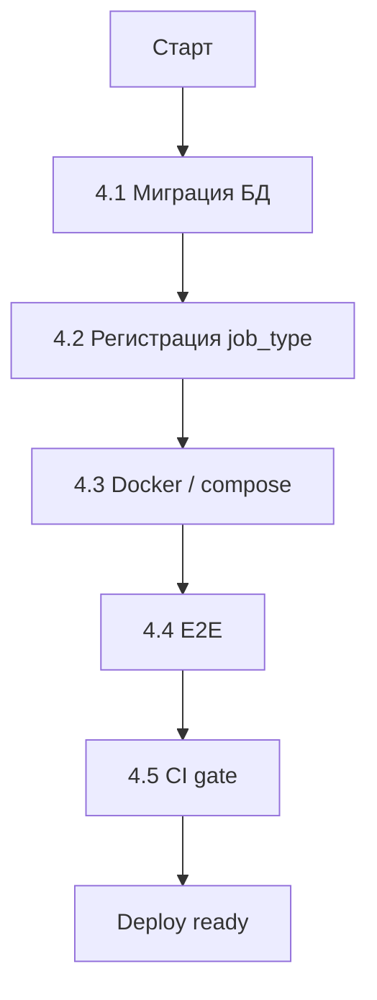

# Роль 4: Integrator

env-зависимые шаги, которые Builder не делает: миграции, регистрация, docker, E2E, CI gate.

## Предусловие

- `docs/features/<feature>/review-report.md` с вердиктом **«зелёный»** от Reviewer
- Подтверждение пользователя на старт фазы

Если review-report красный или отсутствует — **стоп**.

## Порядок действий



### 4.1. Миграция БД

Если `data-model.md` требует схему:

```bash
cd decision-matrix/backend
# Создать миграцию (если Alembic)
alembic revision --autogenerate -m "<feature> data model"
# Проверить сгенерированный файл в alembic/versions/
# Применить локально
alembic upgrade head
```

**Если хранение в `InfrastructureObject.properties` (JSON)** — миграция не нужна, пропусти шаг.

**Проверь:**
- [ ] Миграция идемпотентна
- [ ] Есть downgrade
- [ ] Не ломает существующие данные (тест на копии)

### 4.2. Регистрация job_type

Если фича использует фоновые задачи (ARQ):

1. Проверь, что Builder зарегистрировал `job_type` в `app/services/jobs.py` или `project_jobs.py`
2. Если нет — это нарушение, верни к Builder
3. Убедись, что `job_type` уникален (сверь с существующими через `explore` или grep)

### 4.3. Docker / compose

Добавь микросервис в `docker-compose.yml` (если применимо):

```yaml
  <feature>-planner:
    build: ./<feature>-planner
    ports:
      - "80XX:80XX"
    environment:
      - LOG_LEVEL=info
    healthcheck:
      test: ["CMD", "curl", "-f", "http://localhost:80XX/health"]
      interval: 30s
      timeout: 5s
      retries: 3
```

**Проверь:**
- [ ] Порт не конфликтует с существующими сервисами
- [ ] Healthcheck настроен
- [ ] Переменные окружения задокументированы
- [ ] Сервис стартует: `docker-compose up <feature>-planner`

### 4.4. E2E (полный стек)

Если есть E2E-тесты для фичи (по `pre-deploy-ci.mdc`):

```bash
# Поднять полный стек локально (или против staging)
cd decision-matrix/frontend
npm run test:e2e -- <feature>
```

E2E требует:
- Backend монолит запущен
- Микросервис `<feature>-planner` запущен
- БД с тестовыми данными

**Если E2E красные** — фикс в коде (возврат к Builder) или правка тестов (если тест неверный).

### 4.5. CI gate (по `pre-deploy-ci.mdc`)

Это **финальный жёсткий гейт** перед деплоем.

```powershell
# Полный локальный прогон (как в CI)
cd decision-matrix/frontend
npm run lint
npm run test
npm run test:coverage

cd ../backend
pytest tests/ -q
```

Если локально зелёно — push:

```powershell
git push
```

**Дождаться CI на GitHub:**
```powershell
gh run list --repo Mekcuka/Scaning --limit 3
gh run watch <run-id> --repo Mekcuka/Scaning --exit-status
```

**Деплой считается успешным только если CI зелёный.** Если CI упал:
1. Прочитать логи job
2. Если падение в коде фичи — возврат к Builder
3. Если инфраструктура (flaky test, окружение) — retry или эскалация

## Handoff к пользователю (финал)

Сообщи:

> Фаза Integrator завершена.
> - Миграция: применена / не требовалась
> - job_type: `<name>` зарегистрирован
> - Docker: сервис добавлен, healthcheck OK
> - E2E: <N> сценариев зелёные
> - CI: run #<id> **success** на `Mekcuka/Scaning`
>
> **Фича `<feature>` готова и развёрнута.**

## Когда возвращать к Builder

- Миграция падает из-за схемы в коде
- Docker-сервис не стартует (ошибка в Dockerfile/main.py)
- CI падает на тестах фичи
- E2E красные из-за бага в коде

**Integrator не правит прод-код.** Он сообщает Builder конкретную ошибку.

## Когда возвращать к Planner

- Архитектура не масштабируется в docker (нужен другой паттерн деплоя)
- job_type конфликтует фундаментально (нужен другой нейминг)
- Миграция требует данных, которых нет в `data-model.md`

## Чеклист Integrator

- [ ] Миграция применена локально (если нужна)
- [ ] job_type уникален и зарегистрирован
- [ ] docker-compose обновлён, сервис стартует
- [ ] Healthcheck отвечает 200
- [ ] E2E зелёные (если применимо)
- [ ] `npm run lint` + `npm run test` зелёные
- [ ] `pytest tests/ -q` зелёный
- [ ] Push выполнен
- [ ] CI на GitHub: **success**

## Антипаттерны

- ❌ Integrator правит код фичи — нарушает разделение
- ❌ Деплой без CI gate — нарушает `pre-deploy-ci.mdc`
- ❌ Миграция без downgrade — риск отката
- ❌ Docker без healthcheck — не заметишь падение сервиса
