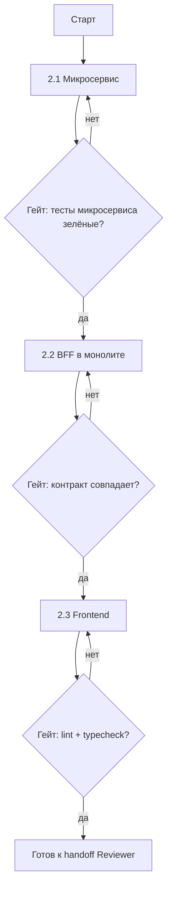

# Роль 2: Builder

Реализует фичу **последовательно** по плану от Planner. Архитектурных решений не принимает.

## Предусловие

Перед стартом **проверь наличие артефактов Planner**:

```
docs/features/<feature>/
├── plan.md          ← ОБЯЗАТЕЛЬНО
├── contract.md      ← ОБЯЗАТЕЛЬНО
└── data-model.md    ← ОБЯЗАТЕЛЬНО
```

Если хотя бы одного нет — **стоп**, вернись к Planner. Не додумывай архитектуру.

## Порядок исполнения (строго последовательный)



### Фаза 2.1 — Микросервис

Создай standalone FastAPI сервис.

**Эталон:** `decision-matrix/backend/../pad-earthwork-planner/` или `well-trajectory-planner`.

**Структура:**
```
<feature>-planner/
├── main.py              # FastAPI app, CORS, health check
├── api/
│   └── routes.py        # endpoints из contract.md
├── compute.py           # бизнес-логика расчёта
├── models.py            # Pydantic request/response (= contract.md)
├── tests/
│   ├── test_api.py      # endpoint tests
│   └── test_compute.py  # unit tests
├── requirements.txt
└── Dockerfile
```

**Обязательно:**
- Порт из `plan.md` (проверить, что не конфликтует)
- Pydantic модели **дословно** из `contract.md`
- Health endpoint `/health`
- Тесты на каждый endpoint

**Гейт перед переходом к 2.2:**
```bash
cd <feature>-planner
pytest tests/ -q
```
Должно быть зелёным.

### Фаза 2.2 — BFF в монолите

Интегрируй микросервис в основной backend.

**Эталон:** `app/api/v1/well_trajectory.py`, `app/services/well_trajectory/`.

**Файлы:**
| Файл | Назначение |
|------|------------|
| `app/api/v1/<feature>.py` | HTTP endpoints, валидация, вызов service |
| `app/services/<feature>/service.py` | Публичный API, оркестрация |
| `app/services/<feature>/adapter.py` | HTTP-клиент к микросервису (:80XX) |
| `app/services/<feature>/api_handlers.py` | Barrel re-export (как в эталоне) |

**Границы слоёв (из `module-boundaries.md`):**
- `api/v1/*` → НЕ делает SQL напрямую, только `Depends` + вызов `services.*`
- `services/*` → НЕ лезет в `Request`/cookies
- Файлы ≤ 300–400 строк

**Обязательно:**
- Зарегистрировать router в `app/api/v1/router.py`
- Если есть фоновые задачи — `job_type` в `jobs.py`
- Pydantic schema = `contract.md` дословно

**Гейт перед переходом к 2.3:**
```bash
cd decision-matrix/backend
pytest tests/test_<feature>.py -q
```
Проверить: BFF endpoints соответствуют `contract.md`.

### Фаза 2.3 — Frontend

Реактовый UI для фичи.

**Эталон:** `src/lib/padEarthworkSketch/`, `src/pages/import/`.

**Файлы:**
| Файл | Назначение |
|------|------------|
| `src/lib/api/<feature>Api.ts` | Доменный API клиент (типизированный) |
| `src/hooks/use<Feature>Panel.ts` | Хук-оркестратор (state + mutations) |
| `src/pages/<feature>/*` или компонент в ObjectDetailPanel | UI |
| `src/styles/features/<feature>.css` | Стили (BEM с префиксом) |

**Правила (из `ui-guidelines.mdc`):**
- CSS variables, не raw hex
- Примитивы: `.btn`, `.form-group`, `AppModal`, `AppSelect`
- BEM: `<feature>-*`
- Тексты на русском (`russian-language.mdc`)
- Tailwind — только layout утилиты

**Гейт перед handoff Reviewer:**
```bash
cd decision-matrix/frontend
npm run lint
npm run typecheck
npm run test -- <feature>
```

## Журнал реализации (`impl-log.md`)

**Веди по ходу.** Создай/обновляй `docs/features/<feature>/impl-log.md`:

```markdown
# Журнал реализации: <feature>

## [дата] Фаза 2.1 Микросервис
- Статус: завершено
- Файлы: <список>
- Отступления от плана: нет / <описание + причина>

## [дата] Фаза 2.2 BFF
- Статус: завершено
- Контракт: совпадает с contract.md / отступление: <описание>
- job_type: <name> (зарегистрирован)

## [даза] Фаза 2.3 Frontend
- Статус: завершено
- Компоненты: <список>
```

**Любое отступление от плана** фиксируй в impl-log. Если отступление меняет контракт — **стоп**, вернись к Planner.

## Handoff к Reviewer (с approval)

**Остановись.** Сообщи:

> Фаза Builder завершена.
> - Микросервис: `<name>-planner` :80XX, тесты зелёные
> - BFF: `api/v1/<feature>.py`, контракт совпадает
> - Frontend: `<components>`, lint/typecheck зелёный
> - Журнал: `docs/features/<feature>/impl-log.md`
>
> **Переходим к фазе Reviewer?**

## Когда возвращаться к Planner

- Контракт оказался нереализуемым → стоп, к Planner
- Нужно новое поле в БД, не описанное в `data-model.md` → стоп, к Planner
- Порт занят (не учли в плане) → стоп, к Planner
- Требуется новая зависимость с GPL/лицензионными рисками → стоп, к Planner

**Не принимай архитектурных решений в одиночку.** Builder = исполнение, не дизайн.
