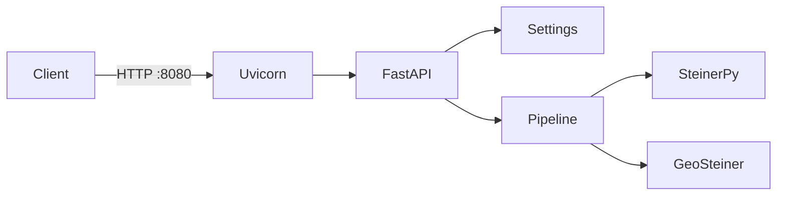

# Микросервис Steiner Network Planner

HTTP-микросервис для построения Euclidean Steiner tree по терминалам на карте. Один контейнер, конфигурация через переменные окружения, probe-эндпоинты для оркестрации.

## Архитектура



| Компонент | Назначение |
|-----------|------------|
| FastAPI | HTTP API, OpenAPI `/docs` |
| SteinerPy | Основной солвер (в Docker-образе по умолчанию) |
| GeoSteiner | Опционально через mount бинарников |
| Post-processing | Лимиты примыкания, hub/attach, waypoints — см. [IMPLEMENTATION.md](IMPLEMENTATION.md) |

## Быстрый старт (Docker Compose)

```bash
cp .env.example .env
docker compose up --build
```

Сервис доступен:

- API: `http://localhost:8080`
- OpenAPI: `http://localhost:8080/docs`
- Прототип: `http://localhost:8080/examples/planner_prototype.html`

Остановка: `docker compose down`

## Локальный запуск (без Docker)

```bash
python -m venv .venv
.venv\Scripts\activate          # Windows
pip install -e ".[dev,steinerpy]"
cp .env.example .env            # optional
uvicorn network_planner.api:app --reload --host 0.0.0.0 --port 8080
```

## Probe-эндпоинты

| Endpoint | Тип | HTTP | Описание |
|----------|-----|------|----------|
| `GET /health` | Liveness | 200 | Процесс жив |
| `GET /ready` | Readiness | 200 / 503 | SteinerPy доступен (если `REQUIRE_STEINERPY=true`) |

Пример readiness:

```json
{
  "status": "ok",
  "steinerpy": true,
  "geosteiner": false
}
```

GeoSteiner **не обязателен** для readiness. Без mount volume `geosteiner` будет `false`, расчёт через `POST /v1/plan/steinerpy` работает.

## Переменные окружения

См. [`.env.example`](../.env.example).

| Переменная | Default | Описание |
|------------|---------|----------|
| `APP_HOST` | `0.0.0.0` | Bind host |
| `APP_PORT` | `8080` | Bind port |
| `LOG_LEVEL` | `INFO` | Уровень логов (JSON в stdout) |
| `CORS_ORIGINS` | `*` | Origins через запятую или `*` |
| `GEOSTEINER_BIN_DIR` | `vendor/geosteiner/bin` | Каталог `efst` / `bb` |
| `GEOSTEINER_TIMEOUT_SEC` | `300` | Timeout subprocess GeoSteiner |
| `REQUIRE_STEINERPY` | `true` | `/ready` требует SteinerPy |
| `MSYS2_ROOT` | `C:\msys64` | Windows: runtime DLL для GeoSteiner |

## GeoSteiner в Docker

Бинарники не включены в образ (лицензия, платформа). Смонтируйте локальную сборку:

```yaml
volumes:
  - ./vendor/geosteiner/bin:/app/vendor/geosteiner/bin:ro
```

Сборка: `bash scripts/build_geosteiner.sh` (Linux) или `scripts/build_geosteiner.ps1` (Windows).

## API (v1)

| Method | Path | Описание |
|--------|------|----------|
| `GET` | `/health` | Liveness |
| `GET` | `/ready` | Readiness |
| `GET` | `/v1/steinerpy/status` | Доступность SteinerPy |
| `GET` | `/v1/geosteiner/status` | Доступность GeoSteiner |
| `POST` | `/v1/plan/steinerpy` | Расчёт через SteinerPy |
| `POST` | `/v1/plan/geosteiner` | Расчёт через GeoSteiner |

Параметры расчёта: [PARAMETERS.ru.md](PARAMETERS.ru.md).

## Логирование

Structured JSON в stdout. Каждый запрос получает `X-Request-ID` (из заголовка клиента или сгенерированный). Поля лога: `timestamp`, `level`, `message`, `request_id`, `path`, `method`, `status_code`, `duration_ms`.

## CI

GitHub Actions (`.github/workflows/ci.yml`):

1. `pytest` с SteinerPy
2. `docker build` + smoke `/health` и `/ready`

## Связанные документы

- [README.md](../README.md) — обзор проекта
- [IMPLEMENTATION.md](IMPLEMENTATION.md) — pipeline и солверы
- [PARAMETERS.ru.md](PARAMETERS.ru.md) — параметры расчёта
