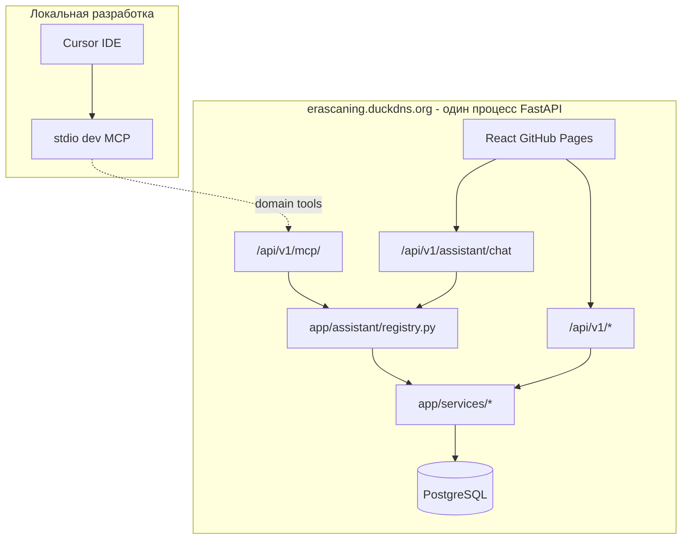
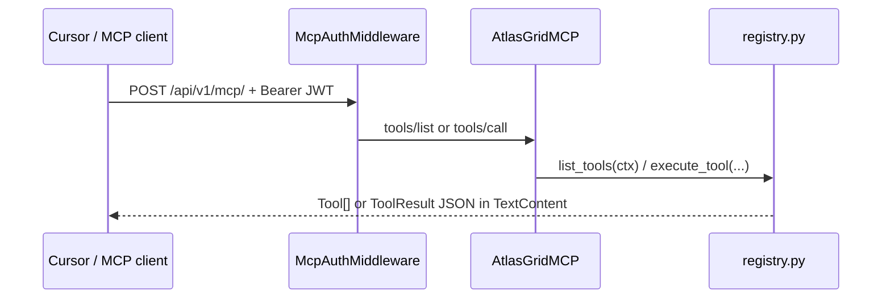
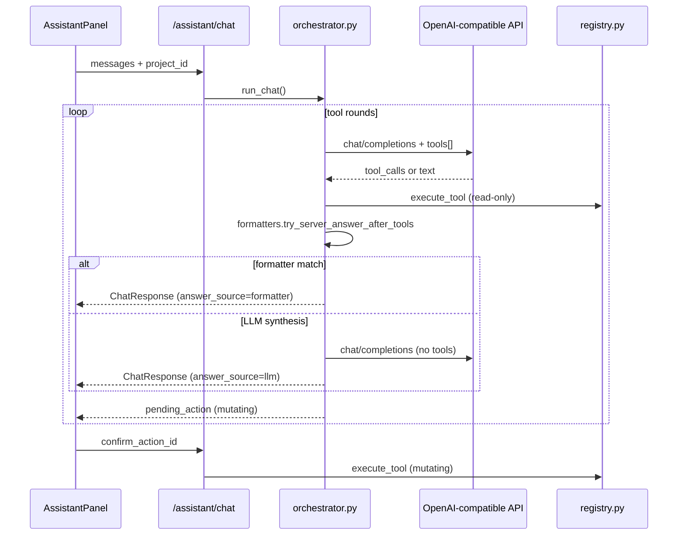
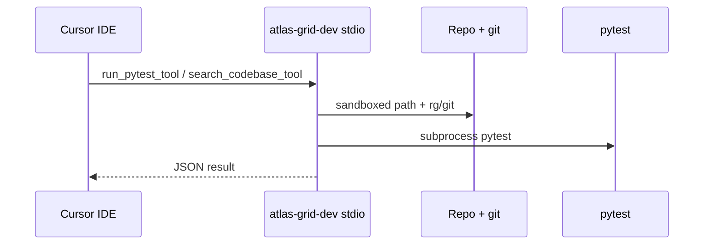

# AI Assistant — архитектура Shared Tool Registry

**Дата:** июнь 2026  
**Для кого:** backend- и frontend-разработчики, интеграторы MCP  
**Код:** [`decision-matrix/backend/app/assistant/`](../../decision-matrix/backend/app/assistant/)  
**Связанные документы:** [assistant-tools.md](../features/assistant-tools.md), [auth-rbac.md](auth-rbac.md), [architecture.md](architecture.md)

---

## 1. Назначение

**Assistant** — модуль внутри существующего FastAPI backend, не отдельный микросервис. Он предоставляет **Shared Tool Registry**: именованные операции (tools) для AI-клиентов — будущего чата в UI, HTTP MCP и stdio MCP для разработки в Cursor.

Tools вызывают ту же бизнес-логику, что и REST API (`app/services/*`, `project_access`), но через единый контракт `execute_tool(name, args, ctx)` вместо дублирования HTTP handlers.

---

## 2. Почему не микросервис

| Критерий | Assistant (модуль) | Отдельный MCP-сервис |
|----------|-------------------|----------------------|
| Доступ к БД | Та же сессия SQLAlchemy, те же транзакции | Отдельное подключение, согласование схемы |
| RBAC | `ToolContext(user, db)` + `resolve_project` | Прокидывание JWT, риск расхождения прав |
| Фоновые jobs | `create_and_schedule_job` в ту же очередь ARQ | Дублирование или лишний HTTP |
| Деплой | Тот же `erascaning.duckdns.org` | Ещё один контейнер, CORS, секреты LLM |
| Аналог в проекте | — | Autoroad network — **опциональный** микросервис из‑за тяжёлого GeoSteiner solver |

Assistant — **оркестрация и RBAC** поверх уже существующего API-слоя, а не изолированный compute engine.

---

## 3. Размещение в backend

```
decision-matrix/backend/app/
├── api/v1/              ← REST для React (как сейчас)
├── services/            ← бизнес-логика (общая для REST и tools)
└── assistant/           ← Shared Tool Registry (фаза 1 — реализован scaffold)
    ├── registry.py      ← execute_tool, list_tools
    ├── context.py       ← ToolContext
    ├── tools/domain/    ← 10 domain tools
    ├── transport/       ← HTTP MCP `/api/v1/mcp` (фаза 2 ✅)
    ├── chat/            ← POST /assistant/chat, LLM orchestrator (фаза 3 ✅)
    └── dev/             ← stdio dev MCP (фаза 4 ✅)
```

В [`main.py`](../../decision-matrix/backend/app/main.py) смонтирован **HTTP MCP** (`ASSISTANT_MCP_PATH` + `/`; клиентский URL: `/api/v1/mcp/`) при `ASSISTANT_MCP_ENABLED=true`. **Chat API** — `POST /api/v1/assistant/chat`, `GET /api/v1/assistant/status` в router v1 (CSRF + JWT как REST).

---

## 4. Целевая архитектура (фазы)



| Фаза | Статус | Содержание |
|------|--------|------------|
| **1** | ✅ scaffold | `ToolContext`, registry, 10 domain tools, pytest |
| **2** | ✅ | HTTP MCP mount (`transport/`), зависимость `mcp`, JWT auth, CORS |
| **3** | ✅ | `POST /api/v1/assistant/chat`, OpenAI-compatible LLM, orchestrator, `AssistantPanel` в `AppLayout` |
| **4** | ✅ | stdio MCP `atlas-grid-dev`: `run_pytest`, `search_codebase`, `git_status`, `git_log` |
| **5** | ✅ | +6 domain tools (тарифы, cancel job, admin journal); UX чата (chips, tool log) |
| **6** | ✅ | Все GET read-only API → 32 tools с RBAC по роли |
| **7** | planned | Tool routing, форматирование ответов, context fallback, status hints |
| **8** | ✅ | 8.1 SSE, 8.2 история в БД, 8.3 UI-контекст, 8.4 chips, 8.5 MCP resources |
| **9** | ✅ | Mutating tools + confirm, HTTP MCP block, audit log, rate limits, MCP UX, dev domain proxy, admin LLM override |
| **10** | ✅ | Product wiki: `docs/wiki/`, bundle, `search_wiki` tools, MCP `wiki://*`, chat routing `help` |

---

## 5. Поток выполнения tool

```
Клиент (chat / MCP / тест)
    │
    ▼
list_tools(ctx)  ──► фильтр по роли (viewer не видит mutating)
    │
    ▼
execute_tool(name, args, ctx)
    │
    ├── Pydantic validate args
    ├── handler(ctx, parsed_args)
    │       └── resolve_project / list_accessible_projects / services/*
    └── ToolResult { ok, data | error, code }
```

**ToolContext:**

```python
@dataclass
class ToolContext:
    user: User
    db: AsyncSession
    env: Literal["development", "staging", "production", "test"]
```

Публичный API пакета:

```python
from app.assistant import ToolContext, execute_tool, list_tools
```

---

## 6. RBAC и безопасность

- Каждый handler вызывает [`resolve_project`](../../decision-matrix/backend/app/services/project_access.py) с нужным `AccessLevel` и `WriteScope` (как REST).
- `list_tools(ctx)` скрывает **mutating** tools от роли `viewer` (например `start_analyze_all_pois`).
- Admin-only tools в scaffold **не включены** (фаза 2+).
- Секреты LLM — только на backend (фаза 3); в `VITE_*` не попадают.
- Cross-origin prod: тот же JWT/Bearer, что в [auth-rbac.md](auth-rbac.md).

---

## 7. Связь REST ↔ tools

Tools **не импортируют** route handlers из `api/v1/`. REST и tools — параллельные «тонкие» слои над `services/`:

```
React ──► api/v1/projects.py ──► services/project_access.py
Chat  ──► assistant/tools/domain/projects.py ──► services/project_access.py
```

Подробный каталог tools и REST-аналоги — [assistant-tools.md](../features/assistant-tools.md).

---

## 8. Тестирование

- [`tests/test_assistant_tools.py`](../../decision-matrix/backend/tests/test_assistant_tools.py) — list_tools RBAC, smoke `list_projects` / `get_project`.
- [`tests/test_assistant_mcp_http.py`](../../decision-matrix/backend/tests/test_assistant_mcp_http.py) — MCP auth 401, `tools/list`, `tools/call`.
- [`tests/test_assistant_chat.py`](../../decision-matrix/backend/tests/test_assistant_chat.py) — mock LLM, tool loop, mutating confirm.
- [`tests/test_assistant_dev_mcp.py`](../../decision-matrix/backend/tests/test_assistant_dev_mcp.py) — dev tools sandbox, pytest/git/search handlers.
- Фикстуры пользователей — [`tests/conftest.py`](../../decision-matrix/backend/tests/conftest.py) (`analyst@test.ru`, `viewer@test.ru`).

```bash
cd decision-matrix/backend
pytest tests/test_assistant_tools.py tests/test_assistant_mcp_http.py tests/test_assistant_chat.py tests/test_assistant_dev_mcp.py -v
```

---

## 9. Добавление нового tool

1. Pydantic input + async handler в `tools/domain/<module>.py`.
2. `register_tool(ToolDefinition(...))` в `register()` модуля.
3. Вызов модуля из [`tools/__init__.py`](../../decision-matrix/backend/app/assistant/tools/__init__.py) → `register_all_tools()`.
4. Тест в `tests/test_assistant_tools.py`.
5. Обновить [assistant-tools.md](../features/assistant-tools.md).

---

## 10. Отличие от Autoroad Network Service

| | Assistant | Autoroad network (optional microservice) |
|--|-----------|----------------------------------------|
| Природа | CRUD + orchestration jobs | Тяжёлый геометрический solver |
| По умолчанию | In-process в FastAPI | In-process; HTTP `:8080` опционально |
| Документация | этот файл | [autoroad-network-plan.md](../autoroad/autoroad-network-plan.md) |

---

## 11. HTTP MCP (фаза 2)

**Endpoint:** `POST /api/v1/mcp/` — [Streamable HTTP](https://modelcontextprotocol.io) через официальный Python SDK (`mcp>=1.9.0`). Клиенты должны использовать URL **с завершающим slash** (иначе 307 и потеря `Authorization` в Cursor).



**Mutating (фаза 9):** `call_tool` для tools с `mutating=True` **не вызывает** `execute_tool` — ответ `ToolResult` с `code=confirm_required`. Запись данных только через веб-чат (кнопка «Подтвердить»).

**Rate limit (фаза 9):** per-role лимиты в `McpAuthMiddleware` (`ASSISTANT_MCP_RATE_LIMIT_*`, ключ `ip:user_id`).

**Auth:** Bearer JWT обязателен (тот же access token, что REST). Cookie опционально через `_extract_access_token`. CSRF **не** применяется — mount вне router с `verify_csrf`.

**Mount:** ASGI sub-app на `ASSISTANT_MCP_PATH + "/"` — без редиректа bare path → slash.

**Lifespan:** `mcp.session_manager.run()` объединён с DB init через `AsyncExitStack` в `main.py`.

**CORS:** заголовки `Mcp-Session-Id`, `MCP-Protocol-Version` добавлены в `allow_headers`.

**Cursor (prod):** `scripts/get-atlas-grid-token.ps1` → `.cursor/mcp.json` (gitignored); rule `.cursor/rules/atlas-grid-mcp.mdc`. См. [assistant-tools.md §9](../features/assistant-tools.md).

Подробнее: [`transport/README.md`](../../decision-matrix/backend/app/assistant/transport/README.md).

---

## 12. Веб-чат (фаза 3)

**Endpoints:** `POST /api/v1/assistant/chat`, `GET /api/v1/assistant/status` — внутри router v1 (JWT + CSRF, per-role rate limit `ASSISTANT_CHAT_RATE_LIMIT_*`).



**LLM:** OpenAI-compatible HTTP (`httpx`) — один клиент для Ollama, LM Studio (локально) и облака (OpenRouter и др.) через `ASSISTANT_LLM_*` в `.env` / `app.env`. `probe_provider()` — только `GET …/models`; ошибки chat (`429`, `401`, …) → `ChatError` с кодами `llm_rate_limit`, `llm_auth`, … и русские подсказки в UI ([`chatErrors.ts`](../../decision-matrix/frontend/src/lib/assistant/chatErrors.ts)).

**Ответ:** `POST /assistant/chat` — цельный JSON (`ChatResponse`: `message`, `tool_calls_made`, `pending_action?`, `answer_source?`); `POST /assistant/chat/stream` — SSE (`token`, `tool_start`, `tool_done`, `pending_action`, `done`, `error`). UI: `fetch` + `ReadableStream` (POST + CSRF).

**История:** session-only в React state (без БД).

**Mutating:** `pending_action` + кнопка «Подтвердить»; `action_id` — HMAC-signed token (`pending.py`).

**UI:** [`AssistantPanel.tsx`](../../decision-matrix/frontend/src/components/assistant/AssistantPanel.tsx) в header [`AppLayout.tsx`](../../decision-matrix/frontend/src/components/layout/AppLayout.tsx).

Подробнее: [`chat/README.md`](../../decision-matrix/backend/app/assistant/chat/README.md), [assistant-tools.md §10](../features/assistant-tools.md).

---

## 13. Dev stdio MCP (фаза 4)

**Сервер Cursor:** `atlas-grid-dev` — subprocess stdio, **не** HTTP mount на FastAPI.



| Tool | Назначение |
|------|------------|
| `run_pytest_tool` | pytest в `decision-matrix/backend` |
| `search_codebase_tool` | ripgrep / Python search |
| `git_status_tool` | branch + short status |
| `git_log_tool` | recent commits |

**Domain data** — по умолчанию HTTP **`atlas-grid`** (`/api/v1/mcp/`). Опционально (фаза 9.6): read-only domain tools в stdio при `ASSISTANT_DEV_MCP_DOMAIN_TOOLS=true` (mutating не экспортируются).

**Setup:** `.\scripts\get-atlas-grid-token.ps1 -IncludeDevMcp` или [`.cursor/mcp.json.example`](../../.cursor/mcp.json.example).

**Prod VM:** dev MCP **не деплоится** (stdio только на ПК разработчика).

Подробнее: [`dev/README.md`](../../decision-matrix/backend/app/assistant/dev/README.md), [assistant-tools.md §11](../features/assistant-tools.md).

---

## 14. Расширение команд (фаза 5)

**Новые tools** в registry (автоматически в HTTP MCP и веб-чате):

| Tool | Тип |
|------|-----|
| `get_cost_rates`, `get_economic_params` | read |
| `cancel_project_job` | mutating + confirm |
| `admin_list_jobs`, `admin_jobs_health` | admin only |

**Чат UX:** быстрые chips, лог `tool_calls_made`, «Очистить чат», русские labels ([`tool_labels.py`](../../decision-matrix/backend/app/assistant/chat/tool_labels.py)).

Подробнее: [assistant-tools.md §12](../features/assistant-tools.md).

---

## 15. Полное покрытие GET (фаза 6)

Добавлены tools для всех read-only REST команд: сессия (`get_me`), слои карты, граф сетей, one-pagers, импорты, 3D-модели (метаданные), admin users/stats и др. Исключение: бинарные файлы GLB.

Модули: `session.py`, `graph.py`, `one_pagers.py`, `imports.py`, `map3d.py`, `admin.py` + расширения `projects.py`, `map.py`, `analysis.py`.

Подробнее: [assistant-tools.md §13](../features/assistant-tools.md).

---

## 16. Стабильность LLM и качество ответов (фаза 7)

**Цель:** стабильная работа чата на локальных LLM с малым контекстом (n_ctx 2048–4096) и понятные ответы пользователю вместо сырого JSON.

**Проблема:** 32 tools с полными JSON-схемами переполняют контекст (`n_keep >= n_ctx`). Меры: `_DATA_HINTS`, `_slim_tool_schema`, **категорийный роутинг** (7.1), **server-side formatters** (7.2).

### Задачи

| ID | Задача | Код / артефакты | Статус |
|----|--------|-----------------|--------|
| 7.1 | Категорийный роутинг tools | [`chat/tool_router.py`](../../decision-matrix/backend/app/assistant/chat/tool_router.py); `categories` на `ToolDefinition`; `_tools_for_llm(ctx, request)` → 5–12 tools; `ASSISTANT_CHAT_MAX_ROUTED_TOOLS` | ✅ |
| 7.2 | Форматирование ответов | [`chat/formatters/`](../../decision-matrix/backend/app/assistant/chat/formatters/) — реестр `FormatterSpec`, tool-first для list/count; анализ POI, admin, потоки/песок, misc read-tools; `answer_source` в `ChatResponse` | ✅ |
| 7.3 | Fallback при переполнении контекста | `llm_client.py` / orchestrator: catch `llm_http` + «context» → retry без tools или core-set | planned |
| 7.4 | Расширенный `/assistant/status` | `formatters_count`, `formatter_tools`; planned: `min_context_recommended`, `tools_count`, `model_hint` | частично ✅ |
| 7.5 | Тесты | `test_assistant_tool_router.py`, `test_assistant_response_formatters.py`, интеграция в `test_assistant_chat.py` | ✅ |

**Server formatters (7.2):** после tool round оркестратор вызывает `formatters/registry.try_server_answer_after_tools()` — ответ **без LLM** при совпадении matcher'а или единственной ошибке tool (`answer_source`: `formatter` | `tool_error` | `llm`). Tool-first для `list_projects`, `list_pois`, `list_infra_objects`, `list_infra_layers`. Полный список tools — `GET /assistant/status` → `formatter_tools`.

Структура пакета:

```
chat/formatters/
  registry.py    # FormatterSpec, try_server_answer_after_tools
  counts.py      # list/count, get_project
  analysis.py    # POI analysis, candidates
  jobs.py, rates.py, admin.py, flow_sand.py, misc.py, errors.py
```

Подробнее: [`formatters/README.md`](../../decision-matrix/backend/app/assistant/chat/formatters/README.md).

**Зависимости:** 7.1 — основа для 7.3; 7.2 можно параллельно с 7.1.

**Риски:** эвристики роутинга пропускают нужный tool — mitigation: core-set fallback + полный набор в MCP (без LLM prompt).

**Вне scope:** история чата в БД (фаза 8.2).

---

## 17. UX чата и контекст приложения (фаза 8)

**Цель:** помощник ощущается отзывчивым, помнит диалог и использует контекст UI (проект, вкладка, выбранный POI).

### Задачи

| ID | Задача | Код / артефакты | Критерий готовности |
|----|--------|-----------------|---------------------|
| 8.1 | SSE streaming | ✅ `POST /assistant/chat/stream`; `postChatStream` + [`AssistantPanel.tsx`](../../decision-matrix/frontend/src/components/assistant/AssistantPanel.tsx); события `token`, `tool_start`, `tool_done`, `pending_action`, `done` | Текст появляется до завершения запроса |
| 8.2 | История чата в БД | ✅ `AssistantChatSession`, `AssistantChatMessage`; `GET/POST /assistant/sessions`; `history.py`; UI selector | История после F5 |
| 8.3 | Богатый контекст UI | ✅ `ChatRequest`: `project_name`, `selected_poi_id`, `active_tab`; [`assistantContext.ts`](../../decision-matrix/frontend/src/lib/assistant/assistantContext.ts); `_build_system_prompt()` | Меньше уточнений «какой проект?» |
| 8.4 | Контекстные chips | ✅ [`getQuickCommands`](../../decision-matrix/frontend/src/lib/assistant/toolLabels.ts) по `pathname` и роли | На `/map` — «Объекты на карте»; admin — «Статистика» |
| 8.5 | MCP resources (read-only) | ✅ `docs://calculation-logic`, `docs://infrastructure-subtypes`, `openapi://v1` в [`transport/resources.py`](../../decision-matrix/backend/app/assistant/transport/resources.py) | `resources/list` в Cursor без 32 tools в prompt |
| 8.6 | Документация | ✅ assistant-tools.md §14; [`transport/README.md`](../../decision-matrix/backend/app/assistant/transport/README.md) | Протокол и auth описаны |

**Зависимости:** 8.1 не блокирует 8.2; 8.3 параллельно с 8.1.

**Риски:** SSE + CSRF/cookies — проверить proxy Vite и prod CORS.

---

## 18. Запись, безопасность, production (фаза 9) ✅

**Цель:** полноценный ассистент с изменением данных (confirm), наблюдаемостью и защитой на prod.

### Задачи

| ID | Задача | Код / артефакты | Критерий готовности |
|----|--------|-----------------|---------------------|
| 9.1 | Mutating tools (пакет 1) | `create_project`, `create_poi`, `update_infra_object`; `mutating=True` + `pending_action` | ✅ Confirm UI; HTTP MCP → `confirm_required` |
| 9.2 | Mutating tools (пакет 2) | `analyze_poi`, `update_cost_rates`, `batch_delete_map_objects` | ✅ RBAC; viewer не видит mutating в `list_tools` |
| 9.3 | Журнал действий assistant | `assistant_audit_log`; хук в `execute_tool`; `admin_list_assistant_audit`, `GET /admin/assistant/audit` | ✅ |
| 9.4 | Rate limits по роли | per-role chat/MCP лимиты; `ASSISTANT_CHAT_MAX_TOOL_ROUNDS_VIEWER` | ✅ |
| 9.5 | MCP / токен UX | `GET /assistant/status` → `mcp_url`, `mcp_setup_hint_ru`; блок в `AssistantPanel` | ✅ |
| 9.6 | Dev MCP domain proxy | `ASSISTANT_DEV_MCP_DOMAIN_TOOLS=true` — read-only domain tools в stdio MCP | ✅ |
| 9.7 | Смена модели без рестарта | `POST/DELETE /admin/assistant/llm-config` (in-memory override) | ✅ |

**Зависимости:** 9.1 перед 9.2; 9.3 после стабилизации mutating (9.1–9.2).

**Риски:** mutating через LLM — строгий confirm и audit обязательны.

**Вне scope:** полный proxy всех REST write endpoints; SSE (фаза 8).

Подробнее: [assistant-tools.md §8](../features/assistant-tools.md).

---

## 19. Product wiki (фаза 10) ✅

**Цель:** проверяемая справка о продукте для LLM (веб-чат и HTTP MCP), без смешения с live data.

### Задачи

| ID | Задача | Код / артефакты | Критерий готовности |
|----|--------|-----------------|---------------------|
| 10.1 | Контент wiki | [`docs/wiki/`](../wiki/), 8+ статей с frontmatter | Русский how-to по разделам UI |
| 10.2 | Bundle + sync | [`scripts/sync-assistant-wiki.py`](../../scripts/sync-assistant-wiki.py), `knowledge/bundle/` | Docker prod без monorepo root |
| 10.3 | Store + search | [`knowledge/store.py`](../../decision-matrix/backend/app/assistant/knowledge/store.py) | RBAC по `roles` в manifest |
| 10.4 | Chat tools | `list_wiki_articles`, `search_wiki`, `get_wiki_article`; `CAT_HELP` в router | Wiki tools всегда в routed set |
| 10.5 | MCP resources | `wiki://{slug}`, `wiki://index`; `docs://*` из bundle | `resources/read` в Cursor |
| 10.6 | Status + UX | `wiki_enabled` в `/assistant/status`; chips «Справка» в UI | Пользователь видит подсказки |

| 10.2 | Wiki RAG | [`knowledge/rag.py`](../../decision-matrix/backend/app/assistant/knowledge/rag.py) | ✅ hybrid keyword + TF-IDF/embeddings |
| — | Админ-редактор wiki в БД | — | вне scope |

Подробнее: [assistant-tools.md §15](../features/assistant-tools.md).
