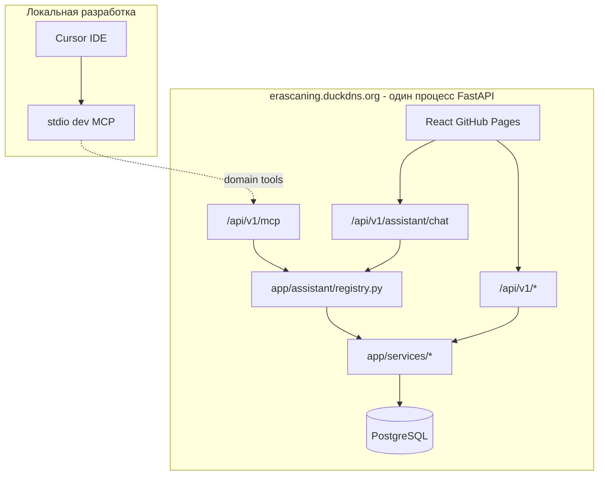
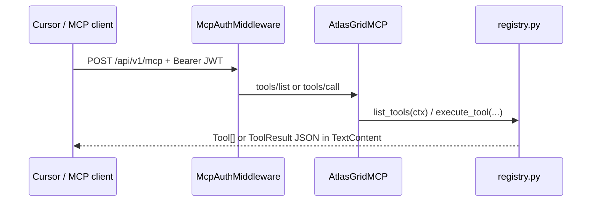

# AI Assistant — архитектура Shared Tool Registry

**Дата:** июнь 2026  
**Для кого:** backend- и frontend-разработчики, интеграторы MCP  
**Код:** [`decision-matrix/backend/app/assistant/`](../../decision-matrix/backend/app/assistant/)  
**Связанные документы:** [assistant-tools.md](../features/assistant-tools.md), [auth-rbac.md](auth-rbac.md), [architecture.md](architecture.md)

---

## 1. Назначение

**Assistant** — модуль внутри существующего FastAPI backend, не отдельный микросервис. Он предоставляет **Shared Tool Registry**: именованные операции (tools) для AI-клиентов — будущего чата в UI, HTTP MCP и stdio MCP для разработки в Cursor.

Tools вызывают ту же бизнес-логику, что и REST API (`app/services/*`, `project_access`), но через единый контракт `execute_tool(name, args, ctx)` вместо дублирования HTTP handlers.

---

## 2. Почему не микросервис

| Критерий | Assistant (модуль) | Отдельный MCP-сервис |
|----------|-------------------|----------------------|
| Доступ к БД | Та же сессия SQLAlchemy, те же транзакции | Отдельное подключение, согласование схемы |
| RBAC | `ToolContext(user, db)` + `resolve_project` | Прокидывание JWT, риск расхождения прав |
| Фоновые jobs | `create_and_schedule_job` в ту же очередь ARQ | Дублирование или лишний HTTP |
| Деплой | Тот же `erascaning.duckdns.org` | Ещё один контейнер, CORS, секреты LLM |
| Аналог в проекте | — | Autoroad network — **опциональный** микросервис из‑за тяжёлого GeoSteiner solver |

Assistant — **оркестрация и RBAC** поверх уже существующего API-слоя, а не изолированный compute engine.

---

## 3. Размещение в backend

```
decision-matrix/backend/app/
├── api/v1/              ← REST для React (как сейчас)
├── services/            ← бизнес-логика (общая для REST и tools)
└── assistant/           ← Shared Tool Registry (фаза 1 — реализован scaffold)
    ├── registry.py      ← execute_tool, list_tools
    ├── context.py       ← ToolContext
    ├── tools/domain/    ← 10 domain tools
    ├── transport/       ← HTTP MCP `/api/v1/mcp` (фаза 2 ✅)
    ├── chat/            ← заглушка: POST /assistant/chat (фаза 3)
    └── dev/             ← заглушка: stdio dev tools (фаза 4)
```

В [`main.py`](../../decision-matrix/backend/app/main.py) смонтирован **HTTP MCP** на `/api/v1/mcp` (если `ASSISTANT_MCP_ENABLED=true`). Endpoint `/assistant/chat` — фаза 3.

---

## 4. Целевая архитектура (фазы)



| Фаза | Статус | Содержание |
|------|--------|------------|
| **1** | ✅ scaffold | `ToolContext`, registry, 10 domain tools, pytest |
| **2** | ✅ | HTTP MCP mount (`transport/`), зависимость `mcp`, JWT auth, CORS |
| **3** | ⬜ | `POST /api/v1/assistant/chat`, LLM orchestrator, UI в `AppLayout` |
| **4** | ⬜ | stdio MCP: `run_pytest`, поиск по репозиторию |

---

## 5. Поток выполнения tool

```
Клиент (chat / MCP / тест)
    │
    ▼
list_tools(ctx)  ──► фильтр по роли (viewer не видит mutating)
    │
    ▼
execute_tool(name, args, ctx)
    │
    ├── Pydantic validate args
    ├── handler(ctx, parsed_args)
    │       └── resolve_project / list_accessible_projects / services/*
    └── ToolResult { ok, data | error, code }
```

**ToolContext:**

```python
@dataclass
class ToolContext:
    user: User
    db: AsyncSession
    env: Literal["development", "staging", "production", "test"]
```

Публичный API пакета:

```python
from app.assistant import ToolContext, execute_tool, list_tools
```

---

## 6. RBAC и безопасность

- Каждый handler вызывает [`resolve_project`](../../decision-matrix/backend/app/services/project_access.py) с нужным `AccessLevel` и `WriteScope` (как REST).
- `list_tools(ctx)` скрывает **mutating** tools от роли `viewer` (например `start_analyze_all_pois`).
- Admin-only tools в scaffold **не включены** (фаза 2+).
- Секреты LLM — только на backend (фаза 3); в `VITE_*` не попадают.
- Cross-origin prod: тот же JWT/Bearer, что в [auth-rbac.md](auth-rbac.md).

---

## 7. Связь REST ↔ tools

Tools **не импортируют** route handlers из `api/v1/`. REST и tools — параллельные «тонкие» слои над `services/`:

```
React ──► api/v1/projects.py ──► services/project_access.py
Chat  ──► assistant/tools/domain/projects.py ──► services/project_access.py
```

Подробный каталог tools и REST-аналоги — [assistant-tools.md](../features/assistant-tools.md).

---

## 8. Тестирование

- [`tests/test_assistant_tools.py`](../../decision-matrix/backend/tests/test_assistant_tools.py) — list_tools RBAC, smoke `list_projects` / `get_project`.
- [`tests/test_assistant_mcp_http.py`](../../decision-matrix/backend/tests/test_assistant_mcp_http.py) — MCP auth 401, `tools/list`, `tools/call`.
- Фикстуры пользователей — [`tests/conftest.py`](../../decision-matrix/backend/tests/conftest.py) (`analyst@test.ru`, `viewer@test.ru`).

```bash
cd decision-matrix/backend
pytest tests/test_assistant_tools.py tests/test_assistant_mcp_http.py -v
```

---

## 9. Добавление нового tool

1. Pydantic input + async handler в `tools/domain/<module>.py`.
2. `register_tool(ToolDefinition(...))` в `register()` модуля.
3. Вызов модуля из [`tools/__init__.py`](../../decision-matrix/backend/app/assistant/tools/__init__.py) → `register_all_tools()`.
4. Тест в `tests/test_assistant_tools.py`.
5. Обновить [assistant-tools.md](../features/assistant-tools.md).

---

## 10. Отличие от Autoroad Network Service

| | Assistant | Autoroad network (optional microservice) |
|--|-----------|----------------------------------------|
| Природа | CRUD + orchestration jobs | Тяжёлый геометрический solver |
| По умолчанию | In-process в FastAPI | In-process; HTTP `:8080` опционально |
| Документация | этот файл | [autoroad-network-plan.md](../autoroad/autoroad-network-plan.md) |

---

## 11. HTTP MCP (фаза 2)

**Endpoint:** `POST /api/v1/mcp` — [Streamable HTTP](https://modelcontextprotocol.io) через официальный Python SDK (`mcp>=1.9.0`).



**Auth:** Bearer JWT обязателен (тот же access token, что REST). Cookie опционально через `_extract_access_token`. CSRF **не** применяется — mount вне router с `verify_csrf`.

**Lifespan:** `mcp.session_manager.run()` объединён с DB init через `AsyncExitStack` в `main.py`.

**CORS:** заголовки `Mcp-Session-Id`, `MCP-Protocol-Version` добавлены в `allow_headers`.

Подробнее: [`transport/README.md`](../../decision-matrix/backend/app/assistant/transport/README.md), [assistant-tools.md §9](../features/assistant-tools.md).
