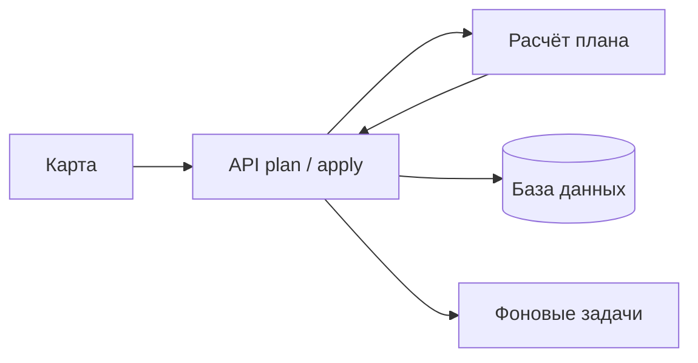
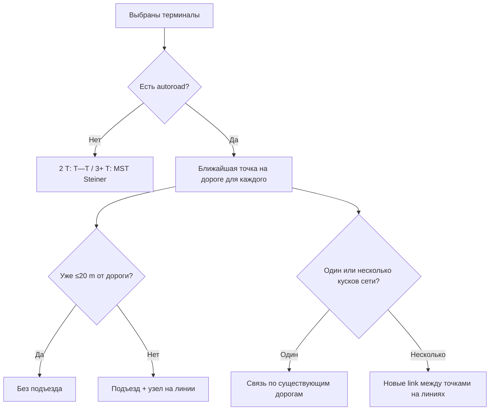

# Автопостроение сети автодорог

**Дата:** июнь 2026  
**Статус:** функция **работает** и **согласована с `plan_core.py`**: режим «Сеть» на карте, plan/apply, MST + Steiner без дорог, проверка связности. Отдельный процесс на порту 8001 — только при `AUTOROAD_NETWORK_INPROCESS=false` + `AUTOROAD_NETWORK_SERVICE_URL`.

> **Пошаговая инструкция и разбор алгоритмов простым языком:** [autoroad-network-instruction.md](./autoroad-network-instruction.md)  
> **Журнал задач в шапке (JSON расчётов, экспорт):** [task-log-panel.md](./task-log-panel.md)

---

## Словарь (как читать этот документ)

| Термин | Значение |
|--------|----------|
| **Терминал** | Точечный объект, который пользователь выбрал; **только конец** дороги, не перекрёсток |
| **Узел** | Отдельная точка на карте, где сходятся две и более автодороги |
| **Autoroad** | Линия автодороги |
| **Подъезд (connector)** | Автодорога от терминала до узла или до точки на существующей линии |
| **Связка (link)** | Автодорога между двумя узлами/snap на линиях (или между терминалами, если дорог ещё нет и объектов ровно два) |
| **Snap** | Точка на полилинии дороги, куда «прилипает» подъезд или стык |
| **MST** | Минимальное дерево связей: **без дорог** (топология между `Т`) и **мосты** между кусками существующей сети |
| **Steiner-узел** | `junction` на магистрали MST (середина маршрута или via-точка обхода); перекрёстки только в `●`, не в `Т` |
| **Компонента сети** | Кусок дорог, до которого можно добраться только по уже нарисованным линиям, без «прыжка через поле» |
| **План** | Расчёт «что нарисовать» без записи в базу |
| **Apply** | Применение плана: создание линий и узлов в проекте |

---

## Часть 1. Для пользователя и аналитика

### Пользовательская история

**Дано:** на карте только **точечные объекты** (скважины, площадки, стыки и т.п.), дорог ещё нет или они не связывают выбранные точки.

**Действие:** пользователь выбирает нужные точки и запускает расчёт сети автодорог.

**Результат:** все выбранные точки оказываются в **одной связной сети** (см. ниже — обязательное требование). Типичная цепочка на карте выглядит так:

```text
Точечный объект — автодорога — узел — автодорога — точечный объект
```

Если точек три и больше, дороги сходятся **в отдельном узле** (перекрёстке), а не в координатах одного из выбранных объектов:

```text
        Т₁
         \
          узел —— Т₂
         /
        Т₃
```

**Главное правило:** **точечный объект не может быть перекрёстком.** В одной точке объекта не сходятся несколько автодорог. Объект — только **конец** дороги (один подъезд или одна привязка линии). Там, где должны встретиться две и более дороги, система создаёт **отдельный узел** (`node` на карте).

| Роль на карте | Может ли соединять несколько дорог? |
|---------------|-------------------------------------|
| Точечный объект (терминал) | **Нет** — только конец линии |
| Узел (junction / intersection) | **Да** — перекрёсток, стык, подъезд к существующей дороге |

### Зачем нужна функция

Связать разрозненные точки **логичной схемой дорог**: без «звезды» в координатах скважины и без прямых линий объект↔объект через поле, когда уже есть сеть `autoroad`.

### Где учитывается «минимальное расстояние» *(утверждено)*

В расчёте **есть** задачи на минимум. Это **не** TSP и **не** учёт рельефа.

| Задача | Что минимизируем | Как |
|--------|------------------|-----|
| Подъезд к дороге | Расстояние `Т` → линия | **Ближайшая точка** на полилинии (haversine по сегментам) |
| Дорог **нет**, 3+ `Т` | **Суммарная длина** новых дорог (MST) | **MST + Steiner:** `●` на ребре MST; степень 2 — `link` вдоль цепочки между `●`; степень ≥3 — **hub** `J_T` + звезда `J_T→●`; `connector` `Т→J_T` или на магистраль |
| Дорог **нет**, 2 `Т` | Длина одного отрезка | Прямая `Т──Т` (минимум для пары; узел `●` **не** обязателен) |
| Связь по **существующей** сети | Длина пути по дорогам | **Кратчайший путь** по графу (Дейкстра) |
| Несколько **несвязанных** кусков | Суммарная длина **мостов** | **MST** между snap на линиях (прямые `link` snap↔snap) |

**Не делаем:** TSP; рельеф и запретные зоны; прямые `link` **Т↔Т** при 3+ точках (только **Т→●** и **●↔●**).

**Реализация:** `_plan_off_network_steiner_mst` — `geodesic_midpoint`, hub `J_T` при степени ≥3, path-`link` при степени 2, `_simplify_collinear_backbone`, **`_repair_planned_line_topology`** (Т-развилки: узел + разрез магистрали), `acute_bend_deg` в preview; на карте — overlay из `preview` до apply.

---

### Связность сети *(утверждено)*

**Обязательно:** после успешного расчёта и apply любые **два** выбранных терминала должны быть соединены **цепочкой** из автодорог `autoroad` (существующих и/или новых) и узлов `●` — без разрывов внутри выбранного набора.

| Что считается «связно» | Что не считается ошибкой связности |
|------------------------|-----------------------------------|
| Есть путь только по линиям `══` / `──` и узлам между любыми двумя `Т` из выбора | Один `Т` с `already_connected` без новой линии, если он уже на общей сети с остальными |
| Один кусок графа дорог + подъезды + мосты между snap | Предупреждения `far_from_autoroad` при этом путь всё равно есть |

**Если связность недостижима** (например, меньше двух терминалов, все исключены по подтипу, нет ни одного snap к сети при обязательных подъездах) — план **не считается успешным**: пустой или неполный preview, предупреждения в ответе; **apply** для такого плана не должен сохранять «полусеть».

**Как обеспечивается в логике:**

- Нет дорог → MST-дерево / `Т──Т` (2 точки) связывает все `Т`.
- Есть дороги, один кусок `══` → подъезды + пути по графу между snap.
- Несколько кусков `══` → **MST мостов** между компонентами (добавляем ровно столько `link` snap↔snap, чтобы все компоненты с выбранными `Т` слились в **одну**).

---

### Остальные правила

1. **Есть старые дороги** — новые участки цепляются к ним; связь между объектами идёт **по сети дорог** и подъездам, а не напрямую объект↔объект.
2. **К каждому терминалу** — не больше **одной** автодороги, приходящей в объект.
3. **Сеть разорвана** на куски — недостающие связи между кусками — **между узлами/snap на линиях**, не между координатами терминалов.
4. **Дорог нет, 2 объекта** — по одному `connector` от каждого `Т` до границы зоны 200 m и один `link` между границами (не прямая линия `Т↔Т`).
5. **Дорог нет, 3+ объекта** — **MST:** `n−1` узлов `●` на рёбрах MST (вне зон 200 m), `link` между узлами, по одному `connector` `Т→граница`; несколько дорог в одной точке `Т` **запрещено**.
6. **Зона 200 m** — вокруг каждого выбранного терминала запретная область радиусом **200 m** (`TERMINAL_EXCLUSION_RADIUS_KM = 0,2`): внутри допускается только `connector` от `Т` до точки на границе; все `link` и `junction` — снаружи. Если терминалы ближе **400 m**, зоны пересекаются → предупреждение `exclusion_zones_overlap`, связь строится между точками на границах.
7. **Уже подключён** — конец существующей дороги в **≤20 m** от объекта → второй подъезд не строят (`already_connected`).
8. **Далеко от дороги** — snap **>0,3 km** → предупреждение `far_from_autoroad`, подъезд всё равно строят.
9. За раз **от 2 до 50** терминалов; POI и подтипы `node` / `methanol_joint` / `power_line_node` не участвуют.

### Как пользоваться (шаги на карте)

1. Открыть проект на карте.
2. Включить режим **«Построить сеть автодорог»** (в интерфейсе — «Сеть»).
3. Выбрать **не меньше двух** подходящих точечных объектов.
4. Нажать расчёт — на карте **фиолетовый/оранжевый overlay** плана и модалка с цифрами; предупреждения (`acute_bend_deg`, далеко от дороги).
5. **Применить** — сохранить в проект, или отменить.
6. При необходимости откатить последнее действие (**Ctrl+Z**).

### Условные обозначения на схемах

| Символ | Значение |
|--------|----------|
| `Т` | Точечный объект (терминал), **не** перекрёсток |
| `●` | Узел на карте (junction / intersection) |
| `══` | Уже существующая автодорога |
| `──` | Новая автодорога (подъезд или связка) |
| `···` | Связь идёт по **существующей** дороге, новую линию не рисуем |
| `⚠` | Предупреждение в предпросмотре |

---

### Схемы по случаям

#### 0. До расчёта — только точки

```text
  Т₁              Т₂

           Т₃
```

Нет линий `autoroad`. Пользователь выбирает `Т₁…Т₃` и запускает расчёт.

---

#### 1. Дорог нет, **два** терминала

```text
  Т₁ ────────────── Т₂
      одна автодорога
```

Узел `●` между ними **не обязателен** (достаточно одной линии между концами).  
Оба объекта — только **концы** этой дороги, не перекрёсток.

---

#### 2. Дорог нет, **три и больше** — MST + Steiner *(утверждено)*

```text
  Т₁ ── ● ─── ● ── Т₃
           |
           J₂
           |
           Т₂
```

**MST без дорог:** топология по **длине маршрута вне зон 200 m** между точками на границах `B_a↔B_b` (`route_backbone_outside_exclusions`), не по прямой между `Т`. Каждое ребро MST — **полилиния** `link` по этому маршруту (обход чужих дисков), не хорда через середины.

Степень 2: `link` вдоль маршрута между `●`, `connector` на магистраль. Степень ≥3: `Т→J_T`, лучи `J_T→` концы маршрутов к границам (без хорды `●₁—●₂` через угол). Два `Т`: `link` `B₁—B₂` с тем же обходом.

---

#### 3. Дорог нет, **четыре терминала** — дерево MST *(утверждено)*

```text
  Т₁──●────●──Т₂
        \  /
         ●
          \
           ●──Т₄
          /
         Т₃
```

Три узла `●` (по числу рёбер MST); перекрёстки только в `●`, не в `Тᵢ`.

---

#### 4. Есть **одна** дорога, терминалы «сбоку» — только подъезды

**До:** дорога уже нарисована, объекты не на линии.

```text
  Т₁          Т₂
   |           |
   └──●═══●═══●──┘
       существующая дорога
```

**После:** от каждого `Т` — подъезд `──` до ближайшей точки на `══`; в точке стыка — узел `●` (junction). Между `Т₁` и `Т₂` **нет** прямой линии через поле — только путь `Т₁→●···●←Т₂` по `══`.

---

#### 5. Два терминала на **концах одной** дороги — уже связаны

```text
  Т₁●════════════●Т₂
     ≤20 m          ≤20 m
```

Подъезды **не строят** (`already_connected`). Новых линий может не быть; в плане — использование существующих участков.

---

#### 6. Терминал **на линии** дороги (не у конца), но дальше 20 m от snap

```text
         Т
         |
         ●──●══════════●
              ↑ подъезд + junction на линии
```

Подъезд к **ближайшей** точке на полилинии (не обязательно к концу дороги).

---

#### 7. Сеть из **двух несвязанных** кусков дорог

```text
  Т₁──●═══●          ●═══●──Т₂
      кусок A    ?    кусок B
                 │
            новая ── между ● на линиях
            (не Т₁──────Т₂)
```

Сначала подъезды `Т→●` на своих кусках, затем **мост** `──` или `══+──` между snap-точками на линиях. Терминалы **не** соединяют напрямую.

---

#### 8. Три терминала, **одна** длинная дорога под всеми

```text
  Т₁──●
       \
        ●════════════●────────●
       /              \
  Т₂──●                ●──Т₃
```

Только `connector` к линии; **нет** `link` объект↔объект. Связность `Т₁↔Т₂↔Т₃` — по `══` между junction на дороге.

---

#### 9. Объект **далеко** от дороги (> 0,3 км)

```text
  Т ⚠
  |
  |  длинный подъезд (всё равно строим)
  |
  ●══════════
```

Предупреждение `far_from_autoroad`, линия **создаётся**.

---

#### 10. Новая дорога **пересекает** старую

```text
        Т
        |
        ●──●
            \
             ●  ← intersection
              \
               ═══ существующая (режется в ●)
```

В точке пересечения — узел `intersection`, существующая линия **режется**, геометрия сохраняется по правилам apply.

---

#### 11. Один терминал уже у дороги, второй — нет

```text
  Т₁●════●········●──Т₂
  уже     существ.  новый подъезд
```

Для `Т₁` — без второго подъезда; для `Т₂` — `──` до линии; связь `Т₁↔Т₂` по сети `══`.

---

#### 12. Сводка: что **запрещено** на схеме

```text
  Запрещено:                 Правильно:

      Т₂                         Т₂
     / \                         |
    /   \                        ●
   Т₁   Т₃                      / \
  (звезда в Т₁)               Т₁   Т₃
```

---

### Краткая таблица случаев

| № | Ситуация | Результат |
|---|----------|-----------|
| 0 | Только точки | Расчёт строит сеть с нуля |
| 1 | Нет дорог, 2 `Т` | `Т──Т` |
| 2–3 | Нет дорог, 3+ `Т` | MST: `Т→●`, `●↔●`, несколько junction |
| 4 | Одна дорога, `Т` сбоку | Подъезды, путь по `══` |
| 5 | `Т` у концов одной дороги | Без подъездов, `already_connected` |
| 6 | `Т` над линией, >20 m | Подъезд к ближайшему snap |
| 7 | Два куска сети | Мост между `●` на линиях |
| 8 | 3+ `Т`, одна линия | Только подъезды |
| 9 | `Т` далеко | Подъезд + `⚠` |
| 10 | Пересечение линий | `intersection` + разрез |
| 11 | Смешанно «у дороги» / «далеко» | Разное по каждому `Т` |

---

### Утверждённые решения *(зафиксировано)*

| № | Вопрос | Решение |
|---|--------|---------|
| — | Связность | Результат **обязан** быть **одной связной** сетью по всем выбранным `Т`; иначе — неуспешный план |
| — | Топология | **Т — дорога — ● — дорога — Т**; `Т` **не** перекрёсток |
| А.1 | 3+ `Т`, нет дорог | **MST** по длине маршрута **вне зон** между границами; `link` — полилиния обхода; `●` на маршруте / hub |
| А.2 | Критерий длины | **Минимальная суммарная длина** новых дорог (дерево), не «все лучи в один центр» |
| Б.3 | 2 `Т`, нет дорог | **`Т──Т`**, узел `●` **не** обязателен |
| В.4 | Подтипы узлов | **Не выбираются:** `node`, `methanol_joint`, `power_line_node` (`NODE_CLUSTER_SUBTYPES`); перекрёстки **создаёт** планировщик |
| В.5 | Два куска `══` | Мост — **прямой** `link` между snap; MST по **кускам**, не по `Т` |
| Г.6 | `already_connected` у части | **Считаем сеть для остальных**, по подключённым — предупреждение, без второго подъезда |
| Г.7 | Порог 0,3 км | Только **`far_from_autoroad`**, подъезд **строим** (режим «не строить дальше X» — не в scope) |
| Д.8 | Предпросмотр | **Два стиля** (существующее / новое) достаточно; подписи символов на карте — не обязательны |

---

### Чего функция не делает

- Не делает терминал перекрёстком (несколько дорог в одной точке объекта).
- Не учитывает рельеф и препятствия при трассировке.
- Не подключает POI как терминалы сети.
- Не рисует второй подъезд к объекту, который уже у дороги.

---

## Часть 2. Как устроена система

### Два этапа: план и применение



- **План** — только математика и геометрия: какие линии и узлы добавить. В базу не пишет.
- **Apply** — запись в проект: новые объекты, разрез существующих линий в точках пересечения, пересборка сети, задачи на пересчёт.

Старый запрос `infrastructure/autoroad-connect` устарел; используется `autoroad-network/plan` и `apply`.

### Роли объектов на карте

| Роль | Описание |
|------|----------|
| Терминал | Любая точка инфраструктуры, кроме POI и `node` / `methanol_joint` / `power_line_node` |
| Узел подъезда | Место, где подъезд встречается с дорогой (`node`, причина junction) |
| Перекрёсток | Место, где новая линия пересекает старую (`node`, причина intersection) |

### Алгоритм (кратко)

**Нет дорог на карте** *(норма)*

1. Два терминала → одна `link` `Т──Т`.
2. Три и больше → MST по длине `route_backbone` между границами → полилинии `link` вне зон → `●` / hub → степень 2: `connector` на магистраль; степень ≥3: hub `J_T`, `connector` `Т→J_T`, звезда к концам маршрутов → `_simplify_collinear_backbone` (не ломает связность hub) → **`_repair_planned_line_topology`** → `acute_bend_deg` в preview. Склейка связности: `max(0.5 км, 1.25×R)`.
3. Проверки: ≤1 автодорога на терминал; связность (`_validate_terminal_connectivity` → `terminals_not_connected`).

**Дороги уже есть**

1. Построить граф из полилиний (вес = длина в км).
2. Для каждого терминала — ближайшая точка на линии.
3. Если дорога уже в 20 m от объекта — подъезд пропустить.
4. Иначе при расстоянии > 20 m — подъезд `connector` и узел на линии.
5. Определить, сколько **несвязанных кусков** сети затронуто.
6. Один кусок — связь только по существующим участкам (в плане перечисляются их id).
7. Несколько кусков — новые `link` только между snap-точками на линиях.
8. Пересечение новой линии со старой → узел перекрёстка и разрез линии (`_collect_splits`).
9. При сохранении форма старых линий не меняется произвольно (`line_preserve_geometry` в apply).
10. Проверка связности по линиям плана и компонентам `terminal_comp`.



---

## Часть 3. Для разработчиков (всё в этом файле)

### Код (пути от корня репозитория)

| Модуль | Путь | Назначение |
|--------|------|------------|
| Планировщик | `decision-matrix/backend/app/services/autoroad_network/plan_core.py` | `plan_from_request`, `_plan_off_network`, `_plan_with_network` |
| MST без дорог | `plan_core._plan_off_network_steiner_mst` | Рёбра MST, Steiner-узлы, connectors |
| Т-развилки | `plan_core._repair_planned_line_topology` | Узел на примыкании коннектора/ребра к **середине** `link`; разбиение сегмента |
| Связность | `plan_core._validate_terminal_connectivity` | Предупреждение `terminals_not_connected` |
| Preview на карте | `frontend/src/lib/autoroadPlanPreview.ts`, `MapPage.tsx` | GeoJSON overlay до apply |
| Демо-сценарии | `.../autoroad_network/demo_projects.py` | Тестовые проекты на карте |
| Схемы | `.../autoroad_network/schemas.py` | Вход/выход plan |
| Граф из линий | `.../autoroad_network/graph_from_polylines.py` | Граф для компонент |
| Клиент внешнего сервиса | `.../autoroad_network/client.py` | HTTP, если не in-process |
| Apply | `decision-matrix/backend/app/services/autoroad_connect.py` | Запись в БД |
| Граф дорог (общий) | `decision-matrix/backend/app/services/road_graph.py` | Пути по сети |

### API приложения

| Метод | Путь | Действие |
|-------|------|----------|
| POST | `/api/v1/projects/{id}/autoroad-network/request` | Снимок БД → `NetworkPlanRequest` |
| POST | `/api/v1/projects/{id}/autoroad-network/compute` | `NetworkPlanRequest` → `NetworkPlanResponse` |
| POST | `/api/v1/projects/{id}/autoroad-network/apply` | `{ plan, object_ids }` → запись без пересчёта (+ job при очереди) |
| POST | `/api/v1/projects/{id}/autoroad-network/plan` | **deprecated** — preview одним вызовом |
| POST | `/api/v1/projects/{id}/autoroad-network/apply-legacy` | **deprecated** — apply по `object_ids` с пересчётом |

Устаревший: `POST .../infrastructure/autoroad-connect`.

### API планировщика (внутренний / отдельный сервис)

**POST** `/v1/network/plan` — тот же контракт, что `POST .../autoroad-network/compute` в BFF.

Подробнее (внешние клиенты, `curl`, таблицы полей): [autoroad-network-instruction.md](./autoroad-network-instruction.md) §4 «Внешний API»; пример JSON — [autoroad-network-planner/data/example_request.json](../autoroad-network-planner/data/example_request.json).

**Вход `NetworkPlanRequest`:**

| Блок | Поля |
|------|------|
| `project_id` | UUID (корреляция; БД не читается) |
| `terminals[]` | `id`, `subtype`, `name`, `lon`, `lat`, `coordinates`, `category`, `subtype_label`, `properties` |
| `existing_autoroads[]` | `id`, `coordinates`, `name`, `subtype` |
| `options` | `snap_tolerance_km`, `node_dedup_km`, `max_terminals` |

**Выход (важные поля):**

| Поле | Смысл |
|------|--------|
| `terminals[]` | Эхо входа (`name`, `coordinates`, `subtype`, …) + `snap_lon`/`snap_lat`, `warning`, `graph_attached` |
| `request_meta` | `project_id`, `terminal_count`, `existing_road_count` |
| `new_lines[].kind` | `connector` (Т→● или Т→snap) или `link` (Т──Т, ●↔●, мост snap↔snap) |
| `preview` | GeoJSON; в линиях — `snap_start_name` / `snap_finish_name` |
| `new_nodes` | `junction` (Steiner, подъезд) или `intersection` |
| `terminals[].warning` | `already_connected`, `far_from_autoroad` или null |
| `used_existing_edge_ids` | Id существующих рёбер графа между терминалами в одной компоненте |

**Предупреждения в `warnings[]` (план):**

| Код | Причина |
|-----|---------|
| `need_at_least_two_terminals` | Меньше двух терминалов |
| `too_many_terminals_max_N` | Больше `max_terminals` (50) |
| `excluded_terminal_subtype:…` | Кластер узлов в выборе |
| `no_autoroad_polylines` | Дорог нет — режим MST Steiner / `Т──Т` |
| `no_graph_edges_from_polylines` | Полилинии есть, граф пуст |
| `already_connected` | В `terminals[].warning` |
| `far_from_autoroad` | В `terminals[].warning` |
| `multiple_autoroad_connections:{id}` | Больше одной линии на объект (не должно при нормальном plan) |
| `terminals_not_connected` | Нет цепочки между всеми выбранными `Т` |

### Развёртывание

- Docker: `deploy/docker-compose.yml`
- Переменная: `AUTOROAD_NETWORK_SERVICE_URL` (если планировщик вынесен в отдельный контейнер)
- In-process по умолчанию: планировщик в том же процессе, что и бэкенд

### Проверки (тесты)

**Юнит:** `decision-matrix/backend/tests/.../test_autoroad_network_plan.py`

- 2 терминала без сети → одна `link` `Т──Т`
- 3+ без сети → `test_plan_three_terminals_off_network_steiner_mst`, `test_plan_four_terminals_off_network_steiner_mst`
- 3+ без сети → N `connector`, `junction` на концах и Т-примыканиях, `link` ●↔●, без `link` Т↔Т
- `test_t_junction_attachment_has_junction_node` — коннектор к середине магистрали: `●` и ≥3 сходящихся отрезка
- 3 терминала на одной дороге → только `connector`, без object↔object `link`
- 2 на концах дороги → `already_connected`, без лишних `link`
- 2 компоненты → `link` между snap, без object snap
- Далеко от дороги → warning + подъезд
- Кластер узлов → reject

**Интеграция:** `test_autoroad_connect.py` — apply, junction на snap, ≤1 autoroad у hub.

---

## История изменений

| Дата | Изменение |
|------|-----------|
| 2026-06 | **JSON API:** полные метаданные объектов в `NetworkPlanRequest`/`Response`, `request_meta`, внешний вызов `:8001/v1/network/plan` |
| 2026-06 | **Т-развилки:** `_repair_planned_line_topology` — узел и разрез `link` при примыкании к середине сегмента (после коллинеарного упрощения) |
| 2026-06 | Документация синхронизирована с кодом; предупреждения и функции в части 3 |
| 2026-06 | Геометрия: hub `J_T`, path-магистраль, bend warnings, preview overlay на карте |
| 2026-06 | Качество off-network: MST по `●`, геодезическая середина, коллинеарное упрощение, тесты `total_new_km` |
| 2026-06 | **Код + док:** MST + Steiner вместо звезды в hub; `terminals_not_connected` |
| 2026-06 | Off-network MST: веса и `link` по `route_backbone_outside_exclusions` между границами; glue ∝ `R` |
| 2026-06 | Звезда + hub (Weiszfeld) — заменена на MST Steiner |
| 2026-06 | **Зафиксировано:** user story, схемы 0–12, таблица решений |
| 2026-06 | Часть 1: схемы 0–12 по случаям |
| 2026-06 | User story: терминал не перекрёсток; цепочка объект—дорога—узел—дорога—объект |
| 2026-06 | Документ переписан простым языком; содержание сведено в один файл |
| 2026-06 | Сеть есть: подъезд без лимита 300 m; мосты snap↔snap; skip already_connected; без link объект↔объект |
| 2026-06 | Junction на подъезде + `line_preserve_geometry` |
| 2026-06 | Первая версия: plan/apply, UI «Построить сеть» |
