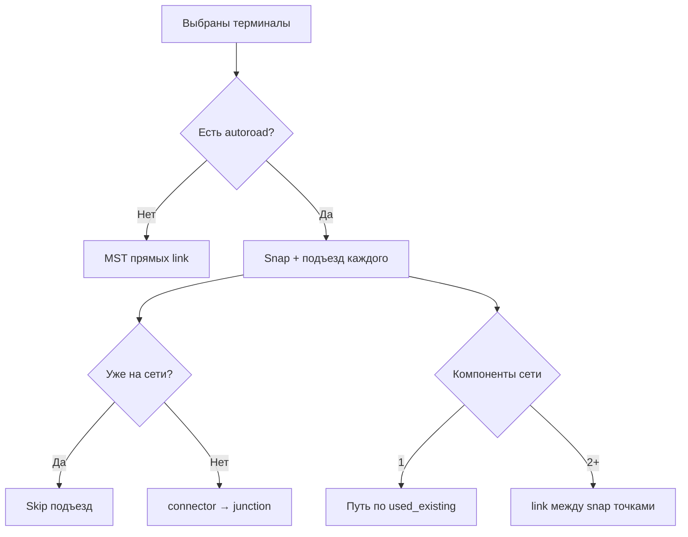

# План реализации сервиса автопостроения сети автодорог

**Дата:** июнь 2026  
**Статус:** BFF `autoroad-network/plan|apply`, planner in-process, UI «Сеть» — **реализовано**; отдельный HTTP-процесс `:8001` — **опционально** (`AUTOROAD_NETWORK_INPROCESS=false` + `AUTOROAD_NETWORK_SERVICE_URL`).

**Связанные документы:** [map-objects-and-spatial-calculations.md](./map-objects-and-spatial-calculations.md) §1.8–§1.9, [user-flows.md](./user-flows.md) §2.0.2–§2.0.4, [architecture.md](./architecture.md), [implementation-status.md](./implementation-status.md), [DEPLOY.md](../DEPLOY.md).

**Цель:** подключить выбранные терминалы к **существующей** сети `autoroad` (подъезд object→точка на полилинии); связность между объектами — **по сети**, не «напрямую через поле». При разрывах сети — новые участки **только между точками на линиях** (узлы/snap), не object↔object. Без дорог на карте — MST прямыми `link` между координатами объектов.

---

## 0. Принятые решения

| Решение | Выбор |
|---------|--------|
| Архитектура | Отдельный процесс **Autoroad Network Service** (FastAPI), не endpoint внутри `map.py` |
| Контракт | **Plan (stateless):** геометрия сети + терминалы на входе, план новых линий/узлов на выходе |
| Persist | **BFF монолита** после plan: транзакция, `line_split`, `build_network_from_lines`, jobs |
| Терминалы | Все точечные подтипы **кроме** `NODE_CLUSTER_SUBTYPES`: `node`, `methanol_joint`, `power_line_node` |
| **Есть polylines** | На каждый терминал — **≤1** `connector` object→**ближайшая** точка на полилинии (**без** лимита 300 m); **нет** прямых `link` object↔object |
| **Нет polylines** | 2 терминала → одна `link` A↔B; 3+ → MST прямых `link` (≤1 `line_snap` на объект) |
| **Разрыв сети** | MST по **компонентам** графа; недостающие ребра — `link` между **snap-точками** на линиях, без snap к объектам |
| **Уже подключён** | Конец существующей `autoroad` в **≤20 m** от объекта → **skip** (warning `already_connected`) |
| Перекрёстки | `subtype=node`, `reason=intersection` \| `junction` на snap подъезда |
| Apply | `line_preserve_geometry=true`; junction/intersection — через `node_by_key` |
| POI | Не терминалы |
| Snap к графу (инфо) | **0,3 km** — только для `graph_attached` / логистики; подъезд строится **всегда** |
| Далеко от дороги | Warning `far_from_autoroad` (>0,3 km), подъезд **всё равно** создаётся |
| Лимит | До **50** терминалов за запуск |
| UI | Режим **«Построить сеть автодорог»** |
| Legacy | `POST .../infrastructure/autoroad-connect` → deprecated, proxy на BFF |

### Сводка сценариев (согласовано)

| # | Ситуация | Поведение |
|---|----------|-----------|
| 1 | Нет дорог | 2 объекта — одна прямая A↔B; 3+ — MST прямыми между координатами |
| 2 | Объект далеко от дороги | Один подъезд к **ближайшей** точке полилинии, без отсечения 300 m |
| 3 | Разорванная сеть (2+ компоненты) | Новые `link` **между snap/узлами на линиях**, не object↔object |
| 4 | Объект уже подключён | Ничего не делать — второй подъезд не создавать |

---

## 1. Границы сервиса

| В зоне сервиса | В зоне BFF / monolith |
|----------------|----------------------|
| Подъезды, мосты между компонентами, пересечения | RBAC, CSRF, загрузка объектов из БД |
| Валидация терминалов (reject node cluster) | Создание `InfrastructureObject`, разрез линий |
| GeoJSON `preview` в ответе | `build_network_from_lines`, `project_jobs` |
| Unit-тесты на JSON fixtures | Undo на карте (`create_clipboard_group`) |

**Реализация:** планировщик — [`plan_core.py`](../decision-matrix/backend/app/services/autoroad_network/plan_core.py); apply — [`autoroad_connect.py`](../decision-matrix/backend/app/services/autoroad_connect.py); граф — [`road_graph.py`](../decision-matrix/backend/app/services/road_graph.py).

---

## 2. Таксономия объектов

| Роль | Подтипы | Кто создаёт |
|------|---------|-------------|
| **Терминал** | Все `POINT`, кроме node cluster | Уже на карте |
| **Junction** | `node`, `reason=junction` | Точка подъезда на полилинии |
| **Перекрёсток** | `node`, `reason=intersection` | Пересечение новой линии с существующей |
| **Не терминал** | POI, линии, расчётные `InfrastructureNode` | — |

---

## 3. API сервиса (вход / выход)

### 3.1 `POST /v1/network/plan`

**Request:** `terminals`, `existing_autoroads`, `options` (см. schemas).

**Response (ключевые поля):**

| Поле | Смысл |
|------|--------|
| `new_lines[].kind` | `connector` (object→snap, ≤1 на терминал) \| `link` (мост между snap **или** MST без сети) |
| `new_nodes` | `junction` на snap \| `intersection` |
| `terminals[].warning` | `already_connected` \| `far_from_autoroad` \| null |
| `used_existing_edge_ids` | Рёбра графа между терминалами в одной компоненте |

**Примеры:**

- **Нет сети, 2 терминала:** одна `link` с обоими `line_snap`.
- **Сеть есть, 2 терминала на одной цепочке:** `used_existing_edge_ids` ≠ ∅, новых `link` object↔object **нет**; подъезды только если объект **>20 m** от snap и не `already_connected`.
- **2 компоненты сети:** по подъезду + одна `link` между snap-точками компонент (без object snap).
- **3+ терминала без дорог:** 2 `link` (MST), у каждого объекта ≤1 snap.

### 3.2 Ошибки

| HTTP | Код | Причина |
|------|-----|---------|
| 422 | `excluded_terminal_subtype` | Node cluster |
| 422 | `too_many_terminals` | > 50 |
| 422 | `need_at_least_two_terminals` | < 2 |

---

## 4. API BFF

| Метод | Путь | Действие |
|-------|------|----------|
| `POST` | `/api/v1/projects/{id}/autoroad-network/plan` | Snapshot → plan |
| `POST` | `/api/v1/projects/{id}/autoroad-network/apply` | Plan + persist (+ job при очереди) |

Deprecated: `POST .../infrastructure/autoroad-connect`.

---

## 5. Алгоритм (нормативный)

### 5.1 Нет `existing_autoroads`

1. MST (Крускал) по haversine между координатами терминалов.
2. Каждое ребро MST → `link`; **≤1** `line_snap` на терминал (повторные сходимости в одну точку — без второго snap).
3. Два терминала → ровно одна общая `link`.

### 5.2 Есть polylines

1. Граф из полилиний (вес = `length_km`).
2. Для каждого терминала: ближайшая точка на полилинии (haversine по сегментам).
3. **`already_connected`:** конец любой `autoroad` в ≤20 m от объекта → подъезд **не** создавать.
4. Иначе: `connector` object→snap если расстояние **>20 m**; `node` `junction` на snap.
5. Компонента связности: по узлу графа у snap или по полилинии дороги.
6. Если **>1** компонента среди терминалов: MST по компонентам → `link` между **representative snap** точками (без object snap).
7. Терминалы в **одной** компоненте: пути по графу → `used_existing_edge_ids` (новых object↔object **нет**).
8. Warning `far_from_autoroad` если snap **>0,3 km** — информативно; подъезд всё равно строится.
9. Пересечения новых линий с существующими → `intersection` + `splits`.
10. **Apply:** `line_preserve_geometry=true`; finish connector → `node` на snap.

---

## 6. UI

См. [user-flows §2.0.4](./user-flows.md): режим «Построить сеть», preview, apply, Ctrl+Z.

---

## 7. Deploy

`deploy/docker-compose.yml`, `AUTOROAD_NETWORK_SERVICE_URL`, [DEPLOY.md](../DEPLOY.md).

---

## 8. Тест-план

### Unit (`test_autoroad_network_plan.py`)

- [x] 2 терминала без сети — одна `link`
- [x] 3+ без сети — MST, ≤1 snap/объект
- [x] 3 терминала на одной дороге — только `connector`, без object↔object `link`
- [x] 2 на концах дороги — `already_connected`, `used_existing`, без новых `link`
- [x] 2 компоненты — `link` между snap без object snap
- [x] Далеко от дороги — `far_from_autoroad`, подъезд есть
- [x] Node cluster → reject

### Integration

- [x] `test_autoroad_connect.py` — apply, junction на snap, ≤1 autoroad у hub

---

## 9. Вне scope

- Трассировка по рельефу
- POI как терминалы
- Прямой вызов сервиса из браузера

---

## 10. История изменений

| Дата | Изменение |
|------|-----------|
| 2026-06 | **Spur-only при наличии сети:** подъезд без лимита 300 m; мосты между компонентами только snap↔snap; skip `already_connected`; без object↔object `link` |
| 2026-06 | Hub junction + `line_preserve_geometry` (≤1 autoroad на объект) |
| 2026-06 | Первая версия: сервис + BFF + UI «Построить сеть» |
