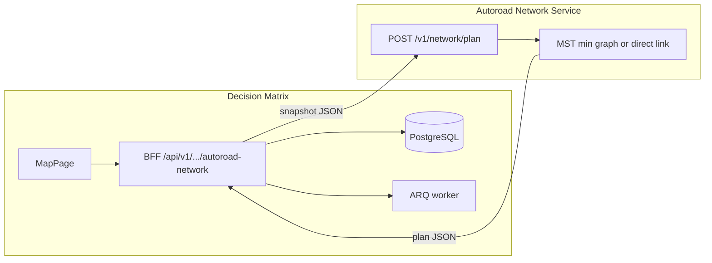
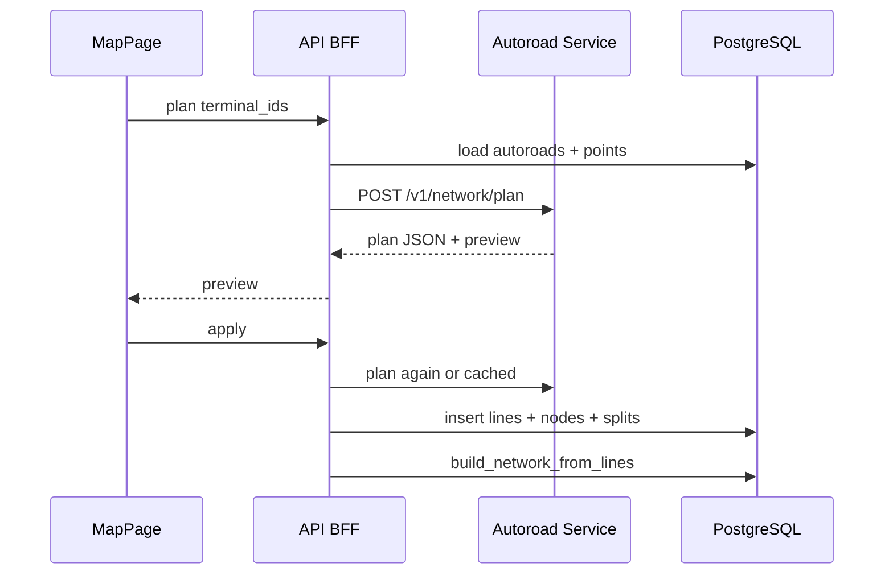

# План реализации сервиса автопостроения сети автодорог

**Дата:** июнь 2026  
**Статус:** BFF `autoroad-network/plan|apply`, planner in-process, UI «Сеть» — **реализовано**; отдельный HTTP-процесс `:8001` — **опционально** (`AUTOROAD_NETWORK_INPROCESS=false` + `AUTOROAD_NETWORK_SERVICE_URL`).

**Связанные документы:** [map-objects-and-spatial-calculations.md](./map-objects-and-spatial-calculations.md) §1.8–§1.9, [user-flows.md](./user-flows.md) §2.0.2–§2.0.4, [architecture.md](./architecture.md), [implementation-status.md](./implementation-status.md), [DEPLOY.md](../DEPLOY.md).

**Цель:** связать **все** выбранные терминалы через MST по координатам объектов / существующей сети `autoroad`; **не более одной** новой линии `autoroad` с привязкой (`line_snap`) к каждому объекту; перекрёстки — `node` (`reason=intersection`). Реализация — **самостоятельный сервис** с явным API «вход → план → выход»; BFF и запись в БД.

---

## 0. Принятые решения

| Решение | Выбор |
|---------|--------|
| Архитектура | Отдельный процесс **Autoroad Network Service** (FastAPI), не endpoint внутри `map.py` |
| Контракт | **Plan (stateless):** геометрия сети + терминалы на входе, план новых линий/узлов на выходе |
| Persist | **BFF монолита** после plan: транзакция, `line_split`, `build_network_from_lines`, jobs |
| Терминалы | Все точечные подтипы **кроме** `NODE_CLUSTER_SUBTYPES`: `node`, `methanol_joint`, `power_line_node` |
| Подключение к объекту | **Не более одной** новой `autoroad` с `line_snap` на терминал; hub (MST degree ≥2) — один `connector` object→`node` на snap; apply с `line_preserve_geometry` |
| Перекрёстки | `subtype=node`, `reason=intersection`, дедуп ~**0,05 км** |
| POI | Не терминалы (`points_of_interest` вне scope) |
| Snap к автодороге | **0,3 км**; вне допуска — `warning`, MST по прямым `link` между координатами |
| Метрика MST | Между терминалами: `min(путь по графу autoroad, прямая haversine)` |
| Лимит | До **50** терминалов за запуск |
| Геометрия новых участков | Прямые сегменты в lon/lat (без рельефа) |
| UI | Режим **«Построить сеть автодорог»** (пошаговый выбор точек на карте) |
| Legacy | `POST .../infrastructure/autoroad-connect` → deprecated, proxy на BFF |

---

## 1. Границы сервиса



| В зоне сервиса | В зоне BFF / monolith |
|----------------|----------------------|
| MST `min(путь по сети, прямая)`, подъезды, пересечения, dedup узлов | RBAC, CSRF, загрузка объектов из БД |
| Валидация терминалов (reject node cluster) | Создание `InfrastructureObject`, разрез линий |
| GeoJSON `preview` в ответе | `build_network_from_lines`, `project_jobs` |
| Unit-тесты на JSON fixtures | Undo на карте (`create_clipboard_group`) |

**Реализация:** планировщик — [`plan_core.py`](../decision-matrix/backend/app/services/autoroad_network/plan_core.py); apply — [`autoroad_connect.py`](../decision-matrix/backend/app/services/autoroad_connect.py); граф — [`road_graph.py`](../decision-matrix/backend/app/services/road_graph.py). BFF — [`autoroad_network.py`](../decision-matrix/backend/app/api/v1/autoroad_network.py); legacy — [`map.py`](../decision-matrix/backend/app/api/v1/map.py) `autoroad-connect` (тот же planner).

**Целевой путь в репозитории:**

```
decision-matrix/
  services/
    autoroad-network/
      app/
        main.py
        api/v1/network.py
        core/planner.py
        schemas/io.py
      tests/
      Dockerfile
      requirements.txt
```

Порт по умолчанию: **8001**. Monolith: `AUTOROAD_NETWORK_SERVICE_URL=http://autoroad-network:8001`. Dev без HTTP: `AUTOROAD_NETWORK_INPROCESS=true` (вызов `planner` как библиотеки).

---

## 2. Таксономия объектов

Справочник подтипов — [map-objects §1.4](./map-objects-and-spatial-calculations.md).

| Роль | Подтипы | Кто создаёт |
|------|---------|-------------|
| **Терминал (выбирает пользователь)** | Все `POINT`, кроме `node`, `methanol_joint`, `power_line_node` | Уже на карте |
| **Junction (hub)** | `node`, `reason=junction` | Алгоритм: snap hub-терминала (MST degree ≥2) |
| **Узел перекрёстка** | `node`, `reason=intersection` | Пересечение новой линии с существующей |
| **Не терминал** | POI, все `LINE_*`, расчётные `InfrastructureNode` (не рисуются на карте) | — |

Константа исключения: `NODE_CLUSTER_SUBTYPES` в [`constants.py`](../decision-matrix/backend/app/geo/constants.py).

---

## 3. API сервиса (вход / выход)

### 3.1 `POST /v1/network/plan`

Единственный обязательный endpoint на первом этапе. **Не обращается к БД** — только переданный snapshot.

**Request:**

```json
{
  "project_id": "550e8400-e29b-41d4-a716-446655440000",
  "terminals": [
    {
      "id": "660e8400-e29b-41d4-a716-446655440001",
      "subtype": "oil_pad",
      "name": "Куст-1",
      "lon": 37.6,
      "lat": 55.75
    }
  ],
  "existing_autoroads": [
    {
      "id": "770e8400-e29b-41d4-a716-446655440002",
      "coordinates": [[37.60, 55.75], [37.64, 55.75]]
    }
  ],
  "options": {
    "snap_tolerance_km": 0.3,
    "node_dedup_km": 0.05,
    "max_terminals": 50
  }
}
```

| Поле | Правила |
|------|---------|
| `terminals` | min 2, max 50; `subtype` ∉ node cluster → иначе **422** `excluded_terminal_subtype` |
| `existing_autoroads` | Полилинии `[[lon, lat], ...]`; пустой список допустим (MST строит прямые `link` между терминалами) |
| `options` | Опционально; дефолты как в §0 |

**Response:**

```json
{
  "terminals": [
    {
      "id": "660e8400-e29b-41d4-a716-446655440001",
      "warning": null,
      "snap_lon": 37.601,
      "snap_lat": 55.751,
      "graph_attached": true
    }
  ],
  "new_lines": [
    {
      "kind": "connector",
      "coordinates": [[37.6, 55.75], [37.601, 55.751]],
      "snap_start_object_id": "660e8400-e29b-41d4-a716-446655440001"
    },
    {
      "kind": "link",
      "coordinates": [[37.60, 55.75], [37.64, 55.76]],
      "snap_start_object_id": "660e8400-e29b-41d4-a716-446655440001",
      "snap_finish_object_id": "770e8400-e29b-41d4-a716-446655440003"
    }
  ],
  "new_nodes": [
    { "lon": 37.62, "lat": 55.76, "reason": "intersection" }
  ],
  "splits": [
    {
      "line_id": "770e8400-e29b-41d4-a716-446655440002",
      "segment_index": 0,
      "split_lon": 37.62,
      "split_lat": 55.76
    }
  ],
  "used_existing_edge_ids": [],
  "total_new_km": 1.234,
  "warnings": [],
  "preview": {
    "type": "FeatureCollection",
    "features": []
  }
}
```

| Поле | Смысл |
|------|--------|
| `new_lines[].kind` | `connector` (объект→snap, если >20 m) \| `link` (MST; snap к объектам только если у терминала ещё нет линии) \| `bridge` (legacy) |
| `new_nodes` | `junction` (hub на snap) \| `intersection` (перекрёсток) |
| `splits` | Разрез существующих `autoroad` в точке пересечения |
| `warnings` | `too_far_from_autoroad` (терминал вне snap, но участвует в MST по прямой), `no_autoroad_polylines`, … |

**Пример без сети на карте:** два терминала, `existing_autoroads: []` → **одна** линия `kind: "link"` с `snap_start_object_id` и `snap_finish_object_id`, `used_existing_edge_ids: []`.

**Пример трёх терминалов без дорог:** две линии `link` (MST); у каждого объекта ровно **одна** линия с его `line_snap` — у терминала с degree 2 вторая линия сходится геометрически в его координаты без повторного snap.

**Опционально позже:** `GET /v1/health`, `GET /v1/meta/eligible-terminal-subtypes`.

### 3.2 Ошибки сервиса

| HTTP | Код / тело | Причина |
|------|------------|---------|
| 422 | `excluded_terminal_subtype` | Терминал из node cluster |
| 422 | `too_many_terminals` | > 50 |
| 422 | `need_at_least_two_terminals` | < 2 |
| 400 | `invalid_coordinates` | Пустая полилиния, NaN |

---

## 4. API BFF (Decision Matrix)

Frontend и внешние клиенты вызывают **только BFF** (auth, CORS). Сервис — internal.

| Метод | Путь | Действие |
|-------|------|----------|
| `POST` | `/api/v1/projects/{project_id}/autoroad-network/plan` | Snapshot из БД → HTTP к сервису → ответ plan |
| `POST` | `/api/v1/projects/{project_id}/autoroad-network/apply` | Plan + persist + `build_network_from_lines`; при очереди → **202** + `job_id` (`autoroad_network_apply`) |

**Deprecated (interim):**

| Метод | Путь | Поведение |
|-------|------|-----------|
| `POST` | `/api/v1/projects/{project_id}/infrastructure/autoroad-connect` | Thin proxy на plan/apply; заголовок `Deprecation: true` |

Схемы interim: `AutoroadConnectRequest` / `AutoroadConnectResponse` в [`schemas/__init__.py`](../decision-matrix/backend/app/schemas/__init__.py).

---

## 5. Алгоритм (нормативный)

Порядок шагов (совпадает с [map-objects §1.8](./map-objects-and-spatial-calculations.md)):

1. Построить граф из `existing_autoroads` (вес ребра = `length_km`).
2. **Snap** каждого терминала к ближайшей точке на полилинии; дальше `snap_tolerance_km` → `warning`, но терминал **всё равно** участвует в MST.
3. **MST** (Крускал) на **всех** выбранных терминалах. Стоимость ребра `(A, B)` = `min(кратчайший путь по графу, прямая haversine)` — если сеть короче, используется она; иначе строится новый участок.
4. Ребро MST по **графу** — пути по существующим рёбрам **не создают** новых линий (`used_existing_edge_ids`).
5. **Hub** (MST degree ≥2): `node` `reason=junction` на snap; один `connector` object→junction; backbone `link` между junction / leaf, **без** snap hub на link. Hub без snap → warning `hub_needs_road_snap`.
6. **Leaf** (degree 1): одна `link`/`connector` с `line_snap`; два объекта без дорог — одна общая `link`.
7. **Apply:** `line_preserve_geometry=true` — свободные концы не автопривязываются к точкам в 0,3 км; junction/intersection — через `node_by_key`.
8. **Перекрёстки** — `intersection` + `line_split`; `build_network_from_lines`.



---

## 6. UI: режим «Построить сеть»

| Шаг | Действие |
|-----|----------|
| 1 | **Редактирование на карте** → инструмент **«Построить сеть автодорог»** (отдельно от «Группа объектов») |
| 2 | Клик по маркеру допустимого подтипа → добавить/убрать из списка терминалов |
| 3 | Недопустимые (node cluster, линии, POI) — без добавления, tooltip |
| 4 | Панель: список имён, «Очистить», «Предпросмотр» (≥ 2 точки) |
| 5 | Preview → диалог (линии, узлы, км, предупреждения) |
| 6 | «Применить» → `autoroad-network/apply` → poll job → обновление карты, undo batch |

**Interim:** [user-flows §2.0.2](./user-flows.md) — групповое выделение и кнопка «Соединить автодорогами».

---

## 7. Deploy

| Компонент | Изменение |
|-----------|-----------|
| `deploy/docker-compose.yml` | Сервис `autoroad-network`, healthcheck |
| `api` / `worker` env | `AUTOROAD_NETWORK_SERVICE_URL` |
| [DEPLOY.md](../DEPLOY.md) | Порты, переменные, локальный запуск |

---

## 8. Фазы реализации

| Фаза | Содержание | Статус |
|------|------------|--------|
| **0** | Документ `autoroad-network-plan.md`, cross-refs | **done** |
| **1** | `app/services/autoroad_network/plan_core` + schemas; unit-тесты | **done** |
| **2** | FastAPI `services/autoroad-network` (Dockerfile) | **done** (опциональный deploy) |
| **3** | BFF `autoroad-network/plan|apply`; legacy `autoroad-connect` | **done** |
| **4** | UI drawMode `autoroad_network`; reject node cluster | **done** |
| **5** | implementation-status | **done** |

---

## 9. Тест-план

### Сервис (unit)

- [x] 2 терминала на одной цепочке `autoroad` — MST по графу, без новых `link` (только подъезды при необходимости)
- [x] 2 терминала без сети — одна новая линия `kind=link` между координатами
- [ ] 2 терминала в разных компонентах сети — MST: `link` или путь по графу (что короче)
- [ ] Пересечение новой линии — `new_nodes` + `splits`
- [x] Терминал `subtype=node` → 422 / `excluded_terminal_subtype`
- [x] Терминал дальше 0,3 км — `warning`, участвует в MST по прямой

### BFF (integration)

- [ ] Mock HTTP сервиса: plan → apply → объекты в БД
- [ ] Job `autoroad_network_apply` при включённой очереди

### UI (manual / e2e)

- [ ] Режим «Построить сеть»: 2 куста → preview GeoJSON → apply → линии на карте
- [ ] Ctrl+Z отменяет созданные линии и узлы

---

## 10. Вне scope

- Трассировка по рельефу / дуги / изгибы
- Автовыбор всех точек проекта без кликов
- POI как терминалы
- Прямой вызов сервиса из браузера (только BFF)

---

## 11. История изменений

| Дата | Изменение |
|------|-----------|
| 2026-06 | Hub junction на snap + `line_preserve_geometry` при apply (строго одна autoroad на объект) |
| 2026-06 | Убран узел доступа 50 m; правило **≤1** новой `autoroad` с `line_snap` на терминал; два объекта без дорог — одна общая `link` |
| 2026-06 | Первая версия: сервис + API in/out, BFF, UI «Построить сеть», фазы 0–5 |
| 2026-06 | Алгоритм: MST на **всех** терминалах, `min(путь по сети, прямая)`; `kind=link` без сети; убраны отдельные мосты между компонентами |
