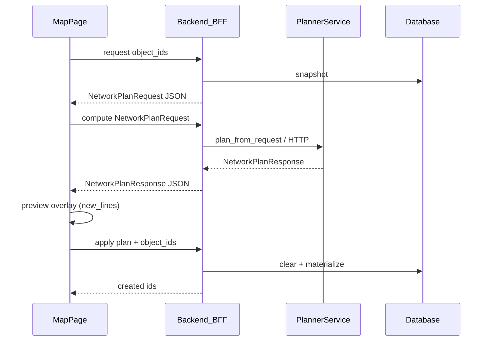

# Инструкция: модуль автопостроения сети автодорог

**Дата:** июнь 2026  
**Для кого:** аналитики, инженеры карты, разработчики  
**Связанные документы:** [autoroad-network-plan.md](autoroad-network-plan.md) (правила и схемы случаев), [map-objects-and-spatial-calculations.md](../features/map-objects-and-spatial-calculations.md) (геометрия на карте), [task-log-panel.md](../features/task-log-panel.md) (журнал задач в шапке)

---

## Содержание

1. [Зачем нужен модуль](#1-зачем-нужен-модуль)
2. [Словарь на человеческом языке](#2-словарь-на-человеческом-языке)
3. [Как пользоваться на карте](#3-как-пользоваться-на-карте)
4. [Что происходит «под капотом»](#4-что-происходит-под-капотом) (JSON-контракт, [внешний API](#внешний-api-без-бд-decision-matrix))
5. [Структура кода](#5-структура-кода)
6. [Два главных режима расчёта](#6-два-главных-режима-расчёта)
7. [Алгоритм «дорог ещё нет»](#7-алгоритм-дорог-ещё-нет)
8. [Зона 200 м вокруг площадок](#8-зона-200-м-вокруг-площадок)
9. [Алгоритм «дороги уже есть»](#9-алгоритм-дороги-уже-есть)
10. [Финальная обработка плана](#10-финальная-обработка-плана)
11. [Применение плана (apply)](#11-применение-плана-apply)
12. [Повторный расчёт и полная перестройка](#12-повторный-расчёт-и-полная-перестройка)
13. [Предупреждения в ответе](#13-предупреждения-в-ответе)
14. [Пример: 12 ГКС без дорог](#14-пример-12-гкс-без-дорог)
15. [Отдельная папка и Jupyter](#15-отдельная-папка-и-jupyter)
16. [Настройки и отладка](#16-настройки-и-отладка)
17. [Частые вопросы](#17-частые-вопросы)

---

## 1. Зачем нужен модуль

На карте проекта лежат **точечные объекты** (ГКС, УКГ, площадки и т.д.). Их нужно соединить **сетью автодорог** так, чтобы:

- из любой выбранной точки можно было доехать до любой другой **только по дорогам и узлам**;
- **площадка не была перекрёстком** — в координатах объекта сходится не больше одной дороги;
- перекрёстки, где сходятся несколько линий, появлялись как отдельные объекты **«Узел»** на карте;
- длина новых дорог была **разумно малой** (дерево связей, а не «звезда» из каждой скважины).

Модуль делает это в два шага:

| Шаг | Что делает | Пишет в базу? |
|-----|------------|---------------|
| **Запрос (request)** | Собирает входной JSON из БД проекта | Нет |
| **Расчёт (compute)** | Планировщик возвращает JSON решения | Нет |
| **Предпросмотр** | Подсветка `new_lines` на карте | Нет |
| **Применение (apply)** | Записывает **тот же** JSON решения в БД | Да |

---

## 2. Словарь на человеческом языке

| Термин в коде / UI | Простыми словами |
|--------------------|------------------|
| **Терминал** | Объект, который вы выбрали для построения сети (например ГКС). Только **конец** дороги. |
| **Узел (`node`)** | Точка на карте, где **сходятся** несколько автодорог. Создаётся планировщиком. |
| **Autoroad** | Линия автодороги на слое инфраструктуры. |
| **Connector (подъезд)** | Короткая дорога от терминала **к границе зоны 200 м** или к точке на существующей сети. |
| **Link (магистраль / связка)** | Дорога **между узлами** или между точками на границе зон — не «сквозь» площадку. |
| **Snap** | Ближайшая точка на уже нарисованной линии, куда «пристыковывается» подъезд. |
| **MST** | Минимальное остовное дерево: связать все точки **минимальной суммарной длиной** новых линий (без циклов). |
| **Компонента сети** | Островок дорог: внутри него можно ездить, в другой островок — только по **новому** мосту. |
| **Preview** | Временная подсветка плана на карте до сохранения. |

---

## 3. Как пользоваться на карте

1. Откройте проект: `/map?project=...`
2. Включите **«Редактирование на карте»** → инструмент **«Сеть»** (режим `autoroad_network` на `MapPage`).
3. В панели **«Сеть автодорог»** выберите способ добавления терминалов:
   - **Клик** — щелчок по объекту на карте;
   - **Рамка** — протяните прямоугольник по видимой области;
   - **«Видимые (N)»** — все подходящие точки в текущем bbox карты;
   - **«Тип…»** — массовое добавление по подтипу (ГКС, куст и т.д.).
4. Нужно **от 2 до 50** терминалов. Нельзя выбрать: POI, узлы `node`, `methanol_joint`, `power_line_node`. Список в панели можно свернуть, искать (при >6 объектах) и убирать точки по одной.
5. В блоке **параметров расчёта** задайте солвер (GeoSteiner / SteinerPy), лимит подъезда, роли start/end и др. — значения сохраняются в `localStorage` браузера. Индикатор солвера показывает, доступен ли GeoSteiner на сервере.
6. Нажмите **«Рассчитать»** — `request` → `compute`; на карте появится **preview** (новые линии) и модалка с цифрами (км, число линий, предупреждения).
7. Нажмите **«Применить»** в модалке — `apply` с тем же планом (без пересчёта); при необходимости откатите **Ctrl+Z**.

**Журнал задач** в шапке (иконка слева от «Тема»): статусы расчётов, тела JSON запросов/ответов, экспорт. Для режима «Сеть» в журнале видны шаги `request` → `compute` → `apply`; для «Соединить автодорогами» — два POST с `dry_run: true/false` (см. [task-log-panel.md](../features/task-log-panel.md)).

**Важно:** режим «Сеть» (`autoroad-network`) при apply **заменяет** все ранее созданные этим модулем автодороги и узлы в проекте (кроме выбранных терминалов) и строит сеть заново. Старый пункт меню «Соединить автодорогами» (`autoroad-connect`) ведёт себя иначе — он **дополняет** существующую сеть, не очищая её.

---

## 4. Что происходит «под капотом»

### Контракт JSON (три шага API)

| Шаг | Endpoint | Тело запроса | Ответ |
|-----|----------|-------------|--------|
| 1 | `POST .../autoroad-network/request` | `{ object_ids, full_network_rebuild? }` | `NetworkPlanRequest` |
| 2 | `POST .../autoroad-network/compute` | `NetworkPlanRequest` | `NetworkPlanResponse` |
| 3 | `POST .../autoroad-network/apply` | `{ object_ids, plan: NetworkPlanResponse }` | созданные id (без пересчёта) |



**Вход `NetworkPlanRequest`:** `project_id`, `terminals[]`, `existing_autoroads[]`, `options`.

| Поле терминала | Описание |
|----------------|----------|
| `id`, `subtype`, `name` | Идентификатор и тип объекта |
| `lon`, `lat`, `coordinates` | WGS84; `coordinates` = `[lon, lat]`, должны совпадать |
| `category`, `subtype_label` | Категория слоя и подпись (напр. «ГКС») |
| `properties` | JSONB объекта из БД (произвольные метаданные) |

| Поле существующей дороги | Описание |
|--------------------------|----------|
| `id`, `coordinates` | Полилиния `[[lon, lat], ...]` |
| `name`, `subtype` | Имя и подтип (обычно `autoroad`) |

**Выход `NetworkPlanResponse`:** `terminals[]` (эхо входа + `snap_lon`/`snap_lat`/предупреждения), `new_lines[]`, `new_nodes[]`, `splits[]`, `warnings`, `preview` (GeoJSON, в линиях — `snap_start_name`/`snap_finish_name`), `request_meta`, `total_new_km`, счётчики.

Старые `POST .../plan` и `POST .../apply-legacy` (только `object_ids`) оставлены для совместимости; режим «Сеть» в UI использует трёхшаговый конвейер.

### Внешний API (без БД decision-matrix)

Планировщик **stateless**: достаточно собрать `NetworkPlanRequest` вручную или в своей системе и вызвать сервис расчёта. Запись в БД — только через `apply` в приложении (с авторизацией).

| Способ | URL | Примечание |
|--------|-----|------------|
| Микросервис | `POST http://<host>:8001/v1/network/plan` | [`services/autoroad-network/app/main.py`](../../decision-matrix/services/autoroad-network/app/main.py), без auth |
| Python-пакет | `plan_from_request(req)` | [`autoroad-network-planner`](../../autoroad-network-planner/README.md) |
| BFF (в приложении) | `POST .../autoroad-network/compute` | Тот же JSON; нужна сессия пользователя |

`project_id` в запросе — для корреляции логов; планировщик **не читает** проект из БД. Можно передать любой UUID.

Пример (две точки, без существующих дорог):

```bash
curl -s -X POST "http://127.0.0.1:8001/v1/network/plan" \
  -H "Content-Type: application/json" \
  -d '{
    "project_id": "00000000-0000-0000-0000-000000000001",
    "terminals": [
      {
        "id": "6e0a2599-f391-4ca2-be46-565b71657222",
        "subtype": "gas_processing",
        "subtype_label": "ГКС",
        "category": "area_facility",
        "name": "GKS_1",
        "lon": 37.142939,
        "lat": 56.040613,
        "coordinates": [37.142939, 56.040613],
        "properties": {}
      },
      {
        "id": "53c1e053-c2aa-4265-b972-2550efb98ef6",
        "subtype": "gas_processing",
        "name": "GKS_2",
        "lon": 37.209718,
        "lat": 56.040613,
        "coordinates": [37.209718, 56.040613]
      }
    ],
    "existing_autoroads": [],
    "options": { "snap_tolerance_km": 0.3 }
  }'
```

В ответе `terminals[]` содержат исходные `name`, `coordinates`, `subtype` и результаты snap; `request_meta` — `terminal_count`, `existing_road_count`.

> **Безопасность:** standalone-сервис по умолчанию без API key — не выставляйте его в интернет без прокси/аутентификации.

```text
┌─────────────┐   request / compute / apply   ┌──────────────────┐
│  MapPage    │ ─────────────────────────────► │ autoroad_network │
│  (frontend) │   (apply передаёт тот же plan) │      API         │
└─────────────┘                                └────────┬─────────┘
       ▲ preview из new_lines[]                         │
       │                                                 ▼
       │                              pipeline.py: snapshot → compute → apply
       │                                                 │
       │                                                 ▼
       │                              plan_from_request()  ← математика (in-process или HTTP)
       └─────────────────────────────────────────────────┘
```

**Ключевая идея:** планировщик **не знает** про базу данных. Apply **не вызывает** compute повторно — на карту попадает ровно тот `NetworkPlanResponse`, который пользователь подтвердил после preview.

---

## 5. Структура кода

Пути от корня репозитория `Cursore/`.

### Backend

| Файл | Роль |
|------|------|
| `decision-matrix/backend/app/api/v1/autoroad_network.py` | HTTP: `request`, `compute`, `apply` (+ legacy `plan`, `apply-legacy`) |
| `decision-matrix/backend/app/services/autoroad_network/pipeline.py` | Конвейер: snapshot → compute → apply без пересчёта |
| `decision-matrix/backend/app/services/autoroad_network/planner_adapter.py` | Мост `NetworkPlanRequest` ↔ `PlanRequest` / `PlanResponse` |
| `autoroad-network-planner/src/network_planner/` | Ядро: Steiner tree, post-processing, HTTP `:8080` |
| `decision-matrix/backend/app/services/autoroad_network/snapshot.py` | Сбор полного `NetworkPlanRequest` из БД |
| `decision-matrix/backend/app/services/autoroad_network/schemas.py` | Типы входа/выхода (Pydantic) |
| `decision-matrix/backend/app/services/autoroad_network/bridge.py` | Перевод ответа планировщика в формат apply |
| `decision-matrix/backend/app/services/autoroad_network/client.py` | In-process или HTTP на микросервис |
| `decision-matrix/backend/app/services/autoroad_connect.py` | Apply в БД, очистка перед перестройкой |
| `decision-matrix/backend/app/services/graph_builder.py` | Пересборка `InfrastructureNetwork` после apply |
| `decision-matrix/frontend/src/components/AutoroadNetworkPanel.tsx` | UI: массовый выбор, параметры, «Рассчитать» |
| `decision-matrix/frontend/src/components/AutoroadNetworkParamsSection.tsx` | Поля расчёта (солвер, лимиты) |

### Frontend

| Файл | Роль |
|------|------|
| `decision-matrix/frontend/src/pages/MapPage.tsx` | Режим «Сеть», request → compute → confirm → apply |
| `decision-matrix/frontend/src/lib/autoroadNetwork.ts` | Какие подтипы можно выбрать как терминал |
| `decision-matrix/frontend/src/lib/autoroadPlanPreview.ts` | Overlay из `new_lines[]` |
| `decision-matrix/frontend/src/lib/api.ts` (barrel) / `lib/api/apiClient.ts` | `autoroadNetworkBuildRequest`, `Compute`, `Apply` |
| `decision-matrix/frontend/src/components/TaskLogPanel.tsx` | Журнал задач в шапке |
| `decision-matrix/frontend/src/lib/taskLog/` | Store, автолог HTTP, экспорт JSON |

### Тесты

| Файл | Что проверяет |
|------|----------------|
| `decision-matrix/backend/tests/test_autoroad_network_plan.py` | Планировщик, 12 ГКС, зона 200 м, перестройка |
| `decision-matrix/backend/tests/test_autoroad_network_api.py` | API request → compute → apply, фиксированный plan на apply |
| `decision-matrix/backend/tests/test_autoroad_connect.py` | Apply, snap, интеграция с БД |

---

## 6. Два главных режима расчёта

Точка входа — `network_planner.plan.pipeline` (`plan_from_request_steinerpy` / `plan_from_request_geosteiner`), вызываемый через `planner_adapter.compute_network_plan()`.

```text
                    PlanRequest (из snapshot БД)
                              │
              ┌───────────────┴───────────────┐
              │                               │
    existing_autoroads пустой?                │
              │                               │
         ДА   ▼                          НЕТ  ▼
    Steiner tree (MST)               подъезды + мосты snap↔snap
    «строим с нуля»                  «цепляемся к дорогам»
```

| Режим | Когда включается | Типичный сценарий |
|-------|------------------|-------------------|
| **Off-network** | В запросе **нет** полилиний `autoroad` | Импорт только точек (12 ГКС), первое построение «Сеть» |
| **With-network** | В проекте уже есть линии `autoroad` (не отброшенные при снимке) | Дороги нарисованы вручную; legacy «Соединить автодорогами» |

Для режима **«Сеть»** на apply снимок для плана **намеренно без старых автодорог** (`full_network_rebuild=True` в `build_plan_request`), чтобы всегда срабатывал off-network — даже если в проекте остались объекты от прошлого apply.

---

## 7. Алгоритм «дорог ещё нет»

Функции: `_plan_off_network()` → при 2 терминалах особый случай; при 3+ → `_plan_off_network_steiner_mst()`.

### 7.1. Два терминала

```text
  Т₁ ──connector──●═══════●──connector── Т₂
         200 м      граница   link    граница   200 м
```

Не рисуем прямую линию **Т₁↔Т₂** через поле. От каждого терминала — **connector** ровно до **границы зоны 200 m**, между границами — один **link**.

Код: блок `if len(terminal_ids) == 2` в `_plan_off_network()`.

### 7.2. Три и больше терминалов (MST + Steiner)

**Шаг 1 — матрица расстояний.**  
Для каждой пары терминалов считается расстояние по земле (haversine, км).

**Шаг 2 — MST.**  
`mst_terminal_edges()` выбирает `n−1` ребро с **минимальной суммарной длиной**, чтобы все терминалы оказались в одном дереве (без циклов).

**Шаг 3 — Steiner-точки на рёбрах.**  
На каждом ребре MST ставится точка `●` — чаще всего **геодезическая середина** (`_geographic_midpoint`). Если середина попала **внутрь чужой зоны 200 m**, точка **сдвигается** наружу (`relocate_if_inside_exclusion`).

**Шаг 4 — подъезды и магистраль.**

| Сколько рёбер MST уходит из терминала | Что рисуем |
|--------------------------------------|------------|
| 1 ребро | Connector Т→граница, link граница→● |
| 2 ребра | Connector на **отрезок** между двумя ● (не в угол площадки), links между ● |
| 3+ ребра | **Hub** `J_T` рядом с терминалом, connector Т→J_T, звезда J_T→каждый ● |

**Шаг 5 — упрощение.**  
`_simplify_collinear_backbone()` сливает лишние collinear-узлы на одной прямой.

**Шаг 6 — Т-образные примыкания.**  
`_repair_planned_line_topology()` — если подъезд упирается в **середину** магистрали, на магистрали появляется узел и сегмент **делится** на два link (правило «примыкание под 90°»).

**Шаг 7 — проверки.**  
- не больше одной дороги на терминал (`_validate_one_autoroad_per_object`);  
- все терминалы в одной компоненте по линиям плана (`_validate_terminal_connectivity`).

---

## 8. Зона 200 м вокруг площадок

Константа: `TERMINAL_EXCLUSION_RADIUS_KM = 0.2` в `app/geo/constants.py`.  
Логика: `app/services/terminal_exclusion.py`.

**Зачем:** площадка (ГКС) — не перекрёсток. Внутри круга 200 m вокруг каждого выбранного терминала **нельзя** ставить узлы и магистраль; там допустим только **подъезд** от объекта до **границы** круга.

```text
        ╭── зона 200 m ──╮
        │    ГКС (Т)     │
        │       │        │
        │    connector   │
        │       ▼        │
        ╰───────●────────╯  ← граница (ровно 200 m от Т)
                │
             link ──────► другие ● и другие Т
```

**Как ищется точка на границе:** `exclusion_boundary_point()` — бинарный поиск вдоль луча от терминала, чтобы расстояние было **ровно 200 m** (не «примерно»).

**Если два терминала ближе 400 m:** круги пересекаются → предупреждение `exclusion_zones_overlap`. Связь всё равно строится **между точками на границах**, не между центрами площадок.

**После построения линий:** `_sanitize_exclusion_geometry()` подталкивает узлы и концы link, если они случайно оказались внутри зоны; `validate_planned_exclusion()` добавляет `exclusion_violation`, если исправить не удалось.

---

## 9. Алгоритм «дороги уже есть»

Функция: `_plan_with_network()`.

**Шаг 1.** Из всех `autoroad` в запросе строится граф (`graph_from_polylines` + `RoadGraph`): вершины — концы и изломы линий, рёбра — сегменты, вес — длина в км.

**Шаг 2. Snap для каждого терминала** (`_snap_terminal`):

- ищется **ближайшая точка** на полилинии (вне зоны 200 m, если возможно);
- если конец существующей дороги уже в **20 m** от объекта → `already_connected`, второй подъезд **не нужен**;
- если snap дальше **0.3 km** → предупреждение `far_from_autoroad`, подъезд **всё равно** строится.

**Шаг 3. Подъезды.**  
Для терминалов без `already_connected` — `connector` от Т до snap + узел `junction` на линии.

**Шаг 4. Компоненты сети.**  
Терминалы группируются: кто на одном «островке» графа дорог. Если островков несколько — между ними строится **MST мостов**: прямые `link` между **представительными точками** snap (не между координатами ГКС).

**Шаг 5. Использование существующих рёбер.**  
Для терминалов на одном островке в план попадают id существующих участков (`used_existing_edge_ids`) — путь по Дейкстре между их snap.

**Шаг 6. Пересечения.**  
`_collect_splits()` — если новый segment пересекает старую дорогу не в конце, в apply старая линия **режется**, в точке создаётся узел `intersection`.

---

## 10. Финальная обработка плана

Общая для обоих режимов: `_finalize_response()` в конце.

| Шаг | Функция | Зачем |
|-----|---------|-------|
| 1 | `_sanitize_exclusion_geometry` | Убрать узлы/link из зон 200 m |
| 2 | `_ensure_connector_backbone_spurs` | Если hub/граница connector **не касается** магистрали из-за зазора — дорисовать короткий **link-мост** |
| 3 | Удаление нулевых link | Сегменты короче `CONNECTOR_MIN_KM` (~5 m) не сохраняем |
| 4 | `validate_planned_exclusion` | Итоговая проверка зон |
| 5 | `_validate_terminal_connectivity` | Если терминалы в разных «островах» по линиям плана → `terminals_not_connected` |
| 6 | `_annotate_bend_angles` | Углы в узлах → предупреждения `acute_bend_deg` в preview |

Preview собирается как GeoJSON `FeatureCollection` (линии + точки узлов) — его рисует фронт до apply.

---

## 11. Применение плана (apply)

Файл: `autoroad_connect.py`, функция `apply_autoroad_connect_plan()`.

**Порядок записи:**

1. Создать **новые узлы** из `plan.new_nodes` (имена `Узел_N`, в `properties.source = "autoroad_network"`).
2. Подгрузить **уже существующие** узлы проекта в индекс по координатам — чтобы концы линий **привязались** к ним, а не висели рядом.
3. Выполнить **разрезы** существующих линий (`plan.splits`) — в точке пересечения.
4. Создать **новые autoroad** с полной геометрией `coordinates`, snap к терминалу/узлу, `line_preserve_geometry=True`.
5. `build_network_from_lines()` — обновить служебный граф сети для логистики песка и анализа.

**Типы линий в БД:** и `connector`, и `link` сохраняются как `subtype: autoroad` — различие хранится в геометрии и snap; на карте стиль может различаться в preview по `kind`.

---

## 12. Повторный расчёт и полная перестройка

Режим **«Сеть»** (`autoroad-network/apply` с телом `{ plan, object_ids }`):

1. `clear_network_for_rebuild()` — удаляет все объекты `autoroad` и `node` в проекте, **кроме** id выбранных терминалов.
2. В БД материализуется **тот же** `NetworkPlanResponse`, что вернул шаг `compute` (без повторного вызова планировщика).
3. Снимок для **первого** расчёта по-прежнему без старых дорог (`full_network_rebuild=True` на шаге `request`).

Поэтому:

- **Исходный файл только с 12 ГКС** и **результат после apply** — разные вещи: после apply в экспорте появятся `Узел_*` и `Автодорога_*` — это **не баг импорта**, а результат модуля.
- Повторный расчёт «Сеть» **не должен** копить второй слой дорог поверх первого и **не должен** отличаться от preview (раньше apply пересчитывал план — исправлено JSON-конвейером).

Legacy **«Соединить автодорогами»** (`infrastructure/autoroad-connect`) старые дороги **не удаляет** и планирует в режиме with-network.

---

## 13. Предупреждения в ответе

| Код | Значение для пользователя |
|-----|---------------------------|
| `need_at_least_two_objects` | Выбран меньше двух объектов |
| `too_many_objects_max_50` | Больше 50 терминалов |
| `excluded_terminal_subtype:...` | Нельзя строить сеть от узла/POI |
| `no_autoroad_polylines` | Дорог нет — строим MST с нуля (информационное) |
| `terminals_not_connected` | План **не связал** все точки — apply не должен считаться успешным |
| `exclusion_zones_overlap` | Площадки ближе 400 m — зоны 200 m пересекаются |
| `exclusion_violation` | Точка магистрали/узла внутри запретной зоны |
| `already_connected` | Объект уже у конца дороги (≤20 m) |
| `far_from_autoroad` | Snap дальше 0.3 km — подъезд длинный |
| `acute_bend_deg:…` | Острый угол в узле (градусы) — на связность не влияет |

---

## 14. Пример: 12 ГКС без дорог

Координаты из вашего исходника (только `gas_processing`, без линий).

**Режим:** off-network, связность **да**.

| Метрика | Значение |
|---------|----------|
| Суммарная длина новых дорог | ~**85 km** |
| Подъезды (connector) | **12** × ~**0.2 km** |
| Магистраль (link) | **45** сегментов |
| Узлы (junction) | **34** |
| `terminals_not_connected` | **нет** |

Каждый ГКС получает подъезд **ровно 200 m** до границы зоны; дальше сеть идёт по MST между границами и Steiner-узлами на рёбрах дерева.

**GeoJSON превью** (для просмотра в geojson.io):

`decision-matrix/backend/data/gks12_plan_preview.geojson`

Пересчёт в консоли (из каталога `backend`, venv активирован):

```powershell
python -m pytest tests/test_autoroad_network_plan.py -q
python -m pytest tests/test_planner_adapter.py -q
```

---

## 15. Отдельная папка и Jupyter

Ядро планировщика — пакет **`network_planner`** в **`autoroad-network-planner/`** (корень репозитория, рядом с `decision-matrix`):

| Артефакт | Назначение |
|----------|------------|
| `src/network_planner/` | Steiner tree, post-processing, HTTP API `:8080` |
| `data/example_request.json` | Минимальный входной JSON для `curl` или скриптов |
| [README](../../autoroad-network-planner/README.md) | Установка, параметры, Docker, HTTP |

В `decision-matrix` BFF: `backend/app/services/autoroad_network/` (`planner_adapter.py` мостит `NetworkPlanRequest` ↔ `PlanRequest`). Шаг **`request`** собирает из БД те же поля, что во внешнем JSON (`name`, `coordinates`, `category`, `subtype_label`, `properties`).

Локально установите пакет в venv backend:

```powershell
cd decision-matrix\backend
.\venv\Scripts\pip install -e ..\..\..\autoroad-network-planner[steinerpy]
```

Пример из пакета (без БД):

```python
from uuid import UUID, uuid4
from network_planner.plan.pipeline import plan_from_request_steinerpy
from network_planner.schemas.io import PlanRequest, TerminalInput

req = PlanRequest(
    project_id=uuid4(),
    terminals=[
        TerminalInput(
            id=UUID("6e0a2599-f391-4ca2-be46-565b71657222"),
            subtype="gas_processing",
            name="GKS_1",
            lon=37.142939,
            lat=56.040613,
        ),
        # ... второй терминал
    ],
)
out = plan_from_request_steinerpy(req)
print(out.steiner_tree.edges, out.warnings)
```

---

## 16. Настройки и отладка

### Переменные окружения (backend)

| Переменная | По умолчанию | Смысл |
|------------|--------------|-------|
| `AUTOROAD_NETWORK_INPROCESS` | `true` | Планировщик в том же процессе, что API |
| `AUTOROAD_NETWORK_SERVICE_URL` | пусто | Если задан URL — попытка HTTP; при ошибке fallback in-process |

### API

| Метод | URL |
|-------|-----|
| POST | `/api/v1/projects/{project_id}/autoroad-network/request` |
| POST | `/api/v1/projects/{project_id}/autoroad-network/compute` |
| POST | `/api/v1/projects/{project_id}/autoroad-network/apply` |
| POST | `/api/v1/projects/{project_id}/autoroad-network/plan` | deprecated |
| POST | `/api/v1/projects/{project_id}/autoroad-network/apply-legacy` | deprecated |
| GET | `/api/v1/projects/{project_id}/jobs?limit=30` | журнал фоновых задач |

Тело apply (конвейер): `{ "object_ids": [...], "plan": { ... NetworkPlanResponse ... } }`.

### Полезные команды

```powershell
cd decision-matrix\backend
.\venv\Scripts\python.exe -m pytest tests/test_autoroad_network_plan.py -q
.\venv\Scripts\python.exe -m pytest tests/test_autoroad_connect.py -q
```

Скрипт анализа плана по id объектов в проекте:

`decision-matrix/backend/scripts/analyze_autoroad_plan.py`

### Запуск приложения

См. [decision-matrix/RUN_GUIDE.md](../../decision-matrix/RUN_GUIDE.md): backend `run_local.py`, frontend `npm run dev`.

---

## 17. Частые вопросы

**Почему на карте узел без дороги?**  
Узел создан в apply, но конец линии не попал в snap (старый баг apply / дубли после повторного расчёта без очистки). В режиме «Сеть» с перестройкой и обновлённым apply узлы должны совпадать с концами линий.

**Почему план в тесте связный, а на карте нет?**  
Часто смотрят на **экспорт после apply**, а не на исходные 12 точек; или apply шёл без `full_network_rebuild` поверх старой сети.

**Учитывается ли рельеф?**  
Нет. Расстояния — haversine по эллипсоиду в плоскости lon/lat.

**Можно ли оставить вручную нарисованную дорогу при «Сеть»?**  
Нет: apply удаляет **все** `autoroad` и `node`, кроме выбранных терминалов. Ручные дороги нужно хранить отдельно или использовать legacy connect.

**Где формальные схемы всех 12 случаев?**  
В [autoroad-network-plan.md](autoroad-network-plan.md), раздел «Схемы по случаем».

**Почему JSON отправляется два раза при «Соединить» и «Применить»?**  
Legacy `autoroad-connect`: preview (`dry_run: true`) и apply (`dry_run: false`) — два расчёта. Режим «Сеть» передаёт готовый `plan` на apply без повторного compute. Подробно: [task-log-panel.md](../features/task-log-panel.md) §5.

---

*При изменении алгоритма обновляйте этот файл и тесты в `test_autoroad_network_plan.py`.*
