# Схема логики расчёта

> **Параметры ввода:** [input-parameters.md](./input-parameters.md).  
> **Объекты карты и якоря расчёта:** [map-objects-and-spatial-calculations.md](./map-objects-and-spatial-calculations.md).  
> **Каталог расчётных функций:** [calculation-functions.md](./calculation-functions.md).

## Общий поток расчёта

> **Схема потоков (PFD)** на вкладке «Потоки» — отдельная ветка: маршруты фаз по графу сети, пропускная способность, перегрузка. Спецификация: [fluid-flow-schematic.md](./fluid-flow-schematic.md). Ниже — поток **анализа окружения и стоимости** (матрица решений).

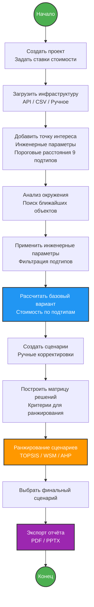

---

## Выбор якоря расчёта (MVP)

После поиска кандидата по подтипу система определяет, **куда** измеряется расстояние и куда рисуется линия подключения (FR-2.4.4).

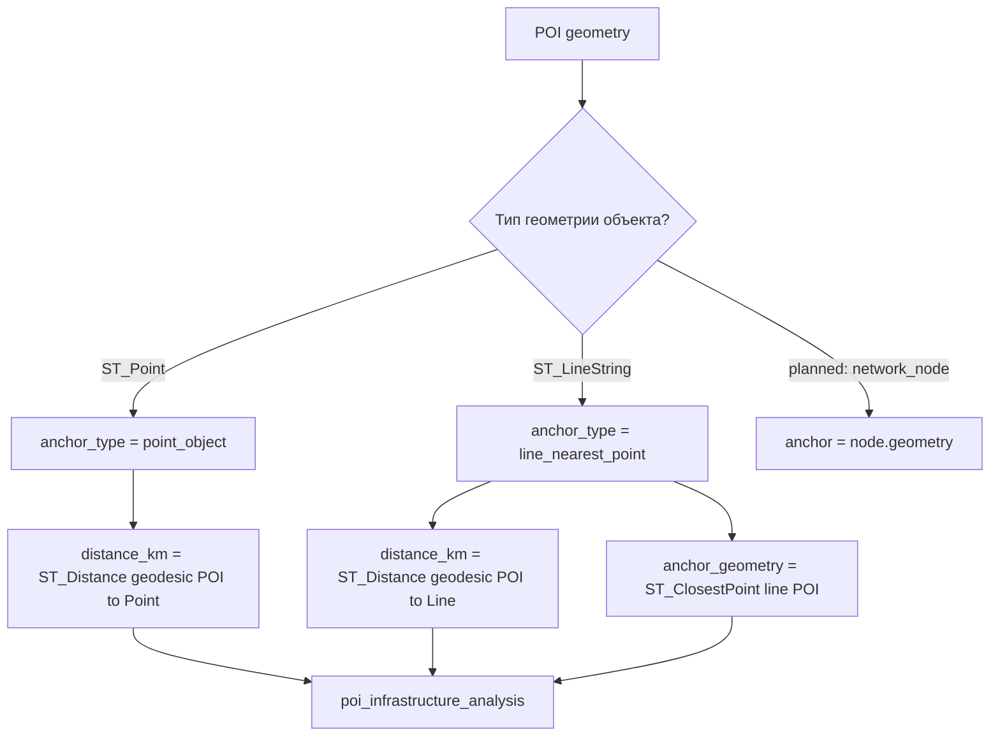

---

## Детальный поток анализа окружения

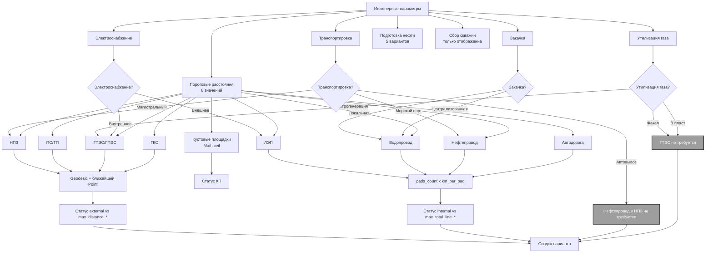

---

## Поток расчёта стоимости

```mermaid
graph TD
    C1[Линейные внутренние] --> L1[Автодорога<br>расстояние x ставка]
    C1 --> L2[Нефтепровод<br>расстояние x ставка]
    C1 --> L3[Водопровод<br>расстояние x ставка]
    C1 --> L4[ЛЭП<br>расстояние x ставка]

    C2[Площадные внешние] --> L5[ГКС<br>фиксированная ставка]
    C2 --> L6[ГТЭС/ГПЭС<br>фиксированная ставка]
    C2 --> L7[ПС/ТП<br>фиксированная ставка]
    C2 --> L8[НПЗ<br>фиксированная ставка / нефтепровод]

    C4[Кустовые площадки] --> K1[Количество = Math.ceil<br>(Объём добычи / Добыча на скважину / Скважин на КП)]
    K1 --> K2[Стоимость = Количество x ставка за шт.]

    C5[Инженерное оборудование] --> E1[Электроснабжение<br>Внешнее = 0 / Внутреннее = ставка ГТЭС]
    C5 --> E2[Закачка<br>Централизованная = 0 / Локальная = ставка насосной]
    C5 --> E3[Утилизация газа<br>В пласт/Факел = 0 / Электрогенерация = ставка ГПЭС]
    C5 --> E4[Подготовка нефти<br>МФНС = 0 / иначе ставка по типу]
    C5 --> E5[Транспортировка<br>Автовывоз = 0 / Порт = стоимость нефтепровода / Труба = стоимость нефтепровода]

    L1 --> T1[Сумма всех подтипов]
    L2 --> T1
    L3 --> T1
    L4 --> T1
    L5 --> T1
    L6 --> T1
    L7 --> T1
    L8 --> T1
    K2 --> T1

    E1 --> T2[Сумма инженерного оборудования]
    E2 --> T2
    E3 --> T2
    E4 --> T2
    E5 --> T2

    T1 --> T3[Итого = T1 + T2]
    T2 --> T3

    classDef blue fill:#2196F3,stroke:#333,stroke-width:2px,color:#fff
    classDef green fill:#4CAF50,stroke:#333,stroke-width:2px,color:#fff
    classDef purple fill:#9C27B0,stroke:#333,stroke-width:2px,color:#fff

    class T3 green
    class C1,C2,C3,C4,C5 blue
    class E1,E2,E3,E4,E5 purple
```

---

## Определение статусов

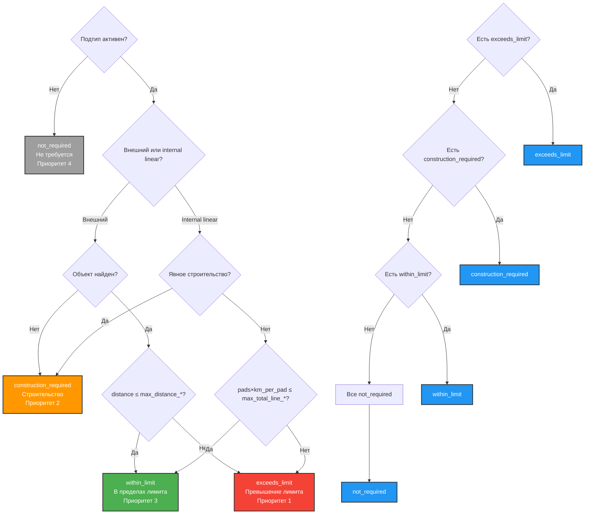

---

## Матрица решений и ранжирование

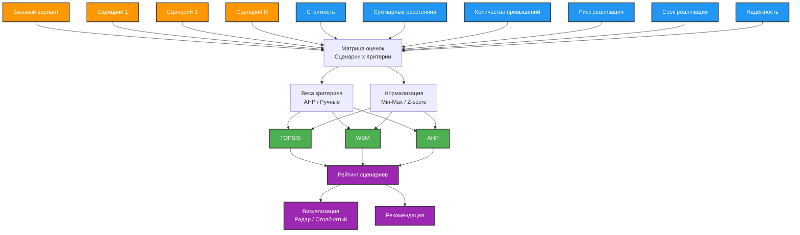

---

## Поток создания и сравнения сценариев

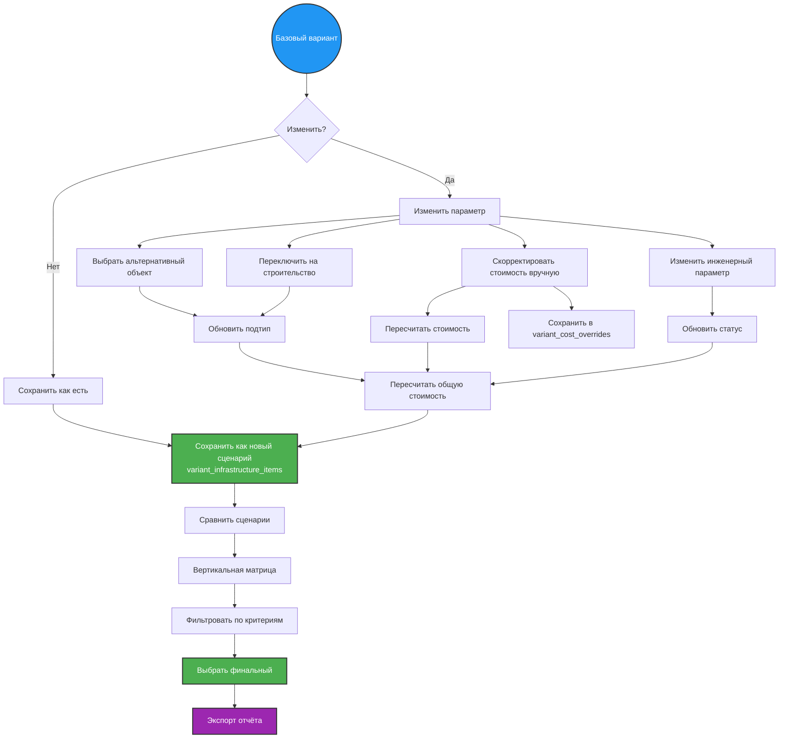

---

## Экспорт отчёта (одностраничник)

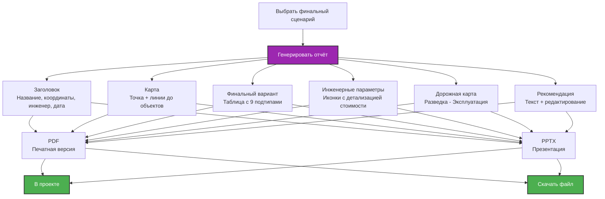

---

## Взаимодействие инженерных параметров

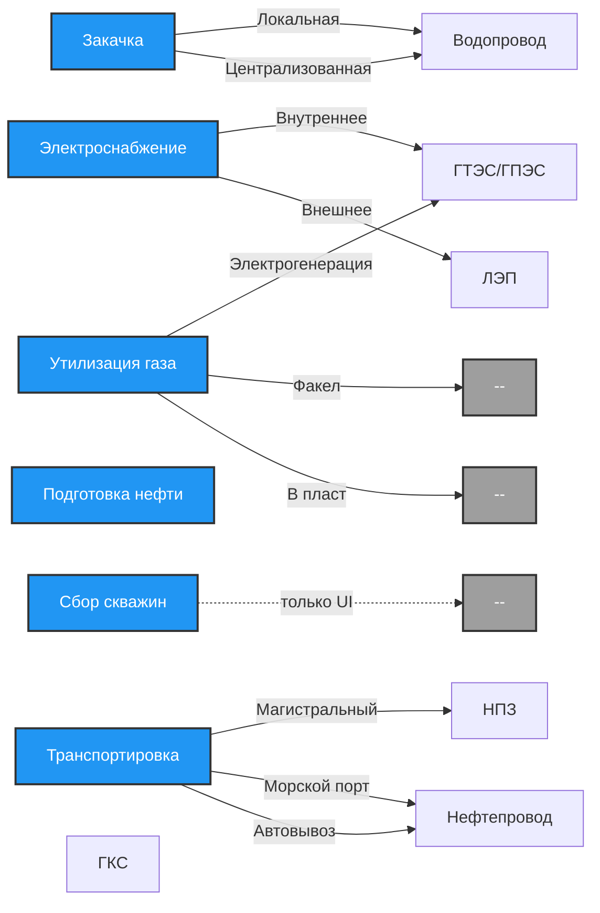

---

## Приоритет статусов

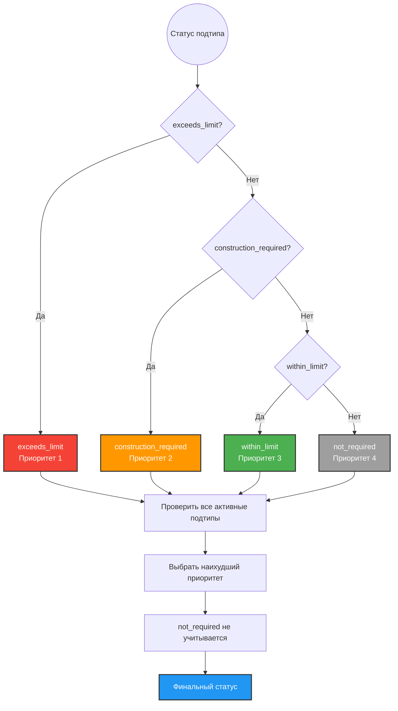

---

## Логика расчёта кустовых площадок

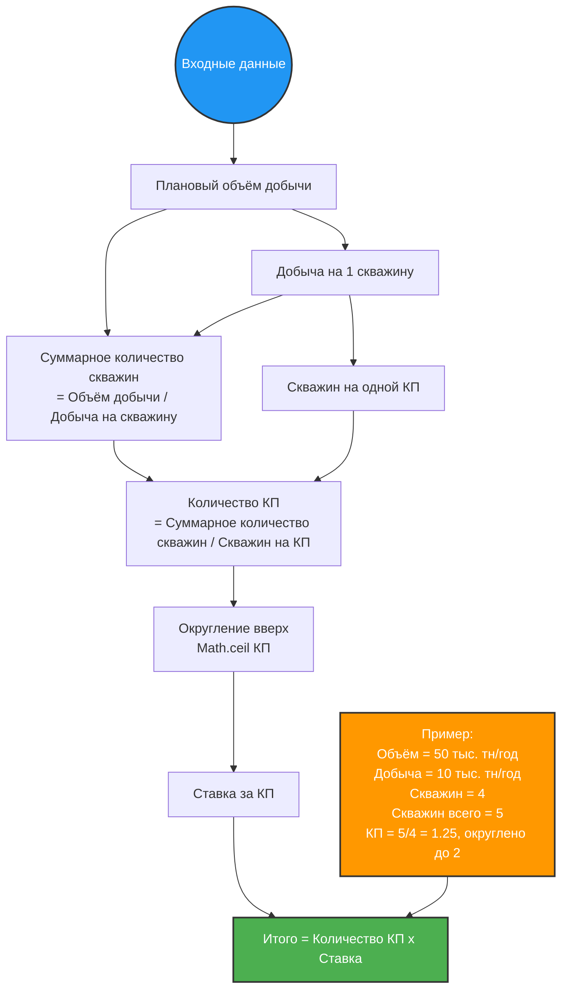

---

## Полный цикл от проекта до отчёта

```mermaid
graph TD
    P1[Создать проект]
    P2[Задать ставки стоимости<br>16 показателей, тыс. ₽]
    P2a[Пороги и нормы проекта<br>4 external + 4 max_total_line + 4 km/КП]
    P3[Загрузить инфраструктуру<br>API / CSV / Ручное]

    P4[Добавить точку интереса<br>флюид, добыча, закачка воды]
    P4a[Применить тип флюида<br>oil / gas]
    P5[Задать инженерные параметры<br>6 параметров]
    P6[Пороги POI<br>4 external + 4 max_total_line + 4 km/КП]

    P7[Анализ окружения<br>Поиск ближайших объектов]
    P8[Применить фильтрацию<br>по инженерным параметрам]
    P9[Рассчитать базовый вариант<br>Стоимость + Статусы]

    P10[Создать сценарии]
    P11[Ручные корректировки]
    P12[Сравнить сценарии]

    P12b[Ввести экспертные оценки<br>по сценариям]
    P13[Построить матрицу ранжирования<br>6 критериев]
    P14[Применить алгоритм<br>TOPSIS / WSM / AHP]
    P15[Получить рейтинг сценариев]

    P16[Выбрать финальный сценарий]
    P17[Генерировать одностраничник]
    P18[Экспорт PDF / PPTX]

    P1 --> P2 --> P2a --> P3 --> P4 --> P4a --> P5 --> P6 --> P7 --> P8 --> P9 --> P10 --> P11 --> P12 --> P12b --> P13 --> P14 --> P15 --> P16 --> P17 --> P18

    classDef green fill:#4CAF50,stroke:#333,stroke-width:2px,color:#fff
    classDef blue fill:#2196F3,stroke:#333,stroke-width:2px,color:#fff
    classDef orange fill:#FF9800,stroke:#333,stroke-width:2px,color:#fff
    classDef purple fill:#9C27B0,stroke:#333,stroke-width:2px,color:#fff

    class P1 green
    class P9 blue
    class P15 orange
    class P18 purple
```

---

## Легенда

| Символ | Значение |
|--------|----------|
| 🔴 | Превышение лимита (exceeds_limit) |
| 🟠 | Строительство (construction_required) |
| 🟢 | В пределах лимита (within_limit) |
| ⚪ | Не требуется (not_required) |
| ✏️ | Ручная корректировка |
| 📊 | Матрица решений |
| 📈 | Ранжирование |
| 📄 | Отчёт |