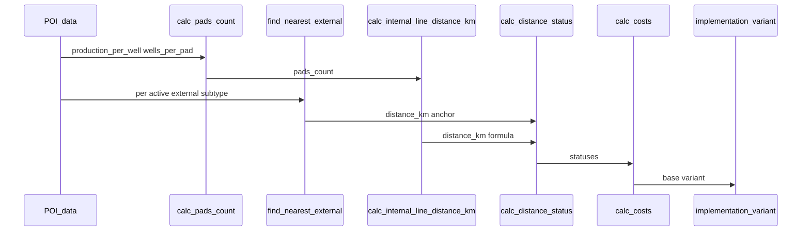

# Каталог расчётных функций

> **Параметры ввода:** [input-parameters.md](../product/input-parameters.md).  
> **Потоки и диаграммы:** [calculation-logic-flow.md](calculation-logic-flow.md).  
> **Геометрия и якоря (внешние):** [map-objects-and-spatial-calculations.md](../features/map/map-objects-and-spatial-calculations.md).

**Дата актуализации:** май 2026.

---

## Легенда

| Поле | Описание |
|------|----------|
| **id** | Стабильный идентификатор функции в API/тестах |
| **Модуль** | Целевой сервис backend (`app/services/`) |
| **Входы / Выход** | Типы и единицы |
| **FR** | Связанные требования |

**Денежные единицы:** расчёт в **тыс. ₽**; отображение в матрице/отчётах — **млн ₽** (÷ 1000).

---

## §1. Пространственные (только внешние Point)

Применяются к подтипам: `gas_processing`, `gtes`, `substation`, `refinery`.  
**Не применяются** к внутренним линейным (`autoroad`, `oil_pipeline`, `water_pipeline`, `power_line`) — см. §3.

### `find_nearest_object_by_subtype`

| | |
|--|--|
| **Модуль** | `infrastructure_analysis_service` |
| **Входы** | `poi_geometry`, `project_id`, `subtype`, `active_only=true` |
| **Выход** | `nearest_object_id`, `distance_km`, `anchor_type`, `anchor_geometry` |
| **FR** | FR-6.1.2, FR-2.4.1–2.4.4 |

**SQL (MVP):**

```sql
SELECT io.id, io.name,
  ST_Distance(poi.geom::geography, io.geometry::geography) / 1000.0 AS distance_km
FROM infrastructure_objects io
JOIN infrastructure_layers il ON il.id = io.layer_id
WHERE il.project_id = :project_id
  AND io.subtype = :subtype
  AND ST_GeometryType(io.geometry) IN ('ST_Point', 'ST_MultiPoint')
ORDER BY distance_km ASC
LIMIT 1;
```

### `calc_geodesic_distance_km`

| | |
|--|--|
| **Входы** | `poi_geometry`, `target_geometry` (Point) |
| **Выход** | `distance_km` (float) |
| **FR** | FR-2.4.2, FR-6.1.3 |

`distance_km = ST_Distance(poi::geography, target::geography) / 1000.0`

### `calc_anchor_geometry`

| | |
|--|--|
| **Входы** | `poi_geometry`, `object_geometry`, `anchor_type` |
| **Выход** | `anchor_geometry` (POINT, 4326) |
| **FR** | FR-2.4.4, FR-10.3.1 |

| `anchor_type` | Правило |
|---------------|---------|
| `point_object` | Координаты Point объекта |
| `line_nearest_point` | Post-MVP / не для базового internal; `ST_ClosestPoint(line, poi)` |
| `network_node` | Planned (FR-2.4.5) |

Для внешних Point в MVP: `anchor_type = point_object`.

---

## §2. Кустовые площадки

### `calc_wells_total`

```
wells_total = planned_production_volume / production_per_well
```

| | |
|--|--|
| **FR** | FR-5.3.1, FR-4.2.5 |

### `calc_pads_count`

```
pads_count = CEIL(wells_total / wells_per_pad)
```

| | |
|--|--|
| **Выход** | `pads_count` (integer ≥ 0) |
| **FR** | FR-5.3.1 |

> **Не путать** с [оптимизацией размещения кустов](../features/pad-placement/pad-placement-optimization.md) (✅): здесь считается только **число КП для стоимости** точки интереса (`CEIL(скважины ÷ скважин на КП)`), **без координат** на карте. Отдельная функция подбирает **где и сколько** новых кустов поставить по забоям (критерий — Σ MD).

При `planned_production_volume = 0` → `pads_count = 0`.

### `calc_pads_cost`

```
cost_thousand_rub = pads_count × rate_pads
```

| | |
|--|--|
| **FR** | FR-7.3.3 |

Статус подтипа `pads`: вычисляемый, без `distance_km` и без порога расстояния.

---

## §3. Внутренние линейные (формула «км на 1 КП»)

Подтипы: `autoroad`, `oil_pipeline`, `water_pipeline`, `power_line`.

**Базовый вариант:** расстояние **не** из карты/geodesic, а:

```
distance_km(subtype) = pads_count × km_per_pad(subtype)
```

| Параметр | Источник |
|----------|----------|
| `pads_count` | `calc_pads_count` (§2) |
| `km_per_pad` | POI (наследовано из `project_distance_defaults`) — см. [database-schema.md](../architecture/database-schema.md) |

**Дефолт `km_per_pad`:** 3.0 км для каждого из 4 подтипов (настраивается на проекте и POI).

### `calc_internal_line_distance_km`

| | |
|--|--|
| **Входы** | `pads_count`, `km_per_pad`, опционально `distance_km_override` (ручная корректировка) |
| **Выход** | `distance_km`, `distance_source` |
| **FR** | FR-5.3.4, FR-7.3.1 |

```
IF distance_km_override IS NOT NULL:
  distance_km = distance_km_override
  distance_source = 'manual_override'
ELSE:
  distance_km = pads_count × km_per_pad
  distance_source = 'pads_per_pad_formula'
```

`nearest_object_id = NULL`, `anchor_geometry = NULL` для базового расчёта.

### `calc_internal_line_cost`

```
cost_thousand_rub = distance_km × rate_subtype   -- rate_unit = per_km
cost_million_rub_display = cost_thousand_rub / 1000
```

| | |
|--|--|
| **FR** | FR-7.3.1 |

При `not_required` (инженерные правила): `cost_thousand_rub = 0`.

### Отображение в матрице

Текстовая подпись: `{km_per_pad} км/КП × {pads_count} КП = {distance_km} км`.

---

## §4. Статусы подтипов (`calc_distance_status`)

### 4.1 Внешние Point

| Условие | Статус |
|---------|--------|
| Подтип неактивен (`eng_*`) | `not_required` |
| Активен, объект не найден | `construction_required` |
| Активен, `distance_km > max_distance_*_km` (POI) | `exceeds_limit` |
| Активен, `distance_km ≤ max_distance_*_km` | `within_limit` |
| Явное «строительство собственного» (FR-6.3.2) | `construction_required` |

### 4.2 Внутренние линейные

Сравнение с **`max_total_line_{subtype}_km`** (не с `max_distance_*`).

| Условие | Статус |
|---------|--------|
| Подтип неактивен | `not_required` |
| Явное «строительство собственного» (FR-6.3.2) | `construction_required` |
| `distance_km > max_total_line_{subtype}_km` | `exceeds_limit` |
| Иначе (в т.ч. `pads_count = 0`, `distance_km = 0`) | `within_limit` |

`max_allowed_distance_km` в `poi_infrastructure_analysis` для internal = snapshot `max_total_line_*` на момент расчёта.

**Нет** статуса «объект не найден» для internal linear.

### 4.3 Общий статус варианта (`calc_overall_status`)

Наихудший приоритет среди **активных** подтипов:  
`exceeds_limit` (1) → `construction_required` (2) → `within_limit` (3) → `not_required` (4).

| | |
|--|--|
| **FR** | FR-6.2.1–6.2.4 |

---

## §5. Инженерное оборудование

### `calc_engineering_equipment_cost`

Сумма по 5 параметрам (тыс. ₽):

| Параметр | Условие ненулевой ставки |
|----------|---------------------------|
| Электроснабжение | `internal` → `rate_eq_power` |
| Закачка | `local` → `rate_eq_injection` |
| Утилизация газа | `power_generation` **и** `internal` электро → `rate_eq_gas` |
| Подготовка нефти | не `mfns` → ставка по `oil_preparation_type` |
| Транспортировка | всегда 0 |

| | |
|--|--|
| **FR** | FR-7.3.4, FR-5.2 |

### `calc_variant_total_cost`

```
total_thousand_rub = Σ subtype_costs (активные) + engineering_equipment_cost
```

С учётом `variant_cost_overrides` (FR-7.3.6).

| | |
|--|--|
| **FR** | FR-7.3.5 |

---

## §7. Порядок вызова (pipeline)



**Шаги:**

1. Загрузить POI + инженерные параметры + пороги + `km_per_pad` (4 поля).
2. `apply_engineering_rules` → активные подтипы.
3. `calc_pads_count`.
4. Для каждого **активного external** → `find_nearest_object_by_subtype` → `calc_distance_status` (external).
5. Для каждого **активного internal linear** → `calc_internal_line_distance_km` → `calc_distance_status` (internal).
6. `calc_pads_cost`, `calc_internal_line_cost`, внешние фиксированные ставки, `calc_engineering_equipment_cost`.
7. `calc_variant_total_cost` → сохранить `implementation_variants` + `variant_infrastructure_items`.
8. Сравнение POI в инфраструктурной матрице; одностраничник формируется по выбранной `poi_id`.

---

## §8. Сводная таблица функций

| id | Назначение | MVP |
|----|------------|-----|
| `find_nearest_object_by_subtype` | Ближайший Point внешнего подтипа | да |
| `calc_geodesic_distance_km` | Geodesic до Point | да |
| `calc_anchor_geometry` | Якорь для карты (внешние) | да |
| `calc_pads_count` | Число КП | да |
| `calc_pads_cost` | Стоимость КП | да |
| `calc_internal_line_distance_km` | pads × km_per_pad | да |
| `calc_internal_line_cost` | distance × rate | да |
| `calc_distance_status` | Статус подтипа | да |
| `calc_engineering_equipment_cost` | 5 инженерных ставок | да |
| `calc_variant_total_cost` | Итог варианта | да |
| `find_nearest_on_linestring` | Якорь на линии | post-MVP |
| `route_along_network` | Расстояние по графу | planned |

---

## История изменений

| Дата | Изменение |
|------|-----------|
| 2026-05 | Первая версия: internal linear = pads_count × km_per_pad; external geodesic; pipeline §7 |
