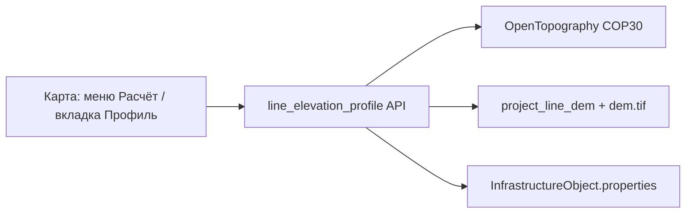

# Высотный профиль линейных объектов

Расчёт отметок рельефа (ЦМР) вдоль polyline **линейных** объектов инфраструктуры: автодороги, трубопроводы, ЛЭП и др. Результат — таблица пикетов с отметкой и уклоном; экспорт в Excel.

**Не рассчитывается** для подтипа **`well_bottomhole_gs`** (забой ГС). Остальные линейные подтипы участвуют.

**Связанные функции:** [Земляные работы площадки](../pad-earthwork/pad-earthwork.md) — отдельный ЦМР **на точечный** объект (`infra_object_pad_dem`); здесь — **один ЦМР на весь проект** (`project_line_dem`).

## Архитектура

- **Микросервис не используется** — расчёт in-process в API (`app/services/line_elevation_profile/`).
- ЦМР: таблица `project_line_dem`, файл `{LINE_PROFILE_DEM_DATA_ROOT}/{project_id}/dem.tif`.
- Профили линий: `line_elevation_profile_json` в `properties` каждой линии.

## Где в интерфейсе

| Место | Действие |
|-------|----------|
| **Карта** → панель инструментов → **Расчёт** → **Рассчитать профиль** | Массовый расчёт по **всем** линиям проекта (кроме `well_bottomhole_gs`) |
| Карточка **линейного** объекта → вкладка **Профиль** | Шаг сэмплинга, повторный расчёт, таблица, Excel |

Шаг по умолчанию — **100 м** (`line_elevation_profile_step_m`, диапазон 10–1000). Чтобы применить новый шаг к объекту, **сохраните** карточку, затем запустите расчёт.

## Алгоритм

1. **BBOX** по всем объектам инфраструктуры проекта, **кроме** забоев (`BOTTOMHOLE_CLUSTER_SUBTYPES`).
2. При изменении BBOX — загрузка GeoTIFF через [OpenTopography](https://opentopography.org/developers) (`COP30`, тот же `OPENTOPOGRAPHY_API_KEY`, что для pad-earthwork). При неизменном BBOX — переиспользование файла (`dem_reused: true`).
3. Для каждой линии — сэмплинг точек вдоль polyline с заданным шагом; высота — из растра.
4. В таблице: **пикет** (формат `N+mmm`), расстояние от начала, отметка, уклон ‰ между соседними точками.

График профиля — переключатель **Таблица / График** на вкладке «Профиль».

## 3D-рендер линий

Если для линии рассчитан **`line_elevation_profile_json`** (≥2 точек с отметкой), **3D-сцена** строит геометрию по **точкам профиля ЦМР**, а не по MapLibre terrain:

| Подтип | Горизонталь | Высота трубы / провода | Опоры ЛЭП |
|--------|-------------|------------------------|-----------|
| Трубы, дороги | `lon`/`lat` из профиля | `elevation_m` + `render_3d_base_m` | — |
| ЛЭП | те же точки | земля + подъём провода (`height × 0.88`) | `elevation_m` + base (земля под опорой) |

- Без профиля — прежнее поведение (terrain + `planCorridorAlts`).
- После **Рассчитать профиль** 3D обновляется автоматически (перезагрузка страницы не нужна).
- **Точечные объекты** (кроме забоев): при расчёте профиля перезаписывается **«Отметка основания»** (`render_3d_base_m`) — абсолютная отметка ЦМР в точке объекта; флаг `render_3d_base_from_dem`.
- MapLibre terrain и профиль OpenTopography могут визуально расходиться — **линия в 3D следует таблице профиля**.

Код: `frontend/src/lib/map3d/map3dLineProfilePath.ts`, интеграция в `map3dLinePathBuild.ts`.

## API (BFF)

| Метод | URL | Назначение |
|-------|-----|------------|
| POST | `/api/v1/projects/{project_id}/infrastructure/line-elevation-profile/compute` | Расчёт профилей всех линий проекта |
| GET | `/api/v1/projects/{project_id}/infrastructure/objects/{object_id}/line-elevation-profile` | Профиль одной линии |

При включённой очереди ARQ (`jobs_async_enabled`) POST `/compute` возвращает **202** и `job_id` с типом `line_elevation_profile_compute`. На SQLite / `JOBS_SYNC_FALLBACK` — синхронный **200**.

Контракт и коды ошибок: [contract.md](contract.md).

## Properties (линейный объект)

| Ключ | Описание |
|------|----------|
| `line_elevation_profile_step_m` | Шаг, м (default 100) |
| `line_elevation_profile_json` | Точки + meta (`dem_source`, `total_length_m`, …) |
| `line_elevation_profile_computed_at` | ISO-время последнего расчёта |

Схема JSON: [data-model.md](data-model.md).

## Фоновая задача

| `job_type` | Подпись в UI |
|------------|--------------|
| `line_elevation_profile_compute` | Профиль высот линий |

Журнал в шапке: [task-log-panel.md](../jobs/task-log-panel.md). POST `/compute` логируется в HTTP-журнал (`loggablePaths.ts`).

## Миграция и окружение

- Alembic **`027_project_line_dem`** — таблица `project_line_dem`.
- `LINE_PROFILE_DEM_DATA_ROOT` (опционально, default `data/line_profile_dem`).
- При удалении проекта — очистка DEM-файла (`project_delete.py`).

## Код

| Слой | Путь |
|------|------|
| API | `app/api/v1/line_elevation_profile.py` |
| Сервис | `app/services/line_elevation_profile/` |
| Frontend API | `frontend/src/lib/api/lineElevationProfileApi.ts` |
| Вкладка | `frontend/src/components/objectDetailPanel/InfraDetailProfileTab.tsx` |
| 3D профиль | `frontend/src/lib/map3d/map3dLineProfilePath.ts` |
| Меню карты | `frontend/src/pages/map/mapPageToolbar/MapPageToolbarCalculationsGroup.tsx` |

## Артефакты конвейера

[plan.md](plan.md) · [contract.md](contract.md) · [data-model.md](data-model.md) · [impl-log.md](impl-log.md) · [review-report.md](review-report.md)
