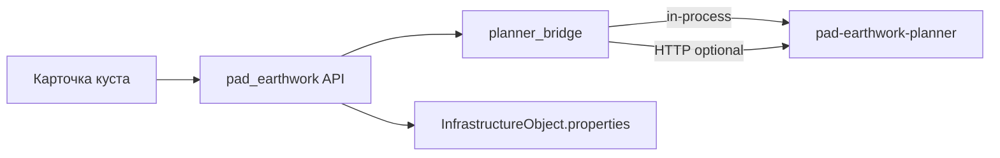

# Земляные работы кустовой площадки

MVP-расчёт объёмов выемки/отсыпки для объектов `oil_pad` и `gas_pad` на плоской опорной отметке.

## Архитектура



- **Микросервис** [`pad-earthwork-planner`](../../pad-earthwork-planner/) — расчёт объёмов, footprint, mesh GLB.
- **Монолит** — BFF (`app/api/v1/pad_earthwork.py`), port/adapter (`app/services/pad_earthwork/`), кэш в `properties`.
- По умолчанию **in-process** (пакет в образе API как `pad-earthwork-vendor`). Отдельный контейнер `:8081` — только dev/нагрузочные тесты.

## Микросервис

| Endpoint | Описание |
|----------|----------|
| `GET /health` | Liveness |
| `GET /ready` | Readiness |
| `POST /v1/compute` | Расчёт `fill_m3 = L×W×H`, `cut_m3 = 0` (MVP: `terrain.mode=flat`) |
| `POST /v1/sketch/preview` | Превью плана: площадь, углы в локальной ENU |

`terrain.mode=dem` → **501** (фаза 2: DEM upload, grid cut/fill, ARQ job `pad_earthwork_compute`).

**Схема (sketch):**

Прямоугольник:

```json
{
  "sketch": { "kind": "plan_rectangle", "length_m": 120, "width_m": 80, "rotation_deg": 0 },
  "params": { "height_m": 2.5, "reference_elevation_m": 150 }
}
```

Произвольный контур (полигон, до 64 вершин в локальной ENU относительно центра куста):

```json
{
  "sketch": {
    "kind": "plan_polygon",
    "vertices": [
      { "east_m": -60, "north_m": -40 },
      { "east_m": 60, "north_m": -40 },
      { "east_m": 40, "north_m": 40 },
      { "east_m": -60, "north_m": 40 }
    ]
  },
  "params": { "height_m": 2.5, "reference_elevation_m": 150 }
}
```

Для полигона: `fill_m3 = площадь_контура × H` (формула шнурка), `footprint_corners` — вершины контура; mesh GLB — упрощённый bounding box (`polygon_mesh_is_bbox_approximation`).

**Обволакивание** (опционально в `compute`):

```json
{
  "sketch": { "kind": "plan_polygon", "vertices": [ ... ] },
  "params": { "height_m": 2.5, "reference_elevation_m": 150 },
  "envelope": { "enabled": true, "wrap_width_m": 3 }
}
```

- Верх — нарисованный контур на высоте `H` (верхнее основание пирамиды); низ — контур с отступом `W` наружу (нижнее основание).
- `fill_m3 = (H / 3) × (A_top + A_bottom + √(A_top × A_bottom))` — усечённая пирамида, warning `envelope_volume_is_truncated_pyramid_approximation`.
- `footprint_corners` на карте — **внешний** (нижний) контур; `design.footprint_area_m2` = площадь низа.

`kind: "profile"` → **501** (`profile_not_supported`, этап 2).

## Монолит (BFF)

Базовый префикс: `/api/v1/projects/{project_id}/infrastructure/objects/{object_id}/pad-earthwork/`

| Метод | Путь | Описание |
|-------|------|----------|
| POST | `compute` | Расчёт и кэш в `properties` |
| GET | `last` | Последние params + результат |
| PATCH | `params` | Только L/W/H/rotation/reference (без пересчёта) |
| PATCH | `sketch` | Сохранение схемы плана и envelope в `properties` без пересчёта объёмов |

Дополнительно:

| Метод | Путь | Описание |
|-------|------|----------|
| POST | `/projects/{id}/pad-earthwork/sketch/preview` | Превью плана без привязки к объекту |
| POST | `/projects/{id}/pad-earthwork/dem` | Загрузка DEM (фаза 2, **501**) |

`compute` принимает опциональный `sketch` — L/W/rotation из схемы, `height_m` и `reference_elevation_m` из `params`.

**Ключи `properties`:**

| Ключ | Назначение |
|------|------------|
| `pad_length_m`, `pad_width_m`, `pad_height_m` | Габариты площадки, м |
| `pad_rotation_deg` | Поворот footprint, ° |
| `pad_reference_elevation_m` | Опорная отметка рельефа, м |
| `pad_fill_volume_m3`, `pad_cut_volume_m3` | Кэш последнего расчёта |
| `pad_earthwork_computed_at` | ISO-время расчёта |
| `pad_earthwork_sketch_json` | Последняя схема плана (`plan_rectangle` или `plan_polygon`) |
| `pad_earthwork_sketch_saved_at` | ISO-время последнего сохранения схемы (без пересчёта) |
| `pad_envelope_enabled`, `pad_envelope_wrap_width_m` | Обволакивание (юбка по периметру) |

**Конфиг** (`backend/.env`):

```env
PAD_EARTHWORK_INPROCESS=true
# PAD_EARTHWORK_SERVICE_URL=http://127.0.0.1:8081
```

Импорт пакета **ленивый** (`planner_bridge.py`): API стартует без установленного `pad-earthwork-planner`; ошибка — только при вызове `compute`, если пакет недоступен.

## UI

Вкладка **«Логистика»** карточки `oil_pad` / `gas_pad`:

- поля L×W×H, опорная отметка, поворот;
- **Схема…** — модальное окно с SVG-редактором плана (вид сверху, локальная ENU от центра куста);
- **Обволакивание** — toggle + ширина основания W; на холсте пунктиром — внешний (нижний) контур;
- вкладка «Профиль» — заглушка этапа 2;
- **Рассчитать** — POST `compute` (из полей или из модалки со `sketch`);
- **Сохранить** (в модалке) — PATCH `sketch`: контур и envelope привязаны к объекту куста, объёмы не пересчитываются;
- **Применить к полям** (в модалке) — синхронизация L/W/rotation в поля карточки без сохранения на сервер и **без закрытия** модалки;
- **Применить N м³ к спросу песка** — заполняет `sand_volume_m3` в черновике (сохранение — кнопкой карточки).

Подсказка в UI: «упрощённый расчёт на плоской опорной отметке».

### Редактор схемы (модалка)

Переключатель формы: **Прямоугольник** / **Произвольная**. Общие элементы холста: оси E/N, стрелка севера, центр куста (0,0), сетка 1 м (toggle), масштаб и «Вписать», площадь контура в центре (для замкнутого полигона), периметр в подсказке.

| Элемент | Описание |
|---------|----------|
| **Сетка 1 м** | Привязка вершин и размеров к шагу 1 м (toggle в тулбаре) |
| **Длины** | Подписи длин сторон на рёбрах (toggle, по умолчанию вкл.; общий для прямоугольника и полигона) |
| **Zoom / Вписать** | Масштаб холста; при перетаскивании вершин/рёбер viewport не «прыгает» (заморозка bbox) |

**Прямоугольник** (`PlanRectangleEditor`):

| Инструмент | Действие |
|------------|----------|
| Углы | Перетаскивание углов от центра; опционально **Пропорции** (lock aspect) |
| Стороны | Перетаскивание середины стороны — изменение длины или ширины |
| Поворот | Маркер поворота вокруг центра |
| Пресеты | Типовые L×W; «Разбить в полигон»; сброс |

На рёбрах при включённом **Длины** — подписи `ширина м` / `длина м` у середин сторон.

**Произвольный контур** (`PlanPolygonEditor`, до 64 вершин, минимум 3 для расчёта):

| Инструмент | Действие |
|------------|----------|
| Рисовать | Клик по холсту — добавление вершины (один клик = одна вершина); предпросмотр последнего ребра |
| Вершины | Перетаскивание вершин; **перетаскивание стороны** — параллельный перенос ребра (обе смежные вершины); hit zone 14 px на рёбрах |
| Вставить | Один клик по стороне контура — вставка вершины на ребре (проекция на отрезок) |
| Удалить | Клик по вершине (не менее 3 вершин) |

При включённом **Длины** — подписи длины каждого ребра в метрах (смещение наружу от центра масс контура). Формат: целые или одна десятая (`12 м`, `12,3 м`).

Пресеты контура: «Из прямоугольника», «Очистить», сброс. Индикатор сохранённой схемы на вкладке «Логистика» (`pad_earthwork_sketch_saved_at`).

**Frontend:** `components/padEarthwork/` (`PadEarthworkSketchModal`, `PlanPolygonEditor`, `PlanRectangleEditor`, тулбары), логика — `lib/padEarthworkSketch.ts` (`polygonEdgeLabels`, `movePolygonEdgeFromDrag`, `insertPolygonVertexOnEdge`, envelope preview).

## Локальный запуск

### Монолит (рекомендуется)

`run_local.py` при отсутствии пакета выполняет `pip install -e ../../../pad-earthwork-planner`:

```powershell
cd C:\Users\user\Documents\Cursore\decision-matrix\backend
.\venv\Scripts\Activate.ps1
python run_local.py
```

Первый запуск (явная установка, как для `autoroad-network-planner`):

```powershell
python -m pip install -e C:\Users\user\Documents\Cursore\pad-earthwork-planner
```

### Микросервис отдельно (порт 8081)

```powershell
cd C:\Users\user\Documents\Cursore\pad-earthwork-planner
pip install -e ".[dev]"
uvicorn pad_earthwork.api:app --host 127.0.0.1 --port 8081
```

Без `pip install`:

```powershell
python run_server.py
```

Проверка: `GET http://127.0.0.1:8081/health` → `{"status":"ok"}`.

### Docker (prod / CI)

При сборке backend образа CI копирует `pad-earthwork-planner` → `backend/pad-earthwork-vendor` (аналог `network-planner-vendor`). Локально для `docker build` из `decision-matrix/backend`:

```powershell
Copy-Item -Recurse C:\Users\user\Documents\Cursore\pad-earthwork-planner `
  C:\Users\user\Documents\Cursore\decision-matrix\backend\pad-earthwork-vendor
```

Микросервис в отдельном контейнере: `cd pad-earthwork-planner && docker compose up --build`.

## Устранение неполадок

| Симптом | Решение |
|---------|---------|
| `ModuleNotFoundError: pad_earthwork` при **compute** | `pip install -e ../../../pad-earthwork-planner` или перезапустить `run_local.py` |
| Backend не стартует (старая версия кода) | Обновите код; импорты теперь ленивые — старт не требует пакета |
| `uvicorn pad_earthwork.api:app` без установки | Используйте `python run_server.py` или `pip install -e .` |
| Docker build: `pad-earthwork-vendor` not found | Скопируйте пакет (см. выше) или используйте CI workflow |

## Тесты

| Область | Файлы |
|---------|--------|
| Микросервис | `pad-earthwork-planner/tests/` |
| Backend BFF | `decision-matrix/backend/tests/test_pad_earthwork_api.py` |
| Frontend | `frontend/src/lib/infraPadEarthwork.test.ts`, `padEarthworkSketch.test.ts` (полигон: рёбра, подписи длин, envelope) |

## Ограничения MVP

- Куст — **точка**; footprint от центра + габариты (прямоугольник) или вершины полигона.
- Полигон: площадь по контуру; L/W в properties — охватывающий bbox для совместимости с полями формы.
- Без DEM cut/fill по рельефу недоступен; `cut_m3 = 0` на плоской отметке.
- Mesh GLB в ответе API есть; превью в UI — post-MVP.
