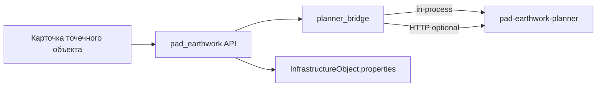

# Земляные работы площадки

MVP-расчёт объёмов выемки/отсыпки для **точечных** объектов инфраструктуры (все подтипы `point.map`, кроме `node`) на плоской опорной отметке или по DEM (OpenTopography).

**Генератор скважин** (автоконтур по ряду скважин) — только `oil_pad` / `gas_pad`. Остальные объекты: схема «Произвольная» / «Прямоугольник» в модалке «Схема…».

## Архитектура



- **Микросервис** [`pad-earthwork-planner`](../../pad-earthwork-planner/) — расчёт объёмов, footprint, mesh GLB.
- **Монолит** — BFF (`app/api/v1/pad_earthwork.py`), port/adapter (`app/services/pad_earthwork/`), кэш в `properties`.
- По умолчанию **in-process** (пакет в образе API как `pad-earthwork-vendor`). Отдельный контейнер `:8081` — только dev/нагрузочные тесты.

## Микросервис

| Endpoint | Описание |
|----------|----------|
| `GET /health` | Liveness |
| `GET /ready` | Readiness |
| `POST /v1/compute` | Расчёт объёмов: см. § [Модель объёмов](#модель-объёмов-отсыпка-и-выемка) |
| `POST /v1/sketch/preview` | Превью плана: площадь, углы в локальной ENU |
| `POST /v1/sketch/generate-from-wells` | Автогенерация `plan_polygon` по числу скважин и отступам |

`terrain.mode=dem` — выемка по сетке 1×1 м внутри footprint; отсыпка не берётся из DEM. BFF загружает GeoTIFF через [OpenTopography Global DEM API](https://opentopography.org/developers) (по умолчанию `COP30`). При Redis/ARQ `compute` с DEM может вернуть **202** + job `pad_earthwork_compute`.

## Модель объёмов (отсыпка и выемка)

**Отсыпка и выемка — независимые процессы.** Изъятый грунт не засчитывается в объём насыпи и не уменьшает спрос песка.

| Поле API | Смысл | Режим flat | Режим DEM |
|----------|--------|------------|-----------|
| `fill_m3` | **Отсыпка** — объём призмы площадки (песок завозится) | `L × W × H` или `площадь_контура × H` | `площадь_контура × H` (не из DEM) |
| `cut_m3` | **Выемка** — грунт, который нужно снять | `0` | сумма по ячейкам внутри контура |
| `net_fill_m3` | Спрос песка для логистики | `= fill_m3` | `= fill_m3` (выемка не вычитается) |

### Геометрия площадки

- **Опорная отметка** (`reference_elevation_m`) — подошва призмы насыпи.
- **Верх площадки** — `reference_elevation_m + height_m`.
- Призма задаётся контуром плана (прямоугольник или полигон) и высотой насыпи `height_m`.

### Выемка по DEM

Для каждой ячейки сетки 1×1 м **внутри контура**, где отметка рельефа `Z_terrain` известна:

```text
если Z_terrain > reference_elevation_m:
  cut_m3 += (Z_terrain − reference_elevation_m) × площадь_ячейки
```

Учитывается весь столб грунта **выше опорной отметки**, в том числе:

- между опорной и верхом площадки (если рельеф в этом диапазоне);
- **выше верха площадки** (холмы, торчащие через синюю призму на вкладке **3D**).

Рельеф **ниже** опорной в выемку не входит (подсыпка всё равно считается полным объёмом призмы).

Реализация: `pad-earthwork-planner/src/pad_earthwork/dem_volume.py`, ответ `POST compute` с `terrain.mode = dem`.

### Отсыпка

Всегда **геометрический объём насыпи**, без «добивки» рельефа до верха:

- прямоугольник: `length_m × width_m × height_m`;
- полигон: `площадь_контура × height_m` (шнурок);
- с обволованием в `POST compute` (legacy planner) — см. § [Объём в POST compute](#объём-в-post-compute-planner-legacy).

Кнопка **«Применить … м³ к песку»** / **«Применить … к спросу песка»** подставляет `fill_m3`.

### 3D, план и цифры

| Слой | Что показывает |
|------|----------------|
| Вкладка **3D** | DEM + призма площадки по опорной/верху; визуальное пересечение рельефа и призмы |
| **Рассчитать** | `fill_m3` и `cut_m3` по правилам выше |
| Overlay DEM на **Плане** | hillshade + **оранжевая** подсветка ячеек, где рельеф выше **опорной** (не синяя «насыпь по DEM») |

После **Загрузить DEM** в модалке «Рассчитать» передаёт `terrain.mode=dem`, если DEM загружен.

### Опорная отметка по минимуму DEM

У поля **Опорная отметка** (карточка и модалка) — кнопка ↓: устанавливает опорную по **`footprint_elev_min`** из `POST dem/preview` (минимум рельефа внутри контура площадки). Требуется загруженный DEM.

**DEM (OpenTopography):**

- Env backend: `OPENTOPOGRAPHY_API_KEY`, `OPENTOPOGRAPHY_DEM_TYPE` (default `COP30`), `PAD_DEM_DATA_ROOT`, `PAD_DEM_BBOX_PADDING_M`, `PAD_DEM_MIN_BBOX_SIDE_M` (default 300 — OpenTopography требует ≥250 м на каждую сторону bbox; при повороте площадки ось-aligned bbox может быть уже footprint).
- Кэш GeoTIFF: `{PAD_DEM_DATA_ROOT}/{project_id}/{id}.tif`; метаданные — таблица **`infra_object_pad_dem`** (1:1 с объектом); в properties дублируются `pad_dem_*`. При смене bbox — перезапись файла; legacy adoption из старых `properties`. См. § [Хранение DEM](#хранение-dem) и [pad-dem-storage.md](../deploy/pad-dem-storage.md).
- UI карточки (вкладка **Логистика**): переключатель «Плоская отметка / DEM», кнопки «Загрузить DEM» и «Рассчитать». Доступно для `EARTHWORK_SUBTYPES` = все `point.map` кроме `node`.
- Подробности объёмов — § [Модель объёмов](#модель-объёмов-отсыпка-и-выемка).
- Ограничения: envelope + DEM → warning `envelope_ignored_with_dem`; ручная загрузка GeoTIFF — **501**.

**Схема (sketch):**

Прямоугольник:

```json
{
  "sketch": { "kind": "plan_rectangle", "length_m": 120, "width_m": 80, "rotation_deg": 0 },
  "params": { "height_m": 2.5, "reference_elevation_m": 150 }
}
```

Произвольный контур (полигон, до 64 вершин в локальной ENU). Якорь зависит от способа задания — см. § UI «Якорь footprint»; для ручного полигона вершины задаются относительно `lon/lat` объекта:

```json
{
  "sketch": {
    "kind": "plan_polygon",
    "vertices": [
      { "east_m": -60, "north_m": -40 },
      { "east_m": 60, "north_m": -40 },
      { "east_m": 40, "north_m": 40 },
      { "east_m": -60, "north_m": 40 }
    ]
  },
  "params": { "height_m": 2.5, "reference_elevation_m": 150 }
}
```

Для полигона: `fill_m3 = площадь_контура × H` (формула шнурка), `footprint_corners` — вершины контура; mesh GLB — упрощённый bounding box (`polygon_mesh_is_bbox_approximation`).

## Режим «Площадки» на карте

На `/map` третий режим отображения (**Площадки**, иконка контуров рядом с 2D/3D):

- Движок — **OpenLayers** (как 2D), не MapLibre 3D.
- Для объектов из `EARTHWORK_SUBTYPES` (все `point.map`, кроме `node`) вместо иконки рисуется **полигон footprint**:
  - если есть `pad_earthwork_sketch_json` — контур из схемы (ENU → lon/lat);
  - иначе — прямоугольник по `pad_length_m` × `pad_width_m` и `pad_rotation_deg` (по умолчанию **120×80 м**, NDS **90°**).
- Линии, POI и **узлы** отображаются как в 2D; **карьер песка** и прочие earthwork-точки — полигоном footprint.
- Выбор и перемещение якоря объекта работают как в 2D (клик по полигону выбирает точечный объект).
- Геометрия на клиенте: `frontend/src/lib/padFootprintGeo.ts` (`resolveFootprintLonLat`); на backend — `resolve_footprint_lonlat` в `app/services/pad_earthwork/service.py`.

### Привязка линий к ребру контура (display-only)

В режиме **«Площадки»** концы линий, topologically привязанные к earthwork-точке (центр в `coordinates[]`), могут **визуально** сходиться к выбранному ребру footprint. В БД и в режиме **2D** координаты концов остаются в **центре** точки.

Настройка хранится на **точечном объекте** (площадке) в `properties.footprint_line_connections` — для каждого типа линейного объекта отдельная точка на периметре:

```json
{
  "oil_pipeline": { "edge_index": 2, "t": 0.5 },
  "gas_pipeline": { "edge_index": 0, "t": 0.5 },
  "power_line": { "edge_index": 1 }
}
```

- `edge_index` — ребро замкнутого кольца из `resolveFootprintLonLat` (0…N−1). **Зависит от поворота** (`pad_rotation_deg` / схема): для прямоугольника 120×80 м и NDS 180° восток — это `edge_index: 3`, а `0` — север. В UI подписи «Север (1)», «Восток (4)» и т.д.
- `t` — позиция вдоль ребра 0…1 (по умолчанию 0.5).
- Только earthwork-eligible точки (как контуры); **узлы** и прочие подтипы — без attach.
- Legacy `properties.line_footprint_attach` на линиях по-прежнему учитывается при отображении, если на точке нет записи для подтипа линии.

**UX (карточка объекта):** **точечный** earthwork-объект, вкладка «Основное», **только** при режиме «Площадки»: переключатель типа линии, мини-схема контура, кнопки **С/З/В/Ю** и **Центр**, поле `t`; **«Применить шаблон проекта»** (merge в `footprint_line_connections` с учётом поворота объекта); клик по ребру на схеме/карте. Компонент `PointFootprintLineConnectionsSection.tsx`; модуль `frontend/src/lib/padFootprintLineAttach.ts`; валидация PATCH — `app/geo/point_footprint_line_connect.py` (точки), `app/geo/line_footprint_attach.py` (legacy на линиях).

**UX (Параметры → Точки подключения,** `/parameters/footprint-connections`):

| Зона | Содержимое |
|------|------------|
| Шапка | Подзаголовок, чипы «типов задано / N», «объектов на карте», бейдж сохранения, **Открыть карту** |
| Шаблон (слева) | Вкладки типов линий с бейджем стороны; compass **С/З/В/Ю** + **Центр**; select и `t`; **Сбросить**; интерактивная **схема** (прямоугольник 120×80, легенда переключает активный тип) |
| Применить (справа, sticky ≥1100px) | Фильтр подтипа с счётчиками; **Применить ко всем** / **Применить к подтипу**; модальное подтверждение (`FootprintTemplateApplyConfirmModal`); progress bar; **Отменить последнее (N)** |

Страница: `FootprintConnectionsParametersPage.tsx`; стили — `parameters.css` (BEM `footprint-connect-*`). Пользовательская wiki: [parameters-footprint-connections.md](../wiki/articles/parameters-footprint-connections.md).

**Шаблон проекта** — cardinal на тип линии (не `edge_index`):

```json
{
  "oil_pipeline": { "cardinal": "north", "t": 0.5 },
  "autoroad": { "cardinal": "east", "t": 0.25 },
  "gas_pipeline": null
}
```

- `null` — **центр** площадки (явное отключение attach для типа в шаблоне).
- Отсутствие ключа — тип не задан в шаблоне (при merge не перезаписывает объект).
- При **apply** `connectionsFromCardinalTemplate` переводит cardinal → `edge_index` по повороту каждого объекта (`pad_rotation_deg` / контур схемы).

**Хранение шаблона:** таблица `project_footprint_connection_templates` (миграция `025`); API `GET/PUT /api/v1/projects/{project_id}/footprint-connection-template`; sanitize — `app/geo/footprint_connection_template.py`. Hook `useProjectFootprintConnectionTemplate`: debounced PUT; `localStorage` (`footprintConnectionTemplateStorage.ts`) — кэш и однократная миграция local → server при пустом remote.

**Массовое применение:** PATCH `properties.footprint_line_connections` по объектам (`applyFootprintTemplateToObject`, mode `merge`); undo — `patch_infra_detail_batch` в `mapUndo.ts`, очередь `pendingMapUndoBridge.ts` для Ctrl+Z на карте; кнопка **Отменить последнее** на странице параметров.

**Обволование** (опционально в `compute` и в модалке «Схема…»):

```json
{
  "sketch": { "kind": "plan_polygon", "vertices": [ ... ] },
  "params": { "height_m": 2.5, "reference_elevation_m": 150 },
  "envelope": { "enabled": true, "wrap_width_m": 3 }
}
```

Параметр `wrap_width_m` = **W** — ширина подошвы песчаной **обваловки** на **верхней плоскости насыпи** (design elevation = `reference_elevation_m + height_m`).

### Модель обволования (вариант A — кольцо обваловки)

В **UI** (план, профиль, 3D) и в **оценке объёма в модалке** используется симметричная **равнобедренная трапеция** в поперечнике; оба откоса **1:1**.

| Обозначение | Формула | Пример при W = 3 |
|-------------|---------|------------------|
| TW — ширина бровки (верх полосы) | `W / 3` | 1 м |
| H — высота откоса (1:1) | `(W − TW) / 2` | 1 м |
| S — площадь поперечного сечения полосы | `H × (W + TW) / 2` | 2 м² |
| V — объём кольца | `P × S`, P — периметр контура верха насыпи | — |

```text
Поперечник (вид с торца):

        TW
    ┌───────┐  ← бровка (+H к design)
   /         \
  /     H     \  откосы 1:1
 /             \
├─────── W ─────┤  ← подошва на design (верх насыпи)
│   площадка    │
```

**План** (контур верха насыпи = внешний край подошвы):

| Линия | Inset от контура площадки |
|-------|---------------------------|
| Внутренний край подошвы | W |
| Внешняя бровка (светлый пунктир) | H |
| Внутренняя бровка (тёмный пунктир) | `(W + TW) / 2` |

**3D:** кольцо на верху призмы — подошва на `reference + height_m`, бровка на `+ H` (не `+ W`).

**Frontend:** `padEarthworkSketch.ts` (`envelopeBerm*`, `estimateEnvelopeBermRingVolumeM3`), `padEarthworkScene3d.ts` (`buildEnvelopeBermRing`).

### Объём в POST compute (planner, legacy)

`pad-earthwork-planner` пока считает **другую** упрощённую модель — **усечённую пирамиду** вокруг всего контура (контур смещается **наружу** на W):

- `fill_m3 = (H_pad / 3) × (A_top + A_bottom + √(A_top × A_bottom))`
- warning `envelope_volume_is_truncated_pyramid_approximation`
- `footprint_corners` на карте — **внешний** (нижний) контур; `design.footprint_area_m2` = площадь низа

> **Известное расхождение MVP:** визуализация и оценка в модалке — вариант A (кольцо на верху насыпи); сохранённый результат **Рассчитать** — формулы planner до выравнивания backend.

## Монолит (BFF)

Базовый префикс: `/api/v1/projects/{project_id}/infrastructure/objects/{object_id}/pad-earthwork/`

| Метод | Путь | Описание |
|-------|------|----------|
| POST | `compute` | Расчёт и кэш в `properties` |
| GET | `last` | Последние params, sketch, `wells_local`, envelope, результат |
| PATCH | `params` | Только L/W/H/rotation/reference (без пересчёта) |
| PATCH | `sketch` | Сохранение схемы **плана**, `wells_local`, envelope и **НДС** |
| POST | `sketch/generate` | Автогенерация схемы по скважинам (из `properties` или тела запроса) |
| POST | `dem/fetch` | Автозагрузка DEM по bbox footprint (OpenTopography) |
| POST | `dem/preview` | Сетка высот DEM в локальной ENU для наложения на схему; поля `elev_min`, `elev_max`, `footprint_elev_min`, `cut_fill` (выемка: рельеф выше опорной) |

Дополнительно:

| Метод | Путь | Описание |
|-------|------|----------|
| POST | `/projects/{id}/pad-earthwork/sketch/preview` | Превью плана без привязки к объекту |
| POST | `/projects/{id}/pad-earthwork/dem` | Ручная загрузка GeoTIFF (**501**, используйте `dem/fetch`) |
| GET | `/projects/{id}/footprint-connection-template` | Шаблон точек подключения (cardinal по типам линий) |
| PUT | `/projects/{id}/footprint-connection-template` | Сохранение шаблона (`{ "template": { … } }`) |

`compute` принимает опциональный `sketch` (план); footprint из сохранённого plan-sketch или params. `height_m` и `reference_elevation_m` из `params`.

**Ключи `properties`:**

| Ключ | Назначение |
|------|------------|
| `pad_length_m`, `pad_width_m`, `pad_height_m` | Габариты площадки, м; default **120×80×1** (L/W/H) если не заданы |
| `pad_reference_elevation_m` | Опорная отметка подошвы, м; default **0** |
| `pad_rotation_deg` | **НДС** — азимут ряда скважин, 0…360° (см. § Автогенерация); для прямоугольника в редакторе — поворот footprint |
| `pad_reference_elevation_m` | Опорная отметка рельефа, м |
| `pad_fill_volume_m3`, `pad_cut_volume_m3` | Кэш последнего расчёта |
| `pad_earthwork_computed_at` | ISO-время расчёта |
| `pad_earthwork_sketch_json` | Последняя схема плана (`plan_rectangle` или `plan_polygon`) |
| `pad_wells_local_json` | Позиции скважин в локальной ENU `[{east_m, north_m}, …]` (сохраняются с автогенерацией) |
| `pad_earthwork_sketch_saved_at` | ISO-время последнего сохранения схемы (без пересчёта) |
| `pad_envelope_enabled`, `pad_envelope_wrap_width_m` | Обволование: W — ширина подошвы обваловки на верху насыпи |
| `pad_well_count`, `pad_wells_per_group` | Скважины на кусте и в группе: **Эксплуатация** (кол-во скв.) и режим «Генератор» в модалке схемы |
| `pad_well_spacing_m`, `pad_well_group_spacing_m` | Шаг между скважинами в группе и между группами, м |
| `pad_layout_margin_left_m` | Отступ слева от первой скважины, м |
| `pad_layout_margin_bottom_m`, `pad_layout_margin_top_m` | Отступы вниз/вверх от линии скважин, м |
| `pad_layout_margin_end_m` | Отступ справа от последней скважины, м |
| `pad_dem_asset_id` | UUID записи DEM (совпадает с `infra_object_pad_dem.id`); путь файла — `{project_id}/{id}.tif` |
| `pad_dem_fetched_at` | ISO-время последней загрузки DEM |
| `pad_dem_source` | Источник, напр. `opentopography:COP30` |
| `pad_dem_bbox_hash` | SHA-256 bbox запроса (кэш: повторный fetch при том же hash не качает DEM) |
| `footprint_line_connections` | JSON: подтип линии → `{ "edge_index", "t" }` или `null` (центр); display-only в режиме «Площадки»; см. § «Привязка линий» |

**Стандартные значения генератора** (если ключи не заданы на объекте):

| Параметр | Default |
|----------|---------|
| `pad_well_count` | 12 |
| `pad_wells_per_group` | 1 |
| `pad_well_spacing_m` | 9 |
| `pad_well_group_spacing_m` | 9 |
| `pad_layout_margin_left_m` | 27 |
| `pad_layout_margin_bottom_m` | 43 |
| `pad_layout_margin_top_m` | 15 |
| `pad_layout_margin_end_m` | 70 |
| НДС (`pad_rotation_deg` / `rotation_deg` в generate) | 90 |

**Конфиг** (`backend/.env`):

```env
PAD_EARTHWORK_INPROCESS=true
# PAD_EARTHWORK_SERVICE_URL=http://127.0.0.1:8081
# OPENTOPOGRAPHY_API_KEY=...
# OPENTOPOGRAPHY_DEM_TYPE=COP30
# PAD_DEM_DATA_ROOT=./data/pad_dem
```

### Хранение DEM

Источник истины — PostgreSQL (`infra_object_pad_dem`, миграция `024`), GeoTIFF на диске — бинарное содержимое.

| Поле / путь | Назначение |
|-------------|------------|
| `infrastructure_object_id` | UNIQUE — одна DEM на объект куста |
| `id` (UUID) | Имя файла `{project_id}/{id}.tif` |
| `bbox_hash` | Кэш OpenTopography: тот же hash → без повторной загрузки |
| `source`, `fetched_at` | Метаданные источника |
| `PAD_DEM_DATA_ROOT` | Корень каталога (Docker: volume `pad_dem_data` → `/app/data/pad_dem`) |

**Жизненный цикл:**

1. `POST …/dem/fetch` или `compute` с `terrain.mode=dem` → `ensure_pad_dem(db)` в `pad_dem_repository.py`.
2. Нет строки или другой `bbox_hash` → запрос OpenTopography, INSERT или UPDATE строки, запись/перезапись `.tif`.
3. Тот же `bbox_hash` → чтение существующего файла.
4. Удаление объекта инфраструктуры → `DELETE` строки (CASCADE) + явное удаление файла в `infra_delete.py` (bulk delete не вызывает ORM-listeners).
5. Старые объекты только с `pad_dem_asset_id` в `properties` — **legacy adoption** при первом обращении (строка в БД, при смене bbox — удаление legacy-файла по старому UUID).

Полная инструкция деплоя volume и бэкапа: [pad-dem-storage.md](../deploy/pad-dem-storage.md).

Импорт пакета **ленивый** (`planner_bridge.py`): API стартует без установленного `pad-earthwork-planner`; ошибка — только при вызове `compute`, если пакет недоступен.

## UI

### Якорь footprint: два режима

| Режим | Когда | Якорь на карте |
|-------|--------|----------------|
| Ручной прямоугольник | `plan_rectangle` в редакторе | Геометрический центр (симметричный bbox) |
| Автогенерация / полигон | `plan_polygon` из автогенератора | **Первая скважина** `(0, 0)` = `lon/lat` объекта куста |

### Автогенерация по скважинам

1. Вкладка **«Логистика»** → **«Схема…»** — по умолчанию открывается режим **«Генератор»** (первый в переключателе формы).
2. Поля скважин, отступов контура и **НДС, °** — в правой панели модалки; **«Сгенерировать»** — `POST sketch/generate`.
3. Результат — `plan_polygon` (4 вершины) + маркеры скважин на холсте; L/W и НДС подставляются в поля карточки.
4. **Сохранить** в модалке — контур в `pad_earthwork_sketch_json`, скважины в `pad_wells_local_json`, НДС в `pad_rotation_deg`.
5. **Сохранить** на карточке объекта — параметры скважин и отступов в `pad_well_*` / `pad_layout_margin_*`.

При переключении **Генератор** ↔ **Произвольная** ↔ **Прямоугольник** сгенерированный контур и скважины сохраняются в сессии модалки; при возврате в **Генератор** восстанавливаются из снимка (если был переход через «Прямоугольник», bbox не затирает исходный полигон).

**Геометрия:** скважины в один ряд; ориентация ряда задаётся **НДС**; между группами — `pad_well_group_spacing_m`; контур: слева от первой, вниз/вверх от линии, справа от последней.

**Запрос `sketch/generate` (тело опционально; пустое `{}` — defaults из таблицы выше или из `properties` объекта):**

```json
{
  "well_count": 12,
  "wells_per_group": 1,
  "well_spacing_m": 9,
  "group_spacing_m": 9,
  "margins": { "left_m": 27, "bottom_m": 43, "top_m": 15, "end_m": 70 },
  "rotation_deg": 90
}
```

**НДС** (`rotation_deg` / `pad_rotation_deg`): азимут ряда скважин от первой к последней, **0…360°** по часовой от **севера** (0° = север, 90° = восток, **180° = юг**, ряд сверху вниз на плане). По умолчанию **90°**.

**Ответ generate:** `sketch` (`plan_polygon`), `wells_local`, `length_m`, `width_m`, `rotation_deg`, `footprint_area_m2`.

**Тело PATCH `sketch` (фрагмент):**

```json
{
  "sketch": { "kind": "plan_polygon", "vertices": [ ... ] },
  "params": { "height_m": 2.5, "reference_elevation_m": 150 },
  "wells_local": [{ "east_m": 0, "north_m": 0 }, ...],
  "rotation_deg": 90,
  "envelope": { "enabled": false, "wrap_width_m": 3 }
}
```

**Ответ GET `last`:** `params`, `sketch`, `wells_local`, `envelope`, `sketch_saved_at`, `result`.

**Модуль planner:** `well_layout.py` — `compute_well_positions_east_m`, `generate_pad_polygon_from_wells`.

Вкладка **«Логистика»** карточки точечного объекта (кроме **Узел**):

- **Кусты** (`oil_pad`, `gas_pad`): полный блок + режим **Генератор** в «Схема…».
- **Карьер песка** (`sand_quarry`): тот же блок земляных работ (L/W/H, схема, DEM, объёмы); отдельно — блок **Песок** (начальный/текущий объём карьера).
- **Прочие точечные** (ГКС, ПС, ДНС, …): тот же блок (схема, DEM, объёмы, песок); в «Схема…» только **Произвольная** / **Прямоугольник**.

### Параметры (массовое редактирование)

Маршрут **Параметры → Земляные работы** (`/parameters/earthwork`): таблица по всем earthwork-eligible объектам проекта. Редактируются `pad_length_m`, `pad_width_m`, `pad_height_m`, `pad_reference_elevation_m`, `pad_rotation_deg` (сохранение при blur/Enter через `PATCH …/pad-earthwork/params`; Excel export). Схема контура, DEM и пересчёт объёмов — только на карте (вкладка **Логистика**). Пользовательская wiki: [parameters-earthwork.md](../wiki/articles/parameters-earthwork.md).

Маршрут **Параметры → Точки подключения** (`/parameters/footprint-connections`): шаблон cardinal + массовое применение `footprint_line_connections` (см. § «Привязка линий»). Wiki: [parameters-footprint-connections.md](../wiki/articles/parameters-footprint-connections.md).

- поля L×W×H, опорная отметка, **НДС, °** (на карточке — тот же смысл, что в генераторе);
- **Схема…** — модальное окно с SVG-редактором (вид сверху, локальная ENU; якорь — см. таблицу выше);
  - переключатель: **Генератор** (по умолчанию) / **Произвольная** / **Прямоугольник**;
  - режим **«Генератор»** — параметры скважин, отступы, НДС и **«Сгенерировать»** (панель справа);
- **Обволование** — toggle + ширина основания W; песчаная **обваловка** по контуру **верха насыпи** (подошва W на design, откосы 1:1, высота H = (W − TW)/2, TW = W/3); на плане — кольцо подошвы + две бровки; в 3D — кольцо на верху призмы;
- вкладка **«3D»** — интерактивная сцена Three.js: рельеф из `POST dem/preview` (сетка ≤128×128), призма площадки по контуру плана, обволование; без DEM — плоскость на опорной отметке; орбитальная камера, «Вписать»;
- **Рассчитать** — POST `compute` (из полей или из модалки со `sketch`; при загруженном DEM — `terrain.mode=dem`);
- **Сохранить** (в модалке) — PATCH `sketch`: контур, `wells_local`, envelope и НДС в `properties`; объёмы не пересчитываются;
- **Применить к полям** (в модалке) — синхронизация L/W/rotation в поля карточки без сохранения на сервер и **без закрытия** модалки;
- **Применить N м³ к спросу песка** — заполняет `sand_volume_m3` в черновике (сохранение — кнопкой карточки).

Подсказка в UI: «упрощённый расчёт на плоской опорной отметке»; для автогенерации — «точка на карте = первая скважина (0,0)».

### Редактор схемы (модалка)

Переключатель формы: **Генератор** / **Произвольная** / **Прямоугольник** (по умолчанию открывается **Генератор**). В режиме **Генератор** — форма параметров скважин и отступов, кнопка **«Сгенерировать»** (`sketch/generate`), предпросмотр контура (read-only) и маркеры скважин. Общие элементы холста: оси E/N, стрелка севера, маркер якоря `(0,0)` (первая скважина при автогенерации; геом. центр при симметричном прямоугольнике), **маркеры скважин** (оранжевые, при автогенерации), сетка 1 м (toggle), масштаб и «Вписать», площадь контура в центре (для замкнутого полигона), периметр в подсказке.

| Элемент | Описание |
|---------|----------|
| **Сетка 1 м** | Привязка вершин и размеров к шагу 1 м (toggle в тулбаре) |
| **Длины** | Подписи длин сторон на рёбрах (toggle, по умолчанию вкл.; общий для прямоугольника и полигона) |
| **Zoom / Вписать** | Масштаб холста; при перетаскивании вершин/рёбер viewport не «прыгает» (заморозка bbox) |
| **Рельеф DEM** | Toggle: hillshade + **оранжевая** подсветка выемки (рельеф выше **опорной** отметки) внутри контура; `POST dem/preview`. Кнопка ↓ у опорной — минимум рельефа в контуре. Легенда: min/max рельеф, верх площадки |
| **3D** | Обволование — кольцо на верху призмы: подошва W на design, откосы 1:1, бровка на H = (W−TW)/2 |
| **Обволование (план)** | Кольцо подошвы (ширина W) + пунктир **внешней** и **внутренней** бровки (inset H и (W+TW)/2) |

**DEM overlay:** canvas-подложка под SVG; пересчёт с debounce ~400 ms при изменении контура или высоты/отметки. Включён по умолчанию, если в карточке выбран режим DEM и `pad_dem_asset_id` задан.

**Прямоугольник** (`PlanRectangleEditor`):

| Инструмент | Действие |
|------------|----------|
| Углы | Перетаскивание углов от центра; опционально **Пропорции** (lock aspect) |
| Стороны | Перетаскивание середины стороны — изменение длины или ширины |
| Поворот | Маркер поворота вокруг центра |
| Пресеты | Типовые L×W; «Разбить в полигон»; сброс |

На рёбрах при включённом **Длины** — подписи `ширина м` / `длина м` у середин сторон.

**Произвольный контур** (`PlanPolygonEditor`, до 64 вершин, минимум 3 для расчёта):

| Инструмент | Действие |
|------------|----------|
| Рисовать | Клик по холсту — добавление вершины (один клик = одна вершина); предпросмотр последнего ребра |
| Вершины | Перетаскивание вершин; **перетаскивание стороны** — параллельный перенос ребра (обе смежные вершины); hit zone 14 px на рёбрах |
| Вставить | Один клик по стороне контура — вставка вершины на ребре (проекция на отрезок) |
| Удалить | Клик по вершине (не менее 3 вершин) |

При включённом **Длины** — подписи длины каждого ребра в метрах (смещение наружу от центра масс контура). Формат: целые или одна десятая (`12 м`, `12,3 м`).

Пресеты контура: «Из прямоугольника», «Очистить», сброс. Индикатор сохранённой схемы на вкладке «Логистика» (`pad_earthwork_sketch_saved_at`).

**Frontend:** `components/padEarthwork/` (`PadEarthworkSketchModal`, `PadEarthworkScene3D`, …), `lib/padEarthworkSketch.ts`, …

## Ограничения MVP

- Куст — **точка**; footprint от `lon/lat` + габариты (прямоугольник, центр) или вершины полигона (автогенерация: первая скважина).
- **Автогенерация:** один ряд скважин; без многорядных кустов; `well_count` на объекте куста не синхронизируется с POI `wells_per_pad`.
- Полигон: площадь по контуру; L/W в properties — охватывающий bbox для совместимости с полями формы.
- Режим **flat**: `cut_m3 = 0`, `fill_m3 = площадь×H`. Режим **DEM**: отсыпка = площадь×H, выемка — грунт выше опорной (OpenTopography, `OPENTOPOGRAPHY_API_KEY`).
- Mesh GLB в ответе API есть; превью в UI — вкладка **3D** в модалке (призма + обваловка варианта A + DEM preview, не полный GeoTIFF).
- **Обволование:** визуализация и оценка объёма в модалке — **вариант A** (кольцо на верху насыпи); `POST compute` — legacy усечённая пирамида planner (см. § Модель обволования).

## Локальный запуск

### Монолит (рекомендуется)

`run_local.py` при отсутствии пакета выполняет `pip install -e ../../../pad-earthwork-planner`:

```powershell
cd C:\Users\user\Documents\Cursore\decision-matrix\backend
.\venv\Scripts\Activate.ps1
python run_local.py
```

Первый запуск (явная установка, как для `autoroad-network-planner`):

```powershell
python -m pip install -e C:\Users\user\Documents\Cursore\pad-earthwork-planner
```

### Микросервис отдельно (порт 8081)

```powershell
cd C:\Users\user\Documents\Cursore\pad-earthwork-planner
pip install -e ".[dev]"
uvicorn pad_earthwork.api:app --host 127.0.0.1 --port 8081
```

Без `pip install`:

```powershell
python run_server.py
```

Проверка: `GET http://127.0.0.1:8081/health` → `{"status":"ok"}`.

### Docker (prod / CI)

При сборке backend образа CI копирует `pad-earthwork-planner` → `backend/pad-earthwork-vendor` (аналог `network-planner-vendor`). Локально для `docker build` из `decision-matrix/backend`:

```powershell
Copy-Item -Recurse C:\Users\user\Documents\Cursore\pad-earthwork-planner `
  C:\Users\user\Documents\Cursore\decision-matrix\backend\pad-earthwork-vendor
```

Микросервис в отдельном контейнере: `cd pad-earthwork-planner && docker compose up --build`.

## Устранение неполадок

| Симптом | Решение |
|---------|---------|
| `ModuleNotFoundError: pad_earthwork` при **compute** | `pip install -e ../../../pad-earthwork-planner` или перезапустить `run_local.py` |
| Backend не стартует (старая версия кода) | Обновите код; импорты теперь ленивые — старт не требует пакета |
| `uvicorn pad_earthwork.api:app` без установки | Используйте `python run_server.py` или `pip install -e .` |
| Docker build: `pad-earthwork-vendor` not found | Скопируйте пакет (см. выше) или используйте CI workflow |

## Тесты

| Область | Файлы |
|---------|--------|
| Микросервис | `pad-earthwork-planner/tests/` (в т.ч. `test_well_layout.py`) |
| Backend BFF | `decision-matrix/backend/tests/test_pad_earthwork_api.py` |
| Frontend | `frontend/src/lib/infraPadEarthwork.test.ts`, `padEarthworkSketch.test.ts`, `envelopeBermAnalysis.test.ts`, `envelopeBermGeometry.test.ts`, `padEarthworkScene3d.test.ts` (полигон, автогенерация, envelope вариант A) |
