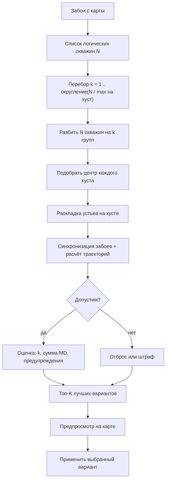
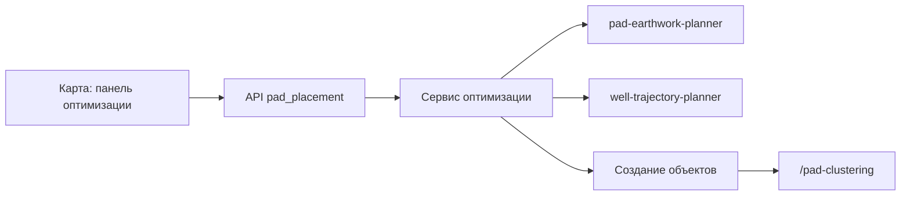

# Оптимизация размещения кустов

> **Статус:** ✅ реализовано (M1–M5, июнь 2026).  
> **См. также:** [Траектории и «Кустование»](../well-trajectory/well-trajectory.md) (работа на одном кусте), [земляные работы куста](../pad-earthwork/pad-earthwork.md) (генератор раскладки устьев), [автосеть](../../autoroad/autoroad-network-plan.md) (похожий сценарий: запрос → расчёт → предпросмотр → применение с карты).

## Зачем нужна функция

На карте уже есть **забои** (точки целей бурения), а **кустов ещё нет** или нужен новый набор площадок. Система должна подсказать:

1. **Сколько** новых кустовых площадок нужно.
2. **Где** их поставить на местности.
3. Как **распределить скважины** по кустам так, чтобы суммарная **измеренная глубина (MD)** стволов была как можно меньше.

Режим работы — **«с нуля» (greenfield)**: создаются только **новые** кусты; уже нарисованные на карте площадки **не трогаем**.

**Не путать** с формулой «число кустов» в матрице точки интереса (`pads_count = округление вверх(скважины ÷ скважин на КП)`) — там считается только **стоимость**, без координат на карте ([calculation-functions.md](../../calculations/calculation-functions.md), §5).

---

## Термины

| Термин | Что это значит |
|--------|----------------|
| **Логическая скважина** | Одна единица в расчёте: одна точка ННБ **или** пара ГС (Т1 + Т3) |
| **Объект-забой** | Точка на карте: ННБ, Т1 ГС или Т3 ГС |
| **Куст-кандидат** | Предварительная площадка с центром, раскладкой устьев и назначенными скважинами (ещё не сохранена в базе) |
| **Вариант** | Полный набор кустов-кандидатов + привязка скважин + показатели (число кустов, сумма MD) |
| **Greenfield («с нуля»)** | Только **новые** кусты; существующие неперемещаемы и не изменяются |
| **Применить (apply)** | Записать выбранный вариант в базу: создать кусты, привязать забои, сохранить раскладку и траектории |
| **«Кустование»** | Страница `/pad-clustering` — доработка **одного** уже созданного куста (раскладка, траектории, SF) |

### Скважины и точки на карте — не одно и то же

| Что нарисовано на карте | Сколько скважин в расчёте |
|-------------------------|---------------------------|
| 2 забоя ННБ | 2 |
| 1 ГС (Т1 + Т3) | 1 |
| 2 ННБ + 1 ГС (Т1 + Т3) | **4 точки** на карте → **3 скважины** |

Правила группировки — как в [`bottomhole_sync.py`](../../decision-matrix/backend/app/services/well_trajectory/bottomhole_sync.py): Т3 ГС наследует номер скважины (`well_index`) у Т1.

---

## Сценарий пользователя

**Исходные данные:** на карте проекта есть забои (ННБ и/или ГС), с кустами они связаны или ещё нет.

**Действия:**

1. Выделить нужные забои на карте.
2. Открыть панель **«Оптимизация кустов»**.
3. Задать ограничения: максимум скважин на куст, шаги раскладки, минимальное расстояние между кустами.
4. Нажать **«Рассчитать»**.

**Результат:**

1. Таблица **вариантов** от лучшего к худшему: число кустов, сумма MD, предупреждения.
2. **Предпросмотр** на карте: контуры площадок, устья, траектории в плане.
3. **«Применить»** — на карте появляются новые кусты, забои перепривязаны.
4. Переход в **«Кустование»** (`/pad-clustering?padId=…`) — DEM, SF, финальная доработка.

---

## Как сравниваются варианты

Сначала по одному критерию, потом по следующему (лексикографическое сравнение):

| Приоритет | Критерий | Пояснение |
|-----------|----------|-----------|
| 1 | **Меньше кустов** | Главная цель — минимум площадок |
| 2 | **Меньше сумма MD** | Сумма измеренных глубин по всем скважинам варианта |
| 3 *(M5)* | **SF** | Меньше нарушений порога SF; выше min SF |

### Откуда берётся MD для каждой скважины

| Порядок | Источник |
|---------|----------|
| 1 | **MD** последней точки инклинометрии после успешного design (`design_well_from_target`: NNB → connector; ГС → `design_horizontal`) |
| 2 | Поле `md` в target траектории (если есть) |
| 3 | Fallback на **TVD** из логической скважины / карточки забоя — с предупреждением в варианте |
| 4 | Вариант **invalid**, если расчёт не удался и MD/TVD недоступны |

**Сумма MD** — по **логическим скважинам**, а не по числу точек-забоев на карте. TVD в карточке забоя по-прежнему нужен для **расчёта траектории**, но не для сортировки вариантов.

---

## Ограничения

### Обязательные (первая версия)

| № | Ограничение |
|---|-------------|
| C1 | На одном кусте не больше `max_wells_per_pad` скважин (по умолчанию — как `pad_well_count`) |
| C2 | Раскладка устьев — через генератор куста ([`pad_well_*`](../../decision-matrix/backend/app/services/pad_earthwork/properties.py): шаг, группы, отступы, азимут) |
| C3 | ГС: Т1 + Т3 = одна скважина, один номер `well_index` на кусте |
| C4 | **Greenfield:** существующие кусты не меняем; новые не ближе `min_pad_spacing_m` друг к другу и к уже стоящим кустам |
| C5 | Каждая выбранная скважина назначена **ровно одному** кусту |
| C6 | Для попадания в рейтинг нужен успешный расчёт траектории до забоя; иначе вариант помечается как недопустимый |

### Желательные (фаза M5 и далее)

| № | Ограничение |
|---|-------------|
| S1 | Anti-collision (SF) внутри куста и между кустами — штраф или отсечение |
| S2 | Рельеф (DEM) для отметки устья (post-MVP) |
| S3 | Запретные зоны / границы лицензии (post-MVP) |

---

## Как работает расчёт (концепция)

### Шаг 1. Подготовка входа

- Взять выбранные объекты-забои из инфраструктуры проекта.
- Объединить Т3 ГС с Т1 в одну логическую скважину.
- Собрать список: профиль (ННБ/ГС), координаты TD, TVD, углы, связанные id забоев.

### Шаг 2. Перебор числа кустов

- Число кустов `k` — от 1 до «округление вверх(N ÷ max на куст)».
- Для каждого `k` — все способы разбить N скважин на k непустых групп (при N > 8 — эвристики: k-means, иерархическая кластеризация, жадный алгоритм).

### Шаг 3. Где поставить центр куста

**M2+ (реализовано):** для каждой группы скважин — **двухфазный** перебор центра вокруг **центроида TD**:

1. **Фаза 1 (грубо):** сетка кандидатов (до **5×5** точек), на каждой — раскладка + design с **укрупнённым** шагом перебора точки входа ГС; выбор позиции с минимальной Σ MD.
2. **Фаза 2 (точно):** полный design только для **лучшего** центра из фазы 1.

Legacy-эвристика (центроид + сдвиг к устью) остаётся дополнительной seed-точкой в сетке.

| Параметр | По умолч. | Описание |
|----------|-----------|----------|
| `center_optimize` | `true` | Включить перебор центра |
| `center_search_radius_m` | 400 | Окно поиска, м |
| `center_search_step_m` | 200 | Шаг сетки, м (автоувеличение при >5×5 точек) |
| `gs_entry_search_step_m` | `null` | Явный шаг перебора точки входа ГС; `null` — **адаптивный** (длина ГС ÷ 10 на финальном этапе, ÷ 4 на грубом) |

В UI — блок **«Расширенные»** в панели «Оптимизация кустов».

### Шаг 4. Раскладка и траектории (переиспользуем существующий код)

Для каждого куста-кандидата **в памяти** (в базу не пишем до «Применить»):

1. Генератор раскладки устьев — [`pad_wells_bootstrap.py`](../../decision-matrix/backend/app/services/well_trajectory/pad_wells_bootstrap.py).
2. Заготовки траекторий из раскладки.
3. Привязка забоев — `sync-bottomholes` (координаты `end_longitude` / `end_latitude` для ГС).
4. Полный расчёт траекторий — [`design_well_from_target`](../../decision-matrix/backend/app/services/well_trajectory/design_bottomholes.py) через [`well-trajectory-planner`](../../well-trajectory-planner/):
   - **ННБ** — connector до TD;
   - **ГС** — горизонтальный design (`design_horizontal`), режим точки входа из карточки забоя (`any` / `Т1` / `Т3`).

**Отличие от «Кустования» на одном кусте:** при pad placement **не** вызывается SF на каждом offset точки входа ГС (`entry_clearance=false`) — иначе расчёт для 8+ ГС занимает минуты. Проверка SF — **один раз на вариант** при `sf_check=true` ([`sf_score.py`](../../decision-matrix/backend/app/services/pad_placement/sf_score.py)). После «Применить» на кусте доступен полный перебор с SF в «Кустовании».

### Шаг 5. Отбор лучших

- Посчитать: число кустов, сумма MD, список предупреждений.
- Отсеять нарушения C1–C6.
- Отсортировать по приоритетам; вернуть **топ-K** (по умолчанию K = 5) для предпросмотра.

### Долгий расчёт

| Условие | Поведение |
|---------|-----------|
| N **≤ 8** логических скважин и ≤ **100** комбинаций разбиения | Синхронный `POST compute` (ответ в том же HTTP-запросе) |
| N **> 8** или > **100** комбинаций | Рекомендуется `POST compute?async=true` → ARQ, [`project_jobs`](../jobs/task-log-panel.md) |
| Таймаут HTTP (frontend / BFF) | **600 с** для `compute` и `apply` (`PAD_PLACEMENT_TIMEOUT_MS`, `WELL_TRAJECTORY_HTTP_TIMEOUT_SECONDS`) |

**Предпросмотр** `POST …/request` — только оценка входа (число скважин, допустимость sync); **не** запускает design.

### Производительность (июнь 2026)

| Узкое место | Оптимизация в коде |
|-------------|-------------------|
| SF на каждом offset точки входа ГС | Отключено в pad placement; SF только при `sf_check` |
| Полный design на каждой точке сетки центра | Двухфазный поиск: грубый перебор → один финальный design |
| Мелкий шаг перебора entry при длинной ГС | Адаптивный `gs_entry_search_step_m` (≈ длина ÷ 10) |
| Большая сетка центра | Потолок **5×5** точек; шаг сетки автоувеличивается |

**Ручное ускорение:** выключить «Оптимизировать положение куста»; на забоях ГС задать точку входа **Т1** или **Т3** вместо «Любая»; увеличить `center_search_step_m`; отключить `sf_check`.

---

## Интерфейс на карте

| Элемент | Описание |
|---------|----------|
| Кнопка / режим | «Кусты» / «Оптимизация кустов» на `/map` (рядом с «Сеть», «Забой») |
| Выбор | Несколько забоев: клик, рамка, «Видимые» или список в панели |
| Панель | Макс. скважин на куст, мин. расстояние между кустами, шаг design, тип куста, проверка SF |
| **Расширенные** | Оптимизация центра по Σ MD (`center_optimize`), радиус и шаг сетки перебора |
| Таблица | Варианты: №, кустов, Σ MD, min SF, предупреждения |
| Предпросмотр | Контуры, устья, траектории; переключение варианта |
| Кнопки | «Рассчитать», «Применить», «Открыть в Кустовании» |

**Права:** расчёт и применение — `write_infra`; просмотр результата задачи — read на проект.

---

## API (BFF)

Префикс: `/api/v1/projects/{project_id}/pad-placement/…`

| Метод | Путь | Назначение |
|-------|------|------------|
| POST | `request` | Проверка входа, оценка числа вариантов, `sync_allowed` (быстро, без design) |
| POST | `compute` | Запуск расчёта; `?async=true` → 202 и `job_id` |
| GET | `compute/{request_id}` | Статус и список вариантов |
| POST | `apply` | Тело: `{ request_id, variant_index }` → создание объектов |
| GET | `preview/{request_id}/{variant_index}/geojson` | Слой для карты |

Структуры запросов и ответов — [pad-placement-optimization-data-model.md](../pad-placement/pad-placement-optimization-data-model.md).

Внутри worker переиспользуются: генератор куста, sync + design траекторий; с фазы M5 — опционально clearance для оценки SF.

---

## Что происходит при «Применить»

Существующие кусты **не изменяются**.

**Для каждого куста в выбранном варианте создаётся:**

- Объект инфраструктуры `oil_pad` или `gas_pad` (тип — по настройке проекта или выбору пользователя).
- Свойства: раскладка устьев, контур площадки, число скважин, отступы, траектории после design, отметка устья по умолчанию.
- Обновление забоев: `well_bottomhole_linked_pad_id`, `well_bottomhole_well_index`.

Дальше — **«Кустование»** для SF, DEM и правок.

---

## Связь с другими модулями

| Модуль | Роль |
|--------|------|
| [`placement_optimize.py`](../../decision-matrix/backend/app/services/pad_placement/placement_optimize.py) | M2+ двухфазный перебор XY центра куста по Σ MD |
| [`trajectory_design.py`](../../decision-matrix/backend/app/services/pad_placement/trajectory_design.py) | Адаптивный шаг перебора точки входа ГС (`coarse` / `full`) |
| [pad-earthwork-planner](../../pad-earthwork-planner/) | Контур куста, координаты устьев, габариты |
| [well-trajectory-planner](../../well-trajectory-planner/) | Горизонтальный участок, инклинометрия, TVD |
| [well_trajectory BFF](../../decision-matrix/backend/app/api/v1/well_trajectory.py) | Образец оркестрации и фоновых задач |
| [PadClusteringPage](../../decision-matrix/frontend/src/pages/padClustering/PadClusteringPage.tsx) | Инженерная доработка после применения |

---

## Что не входит в первую версию

- Перестановка или доработка **уже существующих** кустов.
- Автосвязка с параметрами POI (`wells_per_pad`, добыча на скважину).
- Импорт CSV / WITSML.
- Ортогональная сетка месторождения, рельеф для KB (кроме заметок post-MVP).
- Изменение координат забоев — меняем только положение кустов и устьев.

---

## Связанные документы

- [План реализации](../pad-placement/pad-placement-optimization-plan.md) — фазы D0–M5.
- [Модель данных](../pad-placement/pad-placement-optimization-data-model.md) — JSON-схемы.
- [Инструкция для пользователя](../../wiki/articles/pad-placement-optimization.md).

---

## История изменений

| Дата | Изменение |
|------|-----------|
| 2026-06 | v1: первая спецификация (greenfield, вход — забои) |
| 2026-06 | v1.1: переписано простым русским языком |
| 2026-06 | v1.2: M2+ — перебор центра куста (`center_optimize`, `center_search_*`), критерий Σ MD |
| 2026-06 | v1.3: горизонтальный design ГС в evaluate; sync `end_lon/lat`; таймаут compute/apply **600 с**; двухфазный поиск центра; адаптивный шаг entry; SF только при `sf_check` |
