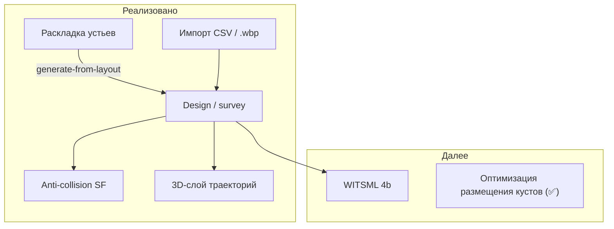
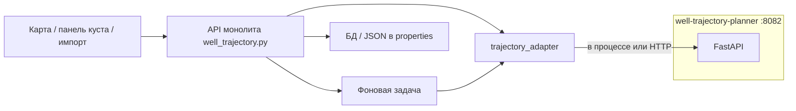

# Траектории скважин (3D)

> **Статус:** **фаза 1 завершена**; **фаза 2 ~85 %**; **фаза 3 (anti-collision SF) ✅** — BFF clearance, project-wide пары, UI «Рассчитать SF», подсветка на 3D.

Функция для **кустовых площадок** (`oil_pad`, `gas_pad`): все данные и расчёты привязаны к объекту **куста** на карте.

**Расчётный модуль:** [`well-trajectory-planner`](../../well-trajectory-planner/) на базе [welleng](https://github.com/jonnymaserati/welleng) и [PyWellGeo](https://github.com/TNO/pywellgeo). Техническое описание сервиса — [MICROSERVICE.md](../../well-trajectory-planner/docs/MICROSERVICE.md).

**Связано с:** [земляные работы куста](pad-earthwork.md) (раскладка устьев на плане), [3D-карта](map-3d-features.md), [каталог параметров](../product/input-parameters.md), **[оценка текущего приложения](../planning/well-trajectory-app-assessment.md)**, **[оптимизация размещения кустов](pad-placement-optimization.md)** (✅ — проектный расчёт координат кустов по забоям; отличие от per-pad «Кустование» ниже).

> **Термин «Кустование»** в UI (`/pad-clustering`) — инженерная работа **на одном выбранном кусте** (раскладка, KB, траектории, SF). **Оптимизация размещения** — отдельная функция: **сколько и где** ставить новые кусты по забоям на карте.

---

## Что умеет приложение сейчас и чего не хватает

> **Подробная оценка всех настроек, defaults и пробелов:** [well-trajectory-app-assessment.md](../planning/well-trajectory-app-assessment.md).

### Уже реализовано

| Область | Что есть |
|---------|----------|
| **Раскладка устьев на кусте** | `pad_well_count`, `pad_wells_local_json`, генератор схемы — план, без глубины ([pad-earthwork.md](pad-earthwork.md)) |
| **Страница «Кустование»** | `/pad-clustering`: раскладка, KB, вкладки «Куст» / **«Расчёт»**, 3D со стволами |
| **BFF well-trajectory** | `generate-from-layout`, `sync-bottomholes`, `design-from-bottomholes`, `GET last`, GeoJSON (куст + проект) |
| **Забои на карте** | `well_bottomhole_*`, рисование ННБ/ГС, привязка к кусту, sequential `well_index` |
| **2D / 3D слои** | GeoJSON на `/map`: plan line, маркеры забоев, траектории; 3D — `MapView3D` |
| **Настройки welleng на кусте** | 7 параметров на вкладке «Расчёт» — [таблица §4.5](../planning/well-trajectory-app-assessment.md#45-настройки-расчёта-welleng--pywellgeo-вкладка-расчёт) |
| **Удаление забоя** | Batch delete → resync куста, сброс target/survey; invalidate GeoJSON |
| **Карточка забоя** | «Основное» + **«Геометрия»** (X/Y/Z, длина ГС, копирование координат) + «3D»; вкладка «Логистика» скрыта |
| **ГС: точка входа** | Режимы `any` / `heel` / `toe` на пятке ГС; при `any` — min MD + учёт SF vs другие скважины куста |
| **ГС: dual TVD** | Отдельные TVD пятки и стока (`heel_tvd_m` / `toe_tvd_m`); Z в геометрии ↔ TVD в параметрах |
| **PyWellGeo** | Авто-метаданные `geometry.*` после расчёта |
| **Anti-collision (SF)** | `POST clearance` (куст / проект), таблица пар, `min_sf` на скважине, подсветка 3D |
| **Импорт инклинометрии (M4a)** | CSV + Landmark `.wbp` на **Данные → Импорт** (`/data/import`), карточка «Импорт инклинометрии»; preview/commit; async job `well_trajectory_import` при &gt;20 скв.; WITSML → 501 |
| **3D в модалке «Схема…»** | DEM и призма — **без стволов** (стволы — «Кустование» и `/map`) |
| **`well_trajectory_default_tvd_m`** | Fallback TVD при design, если у забоя нет `well_bottomhole_tvd_m` |
| **`step_m` из настроек куста** | `readWellTrajectoryStepM` — карточка куста/забоя и «Кустование» |
| **Prompt «пересчитать траектории?»** | При сохранении sketch / генерации раскладки, если траектории уже есть |
| **E2E Playwright** | `e2e/well-trajectory.spec.ts` — API + UI «Кустование» |

### Планируется / пробелы

- WITSML 1.4/2.0 (фаза 4b) — [ADR draft](../planning/well-trajectory-witsml-adr.md)
- Настройки на уровне проекта (`projects.settings.well_trajectory`)



---

## Как устроено в коде (план)



- **Микросервис** — математика траекторий (welleng).
- **Монолит** — API для фронтенда, права доступа, сохранение данных.
- **По умолчанию** пакет встроен в образ API (`well-trajectory-vendor`). Отдельный контейнер на порту 8082 — для разработки или если PyWellGeo вынесен из-за лицензии GPL.

---

## Сценарии для пользователя

### 1. Сгенерировать траектории из раскладки куста

1. На кусте настроены скважины и схема («Схема…» → генератор) — есть `pad_wells_local_json`.
2. На вкладке **Траектории** нажать «Сгенерировать из раскладки».
3. Система создаёт по одной вертикальной заготовке на каждое устье (координаты с плана + высота площадки).
4. Линии траекторий появляются на 3D-карте (слой «Траектории скважин»).

### 2. Спроектировать наклонно-направленную скважину

1. Выбрать скважину в списке на кусте.
2. Задать цель: координаты и глубина забоя, углы на забое (форма в панели **или** клик на карте — см. сценарий 2a).
3. Запрос на проектирование → welleng строит траекторию → таблица MD/inc/azi и превью на 3D.

### 2a. Расставить забои на карте (объекты инфраструктуры)

1. На кусте есть раскладка устьев (`pad_wells_local_json`) и заготовки траекторий (сценарий 1).
2. На **2D-карте** в панели рисования выбрать **«Забой»** → **ННБ** (один клик) или **ГС** (линия heel→toe; legacy — два клика heel + toe).
3. Объекты `well_bottomhole_nnb` / `well_bottomhole_gs` (unified) / `well_bottomhole_gs_heel` / `well_bottomhole_gs_toe` привязываются к ближайшему кусту (`linked_pad_id`); скважина — явно или auto по ближайшему устью.
4. В карточке объекта-забоя: куст, **геометрия** (координаты X/Y, отметка Z), TVD / inc / azi; для ГС — **точка входа** (`Любая` / `heel` / `toe`), отдельные TVD пятки и стока; кнопка «Пересчитать траекторию с куста». Вкладки **«Основное»**, **«Геометрия»** и **«3D»** — без «Логистики».
5. На вкладке **Траектории** куста — список привязанных объектов-забоев; **«Рассчитать до забоев»** → `sync-bottomholes` + `design-from-bottomholes`.
6. Пунктир устье–забой на карте до полного проектирования (`bottomhole_plan_line` в GeoJSON).
7. Дальше — сценарий 3 (расчёт SF).

### 2b. Горизонтальный участок ГС (heel → toe)

Профиль `gs` в `design-from-bottomholes` строит траекторию в три логических сегмента (welleng connector):

1. **Build** — от устья до **точки входа** на линии пятка–сток.
2. **Hold** — горизонтальный участок вдоль оси ГС до дальнего конца (или два hold при входе между пяткой и стоком: entry→toe→heel).

**Точка входа** (`well_bottomhole_gs_entry_mode` на пятке / unified ГС):

| Режим | Поведение |
|-------|-----------|
| `heel` | Вход у пятки; hold пятка → сток |
| `toe` | Вход у стока; hold сток → пятка |
| `any` (по умолчанию) | Перебор точек вдоль пятка–сток с шагом `well_trajectory_gs_entry_search_step_m`; выбирается **минимальная MD** среди вариантов с SF ≥ порога относительно **других скважин куста**; если все нарушают SF — min MD + предупреждение |

При разных TVD пятки и стока hold следует наклону (интерполяция TVD и inc вдоль линии).

Расчёт выполняется в фоне потока (`asyncio.to_thread`), чтобы не блокировать API (в т.ч. авторизацию) при длительном переборе.

Код: `well-trajectory-planner/src/well_trajectory/design.py`, оркестрация SF — `service.py` → `_design_horizontal_any_with_clearance`.

### 2c. Конкурентность расчётов на кусте

| Операция | Модель | Поведение при параллельных запросах |
|----------|--------|--------------------------------------|
| `POST .../design-from-bottomholes` | Синхронный HTTP | **Нет блокировки** на уровне куста/проекта. Два пользователя на одном кусте → **last-write-wins** в `pad_wells_trajectories_json` (кто последний сохранил — тот результат). Режим `any` + SF читает `peer_wells` из snapshot на начало запроса — при гонке возможны расхождения SF между сессиями. |
| `POST .../clearance` (≤12 скв.) | Синхронный HTTP | Та же модель: перезапись JSON без merge. |
| `POST .../clearance` (>12 скв.), `well_trajectory_import` | Фоновая `ProjectJob` | **409 Conflict**, если у проекта уже есть active job ([project_jobs.py](../../decision-matrix/backend/app/services/project_jobs.py)). Разные проекты — независимо (worker `max_jobs = 4`). |
| Разные кусты одного проекта | Независимые объекты | Параллельно допустимо; гонка только при записи в **один** `oil_pad` / `gas_pad`. |

**Event loop:** тяжёлый sync-расчёт (`design-from-bottomholes`, перебор `any`) выполняется в `asyncio.to_thread`, чтобы не блокировать auth и другие запросы на том же worker.

**Roadmap (не MVP):** pad-level lock или постановка design/clearance в очередь `ProjectJob` — см. [well-trajectory-app-assessment.md](../planning/well-trajectory-app-assessment.md).

### 3. Проверить столкновения на кусте

1. У всех скважин заданы забои и спроектированы траектории (сценарии 1, 2a, «Спроектировать до забоев»).
2. «Рассчитать безопасные расстояния» для всех скважин куста.
2. Таблица пар: минимальный SF; если SF &lt; 1,0 — предупреждение.
3. На 3D-карте подсветить проблемные пары.

### 4. Импортировать инклинометрию из CSV

1. Раздел **Импорт** → блок «Импорт инклинометрии».
2. Выбрать куст (`oil_pad` / `gas_pad`).
3. Загрузить CSV с колонками `well_name`, `md`, `inc`, `azi` (шаблон — кнопка «Скачать шаблон CSV»).
4. Preview показывает сопоставление скважин; «Импортировать на куст» записывает `survey.source=imported` и обновляет 3D.

### 5. Импорт Landmark `.wbp`

1. Карточка **«Импорт инклинометрии»** на `/data/import` — файл `.wbp`.
2. Preview + commit; при &gt;20 скважин — фоновая задача `well_trajectory_import`.

### 6. WITSML

- `POST .../import/witsml` → **501** («фаза 4b»). Используйте CSV или `.wbp`.

### 7. Изменили раскладку на схеме куста

После правки `pad_wells_local_json` система спросит: «Пересчитать траектории?»

---

## Интерфейс

### Вкладка «Траектории» на кусте

Отдельная страница **«Кустование»** в навигации (`/pad-clustering`):

| Вкладка | Содержимое |
|---------|------------|
| **Куст** | Раскладка, KB, генератор контура, pipeline траектории (заготовки → синхр. забоев → расчёт) |
| **Расчёт** | Параметры **welleng** (шаг survey, azimuth, error model, TVD, inc heel, SF) и **pad-earthwork** (envelope, DEM) — [§4.5 assessment](../planning/well-trajectory-app-assessment.md#45-настройки-расчёта-welleng--pywellgeo-вкладка-расчёт) |

Для `oil_pad` / `gas_pad` также доступны карточка на карте и модалка «Схема…»:

| Элемент | Действие |
|---------|----------|
| Список скважин | №, имя, тип, **забой ✓/—**, минимальный SF |
| «Сгенерировать из раскладки» | Заготовки из текущей схемы |
| **«Рассчитать до забоев»** | `design-from-bottomholes` для всех привязанных объектов-забоев |
| Список объектов-забоев | Связанные `well_bottomhole_*` или «создайте на карте» |
| «Импорт инклинометрии» | Загрузка CSV |
| «Рассчитать SF» | До 12 скважин — сразу; больше — в фоне |
| Редактор одной скважины | Цель бурения (форма) → API `design` |

### 2D-карта (фаза 2)

| Элемент | Описание |
|---------|----------|
| Слой «Забои скважин» | Маркеры `well_bottomhole_*` + GeoJSON `bottomhole_target` |
| Инструмент «Забой» | ННБ (1 клик) / ГС (heel + toe); preview линии heel–toe |
| Пунктир устье–забой | `bottomhole_plan_line` до `design-from-bottomholes` |

### 3D-карта

| Элемент | Описание |
|---------|----------|
| Слой «Траектории скважин» | Линия по каждому стволу; вкл/выкл в «Слои» |
| Цвет | **По SF:** красный если `min_sf` &lt; порога, зелёный если OK; без SF — синий |
| Клик по линии | Панель: MD, inc, azi у ближайшей станции |
| Клик по маркеру забоя | Панель: TVD, inc/azi, «Спроектировать эту скважину» |

Формат GeoJSON — [модель данных §8](../planning/well-trajectory-data-model.md).

### 2D-карта (дополнительно, фаза 2+)

Проекция стволов на план вместе с контуром куста (если не покрыто слоем забоев).

### Страница импорта

Расширение `/data/import` или отдельный `/import-wells`: пакетный CSV; позже — `.wbp`, EDM, WITSML.

Импорт **Искра/Spark** траекторий **не содержит** — только контуры кустов.

---

## API монолита (BFF)

**Слой сервисов** (июнь 2026, compliance P2+): `app/services/well_trajectory/` — публичный API в `service.py`; оркестрация в `design_bottomholes.py`, `layout_ops.py`, …; **HTTP** — `api_handlers.py` (тонкие роуты в `api/v1/well_trajectory.py`, ≤15 строк на handler).

**На уровне проекта:**

`/api/v1/projects/{project_id}/well-trajectory/`

| Метод | Путь | Описание |
|-------|------|----------|
| GET | `geojson` | Все траектории всех кустов проекта |
| POST | `clearance` | Anti-collision **по всему проекту** (межкустовые пары); sync ≤12 скв. |

**На уровне куста:**

`/api/v1/projects/{project_id}/infrastructure/objects/{object_id}/well-trajectory/`

| Метод | Путь | Описание |
|-------|------|----------|
| GET | `last` | Последние траектории + `clearance_pairs`, `clearance_computed_at`, `settings` |
| POST | `design` | Спроектировать траекторию одной скважины |
| POST | `sync-bottomholes` | Материализовать `target` из объектов `well_bottomhole_*` |
| POST | `design-from-bottomholes` | Sync + design (NNB connector / ГС horizontal с точкой входа) |
| PATCH | `targets` | Сохранить забои (`target` по `well_index`; legacy API) |
| POST | `design-all` | Спроектировать все скважины с заполненным `target` |
| PATCH | `survey` | Сохранить или обновить станции |
| POST | `compute` | Полный пересчёт (интерполяция + кэш) |
| POST | `clearance` | Anti-collision **внутри куста** (sync ≤12 скв. или ARQ) |
| POST | `generate-from-layout` | Из раскладки куста |
| POST | `import/csv` | Импорт CSV |
| POST | `import/witsml` | Импорт WITSML / `.wbp` (фаза 4) |
| GET | `geojson` | Данные для слоя на 3D-карте |

**Права:** analyst и admin могут менять; viewer — только чтение (`last`, `geojson`).

### Пример: сохранение забоя после клика на карте

`PATCH .../well-trajectory/targets`

```json
{
  "targets": [
    {
      "well_index": 0,
      "target": {
        "source": "manual_map",
        "plan": { "east_m": 800, "north_m": 500 },
        "lon": 37.625,
        "lat": 55.762,
        "tvd_m": 2500,
        "inc": 360,
        "azi": 270
      }
    }
  ]
}
```

### Пример запроса проектирования

```json
{
  "well_index": 0,
  "end": {
    "northing": 500,
    "easting": 800,
    "tvd": 2500,
    "inc": 360,
    "azi": 270
  },
  "step_m": 30
}
```

---

## Что хранится в базе (MVP)

Ключи в `properties` куста — [input-parameters.md](../product/input-parameters.md). Полная таблица welleng / PyWellGeo — [assessment §4.5](../planning/well-trajectory-app-assessment.md#45-настройки-расчёта-welleng--pywellgeo-вкладка-расчёт).

| Ключ | Назначение |
|------|------------|
| `pad_wells_trajectories_json` | Массив траекторий по индексу скважины |
| `well_trajectory_computed_at` | Время последнего расчёта |
| `well_trajectory_step_m` | Шаг survey (welleng) |
| `well_trajectory_azi_reference` | Система азимута: `grid` / `magnetic` / `true` |
| `well_trajectory_error_model` | Модель погрешностей ISCWSA |
| `well_trajectory_stub_tvd_m` | TVD вертикальной заготовки |
| `well_trajectory_default_tvd_m` | TVD забоя по умолчанию; fallback при `design-from-bottomholes`, если у забоя нет TVD |
| `well_trajectory_inc_heel` | Inc на heel для ГС |
| `well_trajectory_gs_entry_search_step_m` | Шаг перебора точки входа ГС при режиме `any`, м (default 30) |
| `well_trajectory_sf_warning_threshold` | Порог предупреждения SF; также фильтр кандидатов при `any` |
| `well_trajectory_clearance_pairs_json` | Массив пар SF, где участвует скважина этого куста |
| `well_trajectory_clearance_computed_at` | Время последнего расчёта SF |

В каждом элементе `pad_wells_trajectories_json[i]` после clearance:

| Поле | Назначение |
|------|------------|
| `clearance.min_sf` | Минимальный SF по всем парам проекта с этой скважиной |
| `clearance.computed_at` | ISO datetime расчёта |

**Properties объектов-забоев** (см. [input-parameters.md](../product/input-parameters.md)): `well_bottomhole_gs_entry_mode`, `well_bottomhole_heel_tvd_m`, `well_bottomhole_toe_tvd_m`.

После `design-from-bottomholes` для ГС в `design` скважины: `gs_entry_mode`, `gs_entry_offset_m` (смещение от пятки, м), опц. `gs_entry_plan`.

Настройки проекта (`projects.settings.well_trajectory`) **не используются** — дублируют per-pad keys; в roadmap.

---

## Связь с земляными работами куста

| Поле куста | Использование в траекториях |
|------------|----------------------------|
| `pad_wells_local_json[i]` | Координаты устья, индекс = `well_index` |
| `pad_well_count` | Ожидаемое число скважин на кусте |
| `pad_rotation_deg` | Поворот local ENU → карта |
| `pad_reference_elevation_m`, `pad_height_m` | Высота устья KB |
| `pad_dem_*` | Уточнение отметки поверхности |

При сохранении схемы (`PATCH pad-earthwork/sketch`) — флаг `sync_trajectories: true` для пересчёта траекторий куста.

---

## Эндпоинты микросервиса (кратко)

| Путь | Назначение |
|------|------------|
| `GET /health`, `/ready` | Проверки живости |
| `POST /v1/design/connector` | Проектирование |
| `POST /v1/design/horizontal` | ГС: build + hold, режимы `any` / `heel` / `toe` |
| `POST /v1/survey/interpolate` | Уплотнение survey |
| `POST /v1/clearance/pairs` | Матрица SF |
| `POST /v1/import/csv` | CSV |
| `POST /v1/import/witsml` | WITSML / заглушка |
| `POST /v1/pad/generate-from-layout` | Из раскладки куста |

Подробности — [MICROSERVICE.md](../../well-trajectory-planner/docs/MICROSERVICE.md).

---

## Настройки окружения

```env
WELL_TRAJECTORY_INPROCESS=true
# WELL_TRAJECTORY_SERVICE_URL=http://127.0.0.1:8082
# WELL_TRAJECTORY_SF_THRESHOLD=1.0
# WELL_TRAJECTORY_DEFAULT_ERROR_MODEL=ISCWSA MWD Rev5.11
```

---

## Ограничения

- Расчёты **планировочные** — перед принятием решений нужна независимая экспертиза (см. disclaimer welleng).
- PyWellGeo — лицензия **GPLv3**; см. [MICROSERVICE.md](../../well-trajectory-planner/docs/MICROSERVICE.md).
- Mesh anti-collision — опционально, требует доп. библиотек в Docker.
- Полный WITSML — фаза 4b.
- В первой версии **нет**: крутящий момент и сопротивление, гидравлика, конструкция обсадных колонн.

---

## Фоновые задачи

| Тип задачи | Когда |
|------------|-------|
| `well_trajectory_compute` | SF по проекту или кусту (`object_id` в payload); импорт &gt;20 скв. — фаза 4 |

Статус — в журнале задач проекта (как у «анализ всего»).

---

## Документы

| Тема | Файл |
|------|------|
| **Оценка текущего приложения** | [well-trajectory-app-assessment.md](../planning/well-trajectory-app-assessment.md) |
| Модель данных | [well-trajectory-data-model.md](../planning/well-trajectory-data-model.md) |
| План работ | [well-trajectory-roadmap.md](../planning/well-trajectory-roadmap.md) |
| **План реализации (код)** | [well-trajectory-implementation-plan.md](../planning/well-trajectory-implementation-plan.md) |
| Микросервис | [MICROSERVICE.md](../../well-trajectory-planner/docs/MICROSERVICE.md) |
| Земляные работы | [pad-earthwork.md](pad-earthwork.md) |
| 3D-карта | [map-3d-features.md](map-3d-features.md) |
| Статус в коде | [implementation-status.md](../planning/implementation-status.md) |
