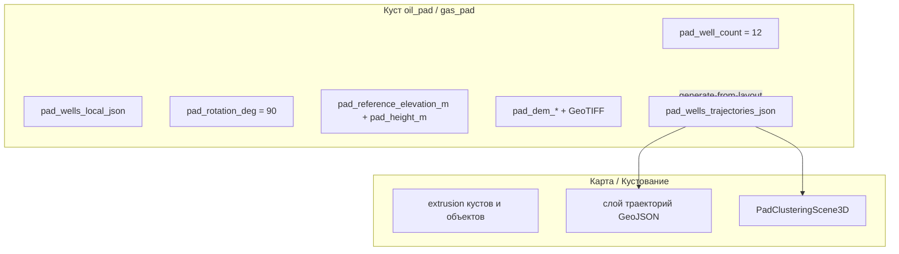

# Оценка текущего приложения для расчёта траекторий скважин

> **Статус:** актуально на **июнь 2026** — **M1 ✅**; **M2 ✅**; **M3 ✅** (anti-collision SF). Таблица параметров welleng / PyWellGeo — §4.5.  
> **См. также:** [well-trajectory.md](well-trajectory.md), [well-trajectory-data-model.md](well-trajectory-data-model.md), [well-trajectory-roadmap.md](well-trajectory-roadmap.md), [input-parameters.md](../../product/input-parameters.md), [pad-earthwork.md](../pad-earthwork/pad-earthwork.md), [pad-placement-optimization.md](../pad-placement/pad-placement-optimization.md) (✅).

**Ориентир данных:** все расчёты траекторий привязаны к объекту **куста** (`oil_pad`, `gas_pad`) на карте.

---

## 1. Зачем этот документ

Здесь собрана **оценка того, что приложение уже умеет и какие настройки хранит** на уровне куста:

- какие параметры куста можно **переиспользовать** без доработок;
- каких данных **не хватает** для расчёта welleng / PyWellGeo;
- что нужно **добавить** в UI, БД и `.env`.

Это **снимок текущих возможностей** перед стартом микросервиса, не ТЗ на реализацию.

---

## 2. Краткий вывод

| Критерий | Оценка |
|----------|--------|
| Раскладка устьев на плане куста | **Есть** — 2D, пригодно как вход для устья |
| Число скважин на кусте (`pad_well_count`) | **Есть** — default 12 |
| Вертикальные заготовки + design до забоев | **Есть** — BFF + «Кустование» + карточка куста |
| Настройки welleng на кусте (вкладка «Расчёт») | **Есть** — 8 параметров, см. §4.5 |
| Трёхмерная траектория (полный inc/azi профиль) | **Есть** — после `design-from-bottomholes` |
| Забои как объекты инфраструктуры | **Есть** — `well_bottomhole_*`, sync + design |
| 2D/3D отображение траекторий на `/map` | **Есть** — GeoJSON project-wide |
| 3D-превью на «Кустовании» | **Есть** — `PadClusteringScene3D` |
| Anti-collision (SF) в UI | **Да** — кнопка «Рассчитать SF», таблица пар, цвет на 3D |
| Импорт инклинометрии / WITSML | **Нет** |
| Инфраструктура микросервиса (adapter, vendor, BFF) | **Есть** — in-process `well-trajectory-vendor` |

**Итог:** для MVP траекторий опираемся на раскладку устьев, KB, DEM и **настройки расчёта на кусте** (§4.5). Пробелы: WITSML import (4b), `default_target_tvd_m` в design, `step_m` в карточках, настройки проекта на уровне проекта, E2E pad-placement. **Multi-pad placement optimizer** — ✅ [pad-placement-optimization.md](../pad-placement/pad-placement-optimization.md) (M1–M5 + M2+ center optimize), отдельно от per-pad «Кустование» и от POI `pads_count`.

---

## 3. Карта данных (только куст)

**Единственный источник скважин:** `infrastructure_objects` с подтипом `oil_pad` / `gas_pad`, свойства в `properties` (JSONB).

---

## 4. Настройки куста (раскладка и площадка)

Хранятся в `infrastructure_objects.properties`. Подтипы: **`oil_pad`**, **`gas_pad`**.

### 4.1 Скважины и генератор схемы

| Параметр | Ключ | По умолчанию | Где в UI | Для траекторий |
|----------|------|--------------|----------|----------------|
| Количество скважин | `pad_well_count` | **12** | Вкладка «Эксплуатация», модалка «Схема…» → «Генератор» | Число заготовок; источник истины по количеству скважин |
| Скважин в группе | `pad_wells_per_group` | **1** | то же | Расстановка в ряд на плане |
| Шаг в группе, м | `pad_well_spacing_m` | **9** | то же | Расстояние устьев |
| Шаг между группами, м | `pad_well_group_spacing_m` | **9** | то же | то же |
| Отступы контура | `pad_layout_margin_*_m` | **27 / 43 / 15 / 70** | Генератор | Контур площадки, не траектория |
| Азимут ряда (НДС), ° | `pad_rotation_deg` | **90** | Логистика, генератор, Параметры → Земляные работы | Поворот local ENU → карта; **не** grid/magnetic north для inc/azi |
| Позиции устьев | `pad_wells_local_json` | — | PATCH `sketch` | **`[{east_m, north_m}, …]`** — главный вход для координат устья |

**Код генератора:** `pad-earthwork-planner/src/pad_earthwork/well_layout.py`.

**API:** `POST .../pad-earthwork/sketch/generate`, `PATCH .../pad-earthwork/sketch`, `GET .../pad-earthwork/last`.

### 4.2 Габариты площадки и высота

| Параметр | Ключ | По умолчанию | Для траекторий |
|----------|------|--------------|----------------|
| Длина / ширина / высота насыпи, м | `pad_length_m`, `pad_width_m`, `pad_height_m` | **120 / 80 / 1** | Высота насыпи → KB устья |
| Опорная отметка подошвы, м | `pad_reference_elevation_m` | **0** | KB ≈ `reference + height` |
| Поворот footprint | `pad_rotation_deg` | **90** | см. §4.1 |

### 4.3 DEM (рельеф)

| Параметр | Ключ | Для траекторий |
|----------|------|----------------|
| ID записи DEM | `pad_dem_asset_id` | Уточнение отметки у устья |
| GeoTIFF | `{PAD_DEM_DATA_ROOT}/{project_id}/{id}.tif` | Поверхность в районе куста |
| Метаданные | `pad_dem_fetched_at`, `pad_dem_source`, `pad_dem_bbox_hash` | Контекст загрузки |

**Таблица БД:** `infra_object_pad_dem` (миграция `024`).

### 4.4 Поля properties, не относящиеся к траектории

| Ключ | Назначение | Для траекторий |
|------|------------|----------------|
| `pad_earthwork_profile_json` | Профиль площадки (plan view) | **Не использовать** — это не инклинометрия |
| `pad_earthwork_sketch_json` | Контур footprint | Связь по `well_index` с `pad_wells_local_json` |
| `pad_fill_volume_m3`, `pad_cut_volume_m3` | Кэш земляных работ | Не нужны |

**Код ключей:** `decision-matrix/backend/app/services/pad_earthwork/properties.py`.

### 4.5 Настройки расчёта welleng / PyWellGeo (вкладка «Расчёт»)

Страница **«Кустование»** (`/pad-clustering`) → вкладка **«Расчёт»**. Значения хранятся в `infrastructure_objects.properties` куста и читаются через `well_trajectory_settings_for_pad()` (`settings_store.py`). Сохранение — кнопка **«Сохранить»** на странице (вместе с параметрами куста).

**Код UI:** `PadClusteringCalculationPanel.tsx`, `padClusteringCalcSettings.ts`.  
**Код backend:** `app/services/well_trajectory/settings_store.py`, `service.py`.  
**Код planner:** `well-trajectory-planner/src/well_trajectory/design.py`, `pad_seed.py`, `pywellgeo_bridge.py`.

#### welleng — параметры в приложении

| Параметр (UI) | Ключ `properties` | Дефолт | UI | Сохраняется | Участвует в расчёте | Вызов welleng |
|---------------|-------------------|--------|----|-------------|---------------------|---------------|
| Шаг survey, м | `well_trajectory_step_m` | 30 | **Да** — «Расчёт» | **Да** | **Да** — `POST design-from-bottomholes`, `POST design` | `survey.from_connections(..., step=step_m)` |
| Азимут (`azi_reference`) | `well_trajectory_azi_reference` | `grid` | **Да** | **Да** | **Да** — заготовки + design | `SurveyHeader(azi_reference=…)`; значения: `grid` / `magnetic` / `true` |
| Модель погрешностей (`error_model`) | `well_trajectory_error_model` | `ISCWSA MWD Rev5.11` | **Да** | **Да** | **Да** — заготовки + `POST clearance` | `IscwsaClearance` через `error_model` в JSON скважины |
| TVD заготовки, м | `well_trajectory_stub_tvd_m` | 100 | **Да** | **Да** | **Да** — «Сгенерировать из раскладки» | Глубина вертикальной заготовки в `pad_seed.generate_from_pad_layout` |
| TVD забоя по умолч., м | `well_trajectory_default_tvd_m` | 1500 | **Да** | **Да** | **Нет** — в design fallback пока `DEFAULT_TVD_M` из `bottomhole_properties.py` | **Пробел:** нужно прокинуть в `target.tvd_m` при отсутствии TVD у забоя |
| Inc на Т1 (ГС), ° | `well_trajectory_inc_heel` | 90 | **Да** | **Да** | **Да** — профиль `gs` в `design-from-bottomholes` | `HorizontalDesignRequest.inc_heel` |
| Шаг поиска точки входа ГС, м | `well_trajectory_gs_entry_search_step_m` | 30 | **Да** — «Расчёт» | **Да** | **Да** — режим `any` | `HorizontalDesignRequest.entry_search_step_m` |
| DLS проектирования, °/30 м | `well_trajectory_dls_design` | 3 | **Да** — «Расчёт» | **Да** | **Да** — ННБ connector + ГС horizontal | `ConnectorDesignRequest.dls_design` / `HorizontalDesignRequest.dls_design` |
| Порог SF (anti-collision) | `well_trajectory_sf_warning_threshold` | 1.0 | **Да** | **Да** | **Да** — clearance + warnings + цвет 3D; **фильтр кандидатов при `any`** | Порог в `POST /v1/clearance/pairs`; per-pad |

**Другие места UI (без вкладки «Расчёт»):**

| Место | Параметр | Примечание |
|-------|----------|------------|
| Карточка забоя | `step_m` | Из настроек куста (`readWellTrajectoryStepM`) в `InfraBottomholeDetailSection` |
| Карточка забоя (ГС) | `gs_entry_mode` | `InfraBottomholeDetailSection`, «Кустование» — `any` / `Т1` / `Т3` |
| Карточка забоя | геометрия X/Y/Z | `InfraBottomholeGeometrySection` — unified ГС: Z Т1/Т3 ↔ dual TVD |

#### PyWellGeo — параметры в приложении

| Что | UI | Сохраняется | Участвует в расчёте | Примечание |
|-----|----|-------------|---------------------|------------|
| Пользовательские параметры | **Нет** | — | **Да** — постобработка | После каждого design / заготовки: `enrich_survey_geometry()` → `WellTreeTNO.from_xyz` |
| `geometry.length_m` | — | в `pad_wells_trajectories_json` | **Да** | Длина пути по дереву скважины |
| `geometry.md_max`, `geometry.tvd_max` | — | там же | **Да** | Экстремумы по станциям survey |

PyWellGeo **не имеет** отдельных полей в UI — только автоматический расчёт метаданных геометрии (`pywellgeo_bridge.py`).

#### pad-earthwork на той же вкладке «Расчёт» (не welleng)

| Параметр | Ключ | UI | Влияние |
|----------|------|----|---------|
| Оболочка (envelope) | `pad_envelope_enabled` | **Да** | Объёмы cut/fill, 3D на «Кустовании» |
| Ширина оболочки, м | `pad_envelope_wrap_width_m` | **Да** | То же; API требует `> 0` при сохранении sketch (нормализация до 3 м) |
| Рельеф DEM | `pad_dem_*` | read-only | 3D-сцена, preview рельефа |

#### welleng / PyWellGeo — есть в библиотеке, **нет** в UI приложения

| Возможность | Библиотека | Статус в Atlas Grid |
|-------------|------------|---------------------|
| Матрица SF (`iscwsa` / `mesh`) | welleng | **Да** — `POST clearance` (BFF) + UI «Рассчитать SF»; mesh — не в MVP |
| Магнитное поле / WMM | welleng | Нет |
| Импорт `.wbp`, EDM | welleng | Фаза 4 |
| Импорт CSV / WITSML | welleng | Фаза 4 |
| Параметры connector (DLS, тип J/S) | welleng | **Частично** — `dls_design` per-pad (default 3 °/30m); тип J/S не в UI |
| Multi-lateral / разветвления | PyWellGeo | **Частично** — coarsen, add_xyz lateral, YAML round-trip, забои куста; SF только по welleng survey |
| Per-well override `error_model` / `azi_reference` | welleng | Только в JSON скважины после генерации; отдельной формы нет |
| Настройки проекта `projects.settings.well_trajectory` | — | Нет — всё на уровне куста |

**Легенда колонки «Участвует в расчёте»:** **Да** — значение реально передаётся в planner при типовом сценарии; **Частично** — сохраняется или отдаётся клиенту, но не все сценарии его используют; **Нет** — только хранение / отображение.

---

## 5. Настройки проекта

| Параметр | Где | Сейчас | Для траекторий |
|----------|-----|--------|----------------|
| Настройки траекторий | `projects.settings.well_trajectory` | **Нет** | Дублируют §4.5; сейчас — **per-pad** keys в `properties` |
| Ставка за куст | `project_cost_rates`, `pads` | 200 000 тыс. ₽/шт. | Вне scope траекторий |

---

## 6. Переменные окружения backend

| Переменная | Есть | Для траекторий |
|------------|------|----------------|
| `PAD_EARTHWORK_INPROCESS` | да | Шаблон для `WELL_TRAJECTORY_INPROCESS` |
| `PAD_EARTHWORK_SERVICE_URL` | да | Шаблон для `WELL_TRAJECTORY_SERVICE_URL` |
| `OPENTOPOGRAPHY_API_KEY`, `PAD_DEM_DATA_ROOT` | да | DEM куста |
| `WELL_TRAJECTORY_*` | **да** (`config.py`, `.env.example`) | `WELL_TRAJECTORY_INPROCESS`, `WELL_TRAJECTORY_SERVICE_URL` |

---

## 7. API и UI (факт)

### 7.1 Работает сегодня (куст)

| Область | Эндпоинт / экран | Данные для траекторий |
|---------|-------------------|------------------------|
| Генератор схемы | `POST .../pad-earthwork/sketch/generate` | `wells_local`, контур |
| Сохранение схемы | `PATCH .../pad-earthwork/sketch` | `pad_wells_local_json` |
| Последние данные | `GET .../pad-earthwork/last` | params + wells_local |
| DEM | `dem/fetch`, `dem/preview` | Рельеф |
| Карточка куста | Панель объекта, модалка «Схема…» | Редактирование раскладки |
| 3D-карта | MapView3D | Куст extrusion + **слой траекторий** (GeoJSON) |
| Pad 3D | `PadEarthworkScene3D` | Призма + DEM — **без стволов** |
| Кустование 3D | `PadClusteringScene3D` | Устья, траектории, забои, envelope |
| Импорт | `/data/import`, Искра | Полигон/точка куста — **не survey** |

### 7.2 Реализовано для траекторий (фазы 2–3)

| Функция | Статус |
|---------|--------|
| `.../well-trajectory/*` | **Есть** — см. [well-trajectory.md](well-trajectory.md) |
| Страница «Кустование» + вкладка «Расчёт» | **Есть** — §4.5 |
| `pad_wells_trajectories_json` | **Есть** |
| Забои `well_bottomhole_*` + рисование на карте | **Есть** |
| `sync-bottomholes`, `design-from-bottomholes` | **Есть** |
| GeoJSON 2D/3D на `/map` | **Есть** |
| Resync траекторий при удалении забоя | **Есть** — `infra_delete.py` |
| 3D со стволами на «Кустовании» | **Есть** — `PadClusteringScene3D` |
| `POST clearance` + UI «Рассчитать SF» | **Есть** — куст + project-wide; ARQ при &gt;12 скв. |
| Подсветка траекторий по SF на 3D | **Есть** — MapView3D + PadClusteringScene3D |

### 7.3 Ещё не реализовано

| Функция | Статус |
|---------|--------|
| Импорт CSV инклинометрии на куст | Нет (фаза 4) |
| Таблицы `project_well`, `well_survey_station` | Нет |
| E2E well-trajectory | ✅ `e2e/well-trajectory.spec.ts` |

---

## 8. Сводка: нужно для расчёта vs есть на кусте

| Группа данных | Нужно | Есть | Оценка |
|---------------|-------|------|--------|
| Координаты устья | да | `pad_wells_local_json` + центр куста | **~70 %** |
| Высота KB | да | `pad_reference_elevation_m` + `pad_height_m` | **~50 %** |
| Число скважин | да | `pad_well_count`, длина `pad_wells_local_json` | **~80 %** |
| Азимут / привязка к северу | да | `pad_rotation_deg` — только ряд на плане | **~10 %** |
| Магнитное склонение, grid north | да | нет | **0 %** |
| Инклинометрия MD/inc/azi | да | после design / import | **~60 %** — design есть, импорт нет |
| Цель бурения (забой, TD) | да | `target` + `well_bottomhole_*` | **~80 %** |
| Модель погрешностей ISCWSA | да | `well_trajectory_error_model` на кусте | **~90 %** — используется в clearance |
| Пары для anti-collision | да | `well_trajectory_clearance_pairs_json` + `clearance.min_sf` | **~95 %** — UI + project-wide |
| Порог SF | да | `well_trajectory_sf_warning_threshold` | **~95 %** — warnings + 3D color |
| DEM | желательно | `pad_dem_*` | **~80 %** |

---

## 9. Что добавить

### Фаза 1

| # | Что | Где | Статус |
|---|-----|-----|--------|
| 1 | `pad_wells_trajectories_json` | `properties` куста | ✅ |
| 2 | `well_trajectory_computed_at` | `properties` куста | ✅ |
| 3 | `projects.settings.well_trajectory` | настройки проекта | ⬜ — per-pad keys |
| 4 | BFF + `well-trajectory-planner` | backend | ✅ |
| 5 | local ENU → lon/lat + KB | сервис траекторий | ✅ |
| 6 | Per-pad welleng settings | `settings_store.py`, «Расчёт» | ✅ |

### Фазы 2–3

| # | Что | Статус |
|---|-----|--------|
| 6 | Страница «Кустование», GeoJSON, слои 2D/3D | ✅ |
| 7 | **Забои на карте:** `well_bottomhole_*`, sync, design | ✅ |
| 8 | Resync при удалении забоя | ✅ |
| 9 | Проверка: `len(pad_wells_local_json)` = `pad_well_count` | ✅ warnings |
| 10 | `WELL_TRAJECTORY_*` в `.env` | ✅ |
| 11 | ARQ для SF по нескольким кустам проекта | ✅ `well_trajectory_compute` |
| 12 | Вкладка «Траектории» на кусте (карточка на карте) | ✅ |
| 13 | E2E + prompt при save sketch | ⬜ |

### Фаза 4

| # | Что |
|---|-----|
| 10 | Импорт CSV / WITSML **с привязкой к кусту** |
| 11 | Таблицы `project_well` (`infra_object_id` обязателен) |

---

## 10. Переиспользование без изменений

| Компонент | Использование |
|-----------|---------------|
| `pad_wells_local_json` | Индекс = `well_index`; ENU → global через anchor куста |
| `pad_well_count` | Количество скважин на кусте |
| `pad_rotation_deg` | Поворот local → карта (`well_layout.py`) |
| Центр куста (geometry) | Якорь ENU |
| `pad_reference_elevation_m`, `pad_height_m` | KB по умолчанию |
| `pad_dem_*` | Отметка поверхности |
| `earthwork_adapter` | Шаблон для `trajectory_adapter` |

---

## 11. Риски

| # | Проблема | Рекомендация |
|---|----------|--------------|
| 1 | `pad_well_count` ≠ числу точек в `pad_wells_local_json` | Предупреждение на вкладке «Траектории»; предложить перегенерировать схему |
| 2 | Нет сущности «скважина» с uuid | JSON по `well_index` в фазе 1; таблица `project_well` с FK на куст — фаза 2+ |
| 3 | `pad_rotation_deg` ≠ азимут ствола | Явная подпись в UI: «азимут ряда на плане» |
| 4 | Искра даёт полигон куста, не скважины | После импорта — генератор схемы на кусте |
| 5 | Скважины не на 2D-карте | Слой траекторий на 3D; опционально plan view в фазе 2+ |

---

## 12. Связанные документы

| Тема | Файл |
|------|------|
| Описание функции | [well-trajectory.md](well-trajectory.md) |
| Модель данных | [well-trajectory-data-model.md](well-trajectory-data-model.md) |
| План работ | [well-trajectory-roadmap.md](well-trajectory-roadmap.md) |
| План реализации | [well-trajectory-implementation-plan.md](well-trajectory-implementation-plan.md) |
| Земляные работы куста | [pad-earthwork.md](../pad-earthwork/pad-earthwork.md) |
| Параметры куста | [input-parameters.md](../../product/input-parameters.md) § pad_well_* |
