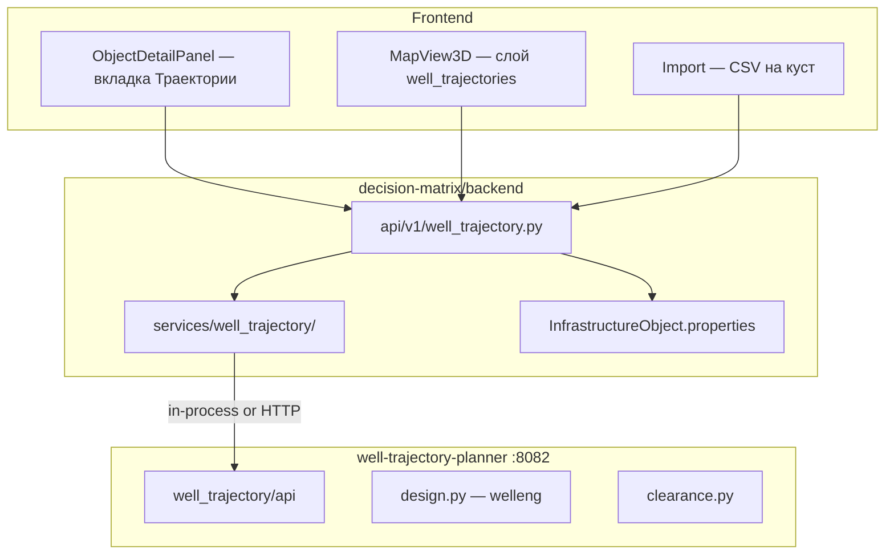
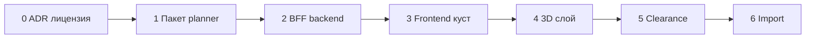

# План реализации: траектории скважин

> **Статус:** **фаза 1 завершена (M1)**; **фаза 2 ~85 % (M2)**; **фаза 3 завершена (M3)** — anti-collision SF (BFF clearance, ARQ, UI, 3D). Остаётся: импорт (M4), polish (step_m в карточках, E2E). Таблица параметров welleng / PyWellGeo: [assessment §4.5](well-trajectory-app-assessment.md#45-настройки-расчёта-welleng--pywellgeo-вкладка-расчёт).  
> **Основа:** [roadmap](well-trajectory-roadmap.md), [оценка приложения](well-trajectory-app-assessment.md), [модель данных](well-trajectory-data-model.md), [feature spec](well-trajectory.md).

**Дата:** июнь 2026.

**Ориентир:** все сущности и API привязаны к объекту **куста** (`oil_pad`, `gas_pad`). Единственный источник устьев — `pad_wells_local_json` и параметры куста из [pad-earthwork](../pad-earthwork/pad-earthwork.md).

---

## 1. Цель и границы

### В scope (4 фазы)

| Фаза | Результат для пользователя |
|------|----------------------------|
| 1 | Пакет расчёта + BFF: проектирование траектории, генерация из раскладки куста |
| 2 | Вкладка «Траектории» на кусте + линии на 3D-карте |
| 3 | Anti-collision (SF) на кусте и по проекту |
| 4 | Импорт CSV / `.wbp` / WITSML на куст |

### Вне scope (первая версия)

- Torque & drag, гидравлика, обсадные колонны
- Multi-lateral через PyWellGeo (опционально позже)
- 2D-проекция траекторий на план карты (опционально фаза 2+)
- Нормализованные таблицы БД (фаза 2+, если JSON станет тесен)

### Стек

| Компонент | Выбор |
|-----------|--------|
| Расчёт | **welleng** (обязательно) |
| Геометрия | **PyWellGeo** — `pywellgeo_bridge.py` (фаза 1: метаданные length/MD/TVD) |
| Микросервис | FastAPI, порт **8082**, паттерн [pad-earthwork-planner](../../pad-earthwork-planner/) |
| Хранение MVP | `pad_wells_trajectories_json` в `properties` куста |
| Фон | ARQ, `job_type=well_trajectory_compute` |

---

## 2. Архитектура (целевая)



**Эталон интеграции:** [pad_earthwork.py](../../decision-matrix/backend/app/api/v1/pad_earthwork.py), [earthwork_adapter.py](../../decision-matrix/backend/app/services/pad_earthwork/earthwork_adapter.py).

---

## 3. Порядок работ (общий)



| Шаг | Оценка | Зависимости |
|-----|--------|-------------|
| 0. ADR PyWellGeo | 0,5 д | — |
| 1. Фаза 1 — пакет + BFF | 5–8 д | ADR |
| 2. Фаза 2 — UI + GeoJSON + 3D | 5–7 д | Фаза 1 |
| 3. Фаза 3 — clearance + ARQ | 4–6 д | Фаза 2 |
| 4. Фаза 4 — import | 5–8 д | Фаза 3 |
| CI, тесты, docs | сквозно | каждая фаза |

---

## 4. Фаза 0 — Решения до кода

| # | Задача | Артефакт |
|---|--------|----------|
| 0.1 | ADR: PyWellGeo GPLv3 — only welleng в prod или отдельный контейнер | `docs/planning/adr-well-trajectory-license.md` |
| 0.2 | Зафиксировать: фаза 1 = **welleng + PyWellGeo bridge** | MICROSERVICE.md |
| 0.3 | Согласовать ключи properties — [input-parameters.md](../../product/input-parameters.md) § Траектории | без изменений id |

---

## 5. Фаза 1 — Пакет и BFF (M1)

### 5.1 Создать `well-trajectory-planner/`

Скопировать каркас с `pad-earthwork-planner`:

```
well-trajectory-planner/
  pyproject.toml          # welleng>=0.11, pywellgeo, pythermonomics, fastapi, pydantic
  run_server.py
  docker-compose.yml      # :8082
  Dockerfile
  src/well_trajectory/
    __init__.py
    api/app.py            # FastAPI, /health, /ready
    api/routes.py         # /v1/*
    schemas.py
    design.py             # we.connector + from_connections
    survey.py               # interpolate_survey
    pad_seed.py             # vertical stubs from wells_local
    enu_transform.py        # reuse logic from pad well_layout (rotate, anchor)
    pywellgeo_bridge.py     # WellTreeTNO geometry metadata
  tests/
    test_design.py
    test_pad_seed.py
    test_api.py
  docs/MICROSERVICE.md    # уже есть
```

| # | Задача | Файл | Критерий |
|---|--------|------|----------|
| 1.1 | Pydantic-схемы запросов/ответов | `schemas.py` | Совпадают с MICROSERVICE.md |
| 1.2 | Connector design | `design.py` | 2-point path, step_m, returns stations |
| 1.3 | Interpolate | `survey.py` | MD step → densified stations |
| 1.4 | Generate from pad layout | `pad_seed.py` | N vertical wells from `wells_local` + anchor + kb_m |
| 1.5 | ENU → lon/lat | `enu_transform.py` | Тот же поворот, что `well_layout.nds_deg_to_math_rotation_deg` |
| 1.6 | HTTP routes | `api/routes.py` | POST design, interpolate, pad/generate-from-layout |
| 1.7 | pytest | `tests/` | ≥3 теста, smoke welleng |

**Зависимость pip:** `welleng>=0.11`, `pywellgeo`, `pythermonomics` (без `[all]` на CI).

### 5.2 Backend monolith

| # | Задача | Путь | Критерий |
|---|--------|------|----------|
| 2.1 | Ключи properties | `app/services/well_trajectory/properties.py` | `PAD_WELLS_TRAJECTORIES_JSON`, `WELL_TRAJECTORY_COMPUTED_AT` |
| 2.2 | Чтение/запись JSON на кусте | `trajectory_store.py` | merge в `properties`, validate subtype oil_pad/gas_pad |
| 2.3 | Lazy bridge | `planner_bridge.py` | import `well_trajectory` on first use |
| 2.4 | Adapter | `trajectory_adapter.py` | InProcess + Http (как earthwork) |
| 2.5 | Orchestration | `service.py` | generate_from_layout, design_well, get_last |
| 2.6 | BFF router | `app/api/v1/well_trajectory.py` | см. таблицу API ниже |
| 2.7 | Подключить router | `app/api/v1/map.py` | `include_router(well_trajectory_router)` |
| 2.8 | Config | `app/core/config.py`, `.env.example` | `WELL_TRAJECTORY_INPROCESS`, `WELL_TRAJECTORY_SERVICE_URL` |
| 2.9 | Project settings default | helper в `service.py` | merge `projects.settings.well_trajectory` |
| 2.10 | API tests | `tests/test_well_trajectory_api.py` | generate-from-layout, design, last; skip if no package |
| 2.11 | Per-pad calc settings (welleng) | `settings_store.py`, «Кустование» → «Расчёт» | 7 ключей в `properties`; см. [§4.5 assessment](well-trajectory-app-assessment.md#45-настройки-расчёта-welleng--pywellgeo-вкладка-расчёт) |

### 5.3 BFF API (фаза 1)

Префикс: `/api/v1/projects/{project_id}/infrastructure/objects/{object_id}/well-trajectory/`

| Метод | Путь | Действие |
|-------|------|----------|
| GET | `last` | `pad_wells_trajectories_json` + wells_local + params |
| POST | `generate-from-layout` | pad_seed → save properties |
| POST | `design` | body: well_index + end target → update one well in JSON |
| POST | `compute` | interpolate all wells, set `well_trajectory_computed_at` |

RBAC: read — viewer+; write — analyst+ (`require_infra_write`, как pad-earthwork).

### 5.4 CI и Docker

| # | Задача | Файл |
|---|--------|------|
| 3.1 | Vendor copy в CI | `.github/workflows/ci.yml` — `cp -r well-trajectory-planner → well-trajectory-vendor` |
| 3.2 | Vendor copy в deploy | `.github/workflows/deploy-yandex-vm.yml` |
| 3.3 | pip install в Dockerfile | `decision-matrix/backend/Dockerfile` — `pip install -e ./well-trajectory-vendor` |
| 3.4 | pytest planner в CI | job backend tests |

### 5.5 Критерии приёмки M1

- [x] `POST generate-from-layout` на кусте с 12 скважинами → 12 vertical stubs в `pad_wells_trajectories_json`
- [x] `POST design` меняет траекторию одной скважины по `well_index`
- [x] Backend стартует без пакета; расчёт → 503 с `well_trajectory_planner_not_available`
- [x] `pytest tests/test_well_trajectory_api.py` green в CI

---

## 6. Фаза 2 — UI куста и 3D (M2)

### 6.1 Backend

| # | Задача | Путь |
|---|--------|------|
| 1 | GeoJSON builder | `app/services/well_trajectory/geojson.py` |
| 2 | GET geojson | BFF `GET .../well-trajectory/geojson` — LineString траекторий + **Point забоев** |
| 3 | Project-wide list | `GET .../projects/{id}/well-trajectory/geojson` — все кусты |
| 4 | Validation | warning если `pad_well_count != len(pad_wells_local_json)` в `last` |
| 5 | **Targets CRUD** | `PATCH .../well-trajectory/targets` — массовое сохранение `target` по `well_index` |
| 6 | **Design from targets** | `POST .../well-trajectory/design-all` — connector для всех скважин с `target` |
| 7 | ENU из lon/lat клика | `target.plan` {east_m, north_m} от anchor куста + `pad_rotation_deg` |

GeoJSON — [data model §5.3, §8](well-trajectory-data-model.md).

### 6.2 Frontend

| # | Задача | Путь | Критерий | Статус |
|---|--------|------|----------|--------|
| 1 | API client | `frontend/src/lib/api/wellTrajectoryApi.ts` | типы, fetch last/design/generate/**targets** | ✅ |
| 2 | Keys | `frontend/src/lib/infraWellTrajectory.ts` | mirror properties keys | ✅ |
| 3 | Вкладка на кусте | `InfraWellTrajectorySection.tsx` | только oil_pad/gas_pad | ✅ |
| 4 | Wire panel | `ObjectDetailPanel` | tab «Траектории» | ✅ |
| 5 | Список скважин + кнопки | WellTrajectorySection | generate, design-from-bottomholes | ✅ |
| 6 | **Страница «Кустование»** | `/pad-clustering`, `PadClusteringPage` | раскладка + pipeline + 3D | ✅ |
| 7 | **Вкладка «Расчёт»** | `PadClusteringCalculationPanel` | 7 ключей welleng + envelope/DEM | ✅ |
| 8 | **Режим карты: забои** | `useBottomholeDraw`, toolbar | клик → объект `well_bottomhole_*` | ✅ |
| 9 | **Слои 2D** | `createMapLayers.ts`, `useMapViewReactiveEffects` | plan line + bottomhole markers | ✅ |
| 10 | **3D слой проекта** | `MapView3D` + `useWellTrajectoryProjectGeoJson` | LineString на `/map` | ✅ |
| 11 | Карточка забоя | `InfraBottomholeDetailSection`, `InfraBottomholeGeometrySection` | геометрия X/Y/Z, dual TVD ГС, `gs_entry_mode`; без «Логистики» | ✅ |
| 12 | Resync при удалении | `infra_delete.py`, `useMapDeleteSelection` | сброс target/survey; invalidate GeoJSON | ✅ |
| 13 | Layer prefs | `mapLayerPreferences.ts` | `well_trajectories`, bottomholes | ✅ |
| 14 | Vitest | `padClusteringScene3d.test.ts`, hook tests | mock API / coords | ✅ частично |
| 15 | Sync prompt при save sketch | hook при save pad sketch | «Пересчитать траектории?» | ⬜ |

**UX расстановки забоев на карте:**

1. Пользователь выбирает куст → вкладка «Траектории» → «Расставить забои на карте».
2. В списке скважин подсвечена активная; на 2D-карте видны устья (из раскладки куста).
3. Клик на плане карты ставит маркер забоя для активной скважины; TVD — в боковой панели (общий или per-well).
4. Перетаскивание маркера обновляет `target.plan` / lon-lat; `PATCH targets` при отпускании или по «Сохранить».
5. Пунктир устье–забой до нажатия «Спроектировать до забоев» (`design-all`).
6. На 3D (опционально): горизонталь на глубине TVD, клик задаёт plan-позицию; высота Z = KB − TVD.

### 6.3 Критерии приёмки M2

- [x] На кусте видна вкладка «Траектории» с списком скважин
- [x] «Сгенерировать из раскладки» → линии на 3D (страница «Кустование» и слой на `/map`)
- [x] **Забои:** объекты `well_bottomhole_*` на 2D-карте → `sync-bottomholes` → `design-from-bottomholes`
- [x] «Спроектировать до забоев» → наклонные траектории до заданных target
- [x] Слои вкл/выкл в «Слои», сохраняются per project
- [x] Удаление забоя с карты сбрасывает траекторию скважины на кусте (stub)
- [ ] 12 скважин без заметных лагов (perf — не замерялось формально)
- [ ] E2E smoke (опционально): `well-trajectory.spec.ts` — pick bottomhole + design-all
- [ ] `step_m` из настроек куста в карточке объекта (сейчас hardcode 30 в части кнопок)

---

## 7. Фаза 3 — Anti-collision (M3) ✅

### 7.1 Planner

| # | Задача | Файл | Статус |
|---|--------|------|--------|
| 1 | Clearance wrapper | `clearance.py` — `IscwsaClearance`, all-pairs | ✅ |
| 2 | Route | `POST /v1/clearance/pairs` | ✅ |

### 7.2 Backend

| # | Задача | Файл | Статус |
|---|--------|------|--------|
| 1 | Clearance service | `clearance_service.py` — project + pad scope, project ENU | ✅ |
| 2 | BFF POST clearance | sync if wells ≤ 12 | ✅ |
| 3 | Job type | `project_jobs.py`: `JOB_TYPE_WELL_TRAJECTORY_COMPUTE` | ✅ |
| 4 | Worker | `project_job_run.py`: `_run_well_trajectory_compute` | ✅ |
| 5 | Project-wide | межкустовые пары C(n,2) | ✅ |
| 6 | Cache min_sf | in each well + pair details on pad | ✅ |

### 7.3 Frontend

| # | Задача | Статус |
|---|--------|--------|
| 1 | Кнопка «Рассчитать SF» на кусте + Кустование | ✅ |
| 2 | Таблица пар: well_a, well_b, min_sf, warning badge | ✅ |
| 3 | Цвет линии на 3D по min_sf (red if &lt; threshold) | ✅ |
| 4 | Project settings: error model (readonly default в MVP) | — (без изменений) |

### 7.4 Критерии приёмки M3

- [x] 12×12 pairs на кусте &lt; 30 с sync
- [x] SF &lt; 1.0 → warning в UI и красная линия на 3D
- [x] 13+ wells project-wide → job `well_trajectory_compute` в журнале
- [x] pytest clearance (planner + BFF + coords)

---

## 8. Фаза 4 — Импорт (M4)

### 8.1 Planner

| # | Задача | Файл |
|---|--------|------|
| 1 | CSV parser | `import_csv.py` — spec §7 data model |
| 2 | `.wbp` / EDM | `import_landmark.py` — welleng readers |
| 3 | WITSML stub | `import_witsml.py` → 501 until 4b |
| 4 | Fixtures | `tests/fixtures/sample_survey.csv` |

### 8.2 Backend + Frontend

| # | Задача |
|---|--------|
| 1 | BFF `POST .../import/csv` multipart, query `infra_object_id` |
| 2 | Import page section или `/import-wells` — выбор куста + файл |
| 3 | Batch &gt;20 wells → ARQ job |
| 4 | ADR WITSML (4b) + реализация парсера |

### 8.5 Критерии приёмки M4

- [ ] CSV 3 wells → 3 trajectories on pad → visible on 3D
- [ ] `.wbp` smoke test
- [ ] WITSML returns 501 with clear message (until 4b)

---

## 9. Миграция данных (опционально, после фазы 2)

Если JSON на кусте становится неудобен:

| # | Задача |
|---|--------|
| 1 | Alembic: `project_well`, `well_survey_station`, `well_trajectory_result` |
| 2 | `infra_object_id` NOT NULL, FK на куст |
| 3 | Script: JSON → tables |
| 4 | BFF читает tables, зеркало в JSON для обратной совместимости (optional) |

Схема — [data model §3](well-trajectory-data-model.md).

---

## 10. Тестирование

| Уровень | Что | Где |
|---------|-----|-----|
| Unit | design, pad_seed, csv parser | `well-trajectory-planner/tests/` |
| API | BFF endpoints, RBAC, 404 wrong subtype | `test_well_trajectory_api.py` |
| Integration | welleng smoke (not full ISCWSA revalidation) | planner tests |
| Frontend | API client, section render | vitest |
| E2E | generate + 3D layer visible | playwright (фаза 2) |

**Правило:** не дублировать ISCWSA validation welleng — только wrapper smoke.

---

## 11. Документация (обновлять по фазам)

| Когда | Файл |
|-------|------|
| M1 | [implementation-status.md](../../planning/implementation-status.md) → ✅ фаза 1 |
| M1 | [well-trajectory.md](well-trajectory.md) — актуализировать API |
| M2 | [implementation-status.md](../../planning/implementation-status.md) → ✅ фаза 2 |
| M2 | [map-3d-features.md](../map/map-3d-features.md) — слой well_trajectories на `/map` |
| M3 | [implementation-status.md](../../planning/implementation-status.md) → M3 ✅; [well-trajectory.md](well-trajectory.md) — clearance API + SF UI |
| M4 | import spec + fixtures README |

---

## 12. Риски и митигация

| Риск | Митигация |
|------|-----------|
| welleng optional deps | `ImportError` → message with pip extra |
| GPL PyWellGeo | ADR фаза 0; prod welleng-only |
| `pad_well_count` ≠ len wells_local | validation in `last`, UI warning |
| Large JSON in properties | phase 2+ tables; limit survey points in API |
| Windows CI + FCL | mesh clearance behind flag, not in CI |

---

## 13. Чек-лист «готов к prod»

- [x] M1 критерии выполнены
- [ ] M2–M4 критерии выполнены
- [ ] CI: planner pytest + backend test_well_trajectory_api
- [ ] Dockerfile: well-trajectory-vendor
- [ ] `.env.example` documented
- [ ] implementation-status.md updated
- [ ] Disclaimer в UI: планировочные расчёты
- [ ] ADR license закрыт

---

## 14. Связанные документы

| Документ | Назначение |
|----------|------------|
| [well-trajectory-roadmap.md](well-trajectory-roadmap.md) | Фазы и вехи M1–M4 |
| [well-trajectory-app-assessment.md](well-trajectory-app-assessment.md) | Что уже есть на кусте |
| [well-trajectory-data-model.md](well-trajectory-data-model.md) | Поля и JSON |
| [MICROSERVICE.md](../../well-trajectory-planner/docs/MICROSERVICE.md) | HTTP planner |
| [pad-earthwork.md](../pad-earthwork/pad-earthwork.md) | Источник wells_local |
