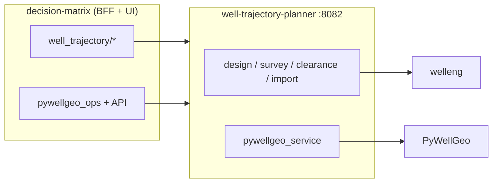

# Покрытие API welleng и PyWellGeo в Atlas Grid

> **Статус:** актуально на **июнь 2026** (welleng **0.11.0**, PyWellGeo **0.1.1** в `decision-matrix/backend/venv`).  
> **См. также:** [well-trajectory.md](well-trajectory.md), [MICROSERVICE.md](../../well-trajectory-planner/docs/MICROSERVICE.md), [pad-clustering-pywellgeo.md](../../wiki/articles/pad-clustering-pywellgeo.md), [adr-pywellgeo-gpl.md](../pad-earthwork/adr-pywellgeo-gpl.md).

Документ фиксирует **что из библиотек уже вызывается в коде** и **что доступно, но не задействовано**. Цель — оценка «запаса» для новых фич без переписывания расчётного ядра.

---

## 1. Граница ответственности



| Задача | Назначение (простыми словами) | Канон | Библиотека |
|--------|-------------------------------|-------|------------|
| Проектирование ствола (connector), интерполяция MD | Построить профиль ствола и уплотнить точки по глубине | `survey.stations` | **welleng** |
| Anti-collision (SF, ISCWSA) | Проверить, не слишком ли близко два ствола друг к другу | welleng `Survey` | **welleng** |
| Импорт CSV / Landmark `.wbp` | Загрузить готовую инклинометрию из файла | welleng `Survey` | **welleng** |
| Дерево ветвей, AHD, coarsen, thermal | Хранить разветвлённую геометрию и длину вдоль ствола | `WellTree` JSON на кусте | **PyWellGeo** |
| Боковые стволы до забоя | Добавить боковой ствол от точки до целевого забоя | `add_branch` → `WellTreeTNO.add_xyz` | **PyWellGeo** |
| Azim/dip, локальные системы координат | Перевести направление ствола в углы и обратно; локальные оси | HTTP `/pywellgeo/azim-dip`, `/coordinate-transform` | **PyWellGeo** |
| DC1D thermal demo | Собрать упрощённую пару скважин для теплового расчёта | `/pywellgeo/dc1d-build` | **PyWellGeo** |

**Важно:** SF считается только по **welleng survey**, не по латералям PyWellGeo. Sync «survey → WellTree» односторонний; обратной перезаписи welleng нет ([ADR](../pad-earthwork/adr-pywellgeo-gpl.md)).

---

## 2. welleng — сводка

| Показатель | В библиотеке (0.11.0) | Используем напрямую | Доля |
|------------|----------------------|---------------------|------|
| Модули верхнего уровня | 17 | 4 (`survey`, `connector`, `clearance`, `exchange.wbp`) | **~24%** |
| Классы (публичные) | ~34 | 4 | **~12%** |
| Функции уровня модуля | ~158 | 2 + `wbp.load` | **~2%** |
| Уникальные точки входа | — | **16** (+ атрибуты Survey) | см. §2.2 |

Импорт `welleng` есть **только** в `well-trajectory-planner` (5 файлов). Монолит ходит в микросервис по HTTP.

### 2.1. Модули welleng: используется / доступно

| Модуль | Назначение | Классы / функции (доступно) | Используем | Не используем (примеры) |
|--------|------------|----------------------------|------------|-------------------------|
| **survey** | Инклинометрия: MD/inc/azi → координаты N/E/TVD, интерполяция, учёт погрешностей | 10 классов, 39 функций | `Survey`, `SurveyHeader`, `from_connections`, `.interpolate_survey()`; поля `md`, `inc_deg`, `azi_*`, `n`, `e`, `tvd`, `dls` | `get_error_models()`, магнитное поле WMM, `Survey` из WITSML, прочие фабрики |
| **connector** | Стыковка двух точек траектории с заданными углами на входе и выходе | `Connector`, `Node`; 36 функций | `Connector(pos1, inc1, azi1, pos2, inc2, azi2)` | J/S/U-type хелперы, `Node` напрямую, остальные функции модуля |
| **clearance** | Расстояние между стволами и коэффициент безопасности SF (anti-collision) | `IscwsaClearance`, `MeshClearance`, `Clearance`, `WellMesh` | `IscwsaClearance(s1, s2)` → `sf`, `distance_cc` | **MeshClearance** (mesh-метод; в MICROSERVICE упомянут, в коде только `iscwsa`) |
| **exchange.wbp** | Чтение и запись планов скважин Landmark (формат `.wbp`) | `load`, `wbp_to_survey`, export/save, `WellPlan`, … | `wbp.load`, `wbp.wbp_to_survey` | `export`, `save_to_file`, EDM |
| **exchange.edm** | Импорт планов из формата EDM (XML) | парсер EDM XML | — | весь модуль (`.wbp` XML → 501 в `import_landmark.py`) |
| **torque_drag** | Натяжение и крутящий момент при бурении / спуске колонны | 3 класса, 7 функций | — | расчёт натяжения / крутящего момента |
| **architecture** | Готовые шаблоны траекторий (J-, S-, U-образные и др.) | 3 класса | — | архитектурные шаблоны траекторий |
| **mesh** | 3D-сетка вокруг ствола для геометрического расчёта clearance | `WellMesh`, функции построения сетки | — | нужен для MeshClearance |
| **target** | Целевые точки и planning targets для проектирования | `Target` | — | целевые точки/planning targets |
| **visual** | Встроенные 2D/3D-графики траекторий welleng | 7 функций визуализации | — | 3D/2D plot welleng |
| **fluid** | Свойства бурового раствора / флюида в стволе | модели флюидов | — | — |
| **error** | Каталог ISCWSA-моделей погрешностей MWD/гироскопа | модели погрешностей | строка `error_model` передаётся в `Survey` / `IscwsaClearance` | явный выбор из каталога `get_error_models()` |
| **utils** | Общая математика и преобразования координат | утилиты | косвенно через Connector/Survey | прямых вызовов нет |
| **io** | Чтение/запись файлов траекторий | I/O | косвенно через Connector/Survey | прямых вызовов нет |
| **node** | Узлы траектории (точки с углами и позицией) | узлы | косвенно через Connector/Survey | прямых вызовов нет |

### 2.2. welleng — раскладка: модуль | класс | функция | назначение

**Легенда:** ⚙️ — аргумент конструктора или поле результата (без отдельного API-вызова).

#### Используется в Atlas Grid

| Модуль | Класс | Функция / метод / атрибут | Назначение | Файл сервиса |
|--------|-------|---------------------------|------------|--------------|
| **connector** | `Connector` | `__init__(pos1, inc1, azi1, pos2, inc2, azi2, dls_design=…)` | Минимальная кривая между двумя точками с углами на концах (design, ГС) | `design.py` |
| **survey** | — | `from_connections(connector, step, survey_header)` | Дискретизация connector → инклинометрия с шагом MD | `design.py` |
| **survey** | `SurveyHeader` | `__init__(azi_reference=…)` | Система азимута: `grid` / `magnetic` / `true` | `design.py`, `survey.py`, `clearance.py`, `import_csv.py`, `import_landmark.py` |
| **survey** | `Survey` | `__init__(md, inc, azi, header=…)` | Инклинометрия из MD/inc/azi; welleng считает N/E/TVD | `survey.py`, `import_csv.py`, `import_landmark.py` |
| **survey** | `Survey` | `__init__(…, start_nev=[N,E,V])` | Начало координат (устье) при импорте CSV и clearance | `import_csv.py`, `clearance.py` |
| **survey** | `Survey` | `__init__(…, n, e, tvd, error_model=…)` | Survey с готовыми координатами и моделью погрешностей для SF | `clearance.py` |
| **survey** | `Survey` | `interpolate_survey(step=…)` | Уплотнение станций с равным шагом по MD | `survey.py` |
| **survey** | `Survey` | ⚙️ `.md`, `.inc_deg`, `.tvd`, `.n`, `.e` | Глубина, углы и координаты станций | `_survey_to_stations` во всех модулях |
| **survey** | `Survey` | ⚙️ `.azi_grid_deg`, `.azi_mag_deg`, `.azi_true_deg` | Азимут в выбранной системе | `survey.py`, `design.py`, `import_landmark.py` |
| **survey** | `Survey` | ⚙️ `.header.azi_reference` | Выбор массива azimuth при экспорте в `SurveyStation` | `survey.py`, `design.py` |
| **survey** | `Survey` | ⚙️ `.dls.max()` | Максимальный dogleg severity после design | `design.py` |
| **clearance** | `IscwsaClearance` | `__init__(survey_a, survey_b)` | Пара стволов для ISCWSA anti-collision | `clearance.py` |
| **clearance** | `IscwsaClearance` | ⚙️ `.sf.min()` | Минимальный separation factor по паре | `clearance.py` |
| **clearance** | `IscwsaClearance` | ⚙️ `.distance_cc.min()` | Минимальное center-to-center расстояние (м) | `clearance.py` |
| **exchange.wbp** | — | `load(path)` | Парсинг файла Landmark `.wbp` | `import_landmark.py` |
| **exchange.wbp** | — | `wbp_to_survey(plan, azi_reference=…)` | Plan Landmark → `Survey` (основной путь импорта `.wbp`) | `import_landmark.py` |

**Прокидываемые параметры без отдельного API:** `error_model` (default `ISCWSA MWD Rev5.11`), `start_nev`, `azi_reference`, `dls_design`.

#### Доступно в welleng 0.11.0, не вызывается напрямую

| Модуль | Класс | Функция (примеры) | Назначение | Почему не сейчас |
|--------|-------|-------------------|------------|------------------|
| **survey** | `Survey` | `get_error_models()` | Каталог ISCWSA-моделей погрешностей | `error_model` — free-text в UI |
| **survey** | — | фабрики WITSML / WMM | Импорт и магнитное поле | WITSML — stub (фаза 4b) |
| **connector** | `Node` | конструктор, хелперы J/S/U | Шаблонные траектории | свой multi-segment design в `design.py` |
| **clearance** | `MeshClearance` | `__init__(…)` | SF через 3D-mesh | только `method=iscwsa` |
| **mesh** | `WellMesh` | построение сетки | Геометрия для MeshClearance | не подключён |
| **exchange.wbp** | — | `export`, `save_to_file` | Запись `.wbp` | только импорт |
| **exchange.edm** | — | парсер EDM XML | Импорт EDM | явный reject в `import_landmark.py` |
| **torque_drag** | * | расчёт T&D | Натяжение / момент колонны | нет UI |
| **architecture** | * | J/S/U templates | Готовые архитектуры ствола | connector вместо шаблонов |
| **target** | `Target` | planning targets | Целевые точки design | координаты из карты / забоев |
| **visual** | — | plot 2D/3D | Встроенная визуализация welleng | свой GeoJSON + Three.js |
| **fluid** | * | модели флюида | Свойства раствора | — |
| **error** | * | каталог моделей | Явный выбор error model | строка в properties |

### 2.3. Точки входа welleng (краткий индекс)

| Символ welleng | Назначение | Файл сервиса | Продуктовая функция |
|----------------|------------|--------------|---------------------|
| `connector.Connector` | Собрать гладкую дугу между двумя точками с углами на концах | `design.py` | Design между двумя точками; ГС (Т1/Т3/entry) |
| `survey.from_connections` | Превратить connector в набор станций инклинометрии | `design.py` | Дискретизация connector → stations |
| `survey.Survey` | Объект инклинометрии: углы, координаты, DLS, погрешности | `design.py`, `survey.py`, `clearance.py`, `import_csv.py`, `import_landmark.py` | Stations, интерполяция, SF, импорт |
| `survey.SurveyHeader` | Метаданные survey: система азимута (grid/magnetic/true) | те же | `azi_reference`: grid / magnetic / true |
| `Survey.interpolate_survey(step=…)` | Добавить промежуточные точки с равным шагом по MD | `survey.py` | Уплотнение инклинометрии по шагу MD |
| `clearance.IscwsaClearance` | Рассчитать SF и расстояние между двумя survey | `clearance.py` | Anti-collision SF (куст / проект) |
| `exchange.wbp.load` | Распарсить файл `.wbp` в объект плана | `import_landmark.py` | Импорт Landmark `.wbp` |
| `exchange.wbp.wbp_to_survey` | Конвертировать plan Landmark → welleng Survey | `import_landmark.py` | Конвертация plan → Survey |

### 2.4. welleng — что можно включить без смены архитектуры

| Возможность | Зависимости | Заметки |
|-------------|-------------|---------|
| MeshClearance | `welleng[all]`, модуль `mesh` | Альтернатива ISCWSA; нужен endpoint `method=mesh` |
| EDM import | `exchange.edm` | Сейчас явный reject XML в `import_landmark.py` |
| Каталог error models | `survey.get_error_models()` | UI выбора модели вместо free-text |
| Torque & drag | `torque_drag` | Отдельная фича, не связана с текущим UI |
| WITSML через welleng | exchange / utils | У нас WITSML — отдельный stub (фаза 4b), не welleng |

---

## 3. PyWellGeo — сводка

| Показатель | В библиотеке (0.1.1) | Используем | Доля |
|------------|---------------------|------------|------|
| Пакеты верхнего уровня | 4 (`well_tree`, `transformations`, `well_data`, `welltrajectory`) | 3 (+ частично `welltrajectory` через DC1D) | **~75% пакетов touched** |
| Классы WellTree | `WellTreeTNO`, `WellTreeAzimDip` | только **WellTreeTNO** | **50%** |
| Методы `WellTreeTNO` (~30 public) | см. §3.2–§3.3 | **7** + конструктор десериализации | **~23%** |
| `welltrajectory.TrajectoryFactory` | 4 формата YAML | не вызываем — свой парсер в `pywellgeo_service.py` | **0%** |

Весь импорт PyWellGeo — в `well-trajectory-planner/src/well_trajectory/pywellgeo_service.py` и `pywellgeo_tree_io.py`.

### 3.1. Пакеты PyWellGeo: используется / доступно

| Пакет / класс | Назначение | Доступно | Используем | Не используем |
|---------------|------------|----------|------------|---------------|
| **well_tree.WellTreeTNO** | Дерево ствола из XYZ: ветви, длина AHD, упрощение, thermal | см. §3.2 | `from_xyz`, `add_xyz`, `init_ahd`, `coarsen`, `splitz`, `init_temperaturesoil` | `from_trajectories`, `from_vertical`, `perforate`, `setperforate`, `plotTree`, `plotTree3D`, `splitwell`, `condenseBranch`, `getBranchSurvey`, `temploss`, … |
| **well_tree.WellTreeAzimDip** | Дерево из azim/dip/длин — проектирование без явных XYZ | azim/dip-native дерево, `fromAzimDipFromtargetXYZ`, `compute_trajectories`, … | — | **весь класс**; azim/dip делаем через `AzimDip` + свой `add_xyz` на фронте |
| **transformations.azim_dip.AzimDip** | Перевод направления: вектор ↔ азимут/наклон/нормаль | vector ↔ azim/dip/normal | `from_vector`, конструктор, `azimdip2Vector`, `azimdip2normal` | — |
| **transformations.coordinate_transformation** | Локальная система координат относительно наклонной плоскости | `CoordinateTransformation` | `transform2local` / `transform2global` | — |
| **well_data.water_properties** | Физические свойства воды/раствора (ρ, μ, Cp, давление) | `viscosity`, `density`, `heatcapacity`, `getWellPres`, `viscosityKestin` | все перечисленные (по запросу UI) | — |
| **well_data.dc1dwell.Dc1dwell** | 1D-модель пары скважин (нагнетатель + добывающая) для thermal | 1D thermal well pair | `Dc1dwell(...)`, `getPseudoKop()`, `get_params()` | `read_input` (CLI) |
| **welltrajectory** | Импорт YAML траекторий разных форматов через фабрику | `TrajectoryFactory`, `TrajectoryXyzGeneric`, `TrajectoryDetailedTNO`, `TrajectoryDc1d`, `densify_by_max_distance` | — | **не используем**; YAML/DC1D разбираем вручную |

### 3.2. PyWellGeo — раскладка: модуль | класс | функция | назначение

Импорт PyWellGeo: `pywellgeo_service.py`, `pywellgeo_tree_io.py`. **Легенда:** ⚙️ — чтение атрибута узла дерева.

#### Используется в Atlas Grid

| Модуль (пакет) | Класс | Функция / метод | Назначение | Обёртка / файл |
|----------------|-------|-----------------|------------|----------------|
| **well_tree** | `WellTreeTNO` | `from_xyz(x, y, z, radius=…, sname=…)` | Построить дерево ствола из массивов E/N/−TVD | `tree_from_survey`, `tree_from_yaml`, `enrich_survey_geometry`, `dc1d_build` |
| **well_tree** | `WellTreeTNO` | `add_xyz(x, y, z, sbranch=…, color=…, radius=…)` | Прикрепить боковую ветку (латераль) | `tree_add_branch`, `_import_tree_from_well_trajectories` |
| **well_tree** | `WellTreeTNO` | `init_ahd()` | Пересчёт длины вдоль ствола (AHD) после мутации | после каждого изменения дерева |
| **well_tree** | `WellTreeTNO` | `coarsen(segmentlength=…, perforated=…)` | Упрощение дерева (меньше узлов) | `tree_coarsen` |
| **well_tree** | `WellTreeTNO` | `splitz(z_m)` | Разрез ствола на заданной глубине Z | `tree_split_at_z` |
| **well_tree** | `WellTreeTNO` | `init_temperaturesoil(Tsurface, Tgrad)` | Линейный профиль температуры грунта по глубине | `tree_compute`, `thermal_init_soil` |
| **well_tree** | `WellTreeTNO` | `__init__(x, y, z, radius, xroot=…, …)` | Восстановление узла при десериализации JSON → дерево | `pywellgeo_tree_io.tree_from_dict` |
| **well_tree** | `WellTreeTNO` | ⚙️ `.radius`, `.x`, `.branches`, `.perforated`, `.color`, `.name` | Сериализация дерева ↔ JSON; обход веток | `tree_node_to_dict`, `walk_nodes`, `collect_*` |
| **transformations.azim_dip** | `AzimDip` | `from_vector(vec)` | Единичный вектор → azim/dip | `azim_dip_convert` (mode `vector_to_azim_dip`) |
| **transformations.azim_dip** | `AzimDip` | `__init__(azim_deg, dip_deg)` | Задать направление углами | `azim_dip_convert`, `coordinate_transform` |
| **transformations.azim_dip** | `AzimDip` | `azimdip2Vector()` | Azim/dip → единичный вектор направления | `azim_dip_convert` (mode `azim_dip_to_vector`) |
| **transformations.azim_dip** | `AzimDip` | `azimdip2normal()` | Azim/dip → нормаль плоскости | `azim_dip_convert` (mode `azim_dip_to_normal`) |
| **transformations.coordinate_transformation** | `CoordinateTransformation` | `__init__(plane, origin=…, pitch=…)` | Локальная СК относительно наклонной плоскости | `coordinate_transform` |
| **transformations.coordinate_transformation** | `CoordinateTransformation` | `transform2local(vec)` | Global → local | `coordinate_transform` (`global_to_local`) |
| **transformations.coordinate_transformation** | `CoordinateTransformation` | `transform2global(vec)` | Local → global | `coordinate_transform` (`local_to_global`) |
| **well_data.water_properties** | — | `viscosity(T, salinity)` | Динамическая вязкость без давления | `water_properties` |
| **well_data.water_properties** | — | `viscosityKestin(P, T, salinity)` | Вязкость Kestin при известном давлении | `water_properties` |
| **well_data.water_properties** | — | `density(P, T, salinity)` | Плотность воды/раствора | `water_properties` |
| **well_data.water_properties** | — | `heatcapacity(T, salinity)` | Теплоёмкость | `water_properties` |
| **well_data.water_properties** | — | `getWellPres(depth, T, salinity)` | Гидростатическое давление на глубине | `water_properties`, расчёт P для density |
| **well_data.dc1dwell** | `Dc1dwell` | `__init__(k, H, L, tvd, temp, …)` | Параметры 1D thermal-пары скважин | `dc1d_build` |
| **well_data.dc1dwell** | `Dc1dwell` | `getPseudoKop()` | Псевдо-KOP для геометрии DC1D | `dc1d_build` |
| **well_data.dc1dwell** | `Dc1dwell` | `get_params()` | Сводка параметров модели в ответ API | `dc1d_build` |
| **well_data.dc1dwell** | `Dc1dwell` | ⚙️ `.tvd`, `.H`, `.L`, `.rw` | TVD, толщина, длина, радиус — для построения XYZ | `dc1d_build` |

#### Доступно в PyWellGeo 0.1.1, не вызывается напрямую

| Модуль (пакет) | Класс | Функция (примеры) | Назначение | Почему не сейчас |
|----------------|-------|-------------------|------------|------------------|
| **well_tree** | `WellTreeAzimDip` | `fromAzimDipFromtargetXYZ`, `compute_trajectories`, … | Дерево из azim/dip без явных XYZ | латерали: `AzimDip` на фронте + `add_xyz` |
| **well_tree** | `WellTreeTNO` | `from_trajectories`, `from_vertical` | Альтернативные фабрики дерева | только `from_xyz` |
| **well_tree** | `WellTreeTNO` | `perforate`, `setperforate` | Интервалы перфорации на ветках | флаг `perforated` в JSON, без вызова API |
| **well_tree** | `WellTreeTNO` | `plotTree`, `plotTree3D` | Встроенный 2D/3D plot | `collect_plot_segments` → Three.js |
| **well_tree** | `WellTreeTNO` | `splitwell`, `condenseBranch`, `getBranchSurvey`, `temploss` | Разделение скважины, сжатие ветки, survey-ветки, потери | не нужны в текущем UI |
| **welltrajectory** | `TrajectoryFactory` | `create`, форматы YAML | Единый импорт траекторий | свой `_extract_xyz_from_yaml` |
| **welltrajectory** | — | `densify_by_max_distance` | Уплотнение XYZ-ветки | есть coarsen, densify — нет |
| **well_data.dc1dwell** | `Dc1dwell` | `read_input` | CLI-ввод параметров DC1D | только HTTP API |

### 3.3. WellTreeTNO — методы (статус)

| Метод / свойство | Назначение | HTTP / UI | Статус |
|------------------|------------|-----------|--------|
| `from_xyz` | Построить дерево из массивов X/Y/Z (E/N/−TVD) | sync-from-survey, from-yaml, dc1d, enrich_survey_geometry | ✅ |
| `add_xyz` | Прикрепить боковую ветку как цепочку XYZ-точек | add-branch (латераль до забоя) | ✅ |
| `init_ahd` | Пересчитать длину вдоль ствола (AHD) по всем веткам | после каждой мутации дерева | ✅ |
| `coarsen` | Упростить дерево: объединить короткие сегменты | вкладка PyWellGeo «Coarsen» | ✅ |
| `splitz` | Разрезать ствол на глубине Z | API есть; UI split-at-Z — ограниченно | ✅ backend |
| `init_temperaturesoil` | Задать температуру грунта по глубине (линейный градиент) | thermal init + compute с Tsurface/Tgrad | ✅ |
| `radius` | Радиус ствола (м) | default радиус ствола | ✅ (чтение) |
| `from_trajectories` | Создать дерево из готовых траекторий (не XYZ) | — | ❌ |
| `from_vertical` | Создать вертикальный ствол заданной глубины | — | ❌ |
| `perforate` / `setperforate` | Пометить интервалы перфорации на ветках | поле `perforated` в JSON, coarsen flag | ⚠️ только флаг в tree I/O, без вызова perforate |
| `plotTree` / `plotTree3D` | Встроенный 2D/3D-plot дерева | — | ❌ (свой `collect_plot_segments` → 3D фронт) |
| `splitwell` | Разделить скважину на две независимые | — | ❌ |
| `getBranchSurvey` | Получить профиль ветки в формате survey | — | ❌ |
| `condenseBranch` | Сжать ветку, убрав лишние узлы | — | ❌ |

### 3.4. PyWellGeo — HTTP-обёртки (BFF → planner)

| Endpoint (логически) | Назначение | pywellgeo_service | UI «Кустование → PyWellGeo» |
|----------------------|------------|-------------------|----------------------------|
| tree from survey | Создать WellTree из рассчитанного welleng survey | `tree_from_survey` | «Из survey» |
| import/export YAML | Загрузить или сохранить траекторию в YAML | `tree_from_yaml`, `tree_export_yaml` | Import / Export |
| add branch | Добавить боковой ствол к дереву | `tree_add_branch` | Латераль до забоя |
| coarsen | Упростить дерево (меньше узлов) | `tree_coarsen` | Coarsen |
| split at Z | Разрезать ствол на заданной глубине | `tree_split_at_z` | API only |
| compute | AHD, TVD max, статистика веток, профиль температуры | `tree_compute` | Compute + geometry → properties |
| plot data | Сегменты для отрисовки веток в 3D | `tree_plot_data` | слой «Ветви» 3D |
| azim-dip convert | Конвертация вектор ↔ azim/dip/normal | `azim_dip_convert` | панель Azim/Dip |
| thermal init soil | Инициализировать температуру грунта в дереве | `thermal_init_soil` | thermal секция |
| water properties | ρ, μ, Cp воды при заданных P/T/солёности | `water_properties` | свойства воды |
| dc1d build | Собрать пару DC1D-скважин из параметров | `dc1d_build` | DC1D demo |
| coordinate transform | Перевод точек global ↔ local | `coordinate_transform` | API |

### 3.5. PyWellGeo — что можно включить

| Возможность | Что даёт | Почему не сейчас |
|-------------|----------|------------------|
| **WellTreeAzimDip** | Нативное построение из azim/dip/KOP без ручного XYZ | Латерали строятся через `lateralXyzFromAzimDip` на фронте + `add_xyz` |
| **TrajectoryFactory** | Единый import YAML всех форматов | Уже есть свой `_extract_xyz_from_yaml` / `_import_tree_from_well_trajectories` |
| **densify_by_max_distance** | Уплотнение XYZ-ветки | Coarsen есть, densify — нет |
| **perforate / setperforate** | Перфорации на дереве | В JSON поле есть, вызовов API нет |
| **plotTree3D** | Быстрый preview | Заменён кастомным экспортом сегментов для Three.js |
| **getBranchSurvey** | Survey-совместимый профиль ветки | Потенциальный мост PyWellGeo → welleng SF для латералей |

---

## 4. Сравнение по продуктовым сценариям

| Сценарий | Назначение | welleng | PyWellGeo | Примечание |
|----------|------------|---------|-----------|------------|
| Вертикаль + design до забоя | Построить ствол от устья до забоя | ✅ Connector | ✅ metadata AHD после design | `enrich_survey_geometry` |
| ГС Т1/Т3/entry | Горизонтальный участок с выбором точки входа | ✅ multi-segment Connector | опционально sync tree | entry search min MD |
| Интерполяция MD | Больше точек инклинометрии с равным шагом | ✅ | — | |
| SF между скважинами | Проверка столкновений между стволами | ✅ IscwsaClearance | ❌ | латерали не в SF |
| CSV / .wbp import | Загрузка инклинометрии из файла | ✅ | — | EDM XML — нет |
| WITSML | Стандартный обмен данными скважин | ❌ (stub) | ❌ | фаза 4b |
| Многоствол / латераль | Боковые ветки от основного ствола | ❌ | ✅ add_xyz | main bore = `branches[0]` chain |
| Coarsen / split Z | Упростить или разрезать дерево | ❌ | ✅ | |
| Thermal / DC1D | Температура грунта и demo-пара скважин | ❌ | ✅ | demo / инженерный блок |
| Azim/dip / local frame | Углы направления и локальные координаты | ❌ | ✅ AzimDip + CoordinateTransformation | |
| 3D отображение ветвей | Показать траектории на 3D-сцене | GeoJSON welleng survey | ✅ plot segments | два слоя |

---

## 5. Как обновить цифры

Скрипт подсчёта поверхности welleng (локально, venv backend):

```powershell
cd decision-matrix\backend
.\venv\Scripts\python.exe ..\..\well-trajectory-planner\scripts\count_welleng_surface.py
```

Для PyWellGeo — introspection `WellTreeTNO` / `WellTreeAzimDip` через `dir()` (см. историю скриптов в репозитории). Версии пакетов:

```powershell
.\venv\Scripts\python.exe -c "import importlib.metadata as m; print('welleng', m.version('welleng')); print('pywellgeo', m.version('pywellgeo'))"
```

---

## 6. Краткий вывод

- **welleng** используется как **узкий движок**: connector → survey → интерполяция → ISCWSA + WBP. Это **~12% классов** и **~2% функций** библиотеки; основной «запас» — mesh clearance, EDM, torque/drag, визуализация.
- **PyWellGeo** используется **шире по смыслу** (ветви, thermal, azim/dip), но **узко по API дерева**: один класс `WellTreeTNO`, без `WellTreeAzimDip` и без `TrajectoryFactory`. Главный потенциал — нативный azim/dip design, перфорации, densify, мост survey-ветки в welleng для SF на латералях.

При добавлении фич сверяйтесь с [границей GPL (ADR)](../pad-earthwork/adr-pywellgeo-gpl.md): новая геометрия ветвей — PyWellGeo; clearance и plan design — welleng.
