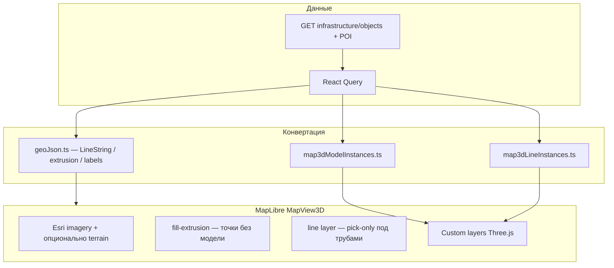

# 3D-карта — реализованный функционал

> **План и чеклисты разработки:** [map-3d-plan.md](./map-3d-plan.md)  
> **Объекты, L2-ключи, импорт:** [map-objects-and-spatial-calculations.md](./map-objects-and-spatial-calculations.md) §6.4  
> **Потоки UI:** [user-flows.md](./user-flows.md) §2.0

**Статус:** реализовано (май 2026). Режим **только просмотр**; редактирование геометрии — в 2D (OpenLayers).

---

## 1. Где доступно

| Экран | Компонент | Редактирование |
|-------|-----------|----------------|
| `/map` (MapPage) | `MapView3D` | нет (toast при попытке рисования) |
| `/matrix` — панель карты проекта | `MapView3D` | нет |
| Превью отчёта (live) | `MapView3D` | нет |
| PNG-снимок отчёта | 2D OpenLayers | без изменений |

Переключатель **2D | 3D** в toolbar карты. Включение сборки: `VITE_MAP_3D_ENABLED=true` ([`map3dConfig.ts`](../decision-matrix/frontend/src/lib/map3d/map3dConfig.ts)).

---

## 2. Переменные окружения (frontend)

| Переменная | Назначение |
|------------|------------|
| `VITE_MAP_3D_ENABLED` | `true` — показать переключатель 2D/3D |
| `VITE_MAPTILER_KEY` | DEM MapTiler Terrain RGB + hillshade; без ключа рельеф отключён (toast) |

Примеры: [`decision-matrix/frontend/.env.example`](../decision-matrix/frontend/.env.example), GitHub Actions Variables ([`deploy/app.env.example`](../deploy/app.env.example)).

Локально:

```env
VITE_MAP_3D_ENABLED=true
VITE_MAPTILER_KEY=<ключ с maptiler.com>
```

---

## 3. Архитектура (клиент)



### Ключевые модули (`frontend/src/lib/map3d/`)

| Модуль | Назначение |
|--------|------------|
| `map3dConfig.ts` | feature flag, MapTiler key, `MAP3D_OBJECT_SCALE` (×5), id слоёв |
| `geoJson.ts` | GeoJSON для sources MapLibre (линии, extrusion, пороги, анализ) |
| `map3dLayers.ts` | vector layers, pick-only линии под 3D-трубами |
| `map3dTerrain.ts` | `setTerrain`, hillshade |
| `map3dModelsLayer.ts` | custom layer `dm-3d-models` (Three.js) |
| `map3dLinesLayer.ts` | custom layer `dm-3d-lines` (трубы) |
| `map3dGltfLoader.ts` | загрузка glTF, палитра по вершинам |
| `map3dGltfAssets.ts` | пути к `/map3d-models/*.glb` |
| `map3dModelCatalog.ts` | подтип → glTF asset / procedural template |
| `map3dObjectPalette.ts` | 5 тонов от цвета слоя (pad/body/roof/accent/trim) |
| `render3d.ts` | L2: `render_3d_*` + L1 fallback |
| `extrusionHeights.ts` | L1 высоты (синхрон с backend JSON) |

Компонент: [`MapView3D.tsx`](../decision-matrix/frontend/src/components/MapView3D.tsx).

---

## 4. Уровни данных (L1 / L2 / L3)

### L1 — по подтипу

- Frontend: [`extrusionHeights.ts`](../decision-matrix/frontend/src/lib/map3d/extrusionHeights.ts)
- Backend: [`shared/l1_extrusion_heights.json`](../decision-matrix/shared/l1_extrusion_heights.json), [`render_3d_properties.py`](../decision-matrix/backend/app/geo/render_3d_properties.py)

### L2 — в `infrastructure_objects.properties`

| Ключ | Описание |
|------|----------|
| `render_3d_height_m` | высота (м), масштабируется `MAP3D_OBJECT_SCALE` на клиенте |
| `render_3d_base_m` | смещение основания над terrain (м) |
| `render_3d_visible` | `false` — скрыть в 3D |
| `render_3d_style` | `model` / `extrusion` |
| `render_3d_model_id` | id glTF-ассета или алиас (`facility-large`, `stack`, `tank`, …) |

Панель объекта → вкладка «Дополнительно» (в 3D-режиме).

### L3 — glTF на клиенте (реализовано)

- Ассеты: [`frontend/public/map3d-models/`](../decision-matrix/frontend/public/map3d-models/) (Kenney City Kit Industrial, **CC0**)
- Каталог: [`map3dModelCatalog.ts`](../decision-matrix/frontend/src/lib/map3d/map3dModelCatalog.ts)
- Процедурный fallback, если glTF не загрузился

Подробнее по файлам моделей: [`public/map3d-models/README.md`](../decision-matrix/frontend/public/map3d-models/README.md).

---

## 5. Точечные объекты

### 5.1 glTF-модели (по умолчанию)

| Подтип (примеры) | glTF asset |
|------------------|------------|
| `gas_processing`, `refinery` | `facility-large` |
| `ukg`, `tsg`, НС, площадки | `facility-medium` |
| `offplot`, `additional_facility` | `facility-compact` |
| `substation` | `substation` |
| `gtes`, `gpes` | `stack-large` |
| `vies` | `stack-medium` |
| `node`, `network_node`, `methanol_joint` | `tank` |
| `sand_quarry` | `facility-compact` (шаблон quarry в каталоге) |
| `poi` | процедурный `poi_pin` (без glTF) |

### 5.2 Окраска

- Базовый цвет: цвет **слоя** или [`MAP_SUBTYPE_COLORS`](../decision-matrix/frontend/src/lib/mapIcons.ts)
- На glTF: **палитра из 5 оттенков** по высоте вершин ([`map3dObjectPalette.ts`](../decision-matrix/frontend/src/lib/map3d/map3dObjectPalette.ts)); атлас Kenney отключается для читаемости цвета
- Выделение: лёгкое emissive-свечение

### 5.3 Extrusion (столбики)

Если `render_3d_style: extrusion` или нет записи в каталоге моделей — `fill-extrusion` в MapLibre (квадратный footprint по подтипу).

### 5.4 UI

- Toggle **«3D-модели объектов»** в панели слоёв (3D): при выкл. — extrusion + 2D-символы
- Символы MapLibre скрываются, пока включены 3D-модели

---

## 6. Линейные объекты

- Источник геометрии: `coordinates` или `end_lon` / `end_lat` (как в 2D); перед построением 3D — `buildNormalizedLinePath3d` ([`map3dLinePathBuild.ts`](../decision-matrix/frontend/src/lib/map3d/map3dLinePathBuild.ts)): горизонтальный путь через `linePathForDisplay` + пул `infraSnapPool` (все объекты проекта).
- Отрисовка: **Three.js custom layer** `dm-3d-lines`
  - Обычные линии — **трубы** по рельефу ([`map3dLineMeshes.ts`](../decision-matrix/frontend/src/lib/map3d/map3dLineMeshes.ts)): **`CurvePath` из прямых `LineCurve3` между вершинами** — план **совпадает** с 2D OpenLayers / GeoJSON `LineString`. Сглаживание Catmull-Rom **не используется** (на острых углах давало «зеркальный» изгиб относительно 2D).
  - **`power_line` (ЛЭП)** — опоры только на **промежуточных** вершинах (glTF **transmission-tower**, iPoly3D CC0); на **начале и конце** опор нет — **3 провода** на каждый пролёт идут по **прямой в плане** к точке привязки на высоте коридора ЛЭП (`wirePointAlongCorridor`, ~88% номинальной высоты линии), не к вершине высокой опоры. Трасса в плане = 2D; опоры — отдельный визуальный элемент выше проводов. При ошибке загрузки glTF — процедурная заглушка.
- MapLibre `line` layer: **opacity 0** — только для клика (pick); геометрия pick-слоя тоже через `linePathForDisplay` ([`geoJson.ts`](../decision-matrix/frontend/src/lib/map3d/geoJson.ts)).
- Радиус трубы: по подтипу + `MAP3D_OBJECT_SCALE`; цвет — как у 2D-линии
- Высота опоры ЛЭП: `render_3d_height_m` (L1 для `power_line` — 10 м) × `MAP3D_OBJECT_SCALE` × `MAP3D_POWER_LINE_TOWER_SCALE` (5)
- Высота: `queryTerrainElevation` + `render_3d_base_m` (один проход, без двойного учёта рельефа)
- **Коридор высот (`planCorridorAlts`)**: внутренние вершины слегка следуют рельефу (`PLAN_CORRIDOR_TERRAIN_BLEND ≈ 0.15`), концы — через `lineEndpointAttachAltitudeM`; снижает ложную «инверсию» изгиба в перспективе при включённом рельефе ([`map3dLinePathBuild.ts`](../decision-matrix/frontend/src/lib/map3d/map3dLinePathBuild.ts)).
- glTF точечных объектов: центрирование по XZ при загрузке ([`map3dModelsLayer.ts`](../decision-matrix/frontend/src/lib/map3d/map3dModelsLayer.ts)), чтобы модель совпадала с `lon`/`lat` маркера.
- При `moveend` / смене рельефа ЛЭП пересчитывает провода с полным **`snapPool`** (все объекты проекта), а не только отфильтрованным `infraObjects` слоя.

Подтипы линий: `autoroad`, `oil_pipeline`, `gas_pipeline`, `water_pipeline`, `power_line`, `methanol_pipeline`, `additional_line`.

См. также §1.5 [map-objects-and-spatial-calculations.md](./map-objects-and-spatial-calculations.md) — рисование, привязка концов, координаты.

### 6.1 QA: паритет 2D/3D линий

Автотесты: [`map3dLinePlanParity.test.ts`](../decision-matrix/frontend/src/lib/map3d/map3dLinePlanParity.test.ts), [`map3dLinePathBuild.test.ts`](../decision-matrix/frontend/src/lib/map3d/map3dLinePathBuild.test.ts), `npm run test -- src/lib/map3d`.

| Шаг | Действие | Ожидание |
|-----|----------|----------|
| 1 | Рельеф **выкл** | Трасса 3D плоская; **план** (lon/lat) совпадает с 2D |
| 2 | Рельеф **вкл** (`VITE_MAPTILER_KEY`, toggle «Рельеф (3D)») | Профиль слегка следует рельефу; план без зеркального изгиба |
| 3 | Pitch **0°** (вид сверху) | Изгиб 3D-трубы = 2D для тех же объектов |
| 4 | Pitch **~60°** | Нет «перевёрнутого» угла относительно 2D (коридор высот) |
| 5 | Панорамирование / zoom | Концы **ЛЭП** на узлах/площадках (snap pool) |
| 6 | Объекты **МП_1**, **доп_ЛО_1** | Сравнить `coordinates` в API/панели: разные V/∧ — данные, не рендер |

Локально: `cd decision-matrix/frontend && npm run dev`, проект с демо-сетью (`draw_demo_map_network.py`).

---

## 7. Рельеф и камера

- MapTiler Terrain RGB, exaggeration по умолчанию **1.2** (`DEFAULT_TERRAIN_EXAGGERATION`)
- Hillshade под векторными слоями
- Сохранение вида 3D: pitch/bearing в `localStorage` (ключи `mapViewState3d_*`)
- Переключение 2D↔3D сохраняет selection и центр (общий snapshot без pitch)

---

## 8. Масштаб сцены

Глобальный множитель **`MAP3D_OBJECT_SCALE = 5`** ([`map3dConfig.ts`](../decision-matrix/frontend/src/lib/map3d/map3dConfig.ts)):

- glTF-модели (mercator scale)
- радиус линейных труб
- `fill-extrusion-height` и footprint в GeoJSON

Изменение масштаба — одна константа + пересборка frontend.

---

## 9. Импорт и backfill

| Канал | 3D-поля |
|-------|---------|
| GeoJSON `properties` | `render_3d_*`, `height_m` |
| GeoJSON Z в координатах | `render_3d_base_m` (backend `merge_geojson_render_3d`) |
| CSV колонка `height_m` | → `render_3d_height_m` |

Backfill L2 для существующих объектов:

```bash
cd decision-matrix/backend
python scripts/backfill_render_3d_properties.py --dry-run
```

Демо-сеть для QA:

```bash
python scripts/draw_demo_map_network.py --project-name "<имя проекта>"
```

---

## 10. Тесты

| Область | Команда |
|---------|---------|
| Frontend map3d + паритет 2D/3D | `cd decision-matrix/frontend && npm run test -- src/lib/map3d src/lib/linePath2d3dParity.test.ts` |
| Backend render_3d | `cd decision-matrix/backend && pytest tests/test_render_3d_properties.py tests/test_render_3d_import.py` |
| Сборка | `npm run build` в `frontend` |

---

## 11. Добавление новой glTF-модели

1. Положить `.glb` в `decision-matrix/frontend/public/map3d-models/`
2. Зарегистрировать в [`map3dGltfAssets.ts`](../decision-matrix/frontend/src/lib/map3d/map3dGltfAssets.ts) (`url`, `targetHeightM`)
3. Привязать подтип в [`map3dModelCatalog.ts`](../decision-matrix/frontend/src/lib/map3d/map3dModelCatalog.ts) или задать `render_3d_model_id` на объекте
4. Убедиться в лицензии (рекомендуется CC0 / CC-BY с указанием автора)

---

## 12. Ограничения и известные моменты

| Тема | Поведение |
|------|-----------|
| Геометрия линий в 3D | только **ломаная** по вершинам (как 2D); без сглаживания Catmull-Rom |
| Редактирование | только 2D |
| Отчёт PNG | только 2D |
| Производительность | каждый 3D-объект — отдельный draw в custom layer; при сотнях объектов возможен просад FPS |
| Подтип `ie` | иконка/3D-каталог есть; в `POINT_SUBTYPES` / группах слоёв может отсутствовать — проверьте фильтр слоёв |
| Админ-загрузка glTF | не реализована (только файлы в `public/`) |
| Cesium / 3D-редактирование | вне scope |

---

## 13. Связанные документы

- [RUN_GUIDE.md](../decision-matrix/RUN_GUIDE.md) §7 — быстрый старт 3D
- [map-3d-plan.md](./map-3d-plan.md) — исходный план фаз
- [architecture.md](./architecture.md) — место 3D в frontend-стеке
