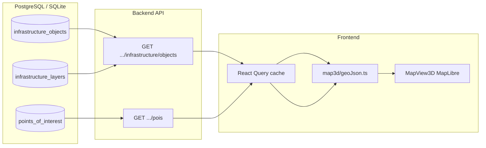
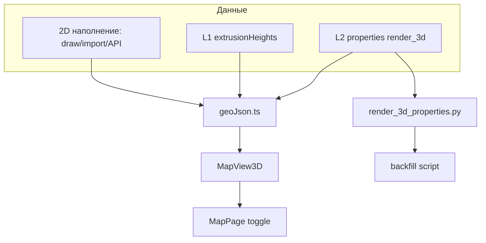

# План реализации 3D-карты (режим просмотра)

**Дата:** май 2026  
**Связанные документы:** [map-3d-features.md](./map-3d-features.md) (**реализованное состояние**), [map-objects-and-spatial-calculations.md](./map-objects-and-spatial-calculations.md), [architecture.md](./architecture.md), [database-schema.md](./database-schema.md)

**Цель:** добавить **3D view-only** рядом с текущей **2D OpenLayers-картой** (редактирование остаётся в 2D).  
**Стек MVP:** MapLibre GL JS + Esri World Imagery (как сейчас) + опциональный DEM + Three.js (glTF, линии).

---

## 0. Принятые решения

| Решение | Выбор | Альтернатива (не MVP) |
|---------|--------|------------------------|
| 3D-движок | MapLibre GL JS | Cesium |
| Редактирование | только 2D (OpenLayers) | 3D Modify |
| Источник геометрии | та же БД `infrastructure_objects` + `points_of_interest` | отдельная «3D-база» |
| Высоты объектов | константы по `subtype` + опционально `properties` | колонка Z в PostGIS |
| Рельеф | фаза 2 (DEM tiles) | без рельефа в фазе 1 |
| Terrain provider | MapTiler free / self-hosted Terrarium | Mapbox |
| Где включается | `MapPage` (main) | matrix/report — фаза 3 |

---

## 1. Архитектура данных для 3D

### 1.1 Отдельной «базы объектов 3D» в MVP нет

3D-режим **не требует** дублирования объектов. Каждая запись, уже лежащая в:

- `infrastructure_objects` (точки и линии, PostGIS `POINT` / `LINESTRING`);
- `points_of_interest` (POI);

автоматически отображается в 3D после конвертации в GeoJSON на клиенте (`lib/map3d/geoJson.ts`).



**Вывод:** наполнение «базы объектов 3D» = наполнение **обычной** карты (2D) + опциональные **3D-атрибуты** в `properties` JSON.

### 1.2 Три уровня 3D-данных

| Уровень | Где хранится | Когда нужен | MVP |
|---------|--------------|-------------|-----|
| **L0 — геометрия 2D** | `lon`, `lat`, `coordinates`, PostGIS | всегда | да (уже есть) |
| **L1 — стиль 3D по подтипу** | frontend `extrusionHeights.ts` + backend defaults | автоматически для всех объектов | да |
| **L2 — переопределение на объект** | `infrastructure_objects.properties` | точная высота, скрытие, модель | фаза B |
| **L3 — 3D-ассеты (glTF)** | `public/map3d-models/` + каталог на клиенте ([map-3d-features.md](./map-3d-features.md)) | админ-загрузка, таблица в БД | **частично реализовано** |

---

## 2. Как наполнять объекты для 3D-карты

### 2.1 Источники 2D-объектов (уже работают → сразу видны в 3D)

Все перечисленные каналы пишут в `infrastructure_objects` / POI. После включения 3D-режима **ничего повторно импортировать не нужно**.

| Канал | Как использовать | `source_type` слоя | Документация |
|-------|------------------|--------------------|--------------|
| **Ручное рисование** | MapPage → инструменты «Точка» / «Линия» / «POI» (режим 2D) | `manual` | map-objects §1.4 |
| **REST API** | `POST .../infrastructure/objects`, `.../facility-objects` | `manual` | `map.py`, schemas `InfraObjectCreate` |
| **GeoJSON** | `POST .../import/geojson` (sync/async) | `geojson_import` | README, architecture |
| **CSV / Shapefile / ZIP** | import endpoints | `csv_import` | input-parameters, FR-2.5 |
| **Импорт Искра** | Spark → `_create_infra_object_record` | `corporate_api` | spark-import-mapping.md |
| **Демо для разработки** | `python seed.py`, `scripts/draw_demo_map_network.py` | `manual` | RUN_GUIDE, backend/scripts |

**Минимальный сценарий «наполнить 3D-карту» для нового проекта:**

1. Создать проект.
2. Нарисовать или импортировать инфраструктуру в **2D** (как сейчас).
3. Переключить карту в **3D** — объекты появятся с дефолтными высотами L1.

**Демо-сеть для QA 3D (локально):**

```powershell
cd decision-matrix\backend
.\venv\Scripts\Activate.ps1
python scripts\draw_demo_map_network.py --project-name "третий проект"
```

Скрипт создаёт узлы, дороги, карьеры — достаточно для проверки extrusion и рельефа.

### 2.2 Уровень L1 — дефолтные высоты по `subtype` (без изменений БД)

Файл `frontend/src/lib/map3d/extrusionHeights.ts` (и зеркало на backend для API-ответов):

| `subtype` | `height_m` (линия / точка) | Примечание |
|-----------|----------------------------|------------|
| `oil_pipeline` | 4 | «труба» над землёй |
| `gas_pipeline` | 4 | |
| `water_pipeline` | 3 | |
| `methanol_pipeline` | 3 | |
| `autoroad` | 0.8 | полоса дороги |
| `power_line` | 10 | коридор / опоры |
| `additional_line` | 3 | |
| `gas_processing`, `refinery`, … | 12–20 | точечные площадки |
| `substation` | 10 | |
| `node`, `methanol_joint` | 6 | |
| `sand_quarry` | 5 | |
| `poi` (POI) | 8 | отдельный слой POI |

MapView3D при `setData` читает `subtype` → высота. **Наполнение БД не требуется.**

### 2.3 Уровень L2 — 3D-атрибуты в `properties` (фаза B данных)

По аналогии с `entry_date` (`infraEntryDate.ts`) и объёмами песка (`sand_properties.py`) вводятся ключи JSON:

| Ключ | Тип | Назначение |
|------|-----|------------|
| `render_3d_height_m` | number | высота extrusion (перекрывает L1) |
| `render_3d_base_m` | number | смещение основания над terrain (м) |
| `render_3d_visible` | boolean | `false` — скрыть только в 3D |
| `render_3d_style` | string | `extrusion` \| `line` \| `model` (post-MVP) |
| `render_3d_model_id` | string | UUID ассета glTF (post-MVP) |

**Backend (задачи фазы B):**

- [ ] **D-B1** `app/geo/render_3d_properties.py`:
  - константы ключей;
  - `default_height_for_subtype(subtype) -> float`;
  - `read_render_3d(props) -> Render3DConfig`;
  - `apply_default_render_3d(subtype, properties) -> dict` — только если ключи отсутствуют (не перетирать импорт).
- [ ] **D-B2** Вызывать `apply_default_render_3d` в `_create_infra_object_record` / update (как `apply_default_sand_volumes`).
- [ ] **D-B3** Тесты `tests/test_render_3d_properties.py`.
- [ ] **D-B4** Опционально: отдавать вычисленный `render_3d_effective` в `InfraObjectResponse` (computed field) — упрощает frontend.

**Frontend (задачи фазы B):**

- [ ] **D-B5** `lib/map3d/render3d.ts` — парсинг `properties`, fallback на `extrusionHeights.ts`.
- [ ] **D-B6** Расширить `withDefaultInfraProperties` или отдельный `withDefaultRender3DProperties` при create/update.
- [ ] **D-B7** `ObjectDetailPanel` → вкладка «Дополнительно» или блок «3D»: поля высота / видимость (только если `mapDisplayMode === '3d'` или всегда).

**Импорт GeoJSON/CSV с 3D-полями (фаза B+):**

- [ ] **D-B8** Маппинг колонок импорта: `height_m` → `render_3d_height_m` (docs + import service).
- [ ] **D-B9** GeoJSON `properties.render_3d_*` или координата Z в `[lon, lat, z]` → сохранять Z в `render_3d_base_m` / отдельный ключ `elevation_m` (решение зафиксировать в map-objects §).

### 2.4 Уровень L3 — каталог 3D-моделей (post-MVP)

Отдельная сущность, **не смешивать** с геометрией PostGIS:

```sql
-- черновик, не в MVP
CREATE TABLE infrastructure_3d_assets (
  id UUID PRIMARY KEY,
  project_id UUID NULL,  -- NULL = глобальный каталог
  subtype VARCHAR(64),
  name VARCHAR(255),
  gltf_url TEXT NOT NULL,
  scale FLOAT DEFAULT 1.0,
  heading_deg FLOAT DEFAULT 0,
  created_at TIMESTAMPTZ DEFAULT now()
);
```

| Задача | Описание |
|--------|----------|
| **D-C1** Хранилище файлов: `/opt/decision-matrix/assets/3d/` или S3 Yandex Object Storage |
| **D-C2** Admin UI: загрузка glTF, привязка к `subtype` |
| **D-C3** `render_3d_model_id` в `properties` → MapLibre custom layer / three.js overlay |
| **D-C4** Лимит размера, CDN, lazy load по bbox |

### 2.5 Наполнение существующих проектов (миграция данных)

Для проектов, созданных до внедрения L2:

- [ ] **D-M1** Alembic **не обязателен** — достаточно runtime defaults (L1).
- [ ] **D-M2** Опциональный скрипт `backend/scripts/backfill_render_3d_properties.py`:
  - `SELECT id, subtype, properties FROM infrastructure_objects WHERE project_id = ?`;
  - merge `apply_default_render_3d` только для отсутствующих ключей;
  - `--dry-run`, `--project-id`.
- [ ] **D-M3** Документировать в RUN_GUIDE: «3D использует существующие объекты; backfill нужен только для кастомных высот».

### 2.6 Проектные настройки 3D (опционально, фаза C)

Глобальные для проекта overrides (единый профиль высот):

| Место хранения | Ключи | UI |
|----------------|-------|-----|
| `projects.settings` JSON | `map_3d.exaggeration`, `map_3d.default_height_scale` | Настройки проекта |
| или `infrastructure_layers.style_config` | `extrusion_height_m` per layer | MapLayersPanel |

Задачи:

- [ ] **D-C5** Схема `ProjectSettings.map_3d` в backend
- [ ] **D-C6** API PATCH project settings
- [ ] **D-C7** MapView3D читает scale при инициализации

### 2.7 POI и analysis — особые случаи

| Данные | Источник | 3D-поведение |
|--------|----------|--------------|
| POI | `points_of_interest` | отдельный GeoJSON source, высота L1 |
| Analysis connection lines | вычисляются на лету (`connectionLines` в MapPage) | dashed line, без extrusion |
| Threshold circles | `thresholdCircles` | flat polygon на terrain |
| Network graph | `infrastructure_nodes/edges` | **не** дублировать; 3D рисует только `infrastructure_objects` |

POI **не** хранят `render_3d_*` в MVP; при необходимости — поля в `poi` table / properties в post-MVP.

### 2.8 Чеклист наполнения перед приёмкой 3D

- [ ] В проекте ≥ 1 POI
- [ ] ≥ 2 line subtypes (`autoroad`, `oil_pipeline`, …) с `coordinates` ≥ 3 точек
- [ ] ≥ 3 point subtypes (`gas_processing`, `substation`, `node`)
- [ ] Импортированный слой (GeoJSON) — проверка L1 цветов
- [ ] Объект с ручным override `render_3d_height_m` (после фазы B)
- [ ] (фаза 2) Terrain включён — объекты не «уходят под землю»

---

## 3. Фаза 1 — PoC «3D просмотр без рельефа» (8–10 дн)

### 3.1 Зависимости и конфиг

- [ ] **T1.1** `maplibre-gl` в `frontend/package.json`
- [ ] **T1.2** CSS MapLibre
- [ ] **T1.3** Env: `VITE_MAP_3D_ENABLED`, `VITE_MAPTILER_KEY` (фаза 2)
- [ ] **T1.4** `RUN_GUIDE.md` — ключи и флаг

### 3.2 Конвертация данных → GeoJSON

- [ ] **T1.5** `lib/map3d/geoJson.ts` — infra lines/points, POI
- [ ] **T1.6** Переиспользование логики геометрии из `MapView.tsx`
- [ ] **T1.7** `lib/map3d/extrusionHeights.ts` — таблица L1
- [ ] **T1.8** `lib/map3d/render3d.ts` — чтение L2 из `properties` (stub → L1)
- [ ] **T1.9** Unit-тесты `geoJson.test.ts`

### 3.3 Компонент `MapView3D`

- [ ] **T1.10** `components/MapView3D.tsx`
- [ ] **T1.11** Props (view-only subset `MapViewProps`)
- [ ] **T1.12** Basemap Esri + pitch/bearing
- [ ] **T1.13** Слои: raster → thresholds → lines → extrusion → points → POI → analysis
- [ ] **T1.14** Sync `setData` при изменении props
- [ ] **T1.15** Click → `onFeatureSelect`
- [ ] **T1.16** `feature-state` highlight

### 3.4 Состояние камеры 3D

- [ ] **T1.17** Расширить `mapViewState.ts`: `pitch`, `bearing`
- [ ] **T1.18** Ключ `dm-map-view-3d:...`
- [ ] **T1.19** `mapFocus` → flyTo

### 3.5 Интеграция в `MapPage`

- [ ] **T1.20** `mapDisplayMode: '2d' | '3d'`
- [ ] **T1.21** Toggle 2D | 3D в toolbar
- [ ] **T1.22** Условный рендер MapView / MapView3D
- [ ] **T1.23** Блокировка draw в 3D + toast
- [ ] **T1.24** Footer hints для 3D
- [ ] **T1.25** Fit view для обоих режимов

### 3.6 Слои и видимость

- [ ] **T1.26** MapLibre filters по subtype / layer_id
- [ ] **T1.27** MapLayersPanel без изменений логики
- [ ] **T1.28** `showBasemap` → visibility raster

### 3.7 Тесты и QA

- [ ] **T1.29** Vitest geoJson + render3d
- [ ] **T1.30** Manual QA (§6)
- [ ] **T1.31** Lazy import `MapView3D`

---

## 4. Фаза 2 — Рельеф и полировка (4–6 дн)

- [ ] **T2.1–T2.5** Terrain DEM, toggle в MapLayersPanel
- [ ] **T2.6–T2.8** Extrusion on terrain, sky/fog, line width by zoom
- [ ] **T2.9–T2.11** Sprites/icons, labels
- [ ] **T2.12–T2.14** Analysis lines, threshold circles

---

## 5. Фаза 3 — Другие экраны (3–5 дн)

- [ ] **T3.1** Report map 3D preview
- [ ] **T3.2** Matrix map
- [ ] **T3.3** `useMapDisplayMode()` hook
- [ ] **T3.4** Синхронизация камеры 2D↔3D

---

## 6. Фаза 4 — Документация и деплой (1–2 дн)

- [ ] **T4.1** map-objects-and-spatial-calculations.md § «3D режим»
- [ ] **T4.2** user-flows.md
- [ ] **T4.3** DEPLOY.md — env vars
- [ ] **T4.4** CORS / tile providers
- [ ] **T4.5** Feature flag prod

---

## 7. Структура новых файлов

```
frontend/src/
├── components/
│   ├── MapView.tsx
│   └── MapView3D.tsx
├── lib/
│   ├── map3d/
│   │   ├── geoJson.ts
│   │   ├── geoJson.test.ts
│   │   ├── extrusionHeights.ts
│   │   ├── render3d.ts
│   │   ├── map3dLayers.ts
│   │   └── map3dBasemap.ts
│   └── mapViewState.ts

backend/app/geo/
└── render_3d_properties.py    # фаза B

backend/scripts/
└── backfill_render_3d_properties.py  # опционально
```

---

## 8. Out of scope

| Задача | Причина |
|--------|---------|
| 3D редактирование | месяцы работы |
| glTF-модели | art pipeline, L3 |
| Z в PostGIS | нет требования; достаточно properties |
| Замена OpenLayers | риск regression |
| Дублирование объектов в 3D-таблицу | лишняя синхронизация |

---

## 9. Зависимости задач



---

## 10. Тест-план (manual QA)

### Окружение

- [ ] Спутник Esri, pitch/bearing
- [ ] Basemap off
- [ ] Terrain on/off (фаза 2)

### Объекты и наполнение

- [ ] Объекты только из 2D draw видны в 3D без доп. действий
- [ ] Импорт GeoJSON → те же объекты в 3D
- [ ] `draw_demo_map_network.py` — сеть дорог + узлы
- [ ] Цвета по subtype
- [ ] Multiline coordinates
- [ ] Выбор → ObjectDetailPanel
- [ ] Скрытие слоя в panel
- [ ] (B) override `render_3d_height_m` меняет высоту

### UX

- [ ] 2D↔3D сохраняет selection
- [ ] Draw заблокирован в 3D
- [ ] Fit view, localStorage камеры

---

## 11. Оценка сроков

| Фаза | Срок | Результат |
|------|------|-----------|
| **1** PoC | 8–10 дн | 2D/3D toggle, L1 данные |
| **2** Polish | 4–6 дн | terrain, labels |
| **B** L2 properties | +3–4 дн | override высот, UI, backfill |
| **3** Other pages | 3–5 дн | report/matrix |
| **4** Docs/deploy | 1–2 дн | prod |
| **Итого MVP (1+2)** | **~3–4 нед** | ~85% мокапа |
| **С L2 данными** | **+1 нед** | кастомные высоты в БД |

---

## 12. Рекомендуемый порядок (первая неделя)

1. **T1.1–T1.9** — geoJson, extrusionHeights, render3d stub
2. **T1.10–T1.16** — MapView3D изолированно на демо-проекте с `draw_demo_map_network.py`
3. **T1.20–T1.28** — MapPage integration
4. **T1.29–T1.31** — QA, lazy load

Параллельно (фаза B, при необходимости кастомных высот):

1. **D-B1–D-B4** — backend render_3d_properties
2. **D-B5–D-B7** — frontend + panel
3. **D-M2** — backfill для prod-проектов
