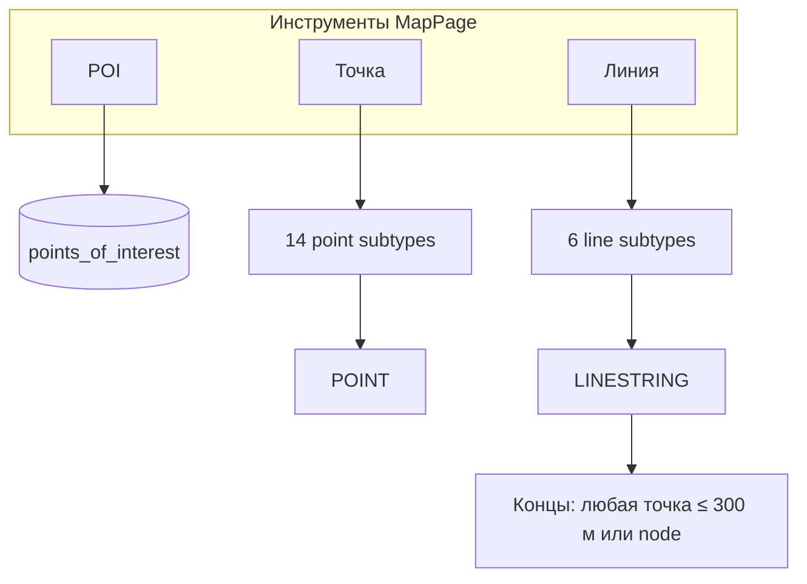
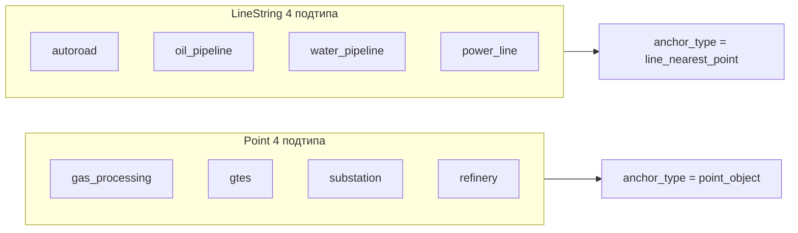
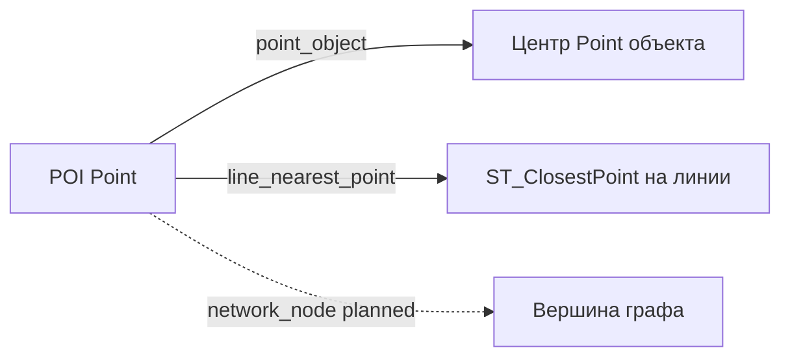
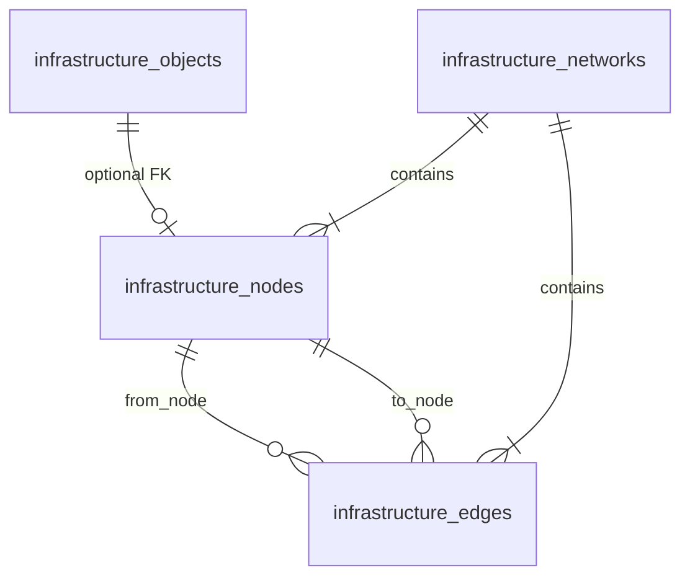

# Объекты карты и пространственные расчёты

Единая спецификация геометрии объектов на карте, якорей расчёта расстояний и операций PostGIS. Используется при реализации Map Module, анализа окружения и визуализации линий подключения.

**Связанные документы:** [requirements.md](./requirements.md) (FR-2.3, FR-2.4, FR-6, FR-10), [database-schema.md](./database-schema.md), [input-parameters.md](./input-parameters.md), [calculation-logic-flow.md](./calculation-logic-flow.md), [fluid-flow-schematic.md](./fluid-flow-schematic.md), [architecture.md](./architecture.md).

**Дата актуализации:** май 2026.

---

## 1. Таксономия объектов на карте

### 1.1 Классы по геометрии

| Класс | PostGIS | Подтипы (`subtype`) | Участие в автопоиске (MVP) |
|-------|---------|---------------------|----------------------------|
| **POI** | `POINT` | — | Источник расчётов; не слой инфраструктуры |
| **Точечная инфраструктура** | `POINT` | `gas_processing`, `gtes`, `substation`, `refinery` | Внешние (Outside POI), FR-6.1.2 |
| **Линейная инфраструктура** | `LINESTRING`, `MULTILINESTRING` | `autoroad`, `oil_pipeline`, `water_pipeline`, `power_line` | В MVP не в автопоиске внешних; объекты на карте для отображения, ручного выбора и post-MVP |
| **Вычисляемый** | — | `pads` | Не на карте |

> Полный справочник по каждому подтипу — **§1.4**.

### 1.2 Соответствие category ↔ subtype ↔ geometry

Краткая сводка; детали и правила импорта — **§1.4**.

| `category` (БД) | `subtype` | Допустимая геометрия | `param_type` |
|-------------------|-----------|----------------------|--------------|
| `road` | `autoroad` | `LINESTRING`, `MULTILINESTRING` | internal |
| `pipeline` | `oil_pipeline`, `water_pipeline` | `LINESTRING`, `MULTILINESTRING` | internal |
| `electricity` | `power_line` | `LINESTRING`, `MULTILINESTRING` | internal |
| `area_facility` | `gas_processing`, `gtes`, `refinery` | `POINT` | external (`gtes` — external при активности) |
| `electricity` | `substation` | `POINT` | external |

> **Примечание:** один физический объект на карте = одна строка `infrastructure_objects` с одной геометрией. Составной объект (несколько отрезков) — `MULTILINESTRING` или несколько записей в одном слое.

### 1.3 Слои и источники

Объекты принадлежат `infrastructure_layers` проекта (`source_type`: `corporate_api`, `csv_import`, `manual`). Импорт — см. **§1.4** (какие подтипы точечные, какие линейные).

- **Точечный CSV/GeoJSON:** `lat`, `lon` → `POINT`.
- **Линейный CSV:** `start_lat`, `start_lon`, `end_lat`, `end_lon` → `LINESTRING` (два конца); цепочки — GeoJSON `LineString` / `MultiLineString`.
- **Shapefile/KML:** тип геометрии из файла; валидация по подтипу (FR-2.5.4).

### 1.4 Справочник: точечные и линейные подтипы

**Правило:** один `subtype` = один тип геометрии. Смешанные типы для одного подтипа запрещены (`chk_io_geometry_by_subtype` в [database-schema.md](./database-schema.md)). **Polygon / MultiPolygon** для площадных объектов в MVP **не допускаются** — только маркер `POINT` (при импорте Spark полигон сводится к центроиду).

#### 1.5 Зависимость подтипа от вида объекта на карте

**Вид на карте** — способ создания и отображения в UI (`MapPage`, панель инструментов и карточка объекта). Подтип (`subtype`) жёстко привязан к геометрии: точечный подтип нельзя сохранить как линию и наоборот.

| `subtype` | Название UI | Вид на карте | Геометрия | `category` | Инструмент | Концы линии (300 м) | Автопоиск FR-6 | Анализ (км) | Порог POI |
|-----------|-------------|--------------|-----------|------------|------------|---------------------|----------------|-------------|-----------|
| — | Точка интереса | **POI** | `POINT` | — | «POI» | — | — | все параметры POI | — |
| `gas_processing` | ГКС | **Точка** | `POINT` | `area_facility` | «Точка» | — | да | external | 80 км |
| `ukg` | УКГ | **Точка** | `POINT` | `area_facility` | импорт Spark | — | нет | — | — |
| `tsg` | ТСГ | **Точка** | `POINT` | `area_facility` | импорт Spark | — | нет | — | — |
| `gtes` | ГТЭС | **Точка** | `POINT` | `area_facility` | «Точка» / импорт Spark | — | да (с `gpes`, `vies`) | external | 60 км |
| `gpes` | ГПЭС | **Точка** | `POINT` | `area_facility` | «Точка» / импорт Spark | — | да (с `gtes`, `vies`) | external | 60 км |
| `vies` | ВИЭС | **Точка** | `POINT` | `area_facility` | «Точка» | — | да (с `gtes`, `gpes`) | external | 60 км |
| `substation` | ПС/ТП | **Точка** | `POINT` | `electricity` | «Точка» | — | да | external | 25 км |
| `refinery` | НПЗ | **Точка** | `POINT` | `area_facility` | «Точка» / импорт Spark (`DeliveryAcceptancePoint`, `CentralProcessingFacility`) | — | да | external | 100 км |
| `node` | Узел | **Точка** | `POINT` | `network` | «Точка» / авто при рисовании линии | — | да (с `methanol_joint`) | — | — |
| `pad` | Куст | **Точка** | `POINT` | `pad` | «Точка» | — | нет | — | — |
| `preliminary_water_discharge_station` | УПСВ | **Точка** | `POINT` | `area_facility` | «Точка» | — | нет | — | — |
| `booster_pumping_station` | ДНС | **Точка** | `POINT` | `area_facility` | «Точка» | — | нет | — | — |
| `oil_pumping_station` | НПС | **Точка** | `POINT` | `area_facility` | импорт Spark | — | нет | — | — |
| `ground_pumping_station` | БКНС | **Точка** | `POINT` | `area_facility` | «Точка» | — | нет | — | — |
| `sand_quarry` | Карьер песка | **Точка** | `POINT` | `area_facility` | «Точка» / импорт Spark | — | нет (только этот подтип) | — | — |
| `methanol_facility` | Объект метанола | **Точка** | `POINT` | `area_facility` | импорт Spark | — | нет | — | — |
| `methanol_joint` | Узел метанола | **Точка** | `POINT` | `network` | импорт Spark / смена у «Узел» | — | да (с `node`) | — | — |
| `autoroad` | Автодорога | **Линия** | `LINESTRING` | `road` | «Линия» | любая **Точка** | нет | internal (4 типа) | — |
| `oil_pipeline` | Нефтепровод | **Линия** | `LINESTRING` | `pipeline` | «Линия» | любая **Точка** | нет | internal | — |
| `gas_pipeline` | Газопровод | **Линия** | `LINESTRING` | `pipeline` | «Линия» | любая **Точка** | нет | — | — |
| `water_pipeline` | Водопровод | **Линия** | `LINESTRING` | `pipeline` | «Линия» | любая **Точка** | нет | internal | — |
| `power_line` | ЛЭП | **Линия** | `LINESTRING` | `electricity` | «Линия» | любая **Точка** | нет | internal | — |
| `methanol_pipeline` | Метанолопровод | **Линия** | `LINESTRING` | `pipeline` | «Линия» | любая **Точка** | нет | — | — |
| `pads` | Кустовые площадки | **не на карте** | — | `pad` | расчёт POI | — | нет | internal | — |

**Пояснения:**

- **Вид «Точка» / «Линия»** — пункты меню на панели карты. В меню «Точка» нет **УКГ**, **ТСГ**, **НПС**, **объекта метанола**, отдельного пункта **узел метанола** (подтип `methanol_joint` — импорт Spark или смена у **Узел**). В меню есть **Узел** (`node`). **ГКС** и **НПЗ** (`refinery`) — в меню «Точка». Spark **ПСП** (`DeliveryAcceptancePoint`) импортируется как **НПЗ** (`refinery`).
- **API площадных объектов НПЗ / НПС:** `POST /projects/{project_id}/infrastructure/facility-objects` — в теле **обязательно** `subtype`: `refinery` | `oil_pumping_station` (схема `FacilityInfraObjectCreate`). Общий `POST .../objects` для НПС вернёт 400 с подсказкой использовать этот endpoint.
- **Карточка объекта** (`ObjectDetailPanel`, поле «Подтип»): линейные ↔ только линейные; точечные ↔ точечные. **Группа ГКС:** `gas_processing` / `ukg` / `tsg` → только **ГКС, УКГ, ТСГ**. **Группа ГТЭС:** `gtes` / `gpes` / `vies` → только **ГТЭС, ГПЭС, ВИЭС** (анализ POI по-прежнему одна строка «ГТЭС», ближайший — любой из трёх). **Группа узлов:** `node` / `methanol_joint` → **Узел**, **Узел метанола**. **Эксклюзивные** (не в списке у других): карьер песка, объект метанола. **Фиксированные:** `sand_quarry`, `ground_pumping_station`, НПС, объект метанола.
- **Концы линии:** в пределах **0,3 км** от ближайшего точечного объекта любого подтипа; иначе при рисовании создаётся `node` (`line_endpoint_rules.ts`, `lineEndpointRules.ts`).
- **Анализ (км):** `autoroad`, `oil_pipeline`, `water_pipeline`, `power_line` — нормы км/КП; внешние Point — поиск в окружении; `gas_pipeline` / метанол / насосные станции в матрице анализа MVP не задействованы.
- **Импорт Spark:** полигоны площадных типов → `POINT` (центроид); см. [spark-import-mapping.md](./spark-import-mapping.md).



#### 1.4.1 Инфраструктура на карте (8 подтипов)

| Геометрия | `subtype` | Название UI | `category` | Inside / Outside | На карте MVP | Автопоиск FR-6.1.2 |
|-----------|-----------|-------------|------------|----------------|--------------|----------------------|
| **POINT** | `gas_processing` | ГКС | `area_facility` | external | да | да |
| **POINT** | `gtes` | ГТЭС / ГПЭС | `area_facility` | external (при активности) | да | да (если активен) |
| **POINT** | `substation` | ПС / ТП | `electricity` | external | да | да |
| **POINT** | `refinery` | НПЗ | `area_facility` | external | да | да |
| **LINESTRING** | `autoroad` | Автодорога | `road` | internal | да | нет |
| **LINESTRING** | `oil_pipeline` | Нефтепровод | `pipeline` | internal | да | нет |
| **LINESTRING** | `water_pipeline` | Водопровод | `pipeline` | internal | да | нет |
| **LINESTRING** | `power_line` | ЛЭП | `electricity` | internal | да | нет |

Для линейных подтипов допустим также `MULTILINESTRING` (несколько отрезков одного объекта).

#### 1.4.2 Сущности вне `infrastructure_objects`

| Сущность | Геометрия | Примечание |
|----------|-----------|------------|
| POI | `POINT` | `points_of_interest`, FR-2.3.8 |
| Кустовые площадки (`pads`) | — | только расчёт по объёму добычи, не на карте |

#### 1.4.3 Якорь расчёта по типу геометрии



- **4 точечных (external):** автопоиск ближайшего на карте; расстояние до маркера.
- **4 линейных (internal):** отображение и импорт как LineString; автопоиск внешних не использует; расстояние до линии — при ручном выборе объекта / в сценарии (`ST_ClosestPoint`).

#### 1.4.4 Импорт и ручной ввод

| Способ | Подтипы | Формат | Инструмент на карте |
|--------|---------|--------|---------------------|
| Точечный | `gas_processing`, `gtes`, `substation`, `refinery` | CSV: `name`, `type`, `lat`, `lon`; GeoJSON `Point` | «Точка» |
| Линейный | `autoroad`, `oil_pipeline`, `water_pipeline`, `power_line` | CSV: `name`, `type`, `start_lat`, `start_lon`, `end_lat`, `end_lon`; GeoJSON `LineString` | «Линия» |

**Валидация при импорте (FR-2.5.4):**

| Ошибка | Пример |
|--------|--------|
| Линейный подтип с `lat`/`lon` без концов отрезка | `type=autoroad`, только `lat`, `lon` |
| Точечный подтип с координатами отрезка | `type=gas_processing`, `start_lat`, `end_lat` |
| Polygon для площадного подтипа | GeoJSON `Polygon` для `refinery` |

### 1.6 Пропускная способность точечных объектов (PFD и карта)

Для части **точечных** подтипов в `ObjectDetailPanel` доступно поле **«Пропускная способность»**. Значения хранятся в JSONB `infrastructure_objects.properties`:

| Ключ | Тип | Единица |
|------|-----|---------|
| `throughput_capacity_annual` | number | тыс. т/год или тыс. м³/год |
| `capacity_unit` | string | `thousand_t_per_year` (default) \| `thousand_m3_per_year` |

**Поле показывается** для всех точечных подтипов, **кроме:** `node`, `pad`, `sand_quarry`, `substation`, `vies`, `gtes`, `gpes`.

**Роль на схеме потоков ([fluid-flow-schematic.md](./fluid-flow-schematic.md)):**

- **`ground_pumping_station` (БКНС)** — единственный терминал водной ветки при централизованной закачке; далее узел **«В пласт»**.
- Лимит терминала на авто-схеме подтягивается из `properties` связанного объекта карты.
- **Объём закачки** (`water_injection_volume` POI) отображается на блоке **«В пласт»**, не в карточке БКНС.

Код frontend: `lib/infraCapacity.ts`, `ObjectDetailPanel.tsx`. Backend: `flow_capacity.py`, `fluid_flow_schematic.py`.

---

## 2. Якорь расчёта (`anchor_type`)

Расстояние в анализе и на карте измеряется **от POI до якоря** — точки, к которой привязан результат и линия подключения (FR-10.3).



### 2.1 Режимы MVP

| `anchor_type` | Целевая геометрия | Расстояние `distance_km` | `anchor_geometry` |
|---------------|-------------------|--------------------------|-------------------|
| `point_object` | `POINT` | Geodesic POI → точка объекта | = геометрия объекта |
| `line_nearest_point` | `LINESTRING` / `MULTILINESTRING` | Geodesic POI → ближайшая точка **на** линии | `ST_ClosestPoint(line, poi)` |

**Важно:** для линии якорь **не обязан** совпадать с концом отрезка или с вершиной полилинии — это ближайшая точка на геометрии.

### 2.2 Режим planned: `network_node`

После введения явного графа (§5) расстояние по прямой может считаться до **вершины** (`infrastructure_nodes.geometry`). Узел может:

- существовать только как топологическая вершина;
- ссылаться на точечный `infrastructure_objects` (`infrastructure_object_id`).

В UI: показывать имя узла и при наличии — связанный площадной объект.

### 2.3 Метод расстояния (`distance_method`)

| Значение | MVP | Описание |
|----------|-----|----------|
| `geodesic` | да | `ST_Distance(...::geography)` в метрах, результат в км |
| `along_network` | planned | Длина пути по рёбрам графа (не входит в MVP) |

---

## 3. Пространственные операции

### 3.1 Поиск ближайшего объекта по подтипу (FR-2.4.1, FR-6.1.2)

**Область поиска:** объекты проекта (`infrastructure_layers.project_id` = проект POI) с заданным `subtype`.

**Алгоритм MVP:**

1. Отфильтровать активные объекты подтипа (и слои с `visible` при необходимости UI).
2. Для каждого кандидата вычислить `distance_km` и `anchor_geometry` по правилу §2.1.
3. Выбрать запись с минимальным `distance_km`.
4. Сохранить в `poi_infrastructure_analysis`: `nearest_object_id`, `distance_km`, `anchor_type`, `anchor_geometry`.

**Точечный подтип (внешний):**

```sql
SELECT io.id,
       ST_Distance(poi.geometry::geography, io.geometry::geography) / 1000.0 AS distance_km,
       io.geometry AS anchor_geometry,
       'point_object'::text AS anchor_type
FROM infrastructure_objects io
JOIN infrastructure_layers il ON il.id = io.layer_id
JOIN points_of_interest poi ON poi.id = :poi_id
WHERE il.project_id = poi.project_id
  AND io.subtype = :subtype
  AND ST_GeometryType(io.geometry) IN ('ST_Point', 'ST_MultiPoint')
ORDER BY distance_km
LIMIT 1;
```

**Линейный подтип** (ручной выбор / post-MVP автопривязка внутренних):

```sql
SELECT io.id,
       ST_Distance(poi.geometry::geography, io.geometry::geography) / 1000.0 AS distance_km,
       ST_ClosestPoint(io.geometry, poi.geometry) AS anchor_geometry,
       'line_nearest_point'::text AS anchor_type
FROM infrastructure_objects io
JOIN infrastructure_layers il ON il.id = io.layer_id
JOIN points_of_interest poi ON poi.id = :poi_id
WHERE il.project_id = poi.project_id
  AND io.subtype = :subtype
  AND ST_GeometryType(io.geometry) IN ('ST_LineString', 'ST_MultiLineString')
ORDER BY distance_km
LIMIT 1;
```

### 3.2 Сравнение с порогом

| Ветка | Порог | Сравнение |
|-------|-------|-----------|
| Внешние Point | `max_distance_*_km` | geodesic `distance_km` |
| Internal linear | `max_total_line_*_km` | `pads_count × km_per_pad` |

`max_allowed_distance_km` в `poi_infrastructure_analysis` — snapshot соответствующего порога на момент расчёта. Функция: `calc_distance_status` — [calculation-functions.md](./calculation-functions.md) §2, §4.2.

### 3.3 Объекты в радиусе / bbox (Map Module)

| Операция | Point | LineString |
|----------|-------|------------|
| `ST_DWithin(poi, geom, radius_m)` | да | да (расстояние до линии ≤ radius) |
| `ST_Intersects(bbox, geom)` | да | да |
| Кластеризация (FR-2.4.3) | да | не применяется |

### 3.4 Связь с расчётом стоимости

| Подтип | Источник `distance_km` | Формула стоимости |
|--------|------------------------|-------------------|
| Внешние Point | автопоиск, `distance_source = geodesic`, `anchor_type = point_object` | фиксированная ставка (FR-7.3.2) |
| Внутренние линейные | `pads_count × km_per_pad` (FR-5.3.4), `distance_source = pads_per_pad_formula` | distance × ставка ₽/км (FR-7.3.1) |
| `pads` | формула по объёму добычи | количество × ставка за шт. |

См. [calculation-functions.md](./calculation-functions.md) §3.

---

## 4. Внутренние vs внешние подтипы

Не смешивать **наличие объектов на карте** и **автоматический поиск ближайшего** (FR-6.1.1).

| Группа | Подтипы | Объекты на карте | Автопоиск MVP |
|--------|---------|------------------|---------------|
| Внешние | `gas_processing`, `gtes`, `substation`, `refinery` | Point | да |
| Внутренние линейные | `autoroad`, `oil_pipeline`, `water_pipeline`, `power_line` | LineString (справочно) | нет — `distance_km = pads_count × km_per_pad` |
| Вычисляемые | `pads` | нет | нет |

### 4.1 Переопределение и карта

| Сценарий | Статус | Поведение |
|----------|--------|-----------|
| Базовый вариант | mvp | `distance_km = pads_count × km_per_pad`; объекты LineString на карте не обязательны |
| Сценарий: override длины (FR-6.3.5) | mvp | `distance_km` и/или `km_per_pad` вручную; `distance_source = manual_override` |
| Выбор LineString на карте для internal | post-MVP | Geodesic + `line_nearest_point` — не MVP |
| Автопривязка внутренних к карте | candidate | Единый поиск как для внешних |

---

## 5. Planned: явная модель графа

В MVP топология сети кодируется только геометрией `LineString`. В следующих версиях — отдельные сущности:



### 5.1 Сущности

| Таблица | Назначение |
|---------|------------|
| `infrastructure_networks` | Логическая сеть (слой + подтип, напр. «Нефтепроводы участка») |
| `infrastructure_nodes` | Вершина: `geometry POINT`, опционально `infrastructure_object_id` |
| `infrastructure_edges` | Ребро: `from_node_id`, `to_node_id`, `geometry LINESTRING`, `length_km` |

### 5.2 Построение из импорта

1. **LineString** с вершинами V0…Vn → узлы V0…Vn, рёбра (Vi, Vi+1).
2. **Point-объект** (НПЗ, ПС) → узел с `infrastructure_object_id`; привязка к сети при `ST_DWithin` ≤ `snap_tolerance_m`.
3. **Поиск ближайшего (planned):** min расстояния POI до узлов сети подтипа **или** до `line_nearest_point` на рёбрах — политика задаётся на уровне проекта (`settings.nearest_policy`).

### 5.3 Расчёт до вершины

- `anchor_type = network_node`
- `nearest_node_id` → FK `infrastructure_nodes`
- `distance_km` = geodesic(POI, node.geometry)
- Линия на карте: POI → node (не к центру площадного объекта, если узел смещён)

**Не MVP:** маршрут по сети (`distance_method = along_network`), стоимость по длине пути.

---

## 6. Визуализация на карте

| Элемент | Правило |
|---------|---------|
| Маркер инфраструктуры Point | `geometry` объекта |
| Линия инфраструктуры | `geometry` LineString |
| Пороговый радиус | круг вокруг POI (FR-10.2) |
| Линия подключения сценария | POI → `anchor_geometry` из анализа/варианта (FR-10.3) |
| Подпись расстояния | `distance_km` у якоря |

---

## 7. API (целевой контракт)

См. [architecture.md](./architecture.md).

См. [calculation-functions.md](./calculation-functions.md) §7 (API-контракт `NearestInfrastructureResult`).

---

## 8. Матрица операций по типу геометрии

| Операция | Point | LineString | Graph (planned) |
|----------|-------|------------|-----------------|
| Расстояние по прямой от POI | да | да (до точки на линии) | да (до вершины) |
| Поиск ближайшего по подтипу | да | да | да |
| Сравнение с порогом | да | да | да |
| Стоимость distance × rate | — | да (внутренние) | planned |
| Стоимость fixed за объект | да (внешние) | — | — |
| Ручное переопределение | да | да | node/edge |
| ST_DWithin / bbox | да | да | да |
| Кластеризация | да | нет | — |

---

## История изменений

| Дата | Изменение |
|------|-----------|
| 2026-05 | Первая версия: таксономия Point/LineString, anchor_type, PostGIS, planned graph |
| 2026-05 | §1.4 справочник: 4 точечных + 4 линейных подтипа, импорт, запрет Polygon в MVP |
