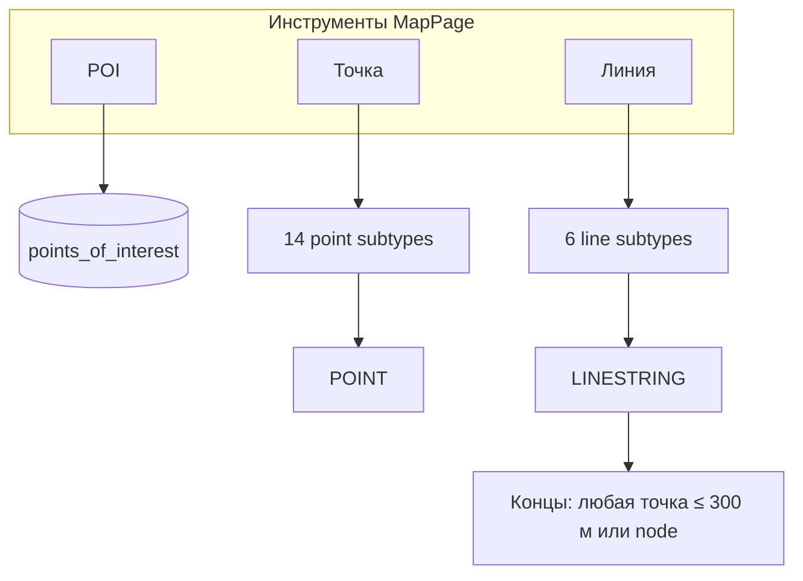
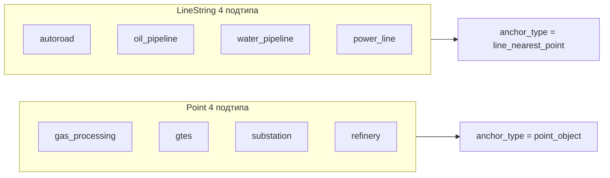
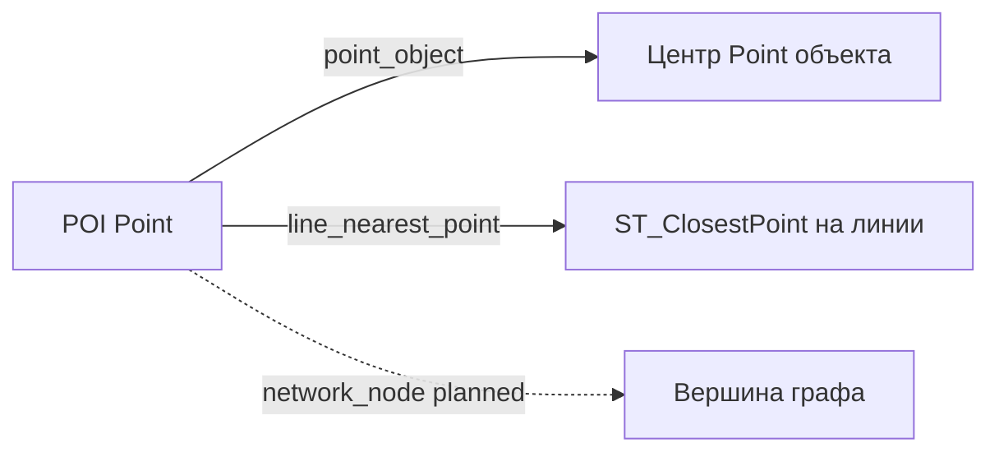
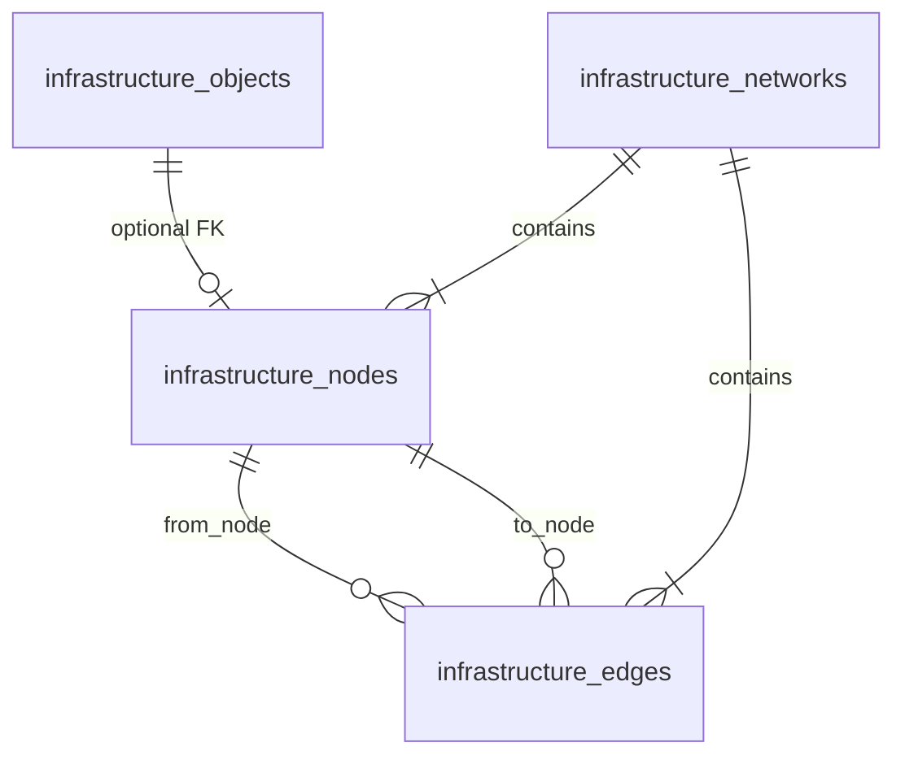

# Объекты карты и пространственные расчёты

Единая спецификация геометрии объектов на карте, якорей расчёта расстояний и операций PostGIS. Используется при реализации Map Module, анализа окружения и визуализации линий подключения.

**Связанные документы:** [requirements.md](./requirements.md) (FR-2.3, FR-2.4, FR-6, FR-10), [database-schema.md](./database-schema.md), [input-parameters.md](./input-parameters.md), [calculation-logic-flow.md](./calculation-logic-flow.md), [fluid-flow-schematic.md](./fluid-flow-schematic.md), [architecture.md](./architecture.md).

**Дата актуализации:** май 2026.

---

## 1. Таксономия объектов на карте

### 1.1 Классы по геометрии

| Класс | PostGIS | Подтипы (`subtype`) | Участие в автопоиске (MVP) |
|-------|---------|---------------------|----------------------------|
| **POI** | `POINT` | — | Источник расчётов; не слой инфраструктуры |
| **Точечная инфраструктура** | `POINT` | `gas_processing`, `gtes`, `substation`, `refinery` | Внешние (Outside POI), FR-6.1.2 |
| **Линейная инфраструктура** | `LINESTRING`, `MULTILINESTRING` | `autoroad`, `oil_pipeline`, `water_pipeline`, `power_line` | В MVP не в автопоиске внешних; объекты на карте для отображения, ручного выбора и post-MVP |
| **Вычисляемый** | — | `pads` | Не на карте |

> Полный справочник по каждому подтипу — **§1.4**.

### 1.2 Соответствие category ↔ subtype ↔ geometry

Краткая сводка; детали и правила импорта — **§1.4**.

| `category` (БД) | `subtype` | Допустимая геометрия | `param_type` |
|-------------------|-----------|----------------------|--------------|
| `road` | `autoroad` | `LINESTRING`, `MULTILINESTRING` | internal |
| `pipeline` | `oil_pipeline`, `water_pipeline` | `LINESTRING`, `MULTILINESTRING` | internal |
| `electricity` | `power_line` | `LINESTRING`, `MULTILINESTRING` | internal |
| `area_facility` | `gas_processing`, `gtes`, `refinery` | `POINT` | external (`gtes` — external при активности) |
| `electricity` | `substation` | `POINT` | external |

> **Примечание:** один физический объект на карте = одна строка `infrastructure_objects` с одной геометрией. Составной объект (несколько отрезков) — `MULTILINESTRING` или несколько записей в одном слое.

### 1.3 Слои и источники

Объекты принадлежат `infrastructure_layers` проекта (`source_type`: `corporate_api`, `csv_import`, `manual`). Импорт — см. **§1.4** (какие подтипы точечные, какие линейные).

- **Точечный CSV/GeoJSON:** `lat`, `lon` → `POINT`.
- **Линейный CSV:** `start_lat`, `start_lon`, `end_lat`, `end_lon` → `LINESTRING` (два конца); цепочки — GeoJSON `LineString` / `MultiLineString`.
- **Shapefile/KML:** тип геометрии из файла; валидация по подтипу (FR-2.5.4).

### 1.4 Справочник: точечные и линейные подтипы

**Правило:** один `subtype` = один тип геометрии. Смешанные типы для одного подтипа запрещены (`chk_io_geometry_by_subtype` в [database-schema.md](./database-schema.md)). **Polygon / MultiPolygon** для площадных объектов в MVP **не допускаются** — только маркер `POINT` (при импорте Искра полигон сводится к центроиду).

#### 1.5 Зависимость подтипа от вида объекта на карте

**Вид на карте** — способ создания и отображения в UI (`MapPage`, панель инструментов и карточка объекта). Подтип (`subtype`) жёстко привязан к геометрии: точечный подтип нельзя сохранить как линию и наоборот.

| `subtype` | Название UI | Вид на карте | Геометрия | `category` | Инструмент | Концы линии (300 м) | Автопоиск FR-6 | Анализ (км) | Порог POI |
|-----------|-------------|--------------|-----------|------------|------------|---------------------|----------------|-------------|-----------|
| — | Точка интереса | **POI** | `POINT` | — | «POI» | — | — | все параметры POI | — |
| `gas_processing` | ГКС | **Точка** | `POINT` | `area_facility` | «Точка» | — | да | external | 80 км |
| `ukg` | УКГ | **Точка** | `POINT` | `area_facility` | импорт Искра | — | нет | — | — |
| `tsg` | ТСГ | **Точка** | `POINT` | `area_facility` | импорт Искра | — | нет | — | — |
| `gtes` | ГТЭС | **Точка** | `POINT` | `area_facility` | «Точка» / импорт Искра | — | да (с `gpes`, `vies`) | external | 60 км |
| `gpes` | ГПЭС | **Точка** | `POINT` | `area_facility` | «Точка» / импорт Искра | — | да (с `gtes`, `vies`) | external | 60 км |
| `vies` | ВИЭС | **Точка** | `POINT` | `area_facility` | «Точка» | — | да (с `gtes`, `gpes`) | external | 60 км |
| `substation` | ПС/ТП | **Точка** | `POINT` | `electricity` | «Точка» | — | да | external | 25 км |
| `refinery` | НПЗ | **Точка** | `POINT` | `area_facility` | «Точка» / импорт Искра (`DeliveryAcceptancePoint`, `CentralProcessingFacility`) | — | да | external | 100 км |
| `node` | Узел | **Точка** | `POINT` | `network` | «Точка» / авто при рисовании линии | — | да (с `methanol_joint`, `power_line_node`) | — | — |
| `oil_pad` | Нефтяной куст | **Точка** | `POINT` | `pad` | «Куст» | — | да (с `gas_pad`) | — | — |
| `gas_pad` | Газовый куст | **Точка** | `POINT` | `pad` | импорт Искра / смена у «Куст» | — | да (с `oil_pad`) | — | — |
| `preliminary_water_discharge_station` | УПСВ | **Точка** | `POINT` | `area_facility` | «Точка» | — | нет | — | — |
| `booster_pumping_station` | ДНС | **Точка** | `POINT` | `area_facility` | «Точка» | — | нет | — | — |
| `oil_pumping_station` | НПС | **Точка** | `POINT` | `area_facility` | импорт Искра | — | нет | — | — |
| `ground_pumping_station` | БКНС | **Точка** | `POINT` | `area_facility` | «Точка» | — | нет | — | — |
| `sand_quarry` | Карьер песка | **Точка** | `POINT` | `area_facility` | «Точка» / импорт Искра | — | нет (только этот подтип) | — | — |
| `methanol_facility` | Объект метанола | **Точка** | `POINT` | `area_facility` | импорт Искра | — | нет | — | — |
| `methanol_joint` | Узел метанола | **Точка** | `POINT` | `network` | импорт Искра / смена у «Узел» | — | да (с `node`, `power_line_node`) | — | — |
| `power_line_node` | Узел ЛЭП | **Точка** | `POINT` | `electricity` | смена у «Узел» | — | да (с `node`, `methanol_joint`) | — | — |
| `offplot` | ВО | **Точка** | `POINT` | `area_facility` | «Точка» / импорт Искра | — | нет | — | — |
| `additional_facility` | Доп. объект | **Точка** | `POINT` | `area_facility` | «Точка» / импорт Искра | — | нет | — | — |
| `autoroad` | Автодорога | **Линия** | `LINESTRING` | `road` | «Линия» | любая **Точка** | нет | internal (4 типа) | — |
| `oil_pipeline` | Нефтепровод | **Линия** | `LINESTRING` | `pipeline` | «Линия» | любая **Точка** | нет | internal | — |
| `gas_pipeline` | Газопровод | **Линия** | `LINESTRING` | `pipeline` | «Линия» | любая **Точка** | нет | — | — |
| `water_pipeline` | Водопровод | **Линия** | `LINESTRING` | `pipeline` | «Линия» | любая **Точка** | нет | internal | — |
| `power_line` | ЛЭП | **Линия** | `LINESTRING` | `electricity` | «Линия» | любая **Точка** | нет | internal | — |
| `methanol_pipeline` | Метанолопровод | **Линия** | `LINESTRING` | `pipeline` | «Линия» | любая **Точка** | нет | — | — |
| `additional_line` | Доп. линия | **Линия** | `LINESTRING` | `other` | «Линия» / импорт Искра | любая **Точка** | нет | external_linear | — |
| `pads` | Кустовые площадки | **не на карте** | — | `pad` | расчёт POI | — | нет | internal | — |

**Иконки и цвета (2D, Lucide):** подтипы `oil_pad` и `gas_pad` используют одну иконку **`LandPlot`** (как у исходного «Куст»); различие — цвет маркера: **нефтяной** `#5d4037`, **газовый** `#fbc02d` ([`mapIcons.ts`](../decision-matrix/frontend/src/lib/mapIcons.ts)). В 3D оба подтипа — glTF `oil-pump-jack`, L1 высота 8 м ([`map3dModelCatalog.ts`](../decision-matrix/frontend/src/lib/map3d/map3dModelCatalog.ts)).

**Пояснения:**

- **Вид «Точка» / «Линия»** — пункты меню на панели карты. В меню «Точка» нет **УКГ**, **ТСГ**, **НПС**, **объекта метанола**, отдельного пункта **узел метанола** (подтип `methanol_joint` — импорт Искра или смена у **Узел**). В меню есть **Узел** (`node`). **ГКС** и **НПЗ** (`refinery`) — в меню «Точка». Искра **ПСП** (`DeliveryAcceptancePoint`) импортируется как **НПЗ** (`refinery`).
- **API площадных объектов НПЗ / НПС:** `POST /projects/{project_id}/infrastructure/facility-objects` — в теле **обязательно** `subtype`: `refinery` | `oil_pumping_station` (схема `FacilityInfraObjectCreate`). Общий `POST .../objects` для НПС вернёт 400 с подсказкой использовать этот endpoint.
- **Карточка объекта** (`ObjectDetailPanel`, поле «Подтип»): линейные ↔ только линейные; точечные ↔ точечные. **Группа ГКС:** `gas_processing` / `ukg` / `tsg` → только **ГКС, УКГ, ТСГ**. **Группа ГТЭС:** `gtes` / `gpes` / `vies` → только **ГТЭС, ГПЭС, ВИЭС** (анализ POI по-прежнему одна строка «ГТЭС», ближайший — любой из трёх). **Группа узлов:** `node` / `methanol_joint` / `power_line_node` → **Узел**, **Узел метанола**, **Узел ЛЭП** (отдельного пункта «Точка» для узла ЛЭП нет). **Группа кустов:** `oil_pad` / `gas_pad` → только **Нефтяной куст**, **Газовый куст**; в меню «Точка» один пункт **«Куст»** (`oil_pad` по умолчанию), `gas_pad` — импорт Искра или смена подтипа в карточке (legacy `pad` в API → `oil_pad`). **Эксклюзивные** (не в списке у других): карьер песка, объект метанола, **ВО** (`offplot`), **доп. объект** (`additional_facility`). **Фиксированные:** `sand_quarry`, `ground_pumping_station`, НПС, объект метанола, **ВО**, **доп. объект**.
- **Концы линии (хранение и отображение):** начало и конец в БД/API — **точные** `lon`/`lat` привязанного точечного объекта (любой подтип, допуск **0,3 км** при рисовании/редактировании). Нормализация: `normalizeLinePathEndpoints` ([`lineEndpointRules.ts`](../decision-matrix/frontend/src/lib/lineEndpointRules.ts)), отображение 2D/3D: `linePathForDisplay` ([`infraGeometry.ts`](../decision-matrix/frontend/src/lib/infraGeometry.ts)); пул привязки на карте — **все** объекты проекта (`infraSnapPool`), не только отфильтрованные слоем. Backend при create/update: `snap_line_endpoints_to_point_objects` ([`line_endpoint_rules.py`](../decision-matrix/backend/app/services/line_endpoint_rules.py)). При загрузке карты (если есть право записи) — одноразовое выравнивание устаревших концов (`lineEndpointHealPayload` → PATCH). **Групповое перемещение** точек тянет связанные линии по тем же правилам координат (`linkCoordMatch`, [`mapGroupLinePatches.ts`](../decision-matrix/frontend/src/lib/mapGroupLinePatches.ts)) — см. **§6.1.1**. Автотест паритета lon/lat всех вершин: [`linePath2d3dParity.test.ts`](../decision-matrix/frontend/src/lib/linePath2d3dParity.test.ts).
- **Рисование линии** (инструмент «Линия», только 2D):
  - **Начало** — обязательно на точечном объекте (клик по иконке или ≤300 м); иначе ошибка.
  - **Промежуточные вершины** — свободно (без snap к ближайшему объекту).
  - **Завершение** — двойной **ЛКМ** / двойной **ПКМ**, **Enter** или кнопка «Готово»; позиция конца из последнего клика/курсора (при Enter/«Готово» — с учётом превью курсора, если есть). Если конец ≤300 м от точечного объекта — привязка к его `lon`/`lat`; иначе создаётся **`node`** в этой точке, затем сохраняется линия. Если при этом узел попадает на геометрию **другой** линии (≤300 м, не у её концов) — эта линия **разделяется** на две части (как при установке точки на линию в режиме «Точка»).
  - Код: [`MapPage.tsx`](../decision-matrix/frontend/src/pages/MapPage.tsx) (`finishLineDraft`, `snapLineDrawPoint`), [`MapView.tsx`](../decision-matrix/frontend/src/components/MapView.tsx) (двойной клик/ПКМ).
- **Редактирование линии** (режим «Редактирование на карте», инструмент «Выбор»): перетаскивание вершин; **двойной ЛКМ** по **промежуточной** вершине удаляет её (концы линии не удаляются). Конец нельзя оставить «в воздухе» — при попытке оторвать от точечного объекта он возвращается на место (уведомление только при перетаскивании конца, не при правке средних вершин). После правки — `constrainLineCoordinatesOnEdit` + `normalizeLinePathEndpoints`. Код: `MapView.tsx`, `lineEndpointRules.ts`.
- **Координаты:** в **БД и API** — полная точность (`float`). В **UI** (строка координат, поля в карточке) — **3 знака** после запятой (`formatCoord`, `COORD_DECIMALS` в [`coords.ts`](../decision-matrix/frontend/src/lib/coords.ts)). Клики и перетаскивание на карте сохраняют полные координаты; `coordForSave` в формах не перезаписывает точное значение, если пользователь не менял округлённое отображение.
- **Анализ (км):** `autoroad`, `oil_pipeline`, `water_pipeline`, `power_line` — нормы км/КП; внешние Point — поиск в окружении; `gas_pipeline` / метанол / насосные станции / доп. линии в матрице анализа MVP не задействованы как internal.
- **Импорт Искра:** полигоны площадных типов → `POINT` (центроид); см. [spark-import-mapping.md](./spark-import-mapping.md).



#### 1.4.1 Инфраструктура на карте (8 подтипов)

| Геометрия | `subtype` | Название UI | `category` | Inside / Outside | На карте MVP | Автопоиск FR-6.1.2 |
|-----------|-----------|-------------|------------|----------------|--------------|----------------------|
| **POINT** | `gas_processing` | ГКС | `area_facility` | external | да | да |
| **POINT** | `gtes` | ГТЭС / ГПЭС | `area_facility` | external (при активности) | да | да (если активен) |
| **POINT** | `substation` | ПС / ТП | `electricity` | external | да | да |
| **POINT** | `refinery` | НПЗ | `area_facility` | external | да | да |
| **LINESTRING** | `autoroad` | Автодорога | `road` | internal | да | нет |
| **LINESTRING** | `oil_pipeline` | Нефтепровод | `pipeline` | internal | да | нет |
| **LINESTRING** | `water_pipeline` | Водопровод | `pipeline` | internal | да | нет |
| **LINESTRING** | `power_line` | ЛЭП | `electricity` | internal | да | нет |

Для линейных подтипов допустим также `MULTILINESTRING` (несколько отрезков одного объекта).

#### 1.4.2 Сущности вне `infrastructure_objects`

| Сущность | Геометрия | Примечание |
|----------|-----------|------------|
| POI | `POINT` | `points_of_interest`, FR-2.3.8 |
| Кустовые площадки (`pads`) | — | только расчёт по объёму добычи, не на карте |

#### 1.4.3 Якорь расчёта по типу геометрии



- **4 точечных (external):** автопоиск ближайшего на карте; расстояние до маркера.
- **4 линейных (internal):** отображение и импорт как LineString; автопоиск внешних не использует; расстояние до линии — при ручном выборе объекта или ручном override (`ST_ClosestPoint`).

#### 1.4.4 Импорт и ручной ввод

| Способ | Подтипы | Формат | Инструмент на карте |
|--------|---------|--------|---------------------|
| Точечный | `gas_processing`, `gtes`, `substation`, `refinery` | CSV: `name`, `type`, `lat`, `lon`; GeoJSON `Point` | «Точка» |
| Линейный | `autoroad`, `oil_pipeline`, `water_pipeline`, `power_line` | CSV: `name`, `type`, `start_lat`, `start_lon`, `end_lat`, `end_lon`; GeoJSON `LineString` | «Линия» |

**Валидация при импорте (FR-2.5.4):**

| Ошибка | Пример |
|--------|--------|
| Линейный подтип с `lat`/`lon` без концов отрезка | `type=autoroad`, только `lat`, `lon` |
| Точечный подтип с координатами отрезка | `type=gas_processing`, `start_lat`, `end_lat` |
| Polygon для площадного подтипа | GeoJSON `Polygon` для `refinery` |

### 1.6 Пропускная способность точечных объектов (PFD и карта)

Для части **точечных** подтипов в `ObjectDetailPanel` доступно поле **«Пропускная способность»**. Значения хранятся в JSONB `infrastructure_objects.properties`:

| Ключ | Тип | Единица |
|------|-----|---------|
| `throughput_capacity_annual` | number | тыс. т/год или тыс. м³/год |
| `capacity_unit` | string | `thousand_t_per_year` (default) \| `thousand_m3_per_year` |

**Поле показывается** для всех точечных подтипов, **кроме:** `node`, `oil_pad`, `gas_pad`, `sand_quarry`, `substation`, `vies`, `gtes`, `gpes`.

**Роль на схеме потоков ([fluid-flow-schematic.md](./fluid-flow-schematic.md)):**

- **`ground_pumping_station` (БКНС)** — единственный терминал водной ветки при централизованной закачке; далее узел **«В пласт»**.
- Лимит терминала на авто-схеме подтягивается из `properties` связанного объекта карты.
- **Объём закачки** (`water_injection_volume` POI) отображается на блоке **«В пласт»**, не в карточке БКНС.

Код frontend: `lib/infraCapacity.ts`, `ObjectDetailPanel.tsx`. Backend: `flow_capacity.py`, `fluid_flow_schematic.py`.

### 1.7 Объёмы песка (логистика)

Для расчёта **логистики песка** (`POST /projects/{id}/sand-logistics/analyze`) в `properties` используются отдельные ключи:

| Объект | Ключи | Единица |
|--------|--------|---------|
| `sand_quarry` | `sand_volume_initial_m3`, `sand_volume_current_m3` | м³ |
| Точечные потребители (все подтипы **кроме** `node`, `sand_quarry`) | `sand_volume_m3` | м³ — режим «Объём на дату ввода» (`sand_volume_mode: single`) |
| Те же потребители | `sand_volume_by_year` | объект `{ "YYYY": м³ }` — режим «План по годам» (`sand_volume_mode: yearly`) |
| Те же потребители | `sand_volume_mode` | `single` \| `yearly` — способ задания спроса в карточке объекта |

**Горизонт расчёта:** `POST .../sand-logistics/analyze` принимает тело `{ "horizon_from": "YYYY-MM-DD", "horizon_to": "YYYY-MM-DD", "as_of": "YYYY-MM-DD" }`. По умолчанию `horizon_from` — минимальная `entry_date` среди карьеров, потребителей с планом и видимых `autoroad`; `horizon_to` — максимум из последней даты ввода и последнего года в `sand_volume_by_year` (конец года, 31.12). `as_of` — срез для сохранённых `subnets` (по умолчанию `horizon_to`). На вкладке **Потоки → Логистика** конец горизонта можно скорректировать вручную; **срез для схемы** меняется без повторного расчёта (данные из `timeline[]`).

**Годовая симуляция:** backend пошагово (календарный год) наращивает спрос (`demand_increment_for_year`) **глобально для всех введённых потребителей** (независимо от связности с карьером в этот год), вводит карьеры и автодороги по `entry_date`, выполняет **жадное** распределение на **неудовлетворённый остаток** (`cumulative_demand − cumulative_allocated`) с depletion `sand_volume_current_m3`. Неудовлетворённый объём **переносится** на следующие годы и отгружается, когда появляется доступный карьер и путь (режим «ожидание песка»). Потребитель не исключается из расчёта: спрос в режиме *single* начисляется в год ввода, отгрузка — при первой возможности. В ответе: `timeline[]` — снимки подсетей на 31.12 каждого года; у потребителей — `allocation_by_year_m3` (фактическая отгрузка по годам; накопительно в `greedy_allocated_m3` на срезе).

**Спрос на дату (срез):** режим задаётся `sand_volume_mode`. На срезе `as_of` в `subnets` и в элементе `timeline` — **накопительный** спрос и отгрузка к 31.12 года среза. В режиме **yearly** — сумма плановых годов от ввода до года среза; **single** — полный объём в год ввода. Поля: `demand_m3`, `demand_plan_total_m3`, `demand_by_year_m3`, `allocation_by_year_m3`.

**Жадное распределение:** порядок обработки потребителей — сначала по расстоянию до ближайшего карьера, при равной дистанции — по более ранней `entry_date`.

**Привязка к сети:** перед расчётом backend пересобирает топологию (`build_network_from_lines`) — автоматически при **создании линии**, **импорте** и при **`POST .../sand-logistics/analyze`** (флаг `rebuild_network`); явный вызов — `POST .../infrastructure/networks/build`. **Расчётный граф (узлы/рёбра) на карте не отображается** — только в БД и в ответах API (схемы «Потоки», логистика песка). Точечный объект участвует в подсети только если он **не дальше 0,3 км от геометрии линии** `autoroad` (как при привязке концов линии на карте), затем привязывается к ближайшему узлу этой автодороги. Объекты вне дорог (например, ДНС без подъезда) **не попадают** в схему, таблицы подсети и расчёт — только в предупреждения (`too_far_from_autoroad`). Кратчайшие пути — **Dijkstra** по рёбрам `autoroad`.

**Подсети:** граф автодорог разбивается на связные компоненты. В расчёт и на схему потоков попадают только карьеры и потребители, чей узел привязки лежит в одной компоненте **с хотя бы одним карьером**. Каждая такая компонента — отдельная **подсеть** (`subnets[]` в ответе API): своя схема, таблицы и распределение объёмов. Потребители в компонентах без карьера или карьеры вне связи с потребителями по автодорогам — в предупреждениях (`no_quarry_in_subnet`, `not_in_quarry_subnet`).

Код: `app/geo/sand_properties.py`, `app/services/sand_logistics.py`, frontend `lib/infraSandVolumes.ts`, вкладка **Потоки → Логистика**. После расчёта таблица **«Плечо возки»** (карьер, объём, км) — для **всех точечных объектов с полем спроса** (`sand_volume_m3`, кроме `node` и `sand_quarry`): вкладка **Логистика** карточки на карте, столбец на **Параметры → Песок**, колонка в таблице потребителей на **Потоки → Логистика** (`lib/sandLogisticsHaulLegs.ts`).

#### 1.7.1 Схема движения песка (React Flow)

На вкладке **Потоки → Логистика** для каждой подсети отображается интерактивная схема (`SandLogisticsFlowSchematic`, `lib/sandLogisticsFlow.ts`, `lib/sandLogisticsNodeVisual.ts`, `SandLogisticsSchematicTimeline`).

**Срез на дату:** временная шкала с чипами годов горизонта, ползунком и кнопками ‹ ›; переключение среза **не вызывает** повторный `POST analyze`. Таблицы и объёмы на срезе — из `timeline[viewAsOf]`; топология схемы — из **канонической** подсети (`result.subnets[]`), объёмы и `in_service` — через `resolveSubnetForSchematicAtView` (`lib/sandLogisticsResult.ts`).

**Все объекты на схеме:** при любом годе среза на canvas остаются **все** карьеры и потребители подсети (по lon/lat и snap из финального расчёта). Не введённые к срезу — **серые** (статус `future`), с нулевой отгрузкой; дорожная сеть и плановые плечи сохраняются. Вкладки подсетей всегда показывают полный список из `result.subnets`, даже если на раннем годе в `timeline` меньше активных подсетей.

**Производительность среза:** раскладка блоков (`buildSandLogisticsLayout`, geo-frame + `resolveSiteLayout`) кэшируется по топологии; смена года пересчитывает только потоки и стили узлов (`buildSandLogisticsSliceFlow`). React Flow **не remount'ится**; zoom/pan сохраняются. Slice-подсети прогреваются в idle (`prefetchSchematicSubnetsAtView`).

**Геопривязка и читаемость:** позиции блоков строятся по lon/lat и snap узлов (`buildGeoFrame` только по объектам подсети); адаптивные зазоры при плотной подсети (`computeSiteDensitySpread`). Кнопка «По карте» — синхронный `defaultViewport` по bbox объектов.

**Состояния узлов потребителя:**

| Визуал | Условие |
|--------|---------|
| Пунктир, «ввод DD.MM.YYYY», «план N м³» | `entry_date > as_of` (не введён) |
| Зелёный, «X / Y м³» | введён, отгрузка ≥ спроса на дату |
| Жёлтый | частичная отгрузка |
| Оранжевый, «· нет отгрузки» | введён, отгрузка 0 (карьер исчерпан или очередь жадного алгоритма) |
| «Σ Z м³ плана» | `demand_plan_total_m3 > demand_m3` (план шире среза на дату) |

**Потоки:** оранжевые участки автодорог и подписи объёма — только для **фактической** жадной отгрузки. **Плановые плечи** (пунктир slate) — к будущим потребителям по кратчайшему пути к **ближайшему активному** карьеру (`nearest_quarry_id`); без объёма на сегментах сети.

**Панель «Схема»:** фильтр объектов («Все с планом» / «Только введённые» / «С отгрузкой»), переключатель плановых плеч, группировка по году ввода (лёгкий сдвиг по Y), режим подписей объёма, форма линий (прямые / изгибы / ступеньки). При активной временной шкале фильтр на схеме принудительно «Все с планом», чтобы будущие объекты оставались видимыми. Настройки — в `sessionStorage` на проект.

**Ограничения:** плановое плечо не строится, если в подсети нет введённого карьера; группировка по году не меняет геопривязку, только смещает блоки внутри раскладки. Объекты без `snap_node_id` или вне 0,3 км от автодороги на схему не попадают (предупреждения в таблице).

### 1.8 Дата ввода

| Объект | Ключ | Формат | По умолчанию |
|--------|------|--------|--------------|
| Все точечные и линейные **кроме** `node` | `entry_date` | ISO `YYYY-MM-DD` | `2020-01-01` |

В **логистике песка** в отгрузку попадают только объекты и участки автодорог с `entry_date ≤ as_of` (дата расчёта, выбирается на **Потоки → Логистика**). Остальные отображаются в таблицах с пометкой «не введён», без отгрузки; спрос по годам может быть виден в плане, но не учитывается до ввода.

Код: `app/geo/entry_date.py`, frontend `lib/infraEntryDate.ts`, **Параметры → Дата ввода**, карточка объекта на карте.

---

## 2. Якорь расчёта (`anchor_type`)

Расстояние в анализе и на карте измеряется **от POI до якоря** — точки, к которой привязан результат и линия подключения (FR-10.3).



### 2.1 Режимы MVP

| `anchor_type` | Целевая геометрия | Расстояние `distance_km` | `anchor_geometry` |
|---------------|-------------------|--------------------------|-------------------|
| `point_object` | `POINT` | Geodesic POI → точка объекта | = геометрия объекта |
| `line_nearest_point` | `LINESTRING` / `MULTILINESTRING` | Geodesic POI → ближайшая точка **на** линии | `ST_ClosestPoint(line, poi)` |

**Важно:** для линии якорь **не обязан** совпадать с концом отрезка или с вершиной полилинии — это ближайшая точка на геометрии.

### 2.2 Режим planned: `network_node`

После введения явного графа (§5) расстояние по прямой может считаться до **вершины** (`infrastructure_nodes.geometry`). Узел может:

- существовать только как топологическая вершина;
- ссылаться на точечный `infrastructure_objects` (`infrastructure_object_id`).

В UI: показывать имя узла и при наличии — связанный площадной объект.

### 2.3 Метод расстояния (`distance_method`)

| Значение | MVP | Описание |
|----------|-----|----------|
| `geodesic` | да | `ST_Distance(...::geography)` в метрах, результат в км |
| `along_network` | planned | Длина пути по рёбрам графа (не входит в MVP) |

---

## 3. Пространственные операции

### 3.1 Поиск ближайшего объекта по подтипу (FR-2.4.1, FR-6.1.2)

**Область поиска:** объекты проекта (`infrastructure_layers.project_id` = проект POI) с заданным `subtype`.

**Алгоритм MVP:**

1. Отфильтровать активные объекты подтипа (и слои с `visible` при необходимости UI).
2. Для каждого кандидата вычислить `distance_km` и `anchor_geometry` по правилу §2.1.
3. Выбрать запись с минимальным `distance_km`.
4. Сохранить в `poi_infrastructure_analysis`: `nearest_object_id`, `distance_km`, `anchor_type`, `anchor_geometry`.

**Точечный подтип (внешний):**

```sql
SELECT io.id,
       ST_Distance(poi.geometry::geography, io.geometry::geography) / 1000.0 AS distance_km,
       io.geometry AS anchor_geometry,
       'point_object'::text AS anchor_type
FROM infrastructure_objects io
JOIN infrastructure_layers il ON il.id = io.layer_id
JOIN points_of_interest poi ON poi.id = :poi_id
WHERE il.project_id = poi.project_id
  AND io.subtype = :subtype
  AND ST_GeometryType(io.geometry) IN ('ST_Point', 'ST_MultiPoint')
ORDER BY distance_km
LIMIT 1;
```

**Линейный подтип** (ручной выбор / post-MVP автопривязка внутренних):

```sql
SELECT io.id,
       ST_Distance(poi.geometry::geography, io.geometry::geography) / 1000.0 AS distance_km,
       ST_ClosestPoint(io.geometry, poi.geometry) AS anchor_geometry,
       'line_nearest_point'::text AS anchor_type
FROM infrastructure_objects io
JOIN infrastructure_layers il ON il.id = io.layer_id
JOIN points_of_interest poi ON poi.id = :poi_id
WHERE il.project_id = poi.project_id
  AND io.subtype = :subtype
  AND ST_GeometryType(io.geometry) IN ('ST_LineString', 'ST_MultiLineString')
ORDER BY distance_km
LIMIT 1;
```

### 3.2 Сравнение с порогом

| Ветка | Порог | Сравнение |
|-------|-------|-----------|
| Внешние Point | `max_distance_*_km` | geodesic `distance_km` |
| Internal linear | `max_total_line_*_km` | `pads_count × km_per_pad` |

`max_allowed_distance_km` в `poi_infrastructure_analysis` — snapshot соответствующего порога на момент расчёта. Функция: `calc_distance_status` — [calculation-functions.md](./calculation-functions.md) §2, §4.2.

### 3.3 Объекты в радиусе / bbox (Map Module)

| Операция | Point | LineString |
|----------|-------|------------|
| `ST_DWithin(poi, geom, radius_m)` | да | да (расстояние до линии ≤ radius) |
| `ST_Intersects(bbox, geom)` | да | да |
| Кластеризация (FR-2.4.3) | да | не применяется |

### 3.4 Связь с расчётом стоимости

| Подтип | Источник `distance_km` | Формула стоимости |
|--------|------------------------|-------------------|
| Внешние Point | автопоиск, `distance_source = geodesic`, `anchor_type = point_object` | фиксированная ставка (FR-7.3.2) |
| Внутренние линейные | `pads_count × km_per_pad` (FR-5.3.4), `distance_source = pads_per_pad_formula` | distance × ставка ₽/км (FR-7.3.1) |
| `pads` | формула по объёму добычи | количество × ставка за шт. |

См. [calculation-functions.md](./calculation-functions.md) §3.

---

## 4. Внутренние vs внешние подтипы

Не смешивать **наличие объектов на карте** и **автоматический поиск ближайшего** (FR-6.1.1).

| Группа | Подтипы | Объекты на карте | Автопоиск MVP |
|--------|---------|------------------|---------------|
| Внешние | `gas_processing`, `gtes`, `substation`, `refinery` | Point | да |
| Внутренние линейные | `autoroad`, `oil_pipeline`, `water_pipeline`, `power_line` | LineString (справочно) | нет — `distance_km = pads_count × km_per_pad` |
| Вычисляемые | `pads` | нет | нет |

### 4.1 Переопределение и карта

| Условие | Статус | Поведение |
|----------|--------|-----------|
| Базовый вариант | mvp | `distance_km = pads_count × km_per_pad`; объекты LineString на карте не обязательны |
| Условие: override длины (FR-6.3.5) | mvp | `distance_km` и/или `km_per_pad` вручную; `distance_source = manual_override` |
| Выбор LineString на карте для internal | post-MVP | Geodesic + `line_nearest_point` — не MVP |
| Автопривязка внутренних к карте | candidate | Единый поиск как для внешних |

---

## 5. Граф инфраструктуры (узлы и рёбра в БД)

В MVP топология хранится в таблицах `infrastructure_networks`, `infrastructure_nodes`, `infrastructure_edges` (построение из геометрии линий на карте — см. §1.7). **На карте OpenLayers граф не рисуется** (нет отдельного слоя узлов/рёбер); визуализация — только объекты инфраструктуры (Point/LineString), линии анализа POI и пороговые радиусы (§6).



### 5.1 Сущности

| Таблица | Назначение |
|---------|------------|
| `infrastructure_networks` | Логическая сеть (слой + подтип, напр. «Нефтепроводы участка») |
| `infrastructure_nodes` | Вершина: `geometry POINT`, опционально `infrastructure_object_id` |
| `infrastructure_edges` | Ребро: `from_node_id`, `to_node_id`, `geometry LINESTRING`, `length_km` |

### 5.2 Построение из импорта

1. **LineString** с вершинами V0…Vn → узлы V0…Vn, рёбра (Vi, Vi+1).
2. **Point-объект** (НПЗ, ПС) → узел с `infrastructure_object_id`; привязка к сети при `ST_DWithin` ≤ `snap_tolerance_m`.
3. **Поиск ближайшего (planned):** min расстояния POI до узлов сети подтипа **или** до `line_nearest_point` на рёбрах — политика задаётся на уровне проекта (`settings.nearest_policy`).

### 5.3 Расчёт до вершины

- `anchor_type = network_node`
- `nearest_node_id` → FK `infrastructure_nodes`
- `distance_km` = geodesic(POI, node.geometry)
- Линия на карте: POI → node (не к центру площадного объекта, если узел смещён)

**Не MVP:** маршрут по сети (`distance_method = along_network`), стоимость по длине пути.

---

## 6. Визуализация на карте

| Элемент | Правило |
|---------|---------|
| Маркер инфраструктуры Point | `geometry` объекта |
| Линия инфраструктуры | `geometry` LineString |
| Пороговый радиус | круг вокруг POI (FR-10.2) |
| Линия подключения POI | POI → `anchor_geometry` из анализа/варианта (FR-10.3) |
| Подпись расстояния | `distance_km` у якоря |
| **Расчётный граф (узлы/рёбра сети)** | **не отображается** — только backend/БД; схемы на вкладке «Потоки» |

### 6.1 Горячие клавиши и подсказки (MapPage)

| Клавиша | Действие |
|---------|----------|
| **E** | Включить/выключить «Редактирование на карте» |
| **Del** / **Backspace** | Удалить выбранный объект или группу |
| **Ctrl+C** | Копировать выбранный объект или группу (режим «Группа объектов» / одиночный выбор) |
| **Ctrl+V** | Вставить из буфера (следующий клик по карте — точка вставки) |
| **Ctrl+X** | Вырезать (копировать + удалить с подтверждением) |
| **Ctrl+Z** | Отменить последнее действие на карте |
| **Enter** | Завершить черновик линии (режим «Линия») |
| **Escape** | Закрыть модал, поиск или выйти из режима рисования |
| **Двойной ЛКМ** (режим «Линия») | Завершить линию; в пустом месте (>300 м) — создать `node` на конце |
| **Двойной ПКМ** (режим «Линия») | То же, что двойной ЛКМ |
| **Двойной ЛКМ** (выбор + редактирование, линия выбрана) | Удалить **промежуточную** вершину (не концы) |

Контекстные подсказки отображаются в footer карты (режим выбора, рисование, сохранение геометрии).

#### 6.1.1 Групповое перемещение (режим «Группа объектов»)

**Включение:** «Редактирование на карте» → «Выбор» → **«Группа объектов»** (рамка, не Ctrl+клик). Перетаскивание — за любой объект в выделении; клик в пустое место снимает выделение.

| Сценарий выделения | Поведение при drag / сохранении |
|--------------------|----------------------------------|
| Несколько **точек**, общая линия **не** в рамке | Линия обновляется: каждый перемещённый конец → новые `lon`/`lat` точки; остальные вершины без изменений. Оба конца одной линии в группе — **один** PATCH с merge обоих концов. |
| Точки **и** линия в рамке | Линия: `constrainGroupMovedLine` — концы на перемещённых опорах в новых координатах, на неперемещённых — координаты опоры из `infraSnapPool`; промежуточные вершины — сдвиг Translate. |
| Только **линия** | Концы не остаются «в воздухе»: snap/revert как при одиночном редактировании (`constrainLineCoordinatesOnEdit`). |
| Часть цепочки вне рамки | Неперемещённые узлы и их концы линий не меняются. |

**Визуализация во время drag (2D):** для точек в выделении `MapView` на событии `translating` подтягивает связанные линии, не попавшие в рамку (как при одиночном modify). После сохранения слой принудительно синхронизируется из `infraObjects` + `linePathForDisplay` (иначе возможны разрывы на экране при уже обновлённой длине в карточке объекта).

**Сохранение (frontend):** `handleBatchGeometryChange` (`MapPage`) — фаза планирования → PATCH точек/POI → PATCH линий; undo: `patch_geometry_group`. Расчёт патчей линий: [`mapGroupLinePatches.ts`](../decision-matrix/frontend/src/lib/mapGroupLinePatches.ts) (`accumulateLineEndpointPatches`, `constrainGroupMovedLine`). Связь концов с точками по координатам: [`infraLinks.ts`](../decision-matrix/frontend/src/lib/infraLinks.ts) (`linkCoordMatch`, `lineCoordsOrEndpoints`).

**Валидация (backend):** после PATCH линии — `validate_line_endpoint_matrix` (допуск **0,3 км**). Ошибка «Начальная/конечная точка линии не привязана…» означает, что сохранённые концы линии не совпали с точечными опорами (типично при частичном перемещении без merge концов — исправлено в batch-логике выше).

**Ограничения:** только 2D (`MapView`); copy/paste/cut группы — отдельно (§6.1, Ctrl+C/V/X). 3D-режим карты групповое перемещение не дублирует.

**Тесты:** [`mapGroupLinePatches.test.ts`](../decision-matrix/frontend/src/lib/mapGroupLinePatches.test.ts), интеграция — `batch move updates linked line when both endpoints move` в [`MapPage.mock.integration.test.tsx`](../decision-matrix/frontend/src/pages/MapPage.mock.integration.test.tsx).

#### 6.1.2 Загрузка и производительность карты

| Механизм | Поведение |
|----------|-----------|
| **Полный список** | `GET …/infrastructure/objects` без `bbox` — кэш React Query (`staleTime` ~5 мин), `infraSnapPool` для snap/heal/поиска |
| **Viewport** | При просмотре (не edit) и **≥80** объектов: `bbox` с буфером ~12%, backend — `ST_Intersects` (PostGIS) / envelope (SQLite); на карту — подмножество + выбранные id |
| **Snap** | Grid-index [`infraSnapIndex.ts`](../decision-matrix/frontend/src/lib/infraSnapIndex.ts) для `linePathForDisplay` |
| **LOD линий** | При zoom &lt; 12 — отображение только двух концов (после snap); полный path при zoom ≥ 12; сохранение всегда по полной геометрии |
| **Heal концов** | Один раз на проект (`localStorage`); сброс после импорта (`bumpMapRefresh`) |
| **Кластеризация точек** | Не используется (FR-2.4.3 вне текущей реализации) |

### 6.2 Поиск и dev-порт

- Поиск объектов на карте: название, подтип, имя слоя, строковые свойства (FR-2.3.6).
- В dev, если Vite поднял frontend не на порту **5173**, на странице карты показывается баннер с рекомендацией использовать `http://localhost:5173` (разные порты — разный origin и рассинхрон состояния).

### 6.3 Пересборка сети после удаления

При удалении линейного объекта (`LINE_SUBTYPES`) backend вызывает `build_network_from_lines` — топология в БД синхронизируется с оставшимися линиями. **Групповое удаление** (десятки объектов): один запрос `POST …/map/batch-delete` с массивом `object_ids` / `poi_ids` — одна транзакция и одна пересборка сети (не параллельные DELETE).

### 6.4 Режим 2.5D / 3D (MapLibre + Three.js, просмотр)

> Полное описание реализации: **[map-3d-features.md](./map-3d-features.md)**.

| Аспект | Правило |
|--------|---------|
| Редактирование | только **2D** (OpenLayers на `/map`) |
| Движок | **MapLibre GL JS** (база, extrusion, pick) + **Three.js** custom layers (точки glTF, линии-трубы) |
| Точечные объекты | glTF **Kenney** (CC0) или **custom GLB** проекта; палитра — только bundled; fallback — процедурная модель или `fill-extrusion` |
| Линейные объекты | 3D-трубы по DEM (`dm-3d-lines`), **прямые отрезки между вершинами** (как 2D `LineString`); корневая матрица слоя — отражение по **Z** (`makeScale(1, 1, -1)`), только линии; MapLibre-линия — только для клика |
| Рельеф | MapTiler Terrain RGB (`VITE_MAPTILER_KEY`), toggle «Рельеф (3D)» |
| Масштаб | `MAP3D_OBJECT_SCALE` (= 5) в `map3dConfig.ts` — модели, трубы, extrusion |
| Экраны | `/map`, превью отчёта (live), панель «Карта проекта» на `/matrix` |
| Снимок отчёта | экспорт `map_snapshot_base64` остаётся **2D** |
| Feature flag | `VITE_MAP_3D_ENABLED=true` при сборке frontend |

**L2-ключи в `infrastructure_objects.properties`:**

| Ключ | Тип | Назначение |
|------|-----|------------|
| `render_3d_height_m` | number | высота (м), перекрывает L1; на клиенте × `MAP3D_OBJECT_SCALE` |
| `render_3d_base_m` | number | смещение основания над terrain (м) |
| `render_3d_visible` | boolean | `false` — скрыть только в 3D |
| `render_3d_style` | string | `model` (по умолчанию для точек с каталогом), `extrusion` — столбик вместо glTF |
| `render_3d_model_id` | string | переопределение точки: пусто — Kenney по подтипу; `custom:{uuid}` — GLB, назначенный на подтип |
| `render_3d_scale` | number | множитель 0.1–10 (по умолчанию 1) |

**Custom GLB:** `project_map3d_models.assigned_subtypes` (массив подтипов); страница `/import-3d`; PATCH `custom:*` только если подтип объекта в списке. Подробно: [map-3d-features.md](./map-3d-features.md).

**L3 (клиент, реализовано):**

- glTF bundled: `frontend/public/map3d-models/*.glb` — [`map3dGltfAssets.ts`](../decision-matrix/frontend/src/lib/map3d/map3dGltfAssets.ts), [`map3dModelCatalog.ts`](../decision-matrix/frontend/src/lib/map3d/map3dModelCatalog.ts)
- Custom GLB: [`map3dCustomAssets.ts`](../decision-matrix/frontend/src/lib/map3d/map3dCustomAssets.ts), [`map3dCustomGlbFetch.ts`](../decision-matrix/frontend/src/lib/map3d/map3dCustomGlbFetch.ts) (Bearer на cross-origin), API `map3d-custom-models`
- Окраска bundled: [`map3dObjectPalette.ts`](../decision-matrix/frontend/src/lib/map3d/map3dObjectPalette.ts); custom — оригинальные PBR-текстуры
- Якорь модели: [`anchorGltfGroupAtFootprint`](../decision-matrix/frontend/src/lib/map3d/map3dGltfLoader.ts)
- Процедурный fallback: [`map3dModelMeshes.ts`](../decision-matrix/frontend/src/lib/map3d/map3dModelMeshes.ts)
- Линии: [`map3dLinesLayer.ts`](../decision-matrix/frontend/src/lib/map3d/map3dLinesLayer.ts)
- UI: панель «Слои» (`mapLayerPreferences.ts` — localStorage на проект); toggle «3D-модели объектов»

**Импорт:** `height_m` в CSV/GeoJSON → `render_3d_height_m`; Z в `[lon, lat, z]` → `render_3d_base_m` (`merge_geojson_render_3d`).

**API:** `render_3d_effective: { height_m, base_m, visible, scale }`; `GET/POST .../map3d-custom-models`.

**QA:** `python scripts/draw_demo_map_network.py` (backend); `npm run test -- src/lib/map3d`; `pytest tests/test_render_3d_*.py tests/test_map3d_custom_models.py`.

---

## 7. API (целевой контракт)

См. [architecture.md](./architecture.md).

См. [calculation-functions.md](./calculation-functions.md) §7 (API-контракт `NearestInfrastructureResult`).

---

## 8. Матрица операций по типу геометрии

| Операция | Point | LineString | Graph (planned) |
|----------|-------|------------|-----------------|
| Расстояние по прямой от POI | да | да (до точки на линии) | да (до вершины) |
| Поиск ближайшего по подтипу | да | да | да |
| Сравнение с порогом | да | да | да |
| Стоимость distance × rate | — | да (внутренние) | planned |
| Стоимость fixed за объект | да (внешние) | — | — |
| Ручное переопределение | да | да | node/edge |
| ST_DWithin / bbox | да | да | да |
| Кластеризация | да | нет | — |

---

## История изменений

| Дата | Изменение |
|------|-----------|
| 2026-06 | §6.1.1: групповое перемещение с привязкой линий (`mapGroupLinePatches`, merge концов, `translating` + resync слоя); §1.5 ссылка на batch |
| 2026-05 | Custom GLB: назначение на несколько подтипов (`assigned_subtypes[]`), `render_3d_scale`, якорь glTF, панель «Слои» в localStorage |
| 2026-05 | Cross-origin: Bearer + `map3dCustomGlbFetch` для `GET .../file`; sync CSRF/Bearer в `api.ts` — см. auth-rbac, map-3d-features §12 |
| 2026-05 | 3D-линии: отражение корневой матрицы по **Z** (`dm-3d-lines` only); точечные glTF без отражения |
| 2026-05 | Паритет вершин 2D/3D: единый `linePathForDisplay` + `infraSnapPool` (2D, GeoJSON pick, `buildNormalizedLinePath3d`, тест `linePath2d3dParity.test.ts`); коридор высот `planCorridorAlts`; snap при refresh рельефа |
| 2026-05 | §1.5: правила рисования линии (начало/середина/конец, `node`), точная привязка концов (`linePathForDisplay`, `infraSnapPool`, heal); координаты — полные в БД, 3 знака в UI; §6.1 hotkeys; 3D-трубы = прямые сегменты |
| 2026-05 | §6.4: glTF Kenney, Three.js линии, палитра, `MAP3D_OBJECT_SCALE`; см. [map-3d-features.md](./map-3d-features.md) |
| 2026-05 | §6.4: 2.5D/3D MapLibre, L2 `render_3d_*`, terrain MapTiler |
| 2026-05 | §6: hotkeys, поиск по свойствам, dev-port banner, пересборка сети после delete |
| 2026-05 | §5–§6: расчётный граф в БД, без слоя на карте; §1.7 пересборка сети на backend; редактирование линий (двойной ЛКМ — удаление промежуточной вершины) |
| 2026-05 | Первая версия: таксономия Point/LineString, anchor_type, PostGIS, planned graph |
| 2026-05 | §1.4 справочник: 4 точечных + 4 линейных подтипа, импорт, запрет Polygon в MVP |
