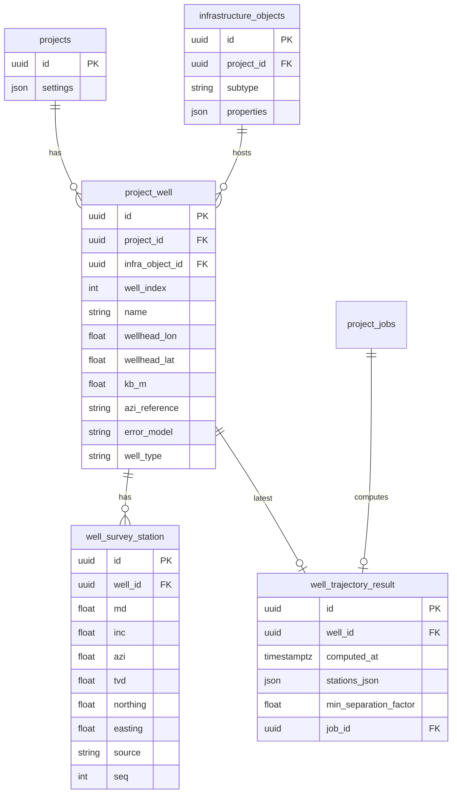

# Модель данных: траектории скважин

> **Статус:** **M1 в коде**; **M2 ✅** — JSON в `properties` куста, объекты `well_bottomhole_*`, блок `target` в `pad_wells_trajectories_json`. Миграций БД нет.  
> **См. также:** [well-trajectory.md](../features/well-trajectory.md), [well-trajectory-app-assessment.md](well-trajectory-app-assessment.md), [well-trajectory-roadmap.md](well-trajectory-roadmap.md), [pad-earthwork.md](../features/pad-earthwork.md), [input-parameters.md](../product/input-parameters.md).

**Дата:** июнь 2026.

---

## 1. Зачем этот документ

Здесь описано, **какие данные нужны** для расчёта трёхмерных траекторий скважин в Atlas Grid с помощью библиотек **welleng** и **PyWellGeo**:

- что уже хранится в приложении;
- чего не хватает;
- как связать новые данные с раскладкой устьев на **кусте** (`oil_pad`, `gas_pad`).

**Ориентир:** скважина и траектория всегда принадлежат объекту куста на карте.

**Условные обозначения** (используются далее):

| Сокращение | Расшифровка |
|------------|-------------|
| **MD** | measured depth — измеренная глубина по стволу, м |
| **TVD** | true vertical depth — вертикальная глубина, м |
| **inc** | inclination — зенитный угол наклона ствола, ° |
| **azi** | azimuth — азимут ствола, ° |
| **DLS** | dogleg severity — интенсивность искривления, °/30 м |
| **KB** | kelly bushing — высота устья (роторный стол), м |
| **SF** | separation factor — коэффициент безопасного расстояния при anti-collision |
| **Survey** | инклинометрия — набор замеров MD/inc/azi по стволу |
| **ENU** | локальная система «восток–север–вверх», м |

---

## 2. Что есть сейчас

### 2.1 Хранимые данные

| Где | Что хранится | Ограничение |
|-----|--------------|-------------|
| Свойства **куста** (`oil_pad` / `gas_pad`) | Число скважин, 2D-координаты устьев, поворот ряда, габариты, DEM, **`pad_wells_trajectories_json`**, настройки welleng | Survey в JSON после design; нет таблиц БД |
| Объекты **забоев** | `well_bottomhole_*` на карте | Связь с кустом через `well_bottomhole_linked_pad_id` |
| 3D-карта / «Кустование» | Extrusion кустов; **GeoJSON траекторий**; **PadClusteringScene3D** | Импорт CSV survey — фаза 4 |

### 2.2 Минимум для расчёта (библиотека welleng)

| Группа данных | Что нужно | Есть в Atlas Grid? |
|---------------|-----------|-------------------|
| **Устье** | Координаты (N/E или lon/lat), высота KB | **Да** — `pad_wells_local_json` + KB |
| **Система отсчёта** | Grid north, магнитное склонение, тип азимута | **Частично** — `well_trajectory_azi_reference` на кусте |
| **Проект** | Точки начала/конца траектории или набор станций MD/inc/azi | **Да** — после `design-from-bottomholes` |
| **Инклинометрия** | Массив `[{md, inc, azi}]` | **Да** — в `pad_wells_trajectories_json[].survey` |
| **Модель погрешностей** | Например, `ISCWSA MWD Rev5.11` | **Да** — в JSON скважины + `POST clearance` |
| **Anti-collision** | Пары скважин, порог SF | **Да** — `POST .../clearance`, `well_trajectory_clearance_pairs_json`, min_sf на скважине |

---

## 3. Целевая схема базы данных



**Таблицы (целевой вариант):**

- `project_well` — скважина на **кусте** (`infra_object_id` обязателен): устье, тип, модель погрешностей;
- `well_survey_station` — станции инклинометрии (проект / импорт / расчёт);
- `well_trajectory_result` — кэш последнего расчёта, минимальный SF, ссылка на фоновую задачу.

---

## 4. Как хранить: два варианта

### 4.1 Вариант A — JSON в свойствах куста (быстрый старт, фаза 1)

Без новых таблиц: массив в `InfrastructureObject.properties`, ключ **`pad_wells_trajectories_json`**.

```json
[
  {
    "well_index": 0,
    "name": "Скв-1",
    "well_type": "producer",
    "wellhead": {
      "east_m": 0,
      "north_m": 0,
      "kb_m": 151.0
    },
    "azi_reference": "grid",
    "error_model": "ISCWSA MWD Rev5.11",
    "design": {
      "profile": "connector",
      "start": { "md": 0, "inc": 0, "azi": 90 },
      "end": { "northing": 500, "easting": 800, "tvd": 2500 }
    },
    "target": {
      "source": "manual_map",
      "plan": { "east_m": 800, "north_m": 500 },
      "lon": 37.625,
      "lat": 55.762,
      "tvd_m": 2500,
      "inc": 90,
      "azi": 270,
      "placed_at": "2026-06-12T10:00:00Z"
    },
    "survey": {
      "source": "calculated",
      "stations": [
        { "md": 0, "inc": 0, "azi": 90, "tvd": 0, "n": 0, "e": 0 }
      ]
    },
    "clearance": {
      "min_sf": 1.85,
      "computed_at": "2026-06-12T10:00:00Z"
    }
  }
]
```

| Плюсы | Минусы |
|-------|--------|
| Быстро, по аналогии с земляными работами куста | Сложно импортировать траектории на весь проект |
| Один запрос на сохранение куста | Нет связей в БД, сложнее аудит |
| Индекс скважины совпадает с `pad_wells_local_json` | Большие survey раздувают JSON |

**Настройки по умолчанию на уровне проекта** — в `projects.settings.well_trajectory`:

```json
{
  "default_error_model": "ISCWSA MWD Rev5.11",
  "default_azi_reference": "grid",
  "sf_warning_threshold": 1.0,
  "units": "metric"
}
```

### 4.2 Вариант B — отдельные таблицы (целевой, фаза 2+)

Нормализованное хранение — см. ER-диаграмму выше.

**Переход A → B:** скрипт миграции разворачивает JSON-массив в строки таблиц; в properties куста можно оставить счётчик скважин для совместимости со старым UI.

---

## 5. Откуда брать данные: связь с тем, что уже есть

### 5.1 Устье из раскладки куста

| Уже в системе | Куда идёт | Как получить |
|---------------|-----------|--------------|
| `pad_wells_local_json[i]` | Индекс и локальные координаты | `{east_m, north_m}` — i-я скважина |
| Центр куста (lon/lat) | Глобальные координаты устья | Якорь + поворот `pad_rotation_deg` + смещение (как в pad-earthwork) |
| `pad_reference_elevation_m` + `pad_height_m` | Высота KB по умолчанию | `kb_m ≈ опорная + высота насыпи`; можно задать для каждой скважины |
| `pad_well_count` | Сколько заготовок создать | При «Сгенерировать из раскладки» |
| `pad_rotation_deg` | Начальный азимут вертикальной заготовки | Азимут ряда; **не** заменяет привязку к grid/magnetic north |

### 5.3 Забои (цели бурения, TD)

Забой задаёт, **куда** должна прийти скважина в плане и по глубине. Нужен для проектирования наклонных траекторий и для **anti-collision (SF)**.

**Гибридная модель (фаза 2):** пользователь создаёт точечные объекты инфраструктуры `well_bottomhole_*` на карте; перед расчётом BFF **материализует** блок `target` в `pad_wells_trajectories_json[i]` (`POST sync-bottomholes`).

#### 5.3.1 Объекты `well_bottomhole_*` (инфраструктура)

| Subtype | Рисование | Связи |
|---------|-----------|--------|
| `well_bottomhole_nnb` | 1 клик (ННБ) | `linked_pad_id`, опц. `well_index` |
| `well_bottomhole_gs_heel` | 1-й клик в режиме ГС | `linked_pad_id`, `tvd_m` |
| `well_bottomhole_gs_toe` | 2-й клик | `gs_heel_id`, тот же `linked_pad_id` / `well_index` |

**Properties (общие):**

| Ключ | Тип | Пояснение |
|------|-----|-----------|
| `well_bottomhole_linked_pad_id` | UUID | Куст `oil_pad` / `gas_pad` |
| `well_bottomhole_well_index` | 0…63 | Опционально; если пусто — auto по ближайшему устью |
| `well_bottomhole_tvd_m` | number | TVD забоя / горизонтального интервала |
| `well_bottomhole_target_inc` | number | ННБ: default **360°** (welleng ≈ вертикальный заход 0°); диапазон 0…360 |
| `well_bottomhole_target_azi` | number | Опционально; default NDS куста |
| `well_bottomhole_gs_heel_id` | UUID | Только на toe; ссылка на heel |

**API:** `POST .../sync-bottomholes`, `POST .../design-from-bottomholes` (NNB → connector; ГС → 2-segment horizontal в planner).

#### 5.3.2 Блок `target` в JSON куста

Хранится в элементе массива `pad_wells_trajectories_json`, блок **`target`** (отдельный ключ верхнего уровня properties не вводим — один массив на куст).

| Поле | Тип | Обязательно | Пояснение |
|------|-----|-------------|-----------|
| `source` | enum | да | `bottomhole_object` — из объекта на карте; `manual_map`, `form`, `import`, `design` — legacy |
| `plan.east_m`, `plan.north_m` | number | да* | Локальная ENU относительно центра куста (как `pad_wells_local_json`); *канон для расчёта |
| `lon`, `lat` | number | нет | WGS84; дублируют plan для отображения на карте; пересчитываются при save из plan + anchor |
| `tvd_m` | number | да | Истинная вертикальная глубина забоя, м (от KB) |
| `inc`, `azi` | number | нет | Углы на забое; по умолчанию для connector — из настроек проекта |
| `placed_at` | ISO datetime | нет | Когда пользователь поставил точку на карте |

**Ручная расстановка на карте (фаза 2):**

1. Frontend получает клик `[lon, lat]` на 2D- или 3D-карте.
2. Обратное преобразование: lon/lat → `plan.east_m/north_m` (якорь = центр куста, поворот = `pad_rotation_deg`, как в pad-earthwork).
3. `PATCH .../well-trajectory/targets` сохраняет массив `{ well_index, target }`.
4. `POST .../well-trajectory/design-all` вызывает connector от устья (первая станция survey) до `target` для каждой скважины с заполненным `target`.

Связь с `design.end`: после успешного `POST design` поля `design.end` и `target` должны совпадать по N/E/TVD (сервис синхронизирует `target.source = "design"`).

**Настройки проекта** (дополнение к §4.1):

```json
{
  "default_target_tvd_m": 2500,
  "default_bottomhole_inc": 360,
  "default_bottomhole_azi": null
}
```

Если `default_bottomhole_azi` = null — использовать `pad_rotation_deg` или azimuth устье→забой.

> **Примечание:** зенитный угол (inc) — шкала **0…180°** в геодезии бурения; в UI допускается **0…360**. welleng нормализует **360° → 0°** (вертикальный заход). Для горизонтального забоя явно задайте **90°**.

### 5.4 Цифровая модель рельефа (DEM) куста

| Поле | Зачем |
|------|-------|
| `pad_dem_asset_id`, GeoTIFF | Уточнить отметку поверхности у устья (опционально) |
| `pad_reference_elevation_m` | Проектная / подошвенная отметка площадки |

---

## 6. Справочники

### 6.1 Тип скважины (`well_type`)

| Значение | По-русски |
|----------|-----------|
| `producer` | Эксплуатационная |
| `injector` | Нагнетательная |
| `exploration` | Разведочная |
| `other` | Прочая |

### 6.2 Относительно чего считается азимут (`azi_reference`)

| Значение | Смысл |
|----------|-------|
| `grid` | Относительно координатной сетки (по умолчанию) |
| `magnetic` | Магнитный север; нужно магнитное склонение (welleng или явное поле) |
| `true` | Истинный (географический) север |

### 6.3 Происхождение станции инклинометрии (`source`)

| Значение | Смысл |
|----------|-------|
| `design` | Спроектирована (connector) |
| `imported` | Загружена из CSV / WITSML / .wbp |
| `calculated` | Получена интерполяцией welleng |

### 6.4 Модели погрешностей (welleng)

По умолчанию: **`ISCWSA MWD Rev5.11`**. Полный список — `welleng.error.get_error_models()`. Ключ модели хранится в скважине или в настройках проекта.

---

## 7. Импорт из CSV

### 7.1 Обязательные колонки

| Колонка | Тип | Единица | Пояснение |
|---------|-----|---------|-----------|
| `well_name` | текст | — | Имя скважины в файле |
| `md` | число | м | Измеренная глубина |
| `inc` | число | ° | Угол наклона (0 = вертикаль) |
| `azi` | число | ° | Азимут |

### 7.2 Дополнительные колонки

| Колонка | Единица |
|---------|---------|
| `tvd` | м |
| `northing`, `easting` | м |
| `dls` | °/30 м |
| `wellhead_lon`, `wellhead_lat` | ° |
| `kb_m` | м |
| `azi_reference` | grid / magnetic / true |

### 7.3 Правила разбора файла

- Кодировка UTF-8; разделитель `,` или `;` (определяется автоматически).
- Единицы: **метры и градусы**. Футы — в фазе 4+.
- Несколько скважин в одном файле — группировка по `well_name`.
- Привязка к кусту: параметр `infra_object_id` в запросе или колонка `pad_name` (поиск по имени объекта).
- После импорта при необходимости — уплотнение точек через `POST /v1/survey/interpolate`.

### 7.4 Другие форматы

| Формат | Фаза | Как обрабатывается |
|--------|------|-------------------|
| Landmark `.wbp` | 4a | Чтение через welleng |
| EDM `.xml` | 4a | Чтение через welleng |
| WITSML 1.4 / 2.0 | 4b | Отдельный модуль (исследование библиотек) |
| Искра / Spark | — | **Не поддерживается** — там только контуры кустов |

---

## 8. GeoJSON для 3D-карты

Ответ `GET .../well-trajectory/geojson` — коллекция линий траекторий и **точек забоев**:

```json
{
  "type": "FeatureCollection",
  "features": [
    {
      "type": "Feature",
      "properties": {
        "kind": "trajectory",
        "well_index": 0,
        "name": "Скв-1",
        "infra_object_id": "uuid",
        "min_sf": 1.85
      },
      "geometry": {
        "type": "LineString",
        "coordinates": [
          [37.62, 55.76, 151.0],
          [37.6201, 55.7601, 140.0]
        ]
      }
    },
    {
      "type": "Feature",
      "properties": {
        "kind": "bottomhole_target",
        "well_index": 0,
        "name": "Скв-1",
        "tvd_m": 2500,
        "source": "bottomhole_object"
      },
      "geometry": {
        "type": "Point",
        "coordinates": [37.625, 55.762]
      }
    }
  ]
}
```

**Координаты LineString:** WGS84 `[долгота, широта, высота_м]`. Первая точка — устье (KB); TVD переводится в абсолютную высоту.

**Координаты Point (забой):** WGS84 на **поверхности плана** (lon/lat); глубина TVD — в `properties.tvd_m` (на 3D маркер рисуется на Z = KB − TVD).

---

## 9. Проверка столкновений (anti-collision) ✅

### 9.1 Вход

- Список траекторий (Survey в welleng) с моделями погрешностей; координаты станций в **единой project ENU** (межкустовые пары).
- Пары скважин: все попарно `C(n,2)` (project-wide) или только внутри куста (pad endpoint).

**BFF:** `POST /projects/{id}/well-trajectory/clearance` или `POST .../objects/{pad_id}/well-trajectory/clearance`.  
**Planner:** `POST /v1/clearance/pairs` (`method: iscwsa`).

Sync при ≤12 скважин с survey ≥2 станций; иначе ARQ `well_trajectory_compute`.

### 9.2 Выход

| Поле | Смысл |
|------|-------|
| `min_sf` | Минимальный SF по ISCWSA вдоль траектории пары |
| `center_to_center_m` | Расстояние между осями (опционально) |
| `warning` | `true`, если SF ниже порога (per-pad `well_trajectory_sf_warning_threshold`, default 1.0) |

**Хранение на кусте:**

| Ключ | Содержимое |
|------|------------|
| `well_trajectory_clearance_pairs_json` | Пары, где участвует ≥1 скважина куста: `well_a`, `well_b`, `well_*_pad_id`, `well_*_pad_name`, `min_sf`, `warning` |
| `well_trajectory_clearance_computed_at` | ISO datetime |
| `pad_wells_trajectories_json[i].clearance` | `{ min_sf, computed_at }` — минимум по **всем** парам проекта с этой скважиной |

GeoJSON trajectory features: `min_sf`, `sf_warning_threshold` для подсветки на 3D.

---

## 10. Сводка API (черновик)

Подробнее — [well-trajectory.md](../features/well-trajectory.md) и [MICROSERVICE.md](../../well-trajectory-planner/docs/MICROSERVICE.md).

| Действие | BFF (монолит) | Микросервис |
|----------|---------------|-------------|
| Спроектировать траекторию | `POST .../well-trajectory/design` | `POST /v1/design/connector` |
| Сохранить забои (карта / форма) | `PATCH .../well-trajectory/targets` | — |
| Спроектировать все до забоев | `POST .../well-trajectory/design-all` | N × `POST /v1/design/connector` |
| Интерполяция | `PATCH .../well-trajectory/survey` | `POST /v1/survey/interpolate` |
| Anti-collision | `POST .../well-trajectory/clearance` | `POST /v1/clearance/pairs` |
| Импорт CSV | `POST .../well-trajectory/import/csv` | `POST /v1/import/csv` |
| Из раскладки куста | `POST .../objects/{id}/well-trajectory/generate-from-layout` | `POST /v1/pad/generate-from-layout` |

---

## 11. Открытые вопросы

| # | Вопрос | План решения |
|---|--------|--------------|
| 1 | JSON или таблицы на старте? | JSON в фазе 1; таблицы — с фазы 2 |
| 2 | PyWellGeo (GPLv3) в prod-образе | См. раздел о лицензии в MICROSERVICE.md |
| 3 | `pad_well_count` ≠ `len(pad_wells_local_json)` | Предупреждение на кусте; кнопка «Перегенерировать схему» |
| 4 | Какую библиотеку для WITSML | Исследование в фазе 4b |
