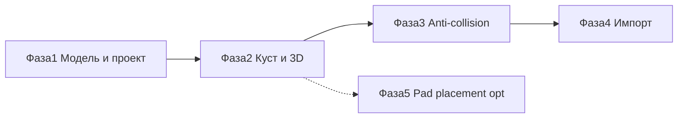
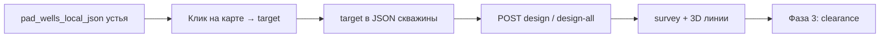

# План работ: траектории скважин

> **Статус:** **M1 ✅**; **M2 ✅**; **M3 ✅** (anti-collision SF); **M4a ✅** (импорт CSV / `.wbp`, UI `/import`, async &gt;20).  
> **См. также:** [well-trajectory.md](../features/well-trajectory.md), [well-trajectory-data-model.md](well-trajectory-data-model.md), [well-trajectory-app-assessment.md](well-trajectory-app-assessment.md), [well-trajectory-implementation-plan.md](well-trajectory-implementation-plan.md), [MICROSERVICE.md](../../well-trajectory-planner/docs/MICROSERVICE.md).

**Дата:** июнь 2026.

---

## Общая картина

Четыре этапа: от простого хранения и проектирования одной скважины до полного цикла — anti-collision, 3D-карта, импорт WITSML и CSV.

| Фаза | Суть | Результат | Статус |
|------|------|-----------|--------|
| 1 | Модель данных + проектирование | Пакет + BFF | **✅ M1** |
| 2 | Все скважины куста + 3D + **забои на карте** | «Кустование», GeoJSON, design | **🟡 ~85 % M2** |
| 3 | Безопасные расстояния | Таблица SF, предупреждения, 3D-подсветка | **✅ M3** |
| 4 | Импорт | CSV, .wbp, WITSML | ⬜ |
| 5 | **Оптимизация размещения кустов** | Greenfield по забоям; ranked варианты; M2+ перебор центра по Σ MD; apply → новые кусты | **✅ M1–M5 + M2+** ([spec](../features/pad-placement-optimization.md), [plan](pad-placement-optimization-plan.md)) |

У каждой фазы есть **критерии готовности** (чек-лист ниже) и зависимости от предыдущих.

---

## Фаза 1 — Модель данных и проектирование одной скважины

### Цель

Зафиксировать, где хранить траектории (JSON в properties куста на старте), создать пакет `well-trajectory-planner` (welleng + PyWellGeo bridge), BFF в монолите.

### Что должно появиться

| № | Артефакт | Статус |
|---|----------|--------|
| 1 | [Оценка текущего приложения](well-trajectory-app-assessment.md) | готово |
| 2 | [Модель данных](well-trajectory-data-model.md) | готово |
| 3 | [Описание микросервиса](../../well-trajectory-planner/docs/MICROSERVICE.md) | готово |
| 4 | [Описание функции в продукте](../features/well-trajectory.md) | готово |
| 5 | Код пакета `well-trajectory-planner/` | **готово (M1)** |
| 6 | BFF + адаптер в монолите | **готово (M1)** |

### API на этой фазе

**Микросервис:** проектирование, интерполяция, генерация из раскладки куста (`:8082`).

**Монолит:** `GET/POST .../well-trajectory/{last,generate-from-layout,design,compute}`.

### Критерии готовности

- [x] Примеры JSON в документации совпадают с реальным API
- [x] Тесты: траектория между двумя точками; вертикальная заготовка; PyWellGeo geometry
- [x] Из `pad_wells_local_json` создаётся N скважин с высотой устья с куста
- [x] Результат пишется в `pad_wells_trajectories_json`
- [x] Монолит без пакета стартует; при расчёте — 503 `well_trajectory_planner_not_available`

### От чего зависит

- Земляные работы куста: уже есть `pad_wells_local_json` и якорь ENU
- PyWellGeo (GPLv3) включён через `pywellgeo_bridge.py`; см. MICROSERVICE § License

---

## Фаза 2 — Все скважины куста и 3D-карта

### Цель

Показать траектории всех скважин куста на 3D-карте; вкладка «Траектории» в карточке куста.

### Что должно появиться

| № | Артефакт | Статус |
|---|----------|--------|
| 1 | API `GET .../well-trajectory/geojson` | ✅ |
| 2 | Слой траекторий в MapView3D на `/map` | ✅ |
| 3 | Вкладка «Траектории» в панели куста | ✅ |
| 4 | **Страница «Кустование»** (`/pad-clustering`) | ✅ |
| 5 | **Расстановка забоев на карте** (2D, объекты infra) | ✅ |
| 6 | Вкладка «Расчёт» (welleng + envelope) | ✅ |
| 7 | Resync траекторий при удалении забоя | ✅ |
| 8 | Вопрос «пересчитать?» при смене схемы куста | ✅ |
| 9 | E2E Playwright | ✅ |

### Забои на карте (куствование — подготовка)

Перед расчётом SF у каждой скважины куста должна быть **спроектированная траектория** (survey ≥2 станций); для design — **цель бурения (забой, TD)**: координаты в плане + TVD.

| Способ задать забой | Фаза | UI |
|---------------------|------|-----|
| Объект на карте **ННБ** (`well_bottomhole_nnb`) | 2 | Тулбар «Забой» → ННБ; 1 клик |
| Объект на карте **ГС** (heel + toe) | 2 | Тулбар «Забой» → ГС; 2 клика |
| Карточка объекта-забоя (куст, TVD, well_index) | 2 | `ObjectDetailPanel` |
| Форма / `PATCH targets` (legacy) | 2 | API-совместимость |
| `POST design-from-bottomholes` | 2 | Вкладка «Траектории» на кусте |
| Импорт CSV / `.wbp` | 4 | Забой из последней станции survey |

**Правила UX:**

- Активна только одна выбранная скважина в режиме расстановки (или «следующая без забоя»).
- Маркер забоя и устьё (`pad_wells_local_json`) связаны линией-превью (тонкая пунктирная) до проектирования траектории.
- TVD по умолчанию — из настроек проекта (`default_target_tvd_m`) или общее поле «TVD пласта» на кусте.
- После смены раскладки устьев — предупреждение: «Забои не сдвигались; проверьте привязку к скважинам».

### Критерии готовности

- [x] GeoJSON по [спецификации](well-trajectory-data-model.md) (линии + **точки забоев** + `bottomhole_plan_line`)
- [x] Слой включается в «Слои»; настройка запоминается
- [x] Инструмент рисования «Забой» (ННБ / ГС heel+toe) на 2D-карте
- [x] Объекты `well_bottomhole_*` → `sync-bottomholes` → `design-from-bottomholes`
- [x] Предупреждение, если `pad_well_count` ≠ числу точек в `pad_wells_local_json`
- [x] Удаление забоя сбрасывает траекторию скважины на кусте
- [ ] 12 скважин на кусте отображаются без заметных тормозов (не замерялось)
- [x] E2E smoke Playwright (`e2e/well-trajectory.spec.ts`)

### От чего зависит

- Завершена фаза 1
- Паттерн линий на 3D — [map-3d-features.md](../features/map-3d-features.md)

### По желанию (фаза 2+)

- Проекция траекторий на 2D-карту
- Перенос данных из JSON в таблицы `project_well`

---

## Фаза 3 — Проверка столкновений (anti-collision) ✅

### Цель

Расчёт коэффициента безопасного расстояния (SF по ISCWSA) для пар скважин **на кусте и по проекту** (включая межкустовые пары); для больших проектов — фоновая задача `well_trajectory_compute`.

### Что должно появиться

| № | Артефакт |
|---|----------|
| 1 | `POST /v1/clearance/pairs` в микросервисе | ✅ |
| 2 | `POST .../clearance` в BFF + задача `well_trajectory_compute` | ✅ |
| 3 | Таблица min SF в UI; подсветка на 3D при SF &lt; порога | ✅ |
| 4 | Выбор модели погрешностей (по умолчанию Rev5.11) | ✅ per-pad |

### Критерии готовности

- [x] Все пары на кусте из 12 скважин — sync расчёт
- [x] SF &lt; 1,0 — предупреждение в списке и цвет на 3D
- [x] 13+ скважин по проекту — задача `well_trajectory_compute` в журнале
- [x] pytest: planner + BFF + coords
- [ ] Mesh-метод — за флагом, отдельный этап Docker с `welleng[all]`

### От чего зависит

- Фаза 2 (траектории и **забои** видны на карте)
- У каждой скважины куста задан `target` (или импортирован survey до TD)
- Порог SF в `projects.settings.well_trajectory`

---

## Фаза 4 — Импорт и погрешности

### Цель

Загрузка инклинометрии из файлов; при необходимости — эллипсы погрешностей в отчёте.

### Подэтапы

| Подэтап | Содержание |
|---------|------------|
| **4a** | CSV (по [спецификации](well-trajectory-data-model.md)), Landmark `.wbp`, EDM через welleng |
| **4b** | WITSML 1.4/2.0 — исследование библиотек и реализация |
| **4c** | Экспорт эллипсов погрешностей в отчёт (опционально) |

### Что должно появиться

| № | Артефакт |
|---|----------|
| 1 | Импорт CSV в микросервисе и BFF |
| 2 | UI на `/import` или `/import-wells` |
| 3 | Пример файла `tests/fixtures/sample_survey.csv` |
| 4 | Заметка по WITSML в MICROSERVICE.md |

### Критерии готовности (4a)

- [x] CSV с тремя скважинами импортируется и виден на 3D
- [x] Колонки в доке = колонки в парсере
- [x] Smoke-тест на одном `.wbp`
- [x] WITSML до 4b отвечает 501 с понятным текстом
- [x] Импорт &gt;20 скважин — через фоновую задачу (`well_trajectory_import`)

### Исследования (4b)

| Задача | Результат |
|--------|-----------|
| Выбор библиотеки WITSML | ADR: готовая lib vs свой разбор XML |
| Версия схем Energistics | 1.4.1.1 или 2.0 |
| Поддержка WITSML в PyWellGeo | Следить за upstream |

### От чего зависит

- Фаза 3 (SF для импортированных траекторий)
- Права как у `/import`: admin, analyst, data_manager

---

## Сквозные задачи

| Задача | Фаза | Примечание |
|--------|------|------------|
| ADR по лицензии PyWellGeo | 1 | До prod |
| Обновление implementation-status.md | 1+ | После каждой фазы |
| MCP-инструменты ассистента (`list_wells`, `well_clearance`) | 3+ | Опционально |
| E2E: генерация + слой на 3D | 2 | Playwright |
| CI: копирование vendor + pytest | 1 | Как у pad-earthwork |

---

## Риски

| Риск | Что делать |
|------|------------|
| GPL PyWellGeo в образе монолита | Отдельный HTTP-сервис или только welleng в prod |
| Сложность WITSML | Сначала CSV и .wbp; WITSML — отдельный подэтап |
| `pad_well_count` ≠ `pad_wells_local_json` | Предупреждение на кусте; перегенерация схемы |
| Нет `target` у части скважин перед SF | Блокировать «Рассчитать SF»; подсветить скважины без забоя в списке |
| FCL на Windows CI | Mesh anti-collision опционален |
| Долгий SF по всему проекту | ARQ `well_trajectory_compute`; sync при ≤12 скважин с survey ≥2 ст. |

---

## Контрольные точки продукта

| Веха | Когда считаем готовым |
|------|------------------------|
| **M1** (конец фазы 1) | API проектирования работает; заготовки из раскладки сохраняются | **✅** |
| **M2** (конец фазы 2) | На 3D-карте и «Кустовании» линии скважин; на 2D — **забои** | **🟡 ~85 %** |
| **M3** (конец фазы 3) | Отчёт SF с предупреждениями | ✅ |
| **M4** (конец фазы 4a) | Импорт CSV end-to-end на staging | ✅ |
| **M5** (фаза 5) | Оптимизация размещения кустов: preview + apply на карте | ✅ |

---

## Связанные документы

| Тема | Файл |
|------|------|
| Описание функции | [well-trajectory.md](../features/well-trajectory.md) |
| Оценка текущего приложения | [well-trajectory-app-assessment.md](well-trajectory-app-assessment.md) |
| План реализации (код) | [well-trajectory-implementation-plan.md](well-trajectory-implementation-plan.md) |
| Модель данных | [well-trajectory-data-model.md](well-trajectory-data-model.md) |
| Микросервис | [MICROSERVICE.md](../../well-trajectory-planner/docs/MICROSERVICE.md) |
| Земляные работы куста | [pad-earthwork.md](../features/pad-earthwork.md) |
| Оптимизация размещения кустов | [pad-placement-optimization.md](../features/pad-placement-optimization.md), [plan](pad-placement-optimization-plan.md) |
