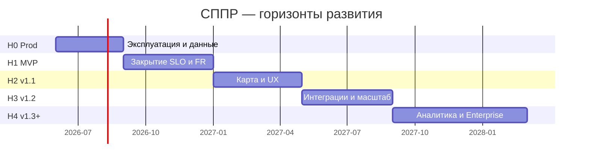
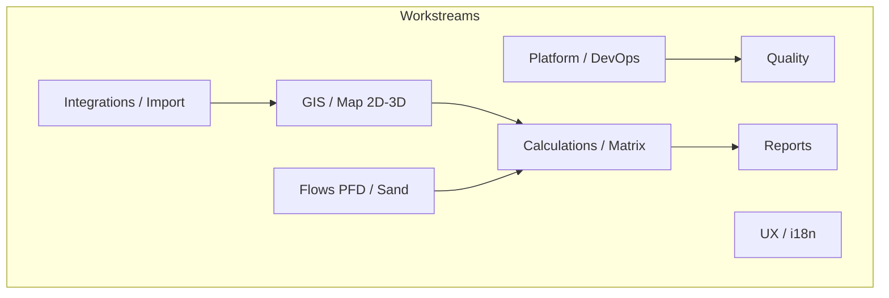

# План развития системы СППР

> **Назначение:** стратегическая дорожная карта развития `decision-matrix/` после завершения ядра MVP.  
> **Дата:** июнь 2026.  
> **Базовая линия:** [implementation-status.md](./implementation-status.md) (~85% Must Have, prod-деплой описан в [DEPLOY.md](../DEPLOY.md)).  
> **Исторический чеклист MVP:** [development-plan.md](./development-plan.md).  
> **Простым языком:** [раздел ниже](#версия-для-руководителя-и-пользователей-без-it-терминов) · технические детали — с [§1](#1-текущее-состояние).

---

## Версия для руководителя и пользователей (без IT-терминов)

Этот раздел — то же самое, что весь документ ниже, но **без жаргона разработчиков**. Его можно читать отдельно, если вы отвечаете за продукт, бюджет или внедрение, а не за код.

### Что это за система

**СППР** (система поддержки принятия решений) — веб-приложение для нефтегаза. Оно помогает:

- завести **проект** и **точки интереса** (площадки, на которые смотрим);
- показать на **карте** дороги, трубопроводы, подстанции и другое окружение — в обычном и **трёхмерном** виде;
- **посчитать**, во что обойдётся подключение к инфраструктуре, и **сравнить** площадки в **матрице**;
- построить **схему потоков** (как идут нефть, газ, вода);
- собрать **отчёт для руководства** (PDF или презентация).

Сайт для пользователей: [GitHub Pages](https://mekcuka.github.io/Scaning/). Сервер с расчётами: [erascaning.duckdns.org](https://erascaning.duckdns.org).

### Где мы сейчас (одной фразой)

**Основной функционал уже работает** — примерно **85%** того, что закладывали в первую «боевую» версию (MVP). Систему можно показывать и использовать, но **до уверенной ежедневной эксплуатации** ещё нужно довести надёжность, скорость и часть удобств.

### Что уже можно делать

| Возможность | Простыми словами |
|-------------|------------------|
| Вход и роли | Разные права: администратор, аналитик, загрузчик данных, только просмотр |
| Проекты и точки | Создавать проекты, точки интереса, ставки, пороги |
| Карта | Карта 2D и 3D, слои, рисование, поиск, импорт файлов и данных из других систем |
| Расчёты | Матрица сравнения площадок, анализ «что рядом», стоимость |
| Потоки и песок | Схема потоков, параметры песка и логистики |
| Отчёты | Одностраничники, выгрузка в PDF (через печать из браузера) и PowerPoint |
| Обновления | Сайт и сервер обновляются автоматически при выкладке новой версии |

### Чего пока не хватает (главное)

**Надёжность для «настоящего» production**

- Загруженные **собственные 3D-модели** (файлы зданий и сооружений) при обновлении сервера **могут пропасть**, хотя запись в базе останется — пользователь увидит ошибку. Нужно постоянное хранилище файлов и **резервные копии** базы.
- Нет привычного **мониторинга** («сайт упал — пришло SMS/письмо») и единого журнала ошибок для поддержки.
- После каждого обновления желательно **короткий чеклист**: «вход работает, карта открывается, расчёт считается».

**Скорость и нагрузка (ещё не проверяли официально)**

- Карта с **тысячей объектов** — цель есть, замеров «выдерживает / тормозит» пока нет.
- Матрица на **20 площадках и 50 параметрах** должна считаться **быстрее 5 секунд** — нужно проверить и при необходимости ускорить.
- Удобство и скорость интерфейса в браузере (оценка Lighthouse) — **цель выше 80 баллов**, сейчас не зафиксировано.

**Удобство и «второй эшелон» функций**

- Нет **личного кабинета** (сменить имя, аватар).
- Нет **журнала «кто что менял»** для аудита.
- Расстояния пока в основном «по прямой на карте», а не **по реальной сети** (труба/дорога как граф) — это запланировано позже.
- PDF формируется **в браузере пользователя**, а не одним файлом с сервера; **полная выгрузка в Excel** всего отчёта — не везде.
- Только **русский** интерфейс; нет тура для новичка после регистрации.

### Куда хотим прийти за 12–18 месяцев

Одна платформа: от загрузки карты и 3D до матрицы, потоков и отчёта — **стабильно**, с понятным временем ответа и без потери данных при обновлениях. Для крупных заказчиков позже — вход через корпоративную учётную запись (SSO), разделение организаций, гарантии доступности.

### План по этапам (простыми словами)

Думайте о пяти **очередях работ**. Каждая следующая опирается на предыдущую: сначала «не ломается и не теряет данные», потом «быстро и полно по MVP», потом «удобнее», потом «умнее по сети», потом «аналитика и корпоративный уровень».

#### Этап 0 — «Можно доверять production» (примерно 3 месяца)

**Задача:** чтобы обновления не стирали работу пользователей и чтобы было понятно, жив ли сервис.

| Что делаем | Зачем вам это |
|------------|----------------|
| Постоянное место для 3D-файлов + резервные копии базы | Загруженные модели не исчезают после обновления; можно восстановить данные при сбое |
| Чеклист после каждого выката | За 15 минут убедиться, что сайт и расчёты живы |
| Журнал ошибок и оповещение «сайт недоступен» | Поддержка узнаёт о проблеме раньше пользователей |
| Инструкция на случай аварии | Кто и как откатывает версию, куда звонить |
| Проверка безопасности (нет тестовых паролей в бою) | Меньше риска взлома |

**Готово, когда:** неделю подряд обновления проходят **без потери файлов и данных**; проверка после релиза занимает **не больше 15 минут**.

#### Этап 1 — «Дожимаем первую полноценную версию» (ещё ~4 месяца)

**Задача:** подтвердить цифры из ТЗ и закрыть критичные недочёты.

| Что делаем | Зачем вам это |
|------------|----------------|
| Проверка карты на 1000+ объектах | Уверенность, что крупные проекты не «встанут» |
| Замер скорости матрицы | Аналитик не ждёт минутами |
| Ускорение и удобство интерфейса | Меньше раздражения, выше оценка в браузере |
| Расширенные автоматические проверки | Меньше сюрпризов после каждого изменения |
| Порядок с критическими ошибками | Перед релизом — ноль «блокеров» |
| Доп. карта (OpenStreetMap), перетаскивание слоёв, Excel, PDF с сервера | По приоритету бизнеса |

**Готово, когда:** все **измеримые цели MVP** из плана разработки либо достигнуты, либо **осознанно перенесены** с объяснением почему.

#### Этап 2 — «Удобнее карта и совместная работа» (~4 месяца)

| Что делаем | Зачем вам это |
|------------|----------------|
| Приглашение коллег в проект | Не только «один владелец» |
| Личный профиль | Пользователь сам меняет имя и контакты |
| 3D в отчётах | Нагляднее для совещаний |
| Надёжное облачное хранилище для моделей | Как у крупных сервисов — файлы не привязаны к одному серверу |
| Приветственный экран / обучение | Новый сотрудник быстрее начинает работать |

**Готово, когда:** типовой аналитик проходит путь **импорт → карта → матрица → отчёт** без помощи администратора «восстановить модель».

#### Этап 3 — «Сеть, обмен данными, масштаб» (~4 месяца)

| Что делаем | Зачем вам это |
|------------|----------------|
| Расстояния **по сети** (узлы, трубопроводы), а не только по прямой | Ближе к реальной прокладке |
| Фоновая загрузка больших объёмов без «зависания» сайта | Импорт десятков тысяч объектов |
| Подключение внешних справочников (по запросу) | Меньше ручного ввода |
| Уведомления о ходе импорта | Не нужно постоянно обновлять страницу |
| База данных в облаке с сопровождением | Надёжнее, чем «всё на одной машине» |

#### Этап 4 — «Аналитика» (~3 месяца)

- Сводная статистика по проектам на главной.
- Сценарии «а что если изменить объём / ставку» без порчи основных данных.
- Готовые шаблоны матриц и отчётов.
- По запросу — эксперименты с прогнозами (машинное обучение), отдельным проектом.

#### Этап 5 — «Корпоративный уровень» (дальше)

- Вход через **корпоративную учётную запись** (как в Active Directory).
- Полный **журнал действий** для комплаенса.
- Разделение данных **между компаниями** в одной установке.
- Гарантии доступности, резервный сервер, приоритетная поддержка.

### Что важнее всего сделать в первую очередь (топ-5)

1. **Не терять загруженные 3D-модели** при обновлении сервера.  
2. **Резервные копии базы** и понятное восстановление.  
3. **Проверка после каждого релиза** + возможность **откатиться** на прошлую версию.  
4. **Проверить карту** на большом числе объектов.  
5. **Проверить скорость матрицы** на реалистичном проекте.

Остальное (красота карты, Excel, английский язык) — после этого, если бизнес не переставит приоритеты.

### Как измерять успех (без формул)

| Вопрос | Сейчас | К концу этапа 1 | Позже |
|--------|--------|-----------------|-------|
| Сколько времени от точки на карте до готовой матрицы? | Не замеряли | В среднем **до 10 минут** | **До 7 минут** |
| Сколько импортов проходит без фатальной ошибки? | — | **95 из 100** | **98 из 100** |
| Доступен ли сервер в течение месяца? | — | **99%** времени | **99,5%** |
| Сколько людей реально пользуется системой? | — | Зафиксировать базу | Рост **+20%** |

Для разработчиков дополнительно считают **автотесты** и **скорость ответа сервера** — это страховка от поломок при доработках, не отдельный продукт для пользователя.

### Кто чем занимается (для планирования людей)

| Направление | О чём это для бизнеса |
|-------------|------------------------|
| **Платформа** | Сервер, обновления, бэкапы, «сайт работает» |
| **Качество** | Проверки перед релизом, сценарии «как пользователь» |
| **Карта и 3D** | Скорость карты, модели, удобство слоёв |
| **Расчёты и матрица** | Правильность и скорость цифр |
| **Потоки и песок** | Схемы и специальные параметры |
| **Отчёты** | PDF, PowerPoint, выгрузки |
| **Импорт и интеграции** | Файлы, Искра, внешние API |
| **Интерфейс** | Обучение, языки, доступность для слабовидящих |

Раз в **две недели** — что берём в работу; раз в **месяц** — обновляем статус «что уже сделано»; раз в **квартал** — пересматриваем этот план.

### Основные риски (простым языком)

| Риск | Что может случиться | Что делаем |
|------|---------------------|------------|
| Потеря 3D-файлов | Пользователь загрузил модель — после обновления её нет | Постоянное хранилище (этап 0–2) |
| Сложная страница карты | Любая мелкая правка ломает карту | Больше автопроверок, упрощение по частям |
| Разные базы у разработчика и на сервере | «У меня работает, у вас нет» | На сервере и в проверках — одна «полная» база с картой |
| Один сервер | Упал диск — всё встало | Бэкапы сейчас; позже — резерв и облачная БД |
| Раздувание scope | Вместо стабильности — десять новых идей | Старые методы (TOPSIS и т.п.) не трогаем без отдельного заказа |
| Сайт и API на разных адресах | Иногда не грузятся файлы / ошибка входа | Отдельно проверяем сценарии с публичного сайта |

### Что делать в ближайший месяц (июнь 2026)

1. **Один раз замерить** «как сейчас»: карта с большим числом объектов, скорость матрицы, удобство сайта в браузере.  
2. **Завести задачи** на этап 0 (хранилище моделей, бэкапы, мониторинг, чеклист после релиза).  
3. **Первое техническое изменение** — чтобы файлы 3D не стирались при обновлении.  
4. **Назначить ответственных** по направлениям из таблицы выше.  
5. **Через месяц** — встреча: выполнены ли критерии этапа 0.

---

*Ниже — тот же план для команды разработки: термины, ссылки на код, таблицы FR и CI.*

---

## 1. Текущее состояние

### 1.1 Что уже есть

| Область | Статус |
|---------|--------|
| Ядро продукта | Проекты, POI, карта 2D/3D, матрица, параметры, PFD, песок, импорт, отчёты (PDF/PPTX) |
| Backend | FastAPI, PostGIS, RBAC, async import, health `/health` + проверка БД |
| Frontend | React 19, OpenLayers + MapLibre/Three.js, TanStack Query |
| CI/CD | GitHub Actions (lint, test, coverage, E2E); Pages + Yandex VM |
| Документация | FR, архитектура, расчёты, 3D, PFD, тесты |

### 1.2 Ключевые пробелы (вход в план)

**Продукт и SLO (из [development-plan.md](./development-plan.md)):**

- Карта 1000+ объектов — не подтверждена нагрузочными тестами
- Расчёт матрицы 20×50 &lt; 5 с — не замерен системно
- Lighthouse &gt; 80 — не достигнут
- Критические баги — нет формального triage-процесса

**Эксплуатация ([DEPLOY.md](../DEPLOY.md)):**

- Персистентность custom GLB на VM (volume / object storage)
- Централизованное логирование и алерты
- Managed PostgreSQL — опционально, сейчас Postgres в Docker на VM
- Формальные smoke/regression на production после каждого релиза

**Функционал (post-MVP FR):**

- Профиль, `audit_log`
- Якорь `network_node` в анализе POI
- Server-side PDF (WeasyPrint), полный Excel-экспорт
- i18n, email-подтверждение, onboarding

**Качество ([testing-strategy.md](./testing-strategy.md)):**

- Frontend components ~15% покрытия
- E2E — 6 сценариев; рефакторинг MapPage/MapView завершён (июнь 2026, [frontend-structure.md](./frontend-structure.md)); риск регрессий снижен за счёт hooks + integration-тестов
- Нет регулярных perf/security прогонов в CI

---

## 2. Видение и принципы

### 2.1 Видение (12–18 месяцев)

**СППР** — единая платформа для сравнения площадок/POI в нефтегазе: от загрузки инфраструктуры и 3D-визуализации до матрицы стоимости, схем потоков и отчётов для руководства, с предсказуемым SLA в production.

### 2.2 Принципы приоритизации

1. **Стабильность prod** — данные пользователя, откат, мониторинг — раньше новых фич.
2. **Закрытие измеримых SLO MVP** — до масштабного расширения функционала.
3. **Один источник геоданных** — 2D/3D/PFD/матрица из одной БД; не дублировать модели.
4. **Вертикальные срезы** — фича считается готовой с API + UI + тестом + обновлением `implementation-status.md`.
5. **Док ↔ код** — каждый этап завершается правкой [consistency-review.md](./consistency-review.md) при изменении FR.

---

## 3. Дорожная карта по горизонтам

### Горизонт 0 — Production-ready (0–3 мес.)

**Цель:** безопасная и воспроизводимая эксплуатация; нет потери пользовательских данных при деплое.

| # | Инициатива | Результат | Зависимости |
|---|------------|-----------|-------------|
| H0.1 | Volume для `map3d_models` + бэкап БД | Custom GLB переживают redeploy | `deploy/docker-compose.yml` |
| H0.2 | Smoke-suite prod | Чеклист после релиза в CI или runbook | DEPLOY §5 |
| H0.3 | Структурированные логи + ротация | JSON/stderr, уровни по `ENVIRONMENT` | backend logging config |
| H0.4 | Алерты uptime | UptimeRobot / YC Monitoring на `/health` | APP_DOMAIN |
| H0.5 | Секреты и CORS-аудит | Нет demo-users в prod; CORS = реальные origin | `app.env` |
| H0.6 | Runbook инцидентов | Откат, миграции, 502, диск | DEPLOY + wiki |

**Критерий выхода:** 7 дней без потери данных при деплое; health + ручной smoke &lt; 15 мин после релиза.

---

### Горизонт 1 — Завершение MVP (3–7 мес.)

**Цель:** закрыть метрики успеха MVP и Should Have FR с высоким бизнес-весом.

| # | Инициатива | FR / ссылка | Приоритет |
|---|------------|-------------|-----------|
| H1.1 | Нагрузочные тесты карты | 1000+ объектов, FR-2 | P0 |
| H1.2 | Бенчмарк матрицы | 20×50 &lt; 5 с, кэш/батч analyze | P0 |
| H1.3 | Perf budget frontend | Lighthouse &gt; 80, lazy routes | P1 |
| H1.4 | Bug triage | Label `critical`, 0 открытых перед релизом | P0 |
| H1.5 | E2E расширение | + matrix, report, import-3d | P1 |
| H1.6 | Coverage gates | pages 80%, components 30%, backend services 70% | P1 |
| H1.7 | Drag-and-drop слоёв | FR-2.2.4 | P2 |
| H1.8 | OSM подложка 2D | FR-2.1.2 (дополнение к Esri) | P2 |
| H1.9 | Полный Excel / GeoJSON export | FR-12.3, development-plan этап 5 | P2 |
| H1.10 | Server PDF | FR-11.2.1, WeasyPrint | P2 |

**Критерий выхода:** все пункты «Метрики успеха MVP» в [development-plan.md](./development-plan.md) отмечены или явно отложены с обоснованием.

---

### Горизонт 2 — v1.1 «Карта и совместная работа» (7–11 мес.)

**Цель:** удобство GIS и командной работы без смены архитектуры.

| # | Инициатива | Описание |
|---|------------|----------|
| H2.1 | Редактирование геометрии линий | улучшение Modify; согласование 2D↔3D |
| H2.2 | Polygon / MultiPolygon (ограниченно) | FR-2.3.9 post-MVP; влияние на импорт |
| H2.3 | Sharing проектов | роли на уровне проекта, invite (v1.1 из development-plan) |
| H2.4 | Профиль пользователя | FR-1.3.1 |
| H2.5 | 3D в матрице/отчёте | фаза 3 из [map-3d-plan.md](./map-3d-plan.md) |
| H2.6 | Object storage для GLB | S3-совместимое хранилище YC; CDN для `/file` |
| H2.7 | Landing + onboarding | user-flows §1 |

**Критерий выхода:** аналитик проходит сценарий «импорт → карта → матрица → отчёт» без обращения к admin за GLB recovery.

---

### Горизонт 3 — v1.2 «Сеть, интеграции, real-time» (11–15 мес.)

**Цель:** расстояния по графу инфраструктуры и живые данные из внешних систем.

| # | Инициатива | Описание |
|---|------------|----------|
| H3.1 | `network_node` в анализе POI | FR-2.4.5, [map-objects §5](./map-objects-and-spatial-calculations.md) |
| H3.2 | `along_network` / route cost | calculation-functions planned |
| H3.3 | Автопривязка internal LineString | post-MVP geodesic к линиям |
| H3.4 | Планировщик sync import | Celery + Redis (architecture post-MVP) |
| H3.5 | Расширение API-коннекторов | OSM Overpass, GeoNames — по запросу |
| H3.6 | WebSocket / SSE | прогресс импорта, уведомления |
| H3.7 | Managed PostgreSQL | миграция с Docker Postgres на YC MDB |

**Критерий выхода:** для POI доступен выбор политики «geodesic vs network»; импорт &gt; 10k объектов не блокирует API.

---

### Горизонт 4 — v1.3 «Аналитика» (15–18 мес.)

| # | Инициатива |
|---|------------|
| H4.1 | Расширенная статистика по проектам (дашборд) |
| H4.2 | Сценарии «what-if» (копия POI / ставок) |
| H4.3 | Шаблоны матриц / отчётов (публичные и корпоративные) |
| H4.4 | ML-прогноз (опционально, отдельный POC) |

---

### Горизонт 5 — v2.0 Enterprise (18+ мес.)

| # | Инициатива |
|---|------------|
| H5.1 | SSO / LDAP / Keycloak |
| H5.2 | Полный `audit_log` (FR-1.3.3) |
| H5.3 | Multi-tenant / изоляция организаций |
| H5.4 | SLA, приоритетная поддержка, OpenTelemetry |
| H5.5 | HA: реплика БД, blue-green deploy |

---

## 4. Рабочие потоки (workstreams)

Параллельная работа команды по потокам; синхронизация на еженедельном review.

| Поток | Владелец (роль) | Фокус H0–H1 |
|-------|-----------------|-------------|
| **Platform** | DevOps / backend | volumes, CI smoke prod, логи, бэкапы |
| **Quality** | QA + dev | E2E, perf, security scan, coverage |
| **GIS** | frontend + geo | 1000 obj, 3D persistence |
| **Calculations** | backend | matrix perf, network_node (H3) |
| **Flows** | full-stack | PFD regression, economic merge |
| **Reports** | full-stack | server PDF, Excel |
| **Integrations** | backend | Celery, connectors |
| **UX** | frontend + design | onboarding, i18n, a11y |

---

## 5. Метрики и контрольные точки

### 5.1 North Star (продукт)

| Метрика | Сейчас | Цель H1 | Цель H2 |
|---------|--------|---------|---------|
| Время «POI → результат матрицы» | не замерено | &lt; 10 мин (median) | &lt; 7 мин |
| Успешность импорта (без fatal) | — | &gt; 95% jobs | &gt; 98% |
| Доступность API (30 дней) | — | 99% | 99.5% |
| MAU / активные проекты | — | baseline | +20% |

### 5.2 Инженерные KPI

| Метрика | Сейчас | Цель H1 |
|---------|--------|---------|
| Backend coverage `app/` | ~72% | ≥ 75% |
| Frontend `pages/` | ~79% | ≥ 80% |
| E2E сценариев | 6 | ≥ 12 |
| p95 API analyze (20 POI) | — | &lt; 5 с |
| Critical bugs open | — | 0 перед release |

### 5.3 Ритм управления

| Частота | Действие |
|---------|----------|
| Спринт (2 нед.) | Приоритизация из backlog по горизонту |
| Месяц | Обновление [implementation-status.md](./implementation-status.md) |
| Квартал | Ревизия этого плана; чеклист user-flows из [testing-strategy.md](./testing-strategy.md) |
| Релиз | Smoke + запись в CHANGELOG / release notes |

---

## 6. Backlog по приоритету (сводка)

### P0 — блокеры зрелого prod

1. Volume / storage для custom GLB  
2. Бэкап и восстановление PostgreSQL  
3. Prod smoke + rollback проверен  
4. Нагрузка карты 1000+ объектов  
5. Бенчмарк матрицы 20×50  

### P1 — завершение MVP

6. E2E matrix + report  
7. Lighthouse / a11y  
8. Централизованные логи и алерты  
9. Coverage gates в CI  
10. Bug triage process  

### P2 — v1.1

11. Sharing проектов  
12. Профиль пользователя  
13. OSM 2D, drag слоёв  
14. Server PDF / полный Excel  

### P3 — v1.2+

15. `network_node` + маршруты по графу  
16. Celery + Redis  
17. WebSocket  
18. SSO / audit  
19. ML / шаблоны (по запросу бизнеса)  

---

## 7. Риски и митигация

| Риск | Влияние | Митигация |
|------|---------|-----------|
| Потеря GLB при деплое | Высокое | H0.1 volume; H2.7 object storage |
| MapPage — монолит, регрессии | Снижено (2026-06) | Рефакторинг завершён; остаётся ~981 строк оркестратора — см. [frontend-structure.md](./frontend-structure.md) |
| SQLite vs PostGIS расхождение | Среднее | CI только PostGIS; локальный README режим B |
| Один сервер VM — SPOF | Среднее | бэкапы; H3.7 managed DB; H5 HA |
| Scope creep (TOPSIS, ML) | Среднее | legacy FR-14 вне UI; отдельные POC |
| CORS / cross-origin auth | Среднее | [auth-rbac.md](./auth-rbac.md); E2E на Pages URL |

---

## 8. Связь с другими документами

| Документ | Роль в плане |
|----------|--------------|
| [implementation-status.md](./implementation-status.md) | Текущая базовая линия; обновлять по спринтам |
| [development-plan.md](./development-plan.md) | Исторический MVP; метрики успеха |
| [requirements.md](./requirements.md) | Источник FR для backlog |
| [DEPLOY.md](../DEPLOY.md) | H0 Platform |
| [testing-strategy.md](./testing-strategy.md) | H1 Quality |
| [map-3d-plan.md](./map-3d-plan.md) | H2 3D в отчётах, L3 storage |
| [map-objects-and-spatial-calculations.md](./map-objects-and-spatial-calculations.md) | H3 network_node |
| [architecture.md](./architecture.md) | Celery, analytics, enterprise |

---

## 9. Следующие шаги (июнь 2026)

1. Зафиксировать baseline метрик (один прогон: карта 1k, матрица 20×50, Lighthouse).  
2. Создать issues/epic по **H0.1–H0.4** в трекере (или GitHub Projects).  
3. Внести volume GLB в `deploy/docker-compose.yml` — первый PR горизонта 0.  
4. Назначить владельцев workstreams на квартал.  
5. Через 4 недели — review: критерии выхода H0.

---

*При изменении приоритетов бизнеса обновляйте §3 и §6; технический статус — в [implementation-status.md](./implementation-status.md).*
