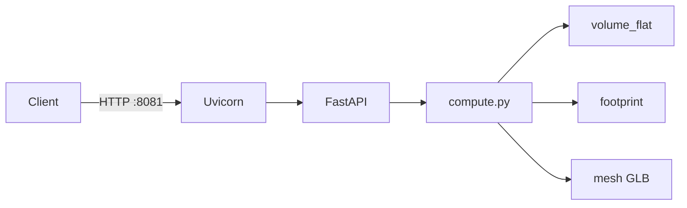

# Микросервис Pad Earthwork Planner

HTTP-микросервис расчёта объёмов выемки/отсыпки для кустовых площадок (`oil_pad`, `gas_pad`) на упрощённой 3D-модели.

## Архитектура



| Модуль | Назначение |
|--------|------------|
| `schemas.py` | Pydantic request/response |
| `footprint.py` | Прямоугольник в ENU (центр lon/lat, `rotation_deg`) |
| `volume_flat.py` | MVP: `fill = L×W×H`, `cut = 0` |
| `volume_grid.py` | Фаза 2: cut/fill по сетке (unit-тесты) |
| `mesh.py` | Экспорт box mesh как base64 GLB |

## Эндпоинты

| Endpoint | HTTP | Описание |
|----------|------|----------|
| `GET /health` | 200 | Liveness |
| `GET /ready` | 200 | Readiness |
| `POST /v1/compute` | 200 / 501 | Расчёт (`terrain.mode=flat` / `dem` → 501) |

OpenAPI: `http://localhost:8081/docs`

## Быстрый старт (Docker Compose)

```bash
docker compose up --build
```

Сервис: `http://localhost:8081`

## Локальный запуск

**С установкой пакета:**

```bash
pip install -e ".[dev]"
pytest
uvicorn pad_earthwork.api:app --reload --host 0.0.0.0 --port 8081
```

**Без `pip install`** (добавляет `src/` в PYTHONPATH):

```bash
python run_server.py
```

Windows PowerShell:

```powershell
cd C:\Users\user\Documents\Cursore\pad-earthwork-planner
python run_server.py
```

## Интеграция в монолит

| Режим | Переменная | Поведение |
|-------|------------|-----------|
| In-process (default) | `PAD_EARTHWORK_INPROCESS=true` | `planner_bridge` импортирует пакет при первом `compute` |
| HTTP | `PAD_EARTHWORK_SERVICE_URL=http://127.0.0.1:8081` | BFF вызывает `POST /v1/compute` |

В Docker-образе API пакет vendored как `decision-matrix/backend/pad-earthwork-vendor` (CI: `cp -r pad-earthwork-planner ...`).

Монолит **стартует без пакета**; расчёт куста требует установленный `pad-earthwork-planner` или HTTP-сервис на `:8081`.

## Пример запроса

```json
{
  "object_id": "00000000-0000-0000-0000-000000000001",
  "subtype": "oil_pad",
  "center": { "lon": 37.62, "lat": 55.76 },
  "params": {
    "length_m": 120,
    "width_m": 80,
    "height_m": 2.5,
    "rotation_deg": 0,
    "reference_elevation_m": 150.0
  },
  "terrain": { "mode": "flat" }
}
```

Ответ: `volumes.fill_m3 = 24000`, `volumes.cut_m3 = 0`, `mesh.format = "glb"`.
