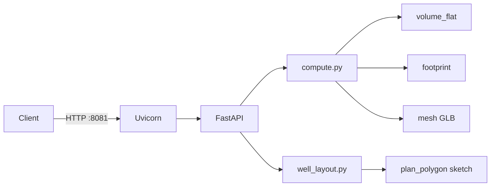

# Микросервис Pad Earthwork Planner

HTTP-микросервис расчёта объёмов выемки/отсыпки для кустовых площадок (`oil_pad`, `gas_pad`) на упрощённой 3D-модели.

## Архитектура



| Модуль | Назначение |
|--------|------------|
| `schemas.py` | Pydantic request/response |
| `footprint.py` | Прямоугольник / полигон в ENU (якорь `lon/lat`) |
| `well_layout.py` | Автогенерация контура по скважинам и отступам |
| `volume_flat.py` | MVP: `fill = L×W×H` или площадь×H, `cut = 0` |
| `volume_plan.py` | Площадь/ bbox для plan sketch |
| `envelope.py` | Обволование в `compute`: усечённая пирамида (legacy; UI — вариант A, см. [pad-earthwork.md](../../docs/features/pad-earthwork.md) § Модель обволования) |
| `volume_grid.py` | Cut/fill по сетке относительно design surface (unit-тесты; не используется в DEM pipeline) |
| `dem_volume.py` | DEM: выемка = грунт выше `reference_elevation_m` в footprint; fill из DEM не считается |
| `mesh.py` | Экспорт box mesh как base64 GLB |

## Эндпоинты

| Endpoint | HTTP | Описание |
|----------|------|----------|
| `GET /health` | 200 | Liveness |
| `GET /ready` | 200 | Readiness |
| `POST /v1/compute` | 200 / 501 | Расчёт (`terrain.mode=flat` или `dem` с `dem_file_path`) |
| `POST /v1/sketch/preview` | 200 / 501 | Превью плана: площадь, углы в локальной ENU |
| `POST /v1/sketch/generate-from-wells` | 200 / 400 | Автогенерация `plan_polygon` + `wells_local` |

OpenAPI: `http://localhost:8081/docs`

### `POST /v1/sketch/generate-from-wells`

```json
{
  "well_count": 12,
  "wells_per_group": 1,
  "well_spacing_m": 9,
  "group_spacing_m": 9,
  "margins": { "left_m": 27, "bottom_m": 43, "top_m": 15, "end_m": 70 },
  "rotation_deg": 90
}
```

При пустом теле `{}` backend подставляет defaults (см. таблицу в [pad-earthwork.md](../../docs/features/pad-earthwork.md)) или значения из `properties` объекта куста.

Ответ: `sketch` (`plan_polygon`), `wells_local`, `length_m`, `width_m`, `rotation_deg`, `footprint_area_m2`. Для стандартных defaults: 12 скважин, `length_m ≈ 196`, `width_m ≈ 58`.

Скважины — один ряд вдоль локальной оси East; первая скважина в `(0, 0)`.

## Быстрый старт (Docker Compose)

```bash
docker compose up --build
```

Сервис: `http://localhost:8081`

## Локальный запуск

**С установкой пакета:**

```bash
pip install -e ".[dev]"
pytest
uvicorn pad_earthwork.api:app --reload --host 0.0.0.0 --port 8081
```

**Без `pip install`** (добавляет `src/` в PYTHONPATH):

```bash
python run_server.py
```

Windows PowerShell:

```powershell
cd C:\Users\user\Documents\Cursore\pad-earthwork-planner
python run_server.py
```

## Интеграция в монолит

| Режим | Переменная | Поведение |
|-------|------------|-----------|
| In-process (default) | `PAD_EARTHWORK_INPROCESS=true` | `planner_bridge` импортирует пакет при первом вызове |
| HTTP | `PAD_EARTHWORK_SERVICE_URL=http://127.0.0.1:8081` | BFF вызывает эндпоинты planner |

В Docker-образе API пакет vendored как `decision-matrix/backend/pad-earthwork-vendor` (CI: `cp -r pad-earthwork-planner ...`).

Монолит **стартует без пакета**; расчёт и автогенерация требуют установленный `pad-earthwork-planner` или HTTP-сервис на `:8081`.

BFF-обёртка автогенерации: `POST /api/v1/projects/{id}/infrastructure/objects/{object_id}/pad-earthwork/sketch/generate` — см. [pad-earthwork.md](../../docs/features/pad-earthwork.md).

## Пример запроса compute

```json
{
  "object_id": "00000000-0000-0000-0000-000000000001",
  "subtype": "oil_pad",
  "center": { "lon": 37.62, "lat": 55.76 },
  "params": {
    "length_m": 120,
    "width_m": 80,
    "height_m": 2.5,
    "rotation_deg": 0,
    "reference_elevation_m": 150.0
  },
  "terrain": { "mode": "flat" }
}
```

Ответ (flat): `volumes.fill_m3 = 24000`, `volumes.cut_m3 = 0`, `volumes.net_fill_m3 = 24000`, `mesh.format = "glb"`.

### Режим DEM

**Загрузка и кэш DEM** — только в BFF (`dem/fetch`, `pad_dem_repository`, таблица `infra_object_pad_dem`). Planner получает уже готовый путь к GeoTIFF в `dem_file_path`; OpenTopography и volume на диске микросервис **не** обслуживает. См. [pad-dem-storage.md](../../docs/deploy/pad-dem-storage.md).

При `terrain.mode = dem` и `dem_file_path`:

- `fill_m3 = footprint_area × height_m` (призма, песок завозится);
- `cut_m3` — сумма `(Z_terrain − reference_elevation_m) × cell_area` по ячейкам внутри контура, где `Z_terrain > reference`;
- `net_fill_m3 = fill_m3` (выемка не вычитается).

Подробнее: [pad-earthwork.md](../../docs/features/pad-earthwork.md) § Модель объёмов.

## Тесты

```bash
pytest tests/test_well_layout.py tests/test_compute_sketch_api.py -q
```
