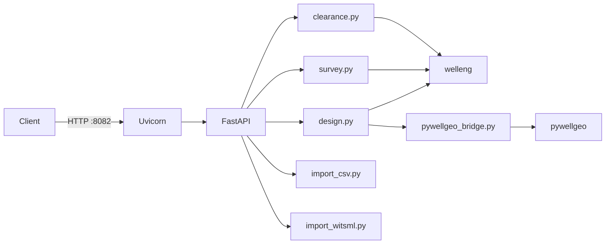

# Микросервис расчёта траекторий скважин

Отдельный HTTP-сервис для **трёхмерных траекторий скважин**: проектирование ствола, интерполяция инклинометрии, проверка столкновений (anti-collision), импорт CSV и WITSML.

**Статус:** фаза 1 реализована (M1: design, interpolate, pad seed, BFF).

---

## Архитектура



| Модуль | Назначение |
|--------|------------|
| `schemas.py` | Форматы запросов и ответов (Pydantic) |
| `design.py` | Проектирование траектории между двумя точками (welleng connector) |
| `survey.py` | Интерполяция инклинометрии по шагу MD |
| `clearance.py` | Расчёт SF (ISCWSA); опционально mesh-метод (`welleng[all]`) |
| `import_csv.py` | Разбор CSV с инклинометрией |
| `import_landmark.py` | Landmark `.wbp` через welleng.exchange.wbp |
| `import_witsml.py` | WITSML stub (501 в фазе 4a) |
| `pywellgeo_bridge.py` | Доп. геометрия: XYZ, разветвлённые стволы (PyWellGeo) |
| `pad_layout.py` | Заготовки скважин из раскладки куста (вертикальные «заглушки») |

---

## Библиотеки расчёта

| Библиотека | Репозиторий | Лицензия | Роль |
|------------|-------------|----------|------|
| **welleng** | [jonnymaserati/welleng](https://github.com/jonnymaserati/welleng) | Apache 2.0 | **Основной движок:** проектирование, survey, интерполяция, модели погрешностей ISCWSA, SF, магнитное поле, `.wbp` / EDM |
| **PyWellGeo** | [TNO/pywellgeo](https://github.com/TNO/pywellgeo) | **GPLv3** | Дополнительная геометрия: траектории из XYZ, разветвления, преобразования азимут/наклон |

### Кто за что отвечает

| Задача | Библиотека |
|--------|------------|
| Построение траектории между точками (J-type, S-type и т.п.) | welleng |
| Интерполяция по минимальной/максимальной кривизне | welleng |
| Коэффициент безопасного расстояния (ISCWSA) | welleng |
| Модели погрешностей MWD, гироскоп | welleng |
| Магнитное поле (WMM) | welleng |
| Импорт Landmark `.wbp`, EDM | welleng |
| Траектория из XYZ, многоствольные скважины | PyWellGeo |
| Векторная математика азимут/наклон | PyWellGeo |
| WITSML 1.4/2.0 | Отдельный парсер (фаза 4b) |

**Правило:** для survey и anti-collision **источник истины — welleng**. PyWellGeo подключается через `pywellgeo_bridge.py` только там, где нужна дополнительная геометрия.

### Лицензия и prod

PyWellGeo распространяется под **GPLv3**. Встраивание в Docker-образ backend может потребовать раскрытия исходного кода.

| Вариант | Описание |
|---------|----------|
| **(a) Только welleng в prod** | Prod без PyWellGeo; разветвления — только в dev |
| **(b) Отдельный GPL-контейнер** | Микросервис на :8082; монолит ходит по HTTP |
| **(c) Юридическая экспертиза** | Решить до выкладки фазы 2 |

Выбор зафиксировать в ADR при начале разработки.

---

## HTTP-эндпоинты

| Путь | Код | Описание |
|------|-----|----------|
| `GET /health` | 200 | Сервис жив |
| `GET /ready` | 200 | Готов принимать запросы |
| `POST /v1/design/connector` | 200 / 400 | Спроектировать траекторию: начало/конец + углы → станции survey |
| `POST /v1/survey/interpolate` | 200 / 400 | Уплотнить survey с заданным шагом по MD |
| `POST /v1/clearance/pairs` | 200 / 400 | Матрица SF для списка траекторий |
| `POST /v1/import/csv` | 200 / 400 | Разобрать CSV → нормализованные станции |
| `POST /v1/import/wbp` | 200 / 400 | Landmark `.wbp` → станции (welleng) |
| `POST /v1/import/witsml` | 501 | WITSML — фаза 4b |
| `POST /v1/pad/generate-from-layout` | 200 / 400 | N скважин из раскладки куста + KB |

Документация OpenAPI: `http://localhost:8082/docs`

### Пример: проектирование траектории

`POST /v1/design/connector`

```json
{
  "start": {
    "northing": 0,
    "easting": 0,
    "tvd": 0,
    "inc": 0,
    "azi": 90
  },
  "end": {
    "northing": 500,
    "easting": 800,
    "tvd": 2500,
    "inc": 90,
    "azi": 270
  },
  "step_m": 30,
  "units": "metric",
  "azi_reference": "grid"
}
```

Ответ: массив станций `{ md, inc, azi, tvd, n, e }` и максимальный DLS.

### Пример: генерация из раскладки куста

`POST /v1/pad/generate-from-layout`

```json
{
  "wells_local": [{ "east_m": 0, "north_m": 0 }, { "east_m": 9, "north_m": 0 }],
  "kb_m": 151.0,
  "rotation_deg": 90,
  "anchor": { "lon": 37.62, "lat": 55.76 },
  "default_profile": "vertical",
  "target_tvd_m": null
}
```

Ответ: для каждой скважины — устье, KB и начальный набор станций (вертикаль или заготовка проекта).

### Пример: импорт CSV

`POST /v1/import/csv` — JSON `{ "content": "well_name,md,inc,azi\\n..." }` или raw `text/csv`.

```json
{
  "wells": [
    {
      "name": "Скв-1",
      "azi_reference": "grid",
      "stations": [
        { "md": 0, "inc": 0, "azi": 90, "tvd": 0, "n": 0, "e": 0 },
        { "md": 1000, "inc": 90, "azi": 90, "tvd": 636.62, "n": 0, "e": 636.62 }
      ],
      "geometry": { "length_m": 1200, "md_max": 1000, "tvd_max": 636.62 },
      "warnings": ["northing/easting computed via welleng"]
    }
  ],
  "errors": []
}
```

### Пример: импорт `.wbp`

`POST /v1/import/wbp` — multipart `file` (Landmark well plan). Ответ — та же структура `ImportParseResponse`.

### Пример: anti-collision

`POST /v1/clearance/pairs`

```json
{
  "surveys": [
    {
      "name": "Скв-1",
      "start_nev": [0, 0, 0],
      "md": [0, 500, 2000],
      "inc": [0, 0, 30],
      "azi": [90, 90, 90],
      "error_model": "ISCWSA MWD Rev5.11",
      "azi_reference": "grid"
    }
  ],
  "pairs": [[0, 1]],
  "method": "iscwsa"
}
```

Ответ: для каждой пары — `min_sf`, флаг `warning`. Метод: `iscwsa` (по умолчанию) или `mesh` (нужен `welleng[all]`).

---

## Запуск (после реализации)

**Docker Compose:**

```bash
docker compose up --build
```

Адрес: `http://localhost:8082`

**Локально:**

```bash
pip install -e ".[dev]"
pytest
uvicorn well_trajectory.api:app --reload --host 0.0.0.0 --port 8082
```

Windows PowerShell:

```powershell
cd C:\Users\user\Documents\Cursore\well-trajectory-planner
python run_server.py
```

---

## Подключение к монолиту Atlas Grid

| Режим | Переменная окружения | Поведение |
|-------|---------------------|-----------|
| Внутри процесса API (по умолчанию) | `WELL_TRAJECTORY_INPROCESS=true` | Пакет подгружается при первом расчёте |
| Отдельный HTTP-сервис | `WELL_TRAJECTORY_SERVICE_URL=http://127.0.0.1:8082` | BFF вызывает микросервис по сети |

В Docker-образ backend пакет копируется как `well-trajectory-vendor` (CI: `cp -r well-trajectory-planner ...`).

**Важно:** монолит **запускается и без пакета**; ошибка «planner not installed» — только при попытке расчёта.

| Компонент | Путь в backend (план) |
|-----------|----------------------|
| Адаптер | `app/services/well_trajectory/trajectory_adapter.py` |
| Мост к пакету | `app/services/well_trajectory/planner_bridge.py` |
| BFF API | `app/api/v1/well_trajectory.py` |
| Фоновая задача | `job_type=well_trajectory_compute` |

Обёртки BFF описаны в [well-trajectory.md](../../docs/features/well-trajectory.md).

### Настройки (`backend/.env`)

```env
WELL_TRAJECTORY_INPROCESS=true
# WELL_TRAJECTORY_SERVICE_URL=http://127.0.0.1:8082
# WELL_TRAJECTORY_SF_THRESHOLD=1.0
# WELL_TRAJECTORY_DEFAULT_ERROR_MODEL=ISCWSA MWD Rev5.11
```

---

## Зависимости Python (план)

```toml
dependencies = [
  "welleng>=0.11",
  "pywellgeo",
  "fastapi",
  "uvicorn",
  "pydantic>=2",
]
```

| Дополнение | Пакеты | Зачем |
|------------|--------|-------|
| `dev` | pytest, httpx | Тесты |
| `viz` | `welleng[easy]` | 3D-просмотр в dev (plotly/vedo) |
| `mesh` | `welleng[all]` | Mesh anti-collision (нужны системные библиотеки FCL) |

### Docker: mesh anti-collision

Для `welleng[all]` в образ добавляют (пример Ubuntu):

```dockerfile
RUN apt-get update && apt-get install -y libeigen3-dev libccd-dev octomap-tools
```

В prod по умолчанию достаточно ISCWSA без mesh.

---

## Нефункциональные требования

| Требование | Значение |
|------------|----------|
| До 12 скважин на кусте | Расчёт SF синхронно в BFF |
| 50+ скважин по проекту | Фоновая задача ARQ |
| Таймаут HTTP-адаптера | 120 с |
| Тесты | Обёртки над welleng; не дублировать валидацию ISCWSA |

**Предупреждение (из документации welleng):** результаты носят **планировочный** характер и не заменяют независимую инженерную экспертизу. Текст показать в UI.

---

## Структура каталога (план)

```
well-trajectory-planner/
  docs/MICROSERVICE.md
  src/well_trajectory/
    api.py, schemas.py, design.py, survey.py, clearance.py
    import_csv.py, import_witsml.py, pywellgeo_bridge.py, pad_layout.py
  tests/
  docker-compose.yml
  pyproject.toml
  run_server.py
```

---

## Связанные документы

| Тема | Файл |
|------|------|
| Функция в продукте | [well-trajectory.md](../../docs/features/well-trajectory.md) |
| Оценка текущего приложения | [well-trajectory-app-assessment.md](../../docs/planning/well-trajectory-app-assessment.md) |
| Модель данных | [well-trajectory-data-model.md](../../docs/planning/well-trajectory-data-model.md) |
| План работ | [well-trajectory-roadmap.md](../../docs/planning/well-trajectory-roadmap.md) |
| 2D-раскладка устьев | [pad-earthwork.md](../../docs/features/pad-earthwork.md) |
| Аналог адаптера | [earthwork_adapter.py](../../decision-matrix/backend/app/services/pad_earthwork/earthwork_adapter.py) |
